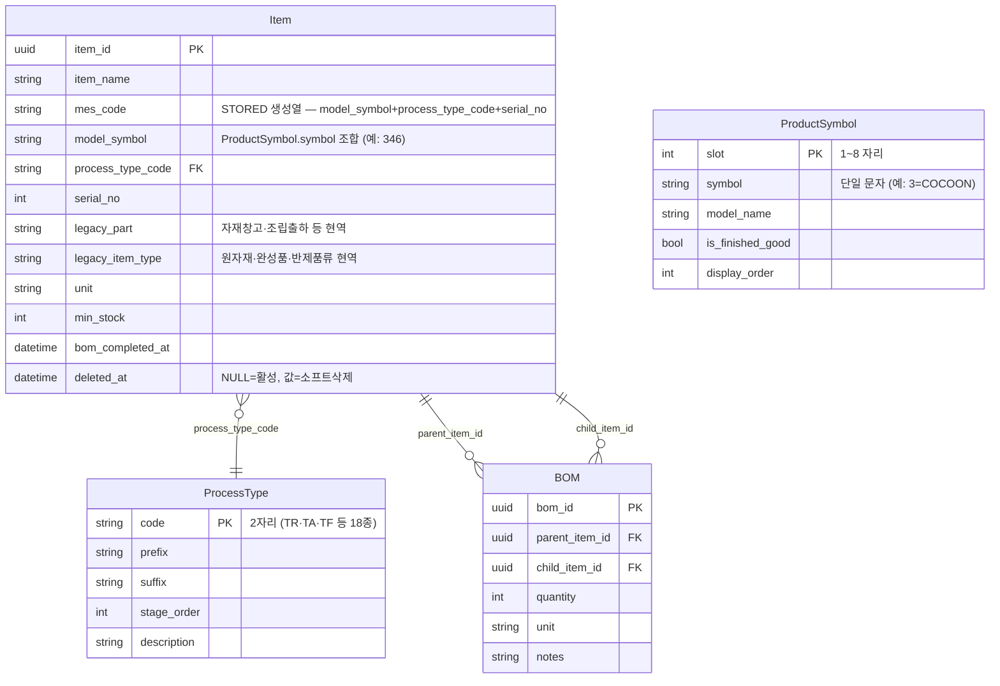
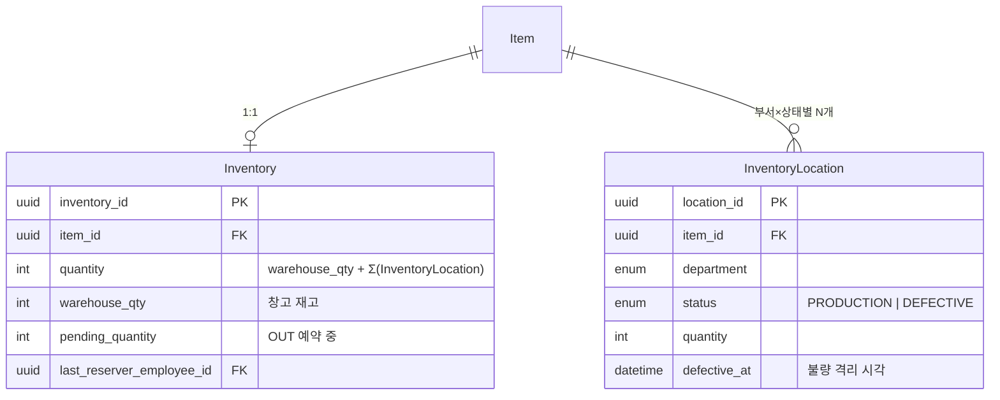
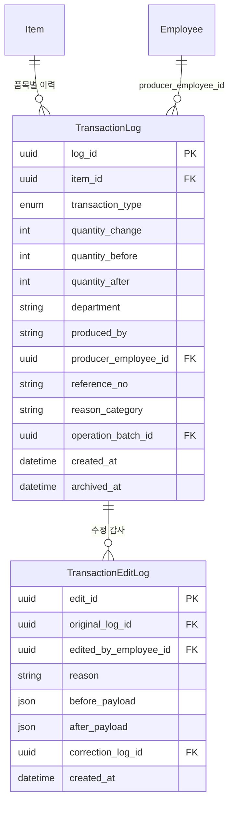
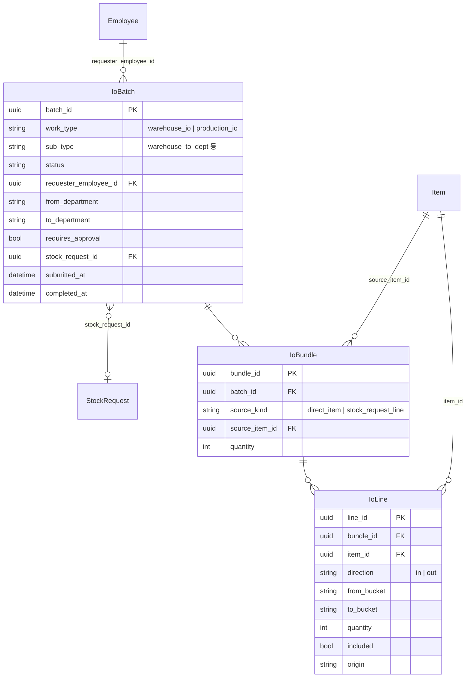
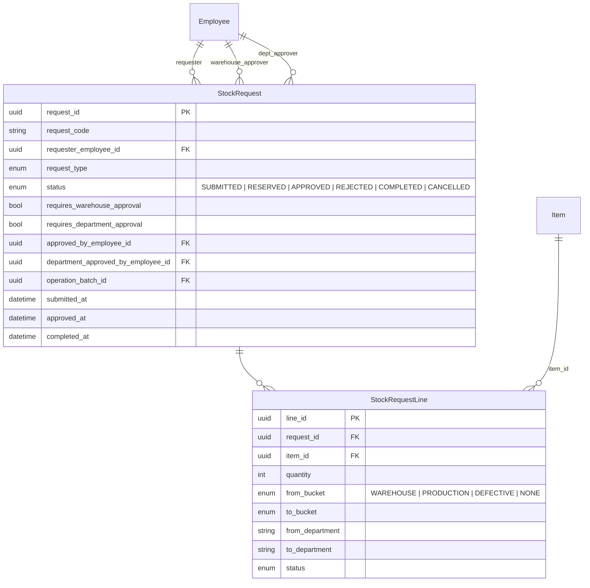
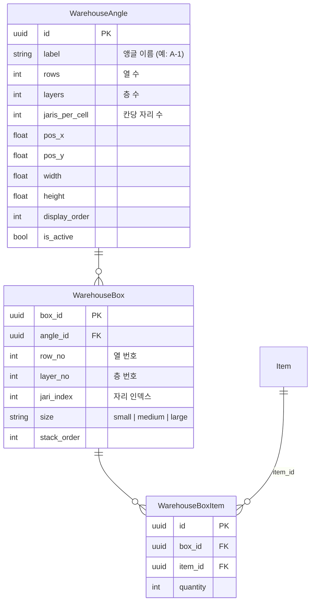
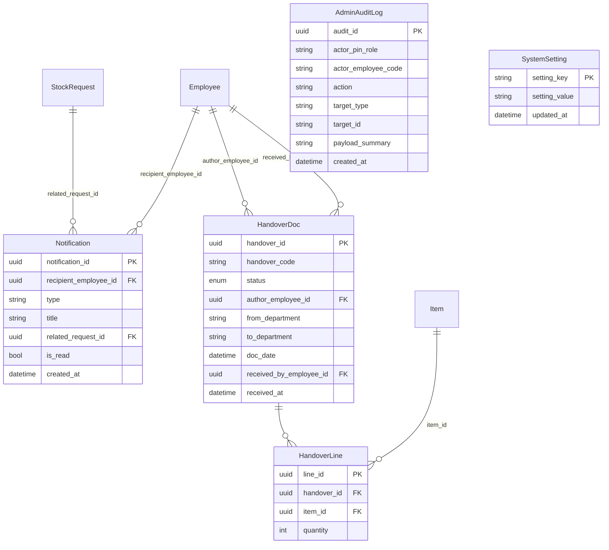

# 엔티티 관계도 (ERD)

> **2026-06-08 현행 기준.** 컬럼 정의 단일 소스: `backend/app/models/` 디렉토리.
> 총 25개 테이블 · 8개 도메인. 도메인별로 다이어그램을 나눔.

## 도메인 지도

| 도메인 | 테이블 | 핵심 목적 |
|---|---|---|
| 품목/코드 | items · bom · process_types · product_symbols | 품목 마스터 + BOM + 코드 체계 |
| 직원/조직 | employees · departments · employee_assigned_models · employee_item_orders | 사원 + 담당 모델 + 품목 순서 |
| 재고 | inventory · inventory_locations | 창고/부서별 수량 |
| 거래 이력 | transaction_logs · transaction_edit_logs | 입출고 로그 + 수정 이력 |
| 입출고 배치 | io_batches · io_bundles · io_lines | IO 제출 단위 |
| 재고 요청/결재 | stock_requests · stock_request_lines | 창고/부서 결재 흐름 |
| 창고 지도 | warehouse_angles · warehouse_boxes · warehouse_box_items | 앵글 위치 시각화 |
| 기타 | notifications · handovers · handover_lines · admin_audit_logs · system_settings | 알림·인수인계·감사·설정 |

---

## 1. 품목/코드 도메인



**규칙:**
- `mes_code` 는 DB STORED 생성열. 직접 쓰기 불가 — 분해 필드(model_symbol·process_type_code·serial_no)가 진실 소스.
- `model_symbol` 과 `ProductSymbol.symbol` 은 코드 규약으로 연결 (별도 FK 없음).
- BOM 순환 참조 금지 — 서비스 레이어(`_is_circular`)에서 검증, 위반 시 400.

---

## 2. 직원/조직 도메인

```mermaid
erDiagram
    Employee {
        uuid employee_id PK
        string employee_code
        string name
        enum role "admin | employee"
        string department
        enum level "admin | manager | staff"
        string warehouse_role "primary | deputy | null"
        string department_role "primary | deputy | null"
        bool io_enabled
        int display_order
        string pin_hash
    }

    Department {
        int id PK
        string name
        int display_order
        bool io_enabled
    }

    EmployeeAssignedModel {
        uuid employee_id PK-FK
        int slot PK-FK
        int priority
    }

    EmployeeItemOrder {
        uuid employee_id PK-FK
        uuid item_id PK-FK
        int display_order
    }

    Employee }o--|| Department : "department"
    Employee ||--o{ EmployeeAssignedModel : ""
    Employee ||--o{ EmployeeItemOrder : ""
    ProductSymbol ||--o{ EmployeeAssignedModel : "slot"
    Item ||--o{ EmployeeItemOrder : "item_id"
```

---

## 3. 재고 도메인



**불변식:** `Inventory.quantity == warehouse_qty + Σ(InventoryLocation.quantity for item_id)`
→ `/health/detailed` 의 `inventory_mismatch_count` 가 위반 건수를 실시간 감시.

---

## 4. 거래 이력 도메인



---

## 5. 입출고 배치 도메인



---

## 6. 재고 요청/결재 도메인



**결재 흐름:**
- 창고 결재: `warehouse_role = primary | deputy` 인 사원만 가능.
- 부서 결재: `department_role = primary | deputy` 또는 `level = admin`.
- 두 결재 모두 통과 → `COMPLETED`.

---

## 7. 창고 지도 도메인



---

## 8. 기타 도메인



---

## 불변식 (코드로 강제)

- `Inventory.quantity == warehouse_qty + Σ(InventoryLocation.quantity for item_id)` — `/health/detailed` 실시간 감시.
- BOM 순환 참조 금지 — `_is_circular` 검증, 위반 시 400.
- `mes_code` unique 전역 (소프트삭제 포함) — 삭제된 코드 재등록 불가.

## 변경 이력

| 날짜 | 변경 내용 |
|---|---|
| 2026-06-08 | 전면 재작성 — io_batches·io_bundles·io_lines·stock_requests·stock_request_lines·warehouse_angles·warehouse_boxes·warehouse_box_items·handovers·notifications·employee_item_orders 추가. STALE 표기 제거. |
| 2026-06-01 | mes_code 전환 반영 (item_code→mes_code) |
| 초기 | V1 핵심 5개 테이블 |

## 변경 시 주의

- DB 스키마 변경 시 이 문서도 함께 갱신.
- `mes_code` 는 STORED 생성열 — `model_symbol`, `process_type_code`, `serial_no` 를 바꾸면 자동 재계산.
- `Inventory.quantity` 불변식 위반 시 `/health/detailed` 가 즉시 감지.
