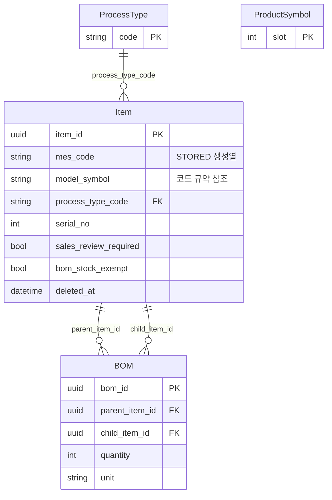
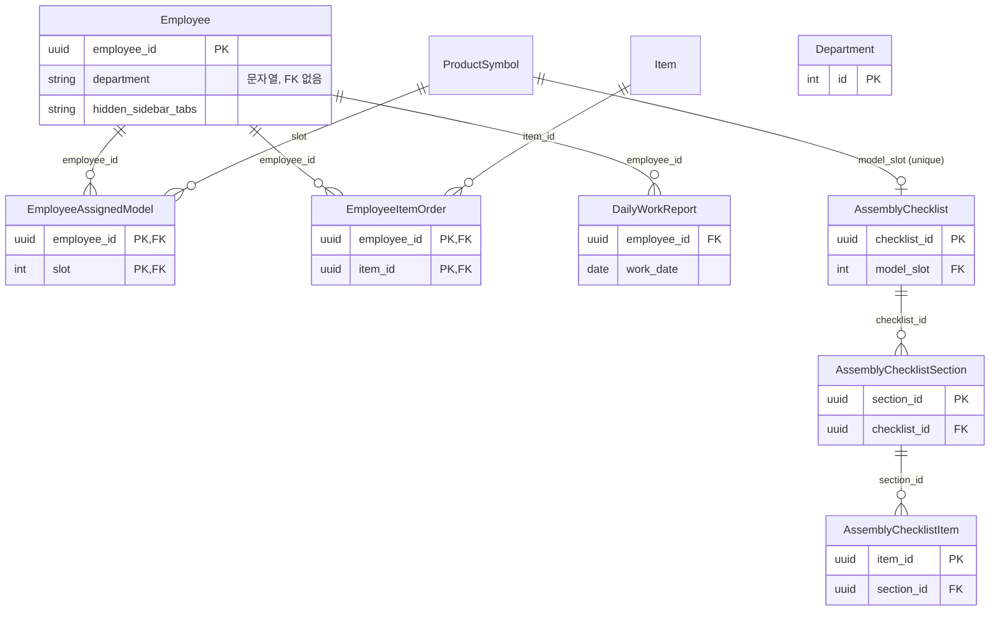
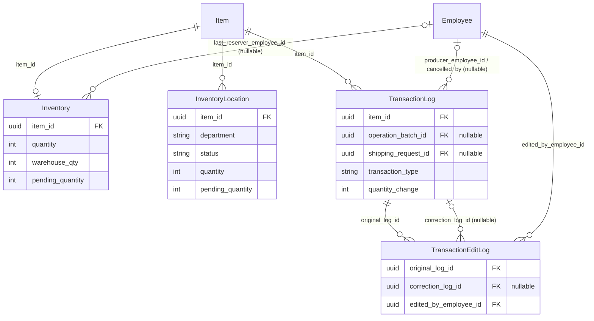
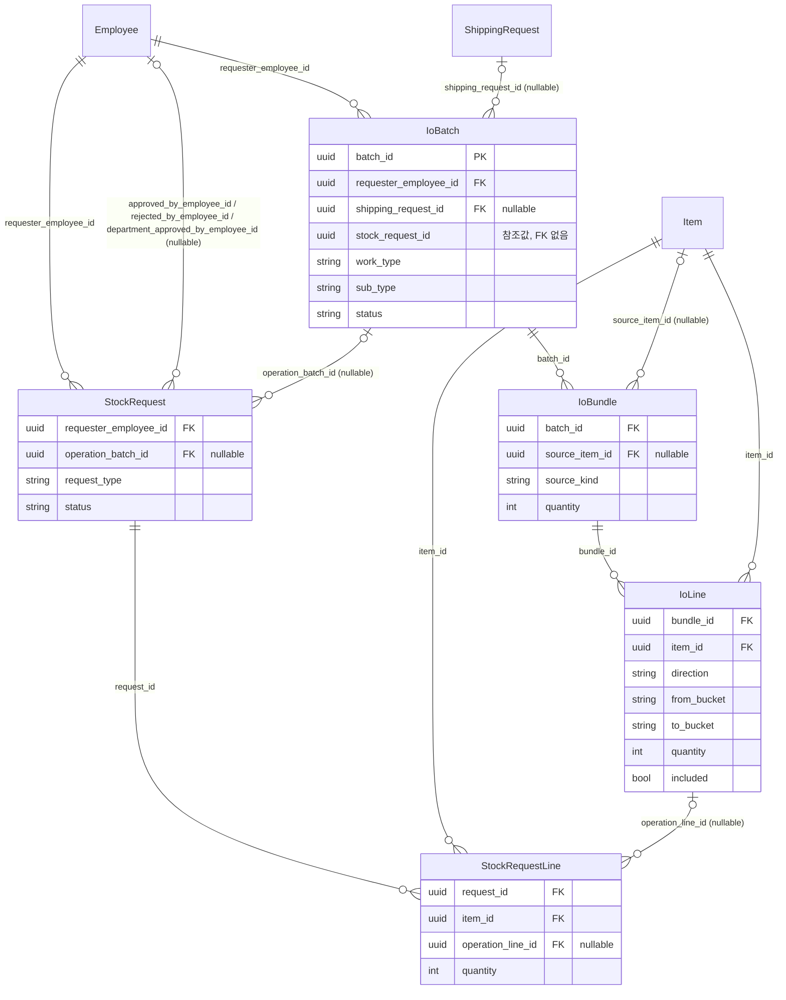
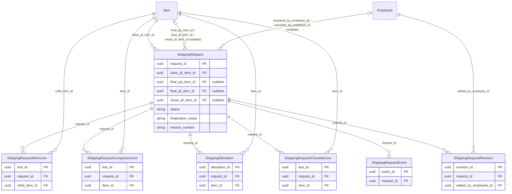
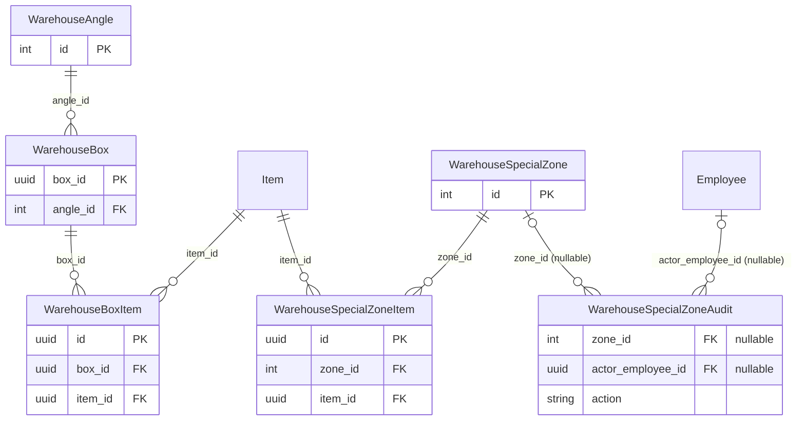
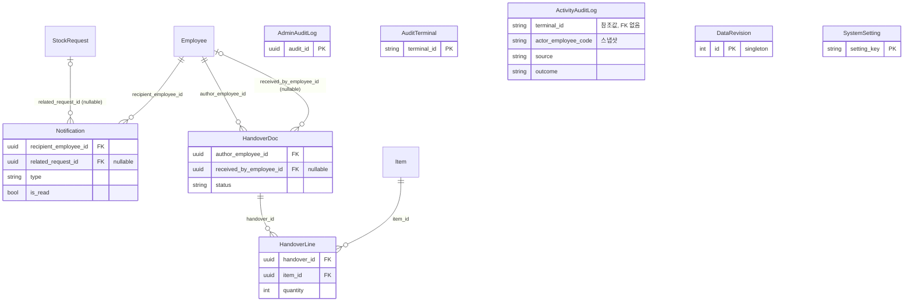

# 엔티티 관계도 (ERD)

> **현재 기준**: 이 문서는 유지하는 Markdown ERD다. 스키마의 단일 소스는
> [`backend/app/models/`](../../backend/app/models/)의 SQLAlchemy 모델과 Alembic migration이다.
> 모델의 `ForeignKey` 선언이 없는 ID/코드 참조는 관계선으로 단정하지 않는다. 렌더링 HTML은
> [ERD.html](ERD.html) 스냅샷이며 자동 동기화 대상이 아니다.

## 읽는 법과 범위

- 도메인 지도는 현재 모델의 `__tablename__`을 적고, Mermaid 엔티티는 읽기 쉽게 모델 클래스명 단수형을 쓴다. 테이블·도메인 수는 고정값으로 기록하지 않는다.
- `FK`는 모델에 선언된 외래 키이고, `참조값`은 외래 키 제약이 없는 저장 값이다.
- 정확한 컬럼 타입·제약·기본값은 모델을 확인한다.

## 도메인 지도

| 도메인 | 테이블 | 역할 |
|---|---|---|
| 품목·코드 | `items`, `bom`, `process_types`, `product_symbols` | 품목 마스터, BOM, 공정·모델 코드 |
| 직원·업무 기록 | `departments`, `employees`, `employee_assigned_models`, `employee_item_orders`, `daily_work_reports`, `assembly_checklists`, `assembly_checklist_sections`, `assembly_checklist_items` | 조직, 담당 모델·품목 순서, 일보, 조립 체크리스트 |
| 재고·거래 | `inventory`, `inventory_locations`, `transaction_logs`, `transaction_edit_logs` | 재고 잔량·위치와 변동/수정 이력 |
| 입출고 V2·결재 | `io_batches`, `io_bundles`, `io_lines`, `stock_requests`, `stock_request_lines` | 제출 배치, BOM 전개 라인, 결재 요청 |
| 출하 | `shipping_requests`, `shipping_request_bom_lines`, `shipping_request_companion_lines`, `shipping_allocations`, `shipping_request_checklist_lines`, `shipping_request_events`, `shipping_request_revisions` | 출하 요청, 준비·배정·체크·이력 |
| 창고 지도 | `warehouse_angles`, `warehouse_boxes`, `warehouse_box_items`, `warehouse_special_zones`, `warehouse_special_zone_items`, `warehouse_special_zone_audits` | 랙/박스와 자유 영역의 배치·감사 |
| 알림·인수인계 | `notifications`, `handovers`, `handover_lines` | 결재/인수 알림과 인수인계 문서 |
| 시스템·감사 | `admin_audit_logs`, `audit_terminals`, `activity_audit_logs`, `data_revision`, `system_settings` | 관리자·사용자 작업 감사와 시스템 상태 |

---

## 1. 품목·코드

```mermaid
erDiagram
    ProcessType ||--o{ Item : "process_type_code"
    Item ||--o{ BOM : "parent_item_id"
    Item ||--o{ BOM : "child_item_id"

    Item {
        uuid item_id PK
        string mes_code "STORED 생성열"
        string model_symbol "코드 규약 참조"
        string process_type_code FK
        int serial_no
        bool sales_review_required
        bool bom_stock_exempt
        datetime deleted_at
    }
    BOM {
        uuid bom_id PK
        uuid parent_item_id FK
        uuid child_item_id FK
        int quantity
        string unit
    }
    ProcessType {
        string code PK
    }
    ProductSymbol {
        int slot PK
    }
```

- `items.mes_code`는 `model_symbol`, `process_type_code`, `serial_no`에서 DB가 계산하는 STORED 생성열이다. `model_symbol`과 `product_symbols.symbol`은 코드 규약으로 연결되며 FK는 아니다.
- `bom`은 부모와 자식 모두 `items`를 참조한다. 순환 방지는 스키마 관계가 아니라 서비스 검증의 책임이다.

## 2. 직원·업무 기록

```mermaid
erDiagram
    Employee ||--o{ EmployeeAssignedModel : "employee_id"
    ProductSymbol ||--o{ EmployeeAssignedModel : "slot"
    Employee ||--o{ EmployeeItemOrder : "employee_id"
    Item ||--o{ EmployeeItemOrder : "item_id"
    Employee ||--o{ DailyWorkReport : "employee_id"
    ProductSymbol ||--o| AssemblyChecklist : "model_slot (unique)"
    AssemblyChecklist ||--o{ AssemblyChecklistSection : "checklist_id"
    AssemblyChecklistSection ||--o{ AssemblyChecklistItem : "section_id"

    Department {
        int id PK
    }
    Employee {
        uuid employee_id PK
        string department "문자열, FK 없음"
        string hidden_sidebar_tabs
    }
    EmployeeAssignedModel {
        uuid employee_id PK, FK
        int slot PK, FK
    }
    EmployeeItemOrder {
        uuid employee_id PK, FK
        uuid item_id PK, FK
    }
    DailyWorkReport {
        uuid employee_id FK
        date work_date
    }
    AssemblyChecklist {
        uuid checklist_id PK
        int model_slot FK
    }
    AssemblyChecklistSection {
        uuid section_id PK
        uuid checklist_id FK
    }
    AssemblyChecklistItem {
        uuid item_id PK
        uuid section_id FK
    }
```

- `employees.department`와 `daily_work_reports.department`는 문자열이며 `departments`에 대한 FK를 선언하지 않는다.
- `assembly_checklists.model_slot`은 `product_symbols.slot` FK이면서 unique이므로, 제품 모델 슬롯 하나에는 체크리스트가 없거나 하나만 연결된다. 섹션과 항목은 부모 삭제 시 함께 삭제된다.

## 3. 재고·거래

```mermaid
erDiagram
    Item ||--o| Inventory : "item_id"
    Employee o|--o{ Inventory : "last_reserver_employee_id (nullable)"
    Item ||--o{ InventoryLocation : "item_id"
    Item ||--o{ TransactionLog : "item_id"
    Employee o|--o{ TransactionLog : "producer_employee_id / cancelled_by (nullable)"
    TransactionLog ||--o{ TransactionEditLog : "original_log_id"
    TransactionLog o|--o{ TransactionEditLog : "correction_log_id (nullable)"
    Employee ||--o{ TransactionEditLog : "edited_by_employee_id"

    Inventory {
        uuid item_id FK
        int quantity
        int warehouse_qty
        int pending_quantity
    }
    InventoryLocation {
        uuid item_id FK
        string department
        string status
        int quantity
        int pending_quantity
    }
    TransactionLog {
        uuid item_id FK
        uuid operation_batch_id FK "nullable"
        uuid shipping_request_id FK "nullable"
        string transaction_type
        int quantity_change
    }
    TransactionEditLog {
        uuid original_log_id FK
        uuid correction_log_id FK "nullable"
        uuid edited_by_employee_id FK
    }
```

- `inventory.item_id`는 품목당 하나의 재고 행을 보장한다. `inventory_locations`는 품목·부서·상태 조합의 위치 재고다.
- 거래 수정 이력은 원본/보정 거래를 분리해 보관한다.

## 4. 입출고 V2·결재

```mermaid
erDiagram
    Employee ||--o{ IoBatch : "requester_employee_id"
    ShippingRequest o|--o{ IoBatch : "shipping_request_id (nullable)"
    IoBatch ||--o{ IoBundle : "batch_id"
    IoBundle ||--o{ IoLine : "bundle_id"
    Item o|--o{ IoBundle : "source_item_id (nullable)"
    Item ||--o{ IoLine : "item_id"
    Employee ||--o{ StockRequest : "requester_employee_id"
    Employee o|--o{ StockRequest : "approved_by_employee_id / rejected_by_employee_id / department_approved_by_employee_id (nullable)"
    IoBatch o|--o{ StockRequest : "operation_batch_id (nullable)"
    StockRequest ||--o{ StockRequestLine : "request_id"
    Item ||--o{ StockRequestLine : "item_id"
    IoLine o|--o{ StockRequestLine : "operation_line_id (nullable)"

    IoBatch {
        uuid batch_id PK
        uuid requester_employee_id FK
        uuid shipping_request_id FK "nullable"
        uuid stock_request_id "참조값, FK 없음"
        string work_type
        string sub_type
        string status
    }
    IoBundle {
        uuid batch_id FK
        uuid source_item_id FK "nullable"
        string source_kind
        int quantity
    }
    IoLine {
        uuid bundle_id FK
        uuid item_id FK
        string direction
        string from_bucket
        string to_bucket
        int quantity
        bool included
    }
    StockRequest {
        uuid requester_employee_id FK
        uuid operation_batch_id FK "nullable"
        string request_type
        string status
    }
    StockRequestLine {
        uuid request_id FK
        uuid item_id FK
        uuid operation_line_id FK "nullable"
        int quantity
    }
```

- **IoBatch → IoBundle → IoLine**은 입출고 V2의 제출·전개·실제 반영 후보 라인 구조다. 제외된 `io_lines`도 감사 내역으로 남는다.
- `io_batches.stock_request_id`는 저장된 참조값이고 모델 FK가 아니다. 결재 요청의 실제 배치 연결은 `stock_requests.operation_batch_id` FK다.

## 5. 출하

```mermaid
erDiagram
    Item ||--o{ ShippingRequest : "base_pf_item_id"
    Item o|--o{ ShippingRequest : "final_pa_item_id / final_pf_item_id / reuse_pf_item_id (nullable)"
    Employee o|--o{ ShippingRequest : "prepared_by_employee_id / cancelled_by_employee_id (nullable)"
    ShippingRequest ||--o{ ShippingRequestBomLine : "request_id"
    ShippingRequest ||--o{ ShippingRequestCompanionLine : "request_id"
    ShippingRequest ||--o{ ShippingAllocation : "request_id"
    ShippingRequest ||--o{ ShippingRequestChecklistLine : "request_id"
    ShippingRequest ||--o{ ShippingRequestEvent : "request_id"
    ShippingRequest ||--o{ ShippingRequestRevision : "request_id"
    Item ||--o{ ShippingRequestBomLine : "child_item_id"
    Item ||--o{ ShippingRequestCompanionLine : "item_id"
    Item ||--o{ ShippingAllocation : "item_id"
    Item ||--o{ ShippingRequestChecklistLine : "item_id"
    Employee ||--o{ ShippingRequestRevision : "edited_by_employee_id"

    ShippingRequest {
        uuid request_id PK
        uuid base_pf_item_id FK
        uuid final_pa_item_id FK "nullable"
        uuid final_pf_item_id FK "nullable"
        uuid reuse_pf_item_id FK "nullable"
        string status
        string finalization_mode
        string invoice_number
    }
    ShippingRequestBomLine {
        uuid line_id PK
        uuid request_id FK
        uuid child_item_id FK
    }
    ShippingRequestCompanionLine {
        uuid line_id PK
        uuid request_id FK
        uuid item_id FK
    }
    ShippingAllocation {
        uuid allocation_id PK
        uuid request_id FK
        uuid item_id FK
    }
    ShippingRequestChecklistLine {
        uuid line_id PK
        uuid request_id FK
        uuid item_id FK
    }
    ShippingRequestEvent {
        uuid event_id PK
        uuid request_id FK
    }
    ShippingRequestRevision {
        uuid revision_id PK
        uuid request_id FK
        uuid edited_by_employee_id FK
    }
```

- 출하 요청은 기본·최종·재사용 PF/PA 품목을 `items`로 참조한다. 각 출하 하위 행은 요청 삭제 시 함께 삭제되도록 모델에 정의되어 있다.
- `transaction_logs`와 `io_batches`도 출하 요청을 FK로 참조하므로 출하 준비/픽업의 재고 반영 경로는 거래·입출고 이력에서 추적한다.

## 6. 창고 지도

```mermaid
erDiagram
    WarehouseAngle ||--o{ WarehouseBox : "angle_id"
    WarehouseBox ||--o{ WarehouseBoxItem : "box_id"
    Item ||--o{ WarehouseBoxItem : "item_id"
    WarehouseSpecialZone ||--o{ WarehouseSpecialZoneItem : "zone_id"
    Item ||--o{ WarehouseSpecialZoneItem : "item_id"
    WarehouseSpecialZone o|--o{ WarehouseSpecialZoneAudit : "zone_id (nullable)"
    Employee o|--o{ WarehouseSpecialZoneAudit : "actor_employee_id (nullable)"

    WarehouseAngle {
        int id PK
    }
    WarehouseBox {
        uuid box_id PK
        int angle_id FK
    }
    WarehouseBoxItem {
        uuid id PK
        uuid box_id FK
        uuid item_id FK
    }
    WarehouseSpecialZone {
        int id PK
    }
    WarehouseSpecialZoneItem {
        uuid id PK
        int zone_id FK
        uuid item_id FK
    }
    WarehouseSpecialZoneAudit {
        int zone_id FK "nullable"
        uuid actor_employee_id FK "nullable"
        string action
    }
```

- 랙은 `warehouse_angles`와 `warehouse_boxes`로, 통로·팔레트 자유 영역은 `warehouse_special_zones`로 분리한다.
- 특별 영역 감사의 `zone_id`, `actor_employee_id`는 삭제 뒤에도 감사 행을 남길 수 있도록 nullable FK다.

## 7. 알림·인수인계·시스템 감사

```mermaid
erDiagram
    Employee ||--o{ Notification : "recipient_employee_id"
    StockRequest o|--o{ Notification : "related_request_id (nullable)"
    Employee ||--o{ HandoverDoc : "author_employee_id"
    Employee o|--o{ HandoverDoc : "received_by_employee_id (nullable)"
    HandoverDoc ||--o{ HandoverLine : "handover_id"
    Item ||--o{ HandoverLine : "item_id"

    Notification {
        uuid recipient_employee_id FK
        uuid related_request_id FK "nullable"
        string type
        bool is_read
    }
    HandoverDoc {
        uuid author_employee_id FK
        uuid received_by_employee_id FK "nullable"
        string status
    }
    HandoverLine {
        uuid handover_id FK
        uuid item_id FK
        int quantity
    }
    AdminAuditLog {
        uuid audit_id PK
    }
    AuditTerminal {
        string terminal_id PK
    }
    ActivityAuditLog {
        string terminal_id "참조값, FK 없음"
        string actor_employee_code "스냅샷"
        string source
        string outcome
    }
    DataRevision {
        int id PK "singleton"
    }
    SystemSetting {
        string setting_key PK
    }
```

- `admin_audit_logs`는 관리자 변경 감사, `activity_audit_logs`는 데스크톱/모바일 사용자 작업 스냅샷을 보관한다. `activity_audit_logs.terminal_id`는 `audit_terminals`의 FK가 아닌 식별자 참조값이다.
- `data_revision`은 단일 행 제약을 둔 데이터 변경 리비전이고, `system_settings`는 키-값 설정 저장소다.

## 변경 시 확인

1. 모델 또는 Alembic migration에서 테이블·FK를 바꾸면 이 문서의 도메인 지도와 관계도를 함께 갱신한다.
2. 새 관계선은 모델의 `ForeignKey`와 `ondelete` 설정을 확인한 뒤에만 추가한다.
3. 런타임 데이터 수량·품목 수·모델 수 등 변동 사실은 문서에 고정하지 말고 `python _attic/backend-scripts/facts.py` 또는 관련 API로 확인한다.
