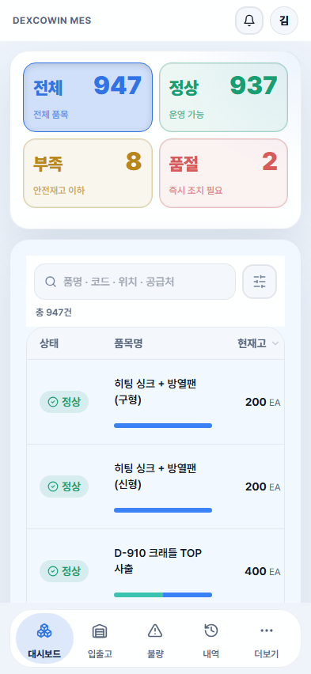
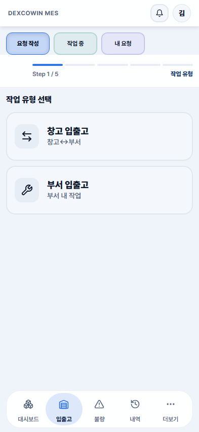
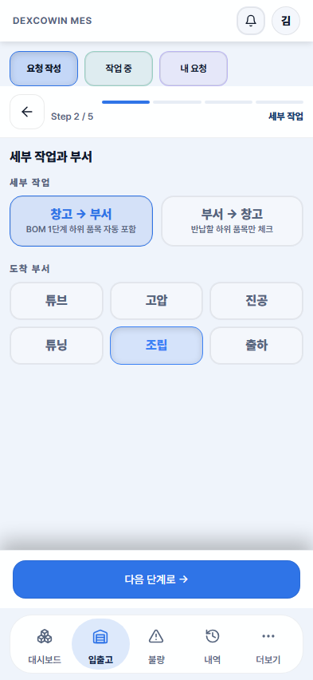
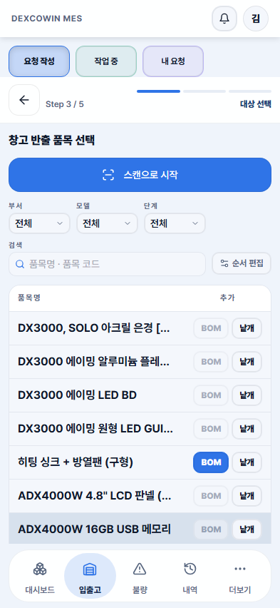
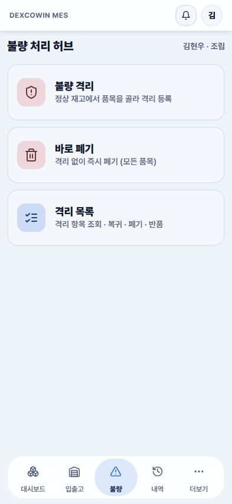
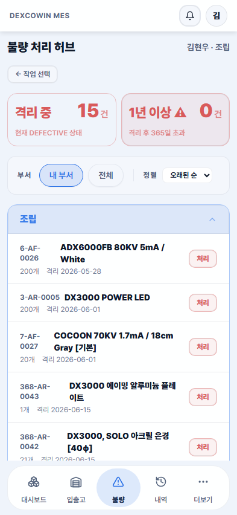
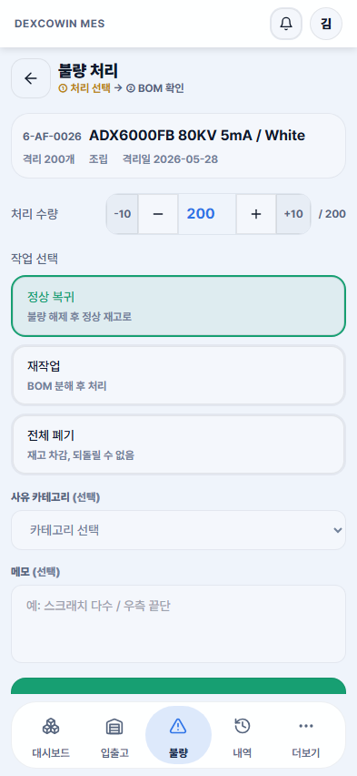
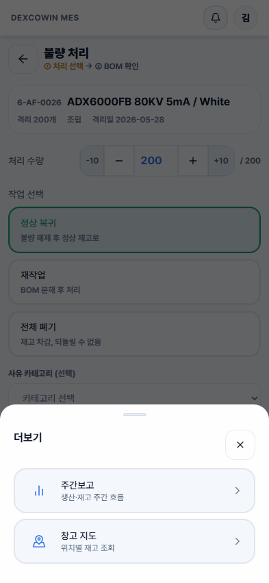

# DEXCOWIN MES 모바일 PC 흐름 패리티 리뷰

- 작성일: 2026-06-17
- 대상: `/mes` 모바일 화면, 393 x 852 viewport
- 기준 작업자: 김현우 / 조립
- 방식: 현재 앱을 직접 실행해 캡처한 화면 기준. 기존 `_attic/screenshots` 이미지는 구형 비교 자료로만 참고.

## 1. 요약 결론

현재 모바일은 입출고와 불량의 비즈니스 규칙을 데스크톱 흐름과 잘 맞추고 있다. 특히 입출고 Step 3의 품목 표, BOM/낱개 분기, 불량 목록의 KPI-필터-부서 목록 구조는 "PC에서 하던 업무"와 같은 뼈대를 유지한다.

다만 50대 현장 작업자가 바로 느낄 문제는 기능 누락보다 화면 감각이다. 몇몇 화면이 실제 업무 영역을 꽉 쓰지 못하고, 카드 몇 장만 위에 놓인 뒤 하단이 비어 보인다. 또 불량 처리처럼 실제 실행 버튼이 하단 네비게이션에 가려지는 화면은 작업 흐름 자체가 끊긴다. 더보기 역시 현재는 하단 카드 시트라서 "다른 업무 탭으로 이동"이라기보다 "임시 메뉴가 떠 있다"는 느낌이 강하다.

가장 중요한 개선 방향은 모바일을 새 UX로 다시 발명하는 것이 아니라, 데스크톱의 업무 구조를 작은 화면에 맞게 전폭으로 재배치하는 것이다. 사용자가 기대하는 감각은 "모바일용으로 바뀌었네"가 아니라 "PC 화면이 손에 들어왔네"에 가깝다.

## 2. 증거 캡처

| 화면 | 캡처 |
|---|---|
| 로그인 |  |
| 대시보드 |  |
| 입출고 Step 1 |  |
| 입출고 Step 2 |  |
| 입출고 Step 3 |  |
| 불량 허브 |  |
| 불량 목록 |  |
| 불량 처리 |  |
| 더보기 |  |

## 3. 우선순위

| 우선순위 | 항목 | 이유 |
|---|---|---|
| P0 | 불량 처리 실행 버튼이 하단 네비게이션 뒤로 밀림 | 실제 작업 완료 버튼이 잘려 보여 작업자가 멈출 수 있음 |
| P0 | 더보기를 BottomSheet 대신 전폭 탭/화면으로 전환 | 주간보고/창고 지도는 임시 메뉴가 아니라 업무 화면 진입점 |
| P1 | 입출고 Step 1, 불량 허브의 큰 빈 공간 축소 | PC의 업무 화면이 아니라 모바일 메뉴 화면처럼 보임 |
| P1 | 대시보드 첫 화면 정보 밀도 조정 | KPI 이후 실제 품목 목록 진입이 늦고 화면이 카드 중심으로 보임 |
| P1 | 입출고 Step 3 품목명/버튼 가독성 개선 | PC 표 감각은 좋지만 말줄임과 작은 반복 버튼이 오작동을 부름 |
| P2 | 하단 네비 활성 상태와 시각 위계 정리 | 현재 개선됐지만 업무 콘텐츠와 시각적으로 경쟁하지 않게 유지 필요 |

## 4. 화면별 리뷰

### 4.1 로그인

현재 상태:
- 직원 선택, PIN 입력, 로그인 버튼 순서가 명확하다.
- 입력칸과 버튼 크기도 모바일 작업자에게 충분히 크다.

어색한 부분:
- 검색 결과가 없거나 드롭다운이 열릴 때 PIN 입력 영역을 덮을 수 있는 구조는 구형 캡처에서 확인됐다.
- 현장에서는 이름을 정확히 타이핑하지 못하는 경우가 많으므로, 검색 실패 상태가 다음 입력 단계와 겹치면 "내가 뭘 잘못 눌렀나"로 느껴질 수 있다.

개선 제안:
- 직원 선택 드롭다운은 입력칸 아래에 뜨더라도 PIN 영역을 덮지 않게 최대 높이를 제한하고 내부 스크롤로 처리한다.
- 검색 결과 없음은 작은 드롭다운 카드보다 입력칸 아래 안내문으로 낮게 배치한다.
- 로그인 화면은 현재 구조를 유지하되, 실패 상태와 다음 단계가 겹치지 않게 한다.

우선순위: P2

### 4.2 대시보드

현재 상태:
- KPI 4개와 품목 목록이 모바일 첫 화면에 보인다.
- 구형 캡처보다 하단 네비 활성 상태는 정리됐다.

어색한 부분:
- KPI 4개가 첫 화면의 큰 면적을 차지한다. 현재 김현우 세션 기준으로도 품목 목록은 2-3줄만 보인다.
- 구형 또는 다른 권한 상태처럼 생산 가능 카드까지 노출되면 실제 목록 진입은 더 늦어진다.
- PC 대시보드는 "현황 요약 + 바로 목록/상세 진입" 느낌인데, 모바일은 "요약 카드가 먼저 있고 목록은 아래에 딸린다"는 느낌이 강하다.

개선 제안:
- KPI 카드를 모바일에서는 2 x 2 큰 카드가 아니라 한 줄 요약 또는 2열 압축형으로 낮춘다.
- 품목 목록의 헤더와 검색 영역은 첫 화면에서 더 위로 당긴다.
- 생산 가능 카드가 필요한 권한/상태에서는 접이식 요약으로 두고, 기본은 한 줄 "생산 가능 N개 모델" 정도로 줄인다.
- 목표는 첫 화면에서 "검색/품목명/현재고"까지 바로 보이게 하는 것이다.

우선순위: P1

권장 형태:

```text
상단: 전체 947 | 정상 937 | 부족 8 | 품절 2
검색/필터
품목 목록 4-5줄
생산 가능 요약은 접힌 보조 영역
```

### 4.3 하단 네비게이션

현재 상태:
- 대시보드, 입출고, 불량, 내역, 더보기 순서가 업무 빈도 기준으로 자연스럽다.
- 구형 캡처의 강한 그림자/박스 느낌은 많이 줄었다.

어색한 부분:
- 네비게이션이 플로팅 pill처럼 보여 콘텐츠 위에 얹힌 느낌이 남아 있다.
- 불량 처리처럼 하단 실행 버튼이 있는 화면에서는 네비와 CTA가 같은 영역을 차지한다.
- 데스크톱 사이드바는 작업 화면을 침범하지 않는데, 모바일 하단 네비는 작업 버튼과 충돌할 수 있다.

개선 제안:
- 하단 네비는 항상 고정하되, 작업 화면 내부의 StickyFooter는 네비 높이를 확실히 피하도록 `padding-bottom`과 CTA 위치를 표준화한다.
- 입력/처리/제출 화면에서는 하단 네비보다 작업 CTA가 우선이다. 필요하면 해당 화면에서 네비를 축소하거나, CTA를 네비 위 전용 band로 올린다.
- 활성 pill은 유지하되 그림자/카드 느낌은 더 줄이고, 데스크톱 사이드바의 선택 상태처럼 차분하게 둔다.

우선순위: P0/P2

### 4.4 입출고 Step 1 - 작업 유형 선택

현재 상태:
- `요청 작성 / 작업 중 / 내 요청` 탭은 데스크톱 섹션 탭과 같은 구조라 좋다.
- Step 진행바도 있어 현재 위치를 이해하기 쉽다.

어색한 부분:
- 본문에는 `창고 입출고`, `부서 입출고` 카드 2장만 있고, 화면 하단 대부분이 비어 있다.
- PC의 입출고 화면은 여러 섹션과 위저드가 한 화면에 이어지는 업무 화면인데, 모바일 Step 1은 "메뉴 2개 고르는 화면"처럼 느껴진다.
- 50대 작업자 입장에서는 "입출고 화면에 들어왔는데 할 게 별로 안 보인다"는 인상을 줄 수 있다.

개선 제안:
- Step 1 하단 빈 공간에 PC 흐름과 같은 "현재 선택 후 진행될 단계" 요약을 넣는다.
- 예: `1 작업 유형 -> 2 부서 -> 3 품목 -> 4 수량 -> 5 제출`.
- 작업 유형 카드는 지금보다 낮게 만들고, 설명은 더 업무 용어에 가깝게 바꾼다.
- `창고 입출고` 카드에는 `창고 -> 부서 / 부서 -> 창고`, `부서 입출고` 카드에는 `부서 내 생산/분해/보정`처럼 PC에서 보던 세부 흐름을 미리 보여준다.

우선순위: P1

### 4.5 입출고 Step 2 - 세부 작업과 부서

현재 상태:
- `창고 -> 부서`, `부서 -> 창고` 선택과 도착 부서 선택이 명확하다.
- 하단 `다음 단계로` 버튼은 엄지 영역에 있어 진행 동선이 좋다.

어색한 부분:
- 데스크톱 사용자는 방향과 부서를 표처럼 읽는데, 모바일은 버튼 묶음이라 관계가 조금 느슨해 보인다.
- 현재 선택된 부서가 `조립`으로 잘 보이지만, "창고에서 조립으로 간다"는 최종 문장은 화면에 크게 고정되어 있지 않다.

개선 제안:
- 세부 작업과 부서를 선택하면 상단 또는 하단 CTA 위에 `창고 -> 조립` 요약 chip을 고정한다.
- 방향 선택과 부서 선택 사이에 "도착 부서"만 두는 현재 구조는 유지하되, 선택 결과를 한 문장으로 반복해 실수를 줄인다.
- 출고/반납 계열은 색상 톤을 Step 2부터 분명히 해서, PC에서 작업 유형을 확인하던 감각을 모바일에도 준다.

우선순위: P2

### 4.6 입출고 Step 3 - 품목 선택

현재 상태:
- PC와 가장 비슷한 화면이다.
- 필터, 검색, 품목 표, BOM/낱개 버튼이 살아 있어 데스크톱 작업 흐름과 잘 연결된다.

어색한 부분:
- 품목명이 많이 말줄임 처리된다. 현장 작업자는 품목명 뒷부분의 사양, 괄호, 구형/신형을 보고 고르는 경우가 많다.
- `BOM`과 `낱개` 버튼이 행마다 작게 반복되어 손가락으로 잘못 누를 가능성이 있다.
- PC 표를 그대로 압축한 장점은 있지만, 모바일에서는 "읽고 누르기"보다 "맞는 품목인지 확인하기"가 먼저 필요하다.

개선 제안:
- 행 높이를 조금 늘려 품목명을 2줄까지 안정적으로 표시한다.
- `BOM/낱개`는 작은 버튼 2개보다 행 선택 후 하단 액션 또는 확장 행에서 고르게 한다.
- 또는 BOM 가능한 품목만 `BOM` primary, 나머지는 `낱개 추가` 단일 버튼으로 단순화한다.
- 검색/필터 영역은 현재처럼 상단에 유지하되, 스캔 버튼과 검색창 사이의 역할을 더 분명히 나눈다.

우선순위: P1

권장 형태:

```text
품목 행:
품목명 2줄
품목코드 / 현재고 / 위치
[낱개 추가] [BOM 전개]  - BOM 가능 품목에만 노출
```

### 4.7 불량 허브

현재 상태:
- `불량 격리`, `바로 폐기`, `격리 목록` 3개 진입이 명확하다.
- 데스크톱 불량 허브의 큰 분기는 모바일에도 살아 있다.

어색한 부분:
- 3개 카드 아래가 크게 비어 있다.
- 사용자가 말한 것처럼 "화면을 꽉 채우지 않고 위에 버튼으로 둔 화면"의 대표 사례다.
- PC의 불량 허브는 KPI, 필터, 목록이 함께 있는 업무 대시보드 느낌인데, 모바일 첫 화면은 메뉴 화면에 가깝다.

개선 제안:
- 불량 허브 첫 화면에도 KPI 2개와 최근/내 부서 격리 목록 일부를 같이 보여준다.
- `불량 격리`, `바로 폐기`는 상단 액션 버튼으로 압축하고, 기본 화면은 `격리 목록` 중심으로 둔다.
- 작업자는 보통 "지금 불량이 뭐가 있지?"를 보고 처리하므로, 목록을 한 단계 아래에 숨기지 않는 편이 PC 감각에 더 가깝다.

우선순위: P1

권장 형태:

```text
불량 처리 허브
[새 불량] [바로 폐기]
격리 중 15 | 1년 이상 0
부서 필터 / 정렬
내 부서 격리 목록
```

### 4.8 불량 목록

현재 상태:
- KPI 카드, 부서 필터, 정렬, 조립 목록, 처리 버튼이 한 화면에 이어진다.
- 데스크톱 흐름과 가장 잘 맞는 불량 화면이다.

어색한 부분:
- 목록의 마지막 행이 하단 네비게이션에 가까워진다.
- `처리` 버튼이 행 오른쪽에 반복되는데, 화면 하단 근처에서는 네비와 손가락 영역이 겹칠 수 있다.
- 품목명은 2줄로 보이지만 코드/수량/격리일의 위계가 작아 빠르게 스캔하기 어렵다.

개선 제안:
- 목록 컨테이너 하단에 네비 높이만큼 여유 padding을 확실히 둔다.
- `처리` 버튼은 유지하되, 행 전체를 누르면 상세/처리로 들어가고 버튼은 보조 확인 역할로 두면 PC의 행 선택 감각과 맞는다.
- 오래된 불량, 수량, 격리일을 색/배지로 더 눈에 띄게 만든다.

우선순위: P1

### 4.9 불량 처리

현재 상태:
- 선택 품목, 격리 수량, 처리 수량, 작업 선택, 사유, 메모 흐름은 명확하다.
- `정상 복귀`, `재작업`, `전체 폐기` 선택 구조도 이해하기 쉽다.

어색한 부분:
- 실행 버튼이 하단 네비게이션 뒤로 내려가 화면에서 보이지 않거나 잘려 보인다.
- 이 화면은 실제 재고를 바꾸는 작업인데, 가장 중요한 완료 버튼이 가장 불안정하게 배치되어 있다.
- PC에서는 작업 패널 안의 실행 버튼이 명확히 보이는데, 모바일에서는 하단 네비와 충돌해서 "끝까지 진행해도 되는지" 확신이 떨어진다.

개선 제안:
- 불량 처리 화면은 P0로 StickyFooter를 재정리한다.
- 실행 버튼은 하단 네비 위에 항상 완전히 보여야 한다.
- 처리 화면 진입 중에는 하단 네비를 숨기거나, 네비를 유지한다면 CTA를 `bottom: navHeight + safeArea + 8px` 위치에 고정한다.
- 메모 입력까지 스크롤했을 때도 CTA가 가려지지 않아야 한다.

우선순위: P0

완료 기준:
- 393 x 852에서 `정상 복귀 ->` 버튼 전체가 항상 보인다.
- 버튼 아래와 하단 네비 사이에 최소 8px 이상의 여백이 있다.
- 키보드가 올라와도 CTA와 입력칸이 서로 가리지 않는다.

### 4.10 더보기

현재 상태:
- `더보기`를 누르면 하단에서 BottomSheet가 올라온다.
- 항목은 `주간보고`, `창고 지도` 2개라 단순하다.

어색한 부분:
- 더보기 안의 항목은 임시 액션이 아니라 별도 업무 화면이다.
- 그런데 현재는 작업 중이던 불량 처리 화면 위에 반투명 dim과 카드가 올라온다.
- 사용자가 말한 것처럼 "더보기용 탭을 하나 만들어서 화면을 꽉 채워 보여주는" 방식이 더 자연스럽다.
- PC에서는 사이드바에서 다른 메뉴를 누르면 전체 작업 화면이 바뀐다. 모바일 더보기만 sheet이면 같은 메뉴 체계가 아니라 보조 메뉴처럼 느껴진다.

개선 제안:
- 더보기는 BottomSheet가 아니라 하단 네비의 5번째 전폭 화면으로 만든다.
- 더보기 화면 안에서 `주간보고`, `창고 지도`, 필요하면 `사용자 메뉴/PIN/로그아웃`을 섹션으로 배치한다.
- 현재 작업 화면 위에 얹지 말고, `더보기` 탭 자체가 전체 화면을 차지해야 한다.
- 더보기 항목을 선택하면 sheet를 닫는 것이 아니라 해당 화면으로 전환한다.

우선순위: P0

권장 형태:

```text
더보기
업무
  주간보고
  창고 지도
계정
  PIN 변경
  로그아웃
```

## 5. 데스크톱 흐름을 더 강하게 느끼게 하는 원칙

1. 모바일 첫 화면도 "업무 화면"이어야 한다.
   - 카드 몇 장만 띄우는 메뉴 화면은 피한다.
   - 목록, 필터, 현재 상태 중 하나는 반드시 첫 화면에 같이 보여준다.

2. 데스크톱의 탭/섹션 구조를 이름 그대로 유지한다.
   - `요청 작성`, `작업 중`, `내 요청`처럼 이미 잘 맞는 용어는 유지한다.
   - 더보기도 sheet가 아니라 탭 화면으로 다룬다.

3. 실제 재고 변경 버튼은 하단 네비보다 우선한다.
   - 제출, 처리, 저장 버튼은 절대 가려지면 안 된다.
   - 처리 화면에서는 하단 네비를 잠시 축소/숨김 처리하는 것도 허용한다.

4. PC 표를 그대로 줄이지 말고, 표의 읽는 순서를 유지한다.
   - 품목명, 코드, 현재고, 위치, BOM 여부를 한 번에 확인할 수 있어야 한다.
   - 작은 반복 버튼보다 행 확장/하단 액션이 안전하다.

5. 빈 공간은 안정감이 아니라 미완성처럼 보일 수 있다.
   - 현장용 MES는 예쁜 여백보다 바로 볼 정보가 중요하다.
   - 특히 입출고/불량은 화면을 꽉 채우는 밀도가 더 자연스럽다.

## 6. 구현 시 검수 체크리스트

- 393 x 852 기준으로 모든 작업 화면의 주 CTA가 하단 네비에 가려지지 않는다.
- 입출고 Step 1에서 화면 절반 이상이 빈 공간으로 남지 않는다.
- 불량 허브 첫 화면에서 KPI 또는 격리 목록이 함께 보인다.
- 더보기는 BottomSheet가 아니라 전폭 탭 화면으로 열린다.
- 입출고 Step 3에서 품목명이 2줄까지 보이고, `BOM/낱개` 오조작 위험이 줄어든다.
- 대시보드 첫 화면에서 품목 목록을 최소 3줄 이상 볼 수 있다.
- 구형 `_attic/screenshots`와 현재 렌더가 다를 경우 현재 렌더를 우선한다.

## 7. 한 줄 결론

현재 모바일은 기능 흐름은 데스크톱을 잘 따라오고 있다. 이제 개선해야 할 부분은 "모바일답게 새로 만들기"가 아니라, 데스크톱에서 익숙한 업무 화면 밀도와 실행 버튼 안정성을 모바일에서도 그대로 느끼게 만드는 것이다.
