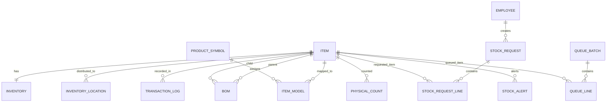
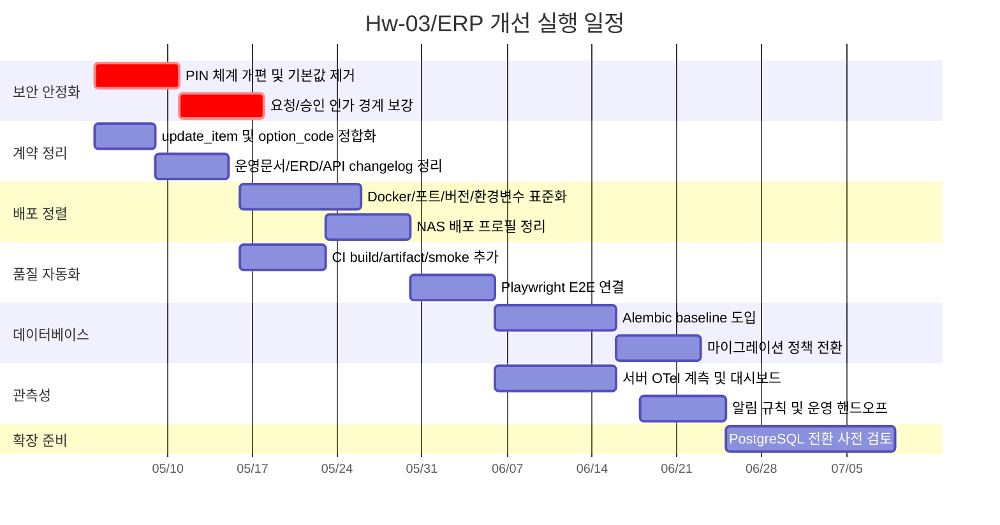

# Hw-03/ERP 저장소 심층 분석 보고서

## 경영진 요약

Hw-03/ERP는 소규모 제조 현장을 염두에 둔 경량 MES/ERP 성격의 내부 프로토타입으로 보이며, 현재의 실질 스택은 FastAPI·SQLAlchemy·SQLite(WAL) 백엔드와 Next.js 14 프런트엔드, 그리고 `/legacy` 중심의 데스크톱 셸 UI다. README와 아키텍처 문서, 운영 스크립트, CI 설정을 종합하면 “윈도우 PC 한 대를 365일 켜두고 LAN에서 접속하는 운영 모델”이 기본 가정으로 설계되어 있다. fileciteturn86file0L1-L1 fileciteturn87file0L1-L1 fileciteturn80file0L1-L1 fileciteturn88file0L1-L1

이 저장소의 강점은 분명하다. 첫째, 라우터–서비스–모델의 계층 분리가 비교적 명확하고, 재고 계산을 `stock_math.py`로 일원화해 N+1과 계산식 드리프트를 줄이려는 의도가 선명하다. 둘째, 앱 기동 시 DB를 암묵 변경하던 부작용을 `bootstrap_db.py`로 떼어내 운영 통제를 강화했다. 셋째, 2026년 4월 말 커밋 흐름에서 테스트, CI, 운영 스크립트, 접근성, 성능 보강이 짧은 주기로 집중적으로 진행된 점은 유지보수 의지가 높다는 신호다. fileciteturn44file0L1-L1 fileciteturn68file0L1-L1 fileciteturn79file0L1-L1

반대로, 이 저장소가 바로 “안전한 운영 제품”이라고 보기는 어렵다. 가장 큰 리스크는 인증·보안이다. 관리자 PIN 기본값 `0000`, 관리자 PIN 평문 저장, 직원 PIN의 unsalted SHA-256, 승인/조회 API에서 실질 세션 인증 없이 `employee_id`를 클라이언트가 넘겨 작업하는 구조는 내부망 전제라 해도 취약하다. 여기에 문서/스키마 드리프트, 수동 마이그레이션 방식, 개발 모드 중심의 Docker 기본값, 버전·포트 불일치가 겹치면서 운영 리스크를 높인다. fileciteturn47file0L1-L1 fileciteturn48file0L1-L1 fileciteturn50file0L1-L1 fileciteturn53file0L1-L1 fileciteturn40file0L1-L1 fileciteturn41file0L1-L1

우선순위는 명확하다. 단기적으로는 인증/승인 모델 정비, 문서 정합성 회복, 업데이트 경로 불일치 수정, production 프로필 정리, CI에 build와 artifact 단계를 추가하는 것이 ROI가 가장 높다. 중기적으로는 Alembic 기반 마이그레이션 체계화, 관측성 도입, Playwright E2E 자동화를 붙이는 편이 낫다. 장기적으로는 동시 쓰기 증가, NAS/네트워크 파일시스템, 장기 보존 데이터 증가 같은 운영 조건이 생기면 PostgreSQL 전환을 검토해야 한다. SQLite 공식 문서는 WAL이 “여러 reader + 단일 writer” 모델이며 네트워크 파일시스템에 적합하지 않다고 설명하고, FastAPI와 Next.js 공식 문서 역시 production에서는 `--reload`/`next dev`가 아니라 production server 빌드와 실행을 권장한다. fileciteturn78file0L1-L1 citeturn6search0turn6search4turn8search0turn6search6

## 분석 범위와 가정

이 보고서는 연결된 entity["organization","GitHub","code hosting platform"] 저장소 Hw-03/ERP의 코드, 문서, 테스트/CI 설정, 운영 스크립트, Docker/NAS 배포 구성을 1차 근거로 사용했고, 보안·배포·관측성·데이터베이스 운영 판단에는 공식 문서를 보조 근거로 사용했다. 사용자 지시에 따라 대상 플랫폼, 언어 버전, 배포 환경은 “특정 제약 없음”으로 두되, 저장소 내부에 드러난 기본 운영 모델은 “Windows + LAN + 소규모 내부 사용 + SQLite 파일 DB”로 해석했다. fileciteturn86file0L1-L1 fileciteturn87file0L1-L1 fileciteturn80file0L1-L1

다만 몇 가지 한계가 있다. GitHub 커넥터의 `fetch_file` 출력은 파일 내용을 하나의 blob 형태로 제공하는 경우가 많아, 이 보고서의 “파일/라인 참조”는 엄밀한 줄 번호보다는 파일·함수·상수·엔드포인트 단위의 근거 제시 중심이다. 또한 최근 커밋 분석은 커밋 메시지와 메타데이터 수준이며 각 diff 전체를 전수 검토한 것은 아니다. 따라서 “현재 상태의 high-confidence 판단”에는 충분하지만, “정적 분석기 수준의 완전한 라인 단위 감리”로 보기는 어렵다.

## 저장소 개요와 최근 활동

README와 아키텍처 문서에 따르면 이 저장소는 backend, frontend, docs, scripts, docker를 중심으로 구성되며, backend는 FastAPI·SQLAlchemy·SQLite, frontend는 Next.js 14·React·Tailwind·TypeScript strict를 사용한다. 실제 의존성 파일을 보면 백엔드는 `fastapi==0.111.0`, `uvicorn[standard]==0.29.0`, `sqlalchemy>=2.0.31`, `alembic==1.13.1`, `pytest>=8.0`, `pytest-cov>=5.0` 등을, 프런트는 `next==14.2.3`, `react==18.3.1`, `swr==2.2.5`, `vitest==2.1.8`, `@testing-library/react==16.1.0` 등을 사용한다. fileciteturn86file0L1-L1 fileciteturn87file0L1-L1 fileciteturn77file0L1-L1 fileciteturn85file0L1-L1

README는 이 프로젝트를 “경량 MES 프로토타입”으로 소개하지만 저장소 이름은 ERP이고, `main.py`의 앱 타이틀과 루트 응답 역시 여전히 “MES” 명칭을 쓴다. 이 명명 불일치는 단순 브랜딩 문제가 아니라, 과거 설계의 일부 흔적이 아직 문서와 코드 곳곳에 남아 있음을 시사한다. 실제로 2026년 4월 말 커밋들은 “공정코드 18개 단일화”, “category 제거 이후 문서 갱신”, “DB 재생성(722건)”을 반복적으로 언급한다. 즉 현재 저장소는 상당히 빠른 구조 정리 단계에 있다. fileciteturn86file0L1-L1 fileciteturn79file0L1-L1

아래 비교표는 README, 아키텍처 문서, requirements/package.json, CI 설정, Docker/NAS 배포 정의를 종합한 것이다. fileciteturn86file0L1-L1 fileciteturn87file0L1-L1 fileciteturn77file0L1-L1 fileciteturn85file0L1-L1 fileciteturn88file0L1-L1 fileciteturn61file0L1-L1

| 컴포넌트 | 책임 | 핵심 파일 | 현재 판단 |
|---|---|---|---|
| 백엔드 진입점 | 라우터 등록, CORS, 예외 처리, 헬스체크 | `backend/app/main.py` | entrypoint는 명확하지만 health와 문서 설명에 일부 드리프트가 있음 |
| 도메인 API 레이어 | 품목, 재고, 생산, BOM, 직원, 요청, 설정 | `backend/app/routers/*` | 엔드포인트 분리가 잘 되어 있으나 인증 경계가 약함 |
| 비즈니스 서비스 | 재고 연산, 무결성 점검, 승인/예약 로직 | `backend/app/services/*` | 핵심 규칙이 서비스층에 모여 있어 구조는 양호 |
| 데이터 모델/스키마 | SQLAlchemy 모델, Pydantic 입출력 계약 | `models.py`, `schemas.py` | 모델 수가 많고 풍부하지만 일부 계약 불일치 존재 |
| DB 부트스트랩/마이그레이션 | `create_all`, raw DDL, seed, ERP 코드 백필 | `backend/bootstrap_db.py` | 초기 민첩성은 높지만 운영 안정성은 낮음 |
| 프런트 API 클라이언트 | 타입 정의와 fetch 래퍼 | `frontend/lib/api.ts` | 타입 정보가 풍부하나 서버 계약과 일부 어긋남 |
| 프런트 메인 UI | `/legacy` 셸과 데스크톱/모바일 섹션 | `frontend/app/legacy/_components/*` | 기능은 풍부하나 레거시 부담이 큼 |
| 운영 스크립트 | 백업, 정합성 체크, 복구 | `scripts/ops/*`, `docs/OPERATIONS.md` | 소규모 현장 운영에는 실용적 |
| CI | backend pytest/compile, frontend lint/tsc/vitest | `.github/workflows/ci.yml` | 기본 품질 게이트는 있으나 build/배포/보안 단계 부재 |
| Docker/NAS 배포 | 선택적 컨테이너 실행 | `backend/Dockerfile`, `frontend/Dockerfile`, `docker/docker-compose.nas.yml` | 운영보다 개발에 가까운 기본 이미지와 일부 불일치 존재 |

최근 활동은 매우 활발하다. GitHub 커넥터 기준으로 2026-04-26~2026-04-30 사이에 Phase 5.1~5.6 정리 커밋이 연속으로 올라왔고, 주요 주제는 DB 정합성, 테스트 인프라, CI 도입, 접근성·성능 보강, 문서 재정렬, DB 재생성(722 items)이다. 분석 시점에서 오픈 이슈/오픈 PR은 검색되지 않았고, 유지보수는 이슈 트래커보다는 커밋과 문서 중심으로 진행되는 패턴에 가깝다.

| 날짜 | 커밋 | 핵심 내용 | 해석 |
|---|---|---|---|
| 2026-04-30 | `9634305` | DB 재생성(722건), process_type_code 문서 단일화 | 현재 데이터셋/문서 기준선 재정립 |
| 2026-04-27 | `f326059` | 외부 리뷰 반영, 테스트 42건, build/lint/vitest green | 품질 보강 마무리 단계 |
| 2026-04-26 | `cbafdf6` | startup 부작용 제거, N+1 정리, CI 도입 | 구조 안정화의 전환점 |
| 2026-04-26 | `9004359` | API/UX/상태/테스트 개선 | 프런트+백엔드 동시 정리 |
| 2026-04-26 | `9b77054` | DB 보강, 운영 스크립트, 프런트 성능 | 운영 준비도 향상 |

README와 문서 허브는 풍부하다. `USER_GUIDE`, `OPERATIONS`, `ARCHITECTURE`, `ERD`, `GLOSSARY`, `BACKEND_REFACTOR_PLAN`, `FRONTEND_HOOKS_PLAN`, `CODEX_PROGRESS`가 연결돼 있어 “살아 있는 설계 문서”로 쓰이려는 흔적이 강하다. 다만 뒤에서 설명하듯 몇몇 문서의 내용은 이미 현재 코드와 어긋난다. fileciteturn86file0L1-L1

## 아키텍처와 데이터 모델

현재 구조의 핵심은 “백엔드에서 상태를 일관되게 보유하고, 프런트는 `lib/api.ts`를 통해 이를 직접 소비하는 내부 업무 앱”이라는 점이다. 백엔드는 `main.py`에서 라우터를 묶고, 라우터는 요청/응답과 예외 변환을 담당하며, 재고 이동·예약·정합성·생산 계산 같은 핵심 규칙은 `services/*`로 내려가 있다. 특히 `stock_math.py`는 `warehouse_qty`, `production_total`, `defective_total`, `pending`, `available`, `warehouse_available`를 하나의 계산 원천으로 둔다. 이는 복잡한 재고 도메인에서 아주 좋은 선택이다. fileciteturn79file0L1-L1 fileciteturn44file0L1-L1

프런트는 `/legacy` 셸이 사실상의 메인 앱이며, `DesktopWarehouseView`, `DesktopInventoryView`, `DesktopHistoryView`, `DesktopAdminView`가 기능 중심 탭 역할을 한다. `FRONTEND_HOOKS_PLAN.md`를 보면 거대한 컴포넌트를 hook과 section으로 분해하는 작업이 2026년 4월 기준 상당 부분 완료되었다. 즉 “동작하는 레거시”를 안전하게 조금씩 모듈화하는 전략을 택한 상태다. fileciteturn87file0L1-L1 fileciteturn63file0L1-L1

아래 다이어그램은 현재 코드 기준 아키텍처 흐름을 단순화한 것이다. 근거는 `main.py`, `lib/api.ts`, `next.config.js`, `database.py`, `bootstrap_db.py`, `useWarehouseData.ts`다. fileciteturn79file0L1-L1 fileciteturn38file0L1-L1 fileciteturn58file0L1-L1 fileciteturn78file0L1-L1 fileciteturn68file0L1-L1 fileciteturn75file0L1-L1

```mermaid
flowchart LR
    U[사용자 브라우저] --> F[Next.js /legacy 셸]
    F --> A[frontend/lib/api.ts]
    A --> R[Next.js rewrite /api/*]
    R --> B[FastAPI routers]
    B --> S[services/*]
    S --> M[SQLAlchemy models/schemas]
    M --> D[(SQLite WAL<br/>or PostgreSQL)]
    B --> H[/health, /health/detailed]
    S --> X[admin audit / transaction logs]
    O[bootstrap_db.py] --> D
    P[scripts/ops/*] --> H
    P --> D
```

데이터 모델은 제조/재고 도메인치고는 비교적 정교하다. 단순 품목–재고–거래 로그만 있는 구조가 아니라, 공정코드(`ProcessType`), 옵션 코드(`OptionCode`), 제품기호(`ProductSymbol`), BOM, 부서별 위치 재고(`InventoryLocation`), 생산/분해/반품 큐(`QueueBatch`/`QueueLine`), 작업자 승인 요청(`StockRequest`/`StockRequestLine`), 실사·알림·차이 로그까지 포함한다. 이는 “창고·생산·불량 버킷”과 “승인/예약”을 함께 다뤄야 하는 내부 MES에 적합한 설계다. fileciteturn43file0L1-L1 fileciteturn68file0L1-L1 fileciteturn45file0L1-L1 fileciteturn53file0L1-L1



하지만 이 모델 계층에는 “개념 풍부함”과 “운영 단순성”이 동시에 존재한다. 개발 단계에서는 빠른 기능 추가에 유리하지만, 장기 운용에서는 스키마 진화 전략이 중요해진다. 현재는 `bootstrap_db.py`의 `create_all + raw ALTER TABLE + broad except skip` 방식이 이 역할을 대신하고 있는데, 이는 초기 단계에는 빠르지만 스키마 차이 누락, 실패 은폐, 환경 편차에 취약하다. `alembic` 의존성은 있으나 저장소 문서상 활성 마이그레이션 체계는 아직 미도입 상태다. fileciteturn68file0L1-L1 fileciteturn77file0L1-L1 fileciteturn62file0L1-L1

## 코드 품질과 주요 리스크

전반적인 평가는 다음과 같다. 아키텍처는 **B+~A-**, 데이터 모델은 **B+**, 성능은 **B**, 테스트는 **B**, 운영 스크립트는 **B+**, 문서는 **B**, 배포 일관성은 **B-**, 보안은 **C~C+** 수준으로 판단된다. 이 평가는 구조적 의도는 좋지만, 인증/배포/스키마 통제가 아직 제품 수준으로 닫히지 않았다는 점을 반영한 것이다. fileciteturn44file0L1-L1 fileciteturn62file0L1-L1 fileciteturn63file0L1-L1 fileciteturn88file0L1-L1

가장 먼저 눈에 띄는 **실제 기능 버그**는 “품목 수정 API 계약 불일치”다. 프런트 `updateItem`은 `process_type_code`를 보낼 수 있도록 타입을 열어두었지만, 백엔드 `ItemUpdate` 스키마에는 해당 필드가 없고, `update_item()` 라우터 역시 `process_type_code`를 갱신하지 않는다. UI에서 공정코드 변경 기능을 노출하거나 연동 코드가 이를 기대한다면, 서버는 그 입력을 반영하지 못한다. 이는 테스트로 바로 잡아야 할 현재형 결함이다. fileciteturn38file0L1-L1 fileciteturn43file0L1-L1 fileciteturn46file0L1-L1

두 번째 **스키마/마이그레이션 불일치**는 `option_code` 길이다. 프런트 타입과 Pydantic 입력은 `option_code`를 일반 문자열로 다루고 `ItemCreate`는 길이 10까지 허용하지만, `bootstrap_db.py`의 raw migration은 `items.option_code`를 `VARCHAR(2)`로 추가한다. 현재 옵션 코드가 `BG`, `WM`, `SV`처럼 2자리라 당장 터지지 않을 수는 있어도, DB 계약과 입력 계약이 이미 다르다는 점 자체가 리스크다. 이 경우 “조용한 truncation” 또는 환경별 실패 같은 운영 버그가 뒤늦게 드러난다. fileciteturn43file0L1-L1 fileciteturn68file0L1-L1

세 번째는 **보안 설계 취약점**이다. `settings.py`는 관리자 PIN을 `SystemSetting`에 평문으로 저장하고 기본값을 `0000`으로 둔다. `employees.py`와 `pin_auth.py`는 직원 PIN을 “실제 보안 인증이 아닌 식별용”이라고 명시하면서도, 저장 방식은 unsalted SHA-256과 기본 PIN `0000`이다. 여기에 `/api/settings/integrity/inventory`는 관리자 PIN을 `GET` 쿼리 파라미터로 받기까지 한다. 일반적인 비밀번호 저장 가이드는 단순 SHA-256보다 salt와 work factor를 갖는 Argon2id, scrypt, PBKDF2 같은 전용 KDF를 권장한다. 따라서 현재 PIN 체계는 내부망 전제라도 “운영 편의용 식별 수단” 이상의 의미를 갖도록 두면 안 된다. fileciteturn47file0L1-L1 fileciteturn48file0L1-L1 fileciteturn50file0L1-L1 fileciteturn39file0L1-L1 citeturn9search0

네 번째는 **인가 경계 부재**다. `stock_requests.py`의 요청 조회·draft 조회·draft 삭제·submit·approve 계열은 일부 액션에서 PIN을 요구하지만, 기본적으로는 클라이언트가 `requester_employee_id` 또는 `actor_employee_id`를 넘겨 작업한다. 즉 진짜 세션 인증, 역할 기반 접근 통제, 토큰 기반 사용자 식별이 없다. “LAN 내부, 25인 이하, 단일 현장”에서는 편하게 쓸 수 있지만, 누가 어떤 요청을 봐도 되는지에 대한 백엔드 강제력이 약하다. 특히 승인 불필요 경로와 draft 조회 경로는 제품 수준의 권한 경계로 보기 어렵다. fileciteturn51file0L1-L1 fileciteturn53file0L1-L1

다섯 번째는 **배포 프로필 불일치**다. README, `start.bat`, `next.config.js`, NAS compose는 백엔드 8010을 기준으로 설명하지만, backend Dockerfile은 8000을 `EXPOSE`하고 `uvicorn ... --reload`를 기본 CMD로 쓴다. frontend Dockerfile도 `npm run dev`를 기본 CMD로 둔다. 반면 `docker/docker-compose.nas.yml`은 이를 command override로 간신히 정렬하면서 frontend에는 `npm run build && npm run start`를 사용한다. 다시 말해 “기본 Docker 이미지”는 개발용, “NAS compose”는 운영용에 가깝고, 이 차이가 파일 간에 암묵적으로 숨어 있다. FastAPI 공식 문서는 `--reload`를 production에서 쓰지 말라고 명시하고, Next.js 공식 배포 문서도 `build`와 `start` 스크립트를 전제로 한다. 따라서 현재 컨테이너 구성을 production-ready라고 보기는 어렵다. fileciteturn40file0L1-L1 fileciteturn41file0L1-L1 fileciteturn42file0L1-L1 fileciteturn58file0L1-L1 fileciteturn61file0L1-L1 citeturn8search0turn6search6

여섯 번째는 **문서 드리프트**다. `OPERATIONS.md`는 `/health/detailed` 응답 필드를 `database`, `tables`, `open_queue_count`, `latest_transaction_at`로 설명하지만 실제 `main.py`는 `db`, `rows`, `open_queue_batches`, `last_transaction_at`를 반환한다. `ERD.md`는 `ProductModel`, `QueueBatchItem` 같은 명칭을 사용하지만, 현재 스키마/API는 `ProductSymbol`, `QueueLine`, `ItemModel` 중심으로 굴러간다. 이 정도 드리프트는 개발자보다 운영자에게 더 위험하다. 왜냐하면 장애 시 “문서대로 curl 쳤는데 필드가 다르다”가 바로 대응 실패로 이어지기 때문이다. fileciteturn80file0L1-L1 fileciteturn79file0L1-L1 fileciteturn33file0L1-L1 fileciteturn43file0L1-L1 fileciteturn38file0L1-L1

일곱 번째는 **마이그레이션 anti-pattern**이다. `bootstrap_db.py`는 raw DDL을 리스트로 쌓아 두고 각 SQL을 broad `except Exception`으로 잡아 “applied/skipped”만 셈한다. 이 방식은 “이미 있는 컬럼이라 skip”과 “실제로 실패해서 skip”를 구분하지 못한다. 게다가 문서에도 Alembic 활성화가 보류 과제로 남아 있다. 초기에는 빠르지만, 스키마 변화가 3번만 누적돼도 environment drift와 재현성 저하를 낳는다. 이 점은 이번 저장소에서 가장 빨리 개선해야 할 운영 기술부채다. fileciteturn68file0L1-L1 fileciteturn62file0L1-L1

여덟 번째는 **스케일 한계가 분명한 성능/데이터베이스 전략**이다. `database.py`는 SQLite + WAL + `busy_timeout=5000` + `NullPool`을 사용한다. 이 조합은 단일 현장·단일 writer 위주 워크로드에서는 꽤 현실적이며, SQLAlchemy 공식 문서도 SQLite 파일 잠금 문제가 있을 때 `NullPool`이 유리할 수 있다고 설명한다. 다만 SQLite 공식 문서는 WAL이 동시 reader에는 강하지만 writer는 하나뿐이며, 네트워크 파일시스템에는 적합하지 않다고 설명한다. 실제 프런트 코드도 `useWarehouseData.ts`에서 검색 변화마다 `getItems(limit: 2000)`를 다시 부르고 있고, 운영 가이드는 `/health/detailed`를 매일 실행하도록 권한다. 현재 규모에서는 문제없을 수 있어도, 사용자 수·쓰기 동시성·보존 거래량이 커지는 순간 병목이 쉽게 드러날 구조다. fileciteturn78file0L1-L1 fileciteturn75file0L1-L1 fileciteturn80file0L1-L1 fileciteturn79file0L1-L1 citeturn14search0turn6search0turn6search4

아홉 번째는 **CI/CD의 절반 완성 상태**다. 현재 `ci.yml`은 backend compile+pytest, frontend lint+tsc+vitest까지는 잡아준다. 캐시도 잘 쓰고 있다. 하지만 README가 권장하는 `npm run build`는 CI에 없고, artifact 업로드, environment approval, release tagging, NAS/VM 자동 배포, migration smoke, secret scanning, dependency audit도 없다. GitHub 공식 문서는 dependency caching, reusable workflows, environment approval, logs/artifacts 확인을 잘 지원한다. 그래서 현재 상태는 “기본 품질 게이트는 있음”이 정확한 표현이고, “CD가 있다”는 평가는 아직 이르다. fileciteturn88file0L1-L1 fileciteturn86file0L1-L1 citeturn7search1turn7search3turn10search0

열 번째는 **모니터링 부재**다. 현재 관측성은 `/health`, `/health/detailed`, 회전 파일 로그, `admin_audit_logs`, `transaction_logs` 정도다. 이는 “문제가 생기면 사람이 들어가서 본다”는 수준에는 맞지만, 지표·추적·알림 중심 운영에는 부족하다. OpenTelemetry 공식 문서는 Python과 Node.js에 대해 zero-code 또는 low-code 계측을 지원하고, 서버 측 자동 계측은 비교적 빠르게 붙일 수 있다. 반면 JavaScript 브라우저 계측은 아직 실험적 성격이 강하므로, 이 저장소는 브라우저보다 backend/Next server 측부터 관측성을 여는 편이 더 현실적이다. 알림 측면에서도 Grafana 계열 공식 문서는 규칙 기반 alerting과 상태 모니터링을 지원한다. fileciteturn80file0L1-L1 fileciteturn79file0L1-L1 citeturn12search0turn12search5turn12search3turn11search8

## 우선순위 개선 로드맵

가장 현실적인 접근은 “지금 돌아가는 내부 도구를 깨지 않고 제품화에 가까운 안전장치를 단계적으로 붙이는 것”이다. 이 저장소는 이미 환경이 복잡하고 운영자가 실사용할 가능성이 높아 보이므로, 전면 재작성보다 “계약 정리 → 보안 보강 → 배포 정렬 → 관측성 → DB 전략 재검토” 순이 낫다. 아래 표는 그 우선순위를 정리한 것이다. 근거는 현재 코드/문서 상태와 공식 운영 문서를 대조한 결과다. fileciteturn47file0L1-L1 fileciteturn68file0L1-L1 fileciteturn88file0L1-L1 citeturn8search0turn6search6turn9search0turn6search0

| 기간 | 우선순위 | 작업 | 예상 노력 | 기대 효과 |
|---|---|---|---|---|
| 단기 | P0 | 관리자/직원 PIN 체계 개편, 기본 PIN 제거, 쿼리스트링 PIN 제거 | 3~5일 | 가장 큰 보안 리스크 제거 |
| 단기 | P0 | `update_item` 계약 일치화, `option_code` 길이 정합화, 운영 문서 필드 갱신 | 2~4일 | 즉시성 높은 버그·드리프트 제거 |
| 단기 | P1 | Docker/compose/start/next rewrite의 포트·모드·버전 단일 계약화 | 3~5일 | 배포 재현성 향상 |
| 단기 | P1 | CI에 frontend build, backend bootstrap smoke, artifact 업로드 추가 | 2~3일 | 배포 전 결함 차단 |
| 중기 | P1 | Alembic baseline 도입, raw migration 축소 | 1~2주 | 스키마 진화 안정화 |
| 중기 | P1 | 서버측 OpenTelemetry + 로그/메트릭 대시보드 + 알림 룰 | 1~2주 | 장애 감지 시간 단축 |
| 중기 | P2 | Playwright E2E를 CI에 연결 | 1주 | 실사용 회귀 방지 |
| 장기 | P2 | 승인/요청 흐름의 정식 인증·권한 모델 도입 | 2~4주 | 내부통제 강화 |
| 장기 | P3 | PostgreSQL 전환 조건 충족 시 DB 이전 | 2~6주 | 동시성·운영성 확장 |

단기 실행 계획은 다음 순서가 가장 안전하다. 먼저 PIN과 권한 경계를 고치고, 같은 PR 묶음에서 `updateItem`/문서 불일치를 해결한다. 그 다음 포트·버전·배포 모드를 통일해 “어떤 파일이 source of truth인지”를 명확히 한다. 마지막으로 CI build/artifact/migration smoke를 넣어 코드-운영 괴리를 줄인다.

아래 간트 차트는 2026-05-04부터 시작하는 10주 예시 일정이다.



PostgreSQL 전환은 “지금 당장”이 아니라 **조건부**로 권한다. 현재 `database.py`와 운영 문서는 SQLite WAL 중심이며, 이는 단일 현장 내부 도구에는 타당하다. 하지만 공식 SQLite 문서의 제약을 그대로 적용하면 “writer 동시성 증가”, “NAS/네트워크 파일시스템”, “장기 운용으로 WAL/백업/복구가 복잡해짐” 같은 신호가 나오면 PostgreSQL로 옮기는 것이 맞다. SQLAlchemy와 요구사항 파일 모두 이미 PostgreSQL 경로(`psycopg2-binary`)를 열어 놓고 있어, 전략적으로는 “준비된 탈출구”가 있다. fileciteturn78file0L1-L1 fileciteturn77file0L1-L1 citeturn6search0turn6search4

## 문서 테스트 CI/CD 모니터링 보강안

이 저장소는 “문서가 없는 프로젝트”가 아니라 “문서는 많은데 일부가 현재 코드와 어긋나는 프로젝트”에 가깝다. 따라서 문서 개선의 초점은 양을 늘리는 것이 아니라 **source of truth를 명시하고, 운영·개발·배포 문서를 서로 맞추는 것**이어야 한다. 가장 먼저 필요한 문서는 `DEPLOYMENT.md`, `SECURITY.md`, `AUTHORIZATION.md`, `MIGRATIONS.md`, `RUNBOOK.md`다. 현재 `OPERATIONS.md`가 운영 가이드를 일부 담당하지만, 보안·CI/CD·권한 모델은 범위 밖이라고 명시한다. 즉 실제로 가장 위험한 결정들이 문서 사각지대에 있다. fileciteturn80file0L1-L1

권장하는 `DEPLOYMENT.md` 최소 템플릿은 다음과 같다.

```md
# Deployment

## Target profile
- Local Windows
- NAS Docker
- Future Linux VM

## Source of truth
- Backend port:
- Frontend port:
- API base / rewrite:
- Python version:
- Node version:

## Required environment variables
- DATABASE_URL
- BACKEND_INTERNAL_URL
- CORS_EXTRA_ORIGINS
- SECRET_KEY

## Deployment steps
1. Install dependencies
2. Run DB bootstrap/migrations
3. Run backend
4. Run frontend
5. Verify /health and /health/detailed

## Rollback
- How to restore DB
- How to revert image / commit
- How to verify recovery
```

테스트는 “없는 상태”가 아니라 “핵심 단위 테스트까지는 있는 상태”다. 백엔드는 `pytest.ini`를 갖고 있고, frontend는 Vitest + Testing Library 구성이 있다. 문서상으로도 backend 35→42 테스트, frontend 12개 테스트가 보고돼 있다. 하지만 coverage gate, contract test, migration test, build output smoke, Playwright e2e의 CI 연결은 보이지 않는다. 따라서 다음 단계는 테스트 추가보다 “테스트 계층의 빈칸 메우기”에 가깝다. 특히 `updateItem(process_type_code)` 불일치와 `option_code` 길이 문제는 회귀 테스트 2개만 있으면 재발 방지 효과가 크다. fileciteturn70file0L1-L1 fileciteturn72file0L1-L1 fileciteturn62file0L1-L1 fileciteturn63file0L1-L1

이를 위한 pytest 예시는 다음처럼 둘 수 있다.

```python
def test_update_item_allows_process_type_change(client, seeded_item):
    res = client.put(
        f"/api/items/{seeded_item.item_id}",
        json={"process_type_code": "AF"}
    )
    assert res.status_code == 200
    body = res.json()
    assert body["process_type_code"] == "AF"
```

```python
def test_option_code_length_matches_contract(db_session):
    # schema, ORM, DB migration contract should agree on max length
    assert get_option_code_column_length(db_session) == 10
```

CI/CD는 현재의 `ci.yml`을 “품질 게이트”와 “배포 게이트”로 분리하는 것이 좋다. GitHub 공식 문서는 dependency caching, reusable workflow, environment approval, artifact/log 관리를 잘 지원하므로, backend/frontend 검사와 deploy를 분리하고 `deploy` job은 `environment: production` 보호 아래 두는 구성이 적절하다. 이 저장소는 아직 내부 도구이므로, 완전 자동 배포보다 “main에서 build artifact 생성 → 수동 승인 후 NAS/VM 배포”가 더 안전하다. fileciteturn88file0L1-L1 citeturn7search1turn7search3turn10search0

예시 워크플로는 아래와 같다.

```yaml
name: Build and Deploy

on:
  push:
    branches: [main]

jobs:
  verify:
    uses: ./.github/workflows/ci.yml

  build:
    needs: verify
    runs-on: ubuntu-latest
    steps:
      - uses: actions/checkout@v4
      - uses: actions/setup-python@v5
        with:
          python-version: "3.11"
      - uses: actions/setup-node@v4
        with:
          node-version: "20"
      - run: cd backend && pip install -r requirements.txt
      - run: cd frontend && npm ci && npm run build
      - uses: actions/upload-artifact@v4
        with:
          name: erp-build
          path: |
            frontend/.next
            backend

  deploy-nas:
    needs: build
    runs-on: ubuntu-latest
    environment: production
    steps:
      - run: echo "approved deploy step"
```

모니터링은 “서버 측부터” 여는 것이 좋다. OpenTelemetry 공식 문서는 Python과 Node.js 서버 앱에 대해 zero-code 또는 자동 계측을 지원한다. 반면 JavaScript 브라우저 계측은 아직 실험적이므로, 이 저장소에서는 FastAPI와 Next.js server/runtime 쪽 request, DB call, error trace, latency부터 수집하고, 프런트 브라우저 계측은 나중에 붙이는 순서가 맞다. 알림은 Grafana 계열 규칙·상태 관리로 연결하면 충분하다. citeturn12search0turn12search5turn12search3turn11search8

예시 alert rule은 아래 정도면 출발점으로 충분하다.

```yaml
groups:
  - name: erp-basic-alerts
    rules:
      - alert: ErpApiHighErrorRate
        expr: rate(http_server_errors_total[5m]) > 0.05
        for: 10m
        labels:
          severity: critical
        annotations:
          summary: ERP API error rate is high

      - alert: ErpHealthDegraded
        expr: erp_health_status == 0
        for: 5m
        labels:
          severity: critical
        annotations:
          summary: ERP health endpoint reports degraded

      - alert: ErpDbLockContention
        expr: rate(sqlite_busy_errors_total[5m]) > 0
        for: 15m
        labels:
          severity: warning
        annotations:
          summary: SQLite busy/lock contention detected
```

## 로컬 실행 명령과 오픈 이슈

README, `start.bat`, Docker/NAS compose, CI를 종합하면 로컬 개발·검증·배포 명령은 아래 순서가 가장 일관적이다. 단, 현재 저장소의 운영 기준선은 Windows `start.bat`이며 Docker는 선택적 프로필이라는 점을 기억해야 한다. fileciteturn86file0L1-L1 fileciteturn42file0L1-L1 fileciteturn61file0L1-L1 fileciteturn88file0L1-L1

### 로컬 개발 실행

```bash
# Windows 권장
start.bat
```

```bash
# Backend 수동 실행
cd backend
pip install -r requirements.txt
python bootstrap_db.py --schema --migrate
python -m uvicorn app.main:app --host 127.0.0.1 --port 8010 --reload
```

```bash
# Frontend 수동 실행
cd frontend
npm ci
npm run dev
```

### 로컬 테스트 및 빌드

```bash
# Backend
python -m compileall backend

cd backend
pytest -q
```

```bash
# Frontend
cd frontend
npm run lint
npx tsc --noEmit
npm test
npm run build
```

### 선택적 NAS 스타일 배포

```bash
docker compose -f docker/docker-compose.nas.yml up --build -d
```

권장하는 즉시 실행 체크리스트는 짧다. 첫째, `update_item` 계약 수정. 둘째, 관리자/직원 PIN 체계 교체와 기본 PIN 제거. 셋째, `OPERATIONS.md`와 `ERD.md`를 현재 코드에 맞춰 갱신. 넷째, backend/frontend Dockerfile을 production profile로 재작성. 다섯째, CI에 `npm run build`와 bootstrap smoke를 추가. 이 다섯 가지만 해도 저장소의 체감 신뢰도는 크게 오른다. fileciteturn46file0L1-L1 fileciteturn47file0L1-L1 fileciteturn50file0L1-L1 fileciteturn80file0L1-L1 fileciteturn33file0L1-L1 fileciteturn40file0L1-L1 fileciteturn41file0L1-L1 fileciteturn88file0L1-L1

남는 오픈 이슈도 있다. 첫째, GitHub 커넥터상 전체 디렉터리 트리를 기계적으로 덤프하지는 못했기 때문에 archive/dead-code의 정확한 영향 범위는 보수적으로 평가했다. 둘째, 일부 대형 파일은 blob 형태로만 검토되어 정밀 줄 번호는 제한적이었다. 셋째, 최근 커밋은 활발하지만 issue tracker 운영은 약해 보여, 암묵지와 커밋 메시지 의존도가 높을 수 있다. 그럼에도 현재까지 확보한 근거만으로는 “작게 시작된 현장형 MES/ERP가 좋은 방향으로 정리되고 있으나, 보안·배포·스키마 통제가 아직 제품 수준에 도달하지 못한 상태”라는 결론이 가장 타당하다.