# 관리자 모드 재설계 — 2026-05-02

> **작업 ID:** MES-ADMIN-001~002  
> **작성일:** 2026-05-02 (토)  
> **기준 브랜치:** `feat/hardening-roadmap` (단일 — 초기 분석 브랜치 `claude/analyze-dexcowin-mes-tGZNI` 폐기)  
> **수정 여부:** 없음 (설계 문서만)

---

## 1. 현재 vs 재설계 매핑

| 재설계 영역 | 현재 파일 | 현재 섹션 ID | 누락/문제 |
|---|---|---|---|
| 1. 관리자 홈 | 없음 | — | 홈 없이 items 섹션으로 바로 진입 |
| 2. 품목·자재 마스터 | `AdminMasterItemsSection.tsx` | `items` | process_type_code 수정 불가 버그 |
| 3. 공정·옵션·제품기호 | `AdminModelsSection.tsx` | `models` | 코드 마스터 3종이 한 섹션에 혼재 |
| 4. 부서·직원 | `AdminDepartmentsSection.tsx` + `AdminEmployeesSection.tsx` | `departments` + `employees` | 분리됨, 색상 5곳 중복 |
| 5. 재고 기준값 | items 내 `min_stock` 필드 | — | 전용 화면 없음 |
| 6. 실사·강제조정 | `/counts` 별도 라우트 | — | 관리자 메뉴 미연결 |
| 7. 손실·폐기·편차 | `/loss`, `/scrap`, `/variance` 개별 API | — | 관리자 화면 없음 |
| 8. 시스템 설정 | `settings.py` (PIN, CSV, 초기화) | `settings` | PIN은 SHA-256, DEFAULT 0000 취약 |
| 9. 권한·PIN | `pin_auth.py`, `employees.py` | settings 일부 | 직원별 PIN 관리 불명확 |
| 10. 감사 로그 | `admin_audit.py` | — | 화면 없음, API만 존재 |

---

## 2. 재설계 Mermaid 다이어그램

```mermaid
graph TD
    HOME[🏠 관리자 홈<br/>9개 카드 그리드]

    HOME --> A[📦 품목·자재<br/>AdminMasterItemsSection]
    HOME --> B[⚙️ 공정·옵션·제품기호<br/>코드마스터 3탭]
    HOME --> C[🏢 부서·직원<br/>통합 화면]
    HOME --> D[📊 재고 기준값<br/>안전재고 일괄 설정]
    HOME --> E[🔍 실사·강제조정<br/>counts.py 연동]
    HOME --> F[🗑️ 손실·폐기·편차<br/>3탭 통합]
    HOME --> G[🔧 시스템 설정<br/>일반·PIN·CORS]
    HOME --> H[🔐 권한·PIN<br/>직원·역할·PIN]
    HOME --> I[📋 감사 로그<br/>검색·필터·CSV]

    A --> A1[검색 → 리스트 → 상세 편집]
    B --> B1[공정 타입 탭]
    B --> B2[옵션코드 탭]
    B --> B3[제품기호 탭]
    C --> C1[부서 목록·색상]
    C --> C2[직원 목록·활성]
    D --> D1[품목별 min_stock 표 편집]
    E --> E1[실사 등록]
    E --> E2[차이 확인]
    E --> E3[강제조정 ← PIN 필요]
    F --> F1[손실 탭]
    F --> F2[폐기 탭]
    F --> F3[편차 탭]
    G --> G1[일반 설정]
    G --> G2[PIN 변경 ← bcrypt 전환 후]
    G --> G3[CORS/시스템]
    H --> H1[직원별 PIN 관리]
    H --> H2[역할 부여]
    I --> I1[타임라인 검색]
    I --> I2[필터: 액션/직원/날짜]
    I --> I3[CSV 내보내기]
```



---

## 3. 영역별 상세 설계

### 영역 1 — 관리자 홈 카드 그리드

```
모바일: 1열 3행 (3x3)
태블릿: 2열
데스크톱: 3열 3행

카드 구성:
┌──────────────┬──────────────┬──────────────┐
│ 📦 품목·자재  │ ⚙️ 코드마스터 │ 🏢 부서·직원  │
├──────────────┼──────────────┼──────────────┤
│ 📊 재고기준값 │ 🔍 실사·조정  │ 🗑️ 손실·폐기  │
├──────────────┼──────────────┼──────────────┤
│ 🔧 시스템설정 │ 🔐 권한·PIN  │ 📋 감사로그   │
└──────────────┴──────────────┴──────────────┘
```

### 영역 2 — 품목·자재 마스터

- **현재 문제:** `process_type_code` 수정 불가 (`ItemUpdate` 스키마 누락 버그)
- **개선:** 검색 → 리스트 → 행 클릭 → 슬라이드 패널 상세편집
- **필수 필드 노출:** erp_code(표시만), item_name, process_type_code, spec, unit, min_stock, barcode
- **위험도:** C (서버 확인 필요, update_item 버그 수정 후)

### 영역 3 — 공정·옵션·제품기호 코드마스터

- **현재 문제:** AdminModelsSection이 ProductSymbol(제품기호) 관리 혼재
- **개선:** 3탭 분리 (공정타입 18개 / 옵션코드 / 제품기호)
- **위험도:** C

### 영역 4 — 부서·직원 통합

- **현재 문제:** departments/employees 2개 섹션 분리, 색상 5곳 산재
- **개선:** 좌패널(부서 목록+색상 피커) / 우패널(부서별 직원 리스트)
- **DB color_hex 우선** 원칙 유지
- **위험도:** C + MES-COMP-001 선행 필요

### 영역 5 — 재고 기준값

- **현재:** items 섹션 내 min_stock 필드 1개
- **개선:** 품목 테이블 전체 노출 + min_stock 인라인 편집 + 안전재고 미만 하이라이트
- **API:** `PUT /api/items/{id}` (min_stock 포함 — items.py 는 @router.put)
- **위험도:** C

### 영역 6 — 실사·강제조정

- **현재:** `/counts` 별도 라우트 (관리자 화면 미연결)
- **개선:** 3단계 워크플로
  ```
  ① 실사 시작 → ② 품목별 실수량 입력 → ③ 차이 확인 → ④ 강제조정 확정 (PIN 필수)
  ```
- **API:** `POST /api/counts`, `/api/inventory/adjustment`
- **위험도:** C~D

### 영역 7 — 손실·폐기·편차

- **현재:** 화면 없음, API만 존재 (`loss.py`, `scrap.py`, `variance.py`)
- **개선:** 단일 화면에 3탭 (손실/폐기/편차) + 날짜/품목 필터
- **위험도:** C

### 영역 8 — 시스템 설정

- **현재:** settings 섹션 (PIN, CSV 재시드, 초기화)
- **개선:** 일반/PIN/CORS 3탭 분리
- **⚠️ PIN 보안:** SHA-256 → bcrypt/argon2id 전환 필요 (D등급, 별도 PR)
- **위험도:** C~D

### 영역 9 — 권한·PIN

- **현재:** 직원별 PIN 관리 화면 없음
- **개선:** 직원 카드 + 역할(admin/warehouse/general) + PIN 리셋 버튼
- **⚠️ DEFAULT_PIN = "0000":** 첫 진입 시 강제 변경 안내 필요
- **위험도:** D

### 영역 10 — 감사 로그

- **현재:** `admin_audit.py` API만, 화면 없음
- **개선:** 타임라인 뷰 + 액션/직원/날짜 필터 + CSV 내보내기
- **API:** `GET /api/admin/audit-logs`
- **위험도:** C

---

## 4. 공통 원칙

1. **한 화면 한 책임** — 현재 DesktopAdminView 단일 파일 → 10개 독립 섹션 컴포넌트
2. **위험 작업 이중 확인** — 실사 강제조정, PIN 변경, 초기화 → 반드시 추가 확인 단계
3. **모바일 1열** / 데스크톱 2~3열 반응형
4. **상태 분리** — AdminBomProvider/AdminMasterItemsProvider 패턴을 전 영역으로 확대

---

## 5. 후속 프롬프트 (MES-ADMIN-002)

| ID | 프롬프트 제목 | 대상 영역 |
|---|---|---|
| P-ADM-01 | 관리자 홈 카드 그리드 구현 | 영역 1 |
| P-ADM-02 | 품목·자재 마스터 화면 + update_item 버그 수정 | 영역 2 |
| P-ADM-03 | 코드마스터 3탭 화면 | 영역 3 |
| P-ADM-04 | 부서·직원 통합 화면 + mes-department.ts 적용 | 영역 4 |
| P-ADM-05 | 재고 기준값 인라인 편집 | 영역 5 |
