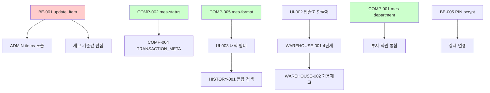

# 실행 큐 초안 (35개 백로그 우선순위 재정렬) — 2026-05-02

> **작업 ID:** MES-SAT-06 / P-SAT-06
> **작성일:** 2026-05-02 (토)
> **기준 브랜치:** `feat/hardening-roadmap` (단일 — 초기 분석 브랜치 `claude/analyze-dexcowin-mes-tGZNI` 폐기)
> **수정 여부:** 없음 (계획 문서만)

---

## 1. 분류 기준

### 위험도

- **A**: 모바일/문서 — 실수해도 회복 쉬움
- **B**: 프론트 코드 — diff 첨부 필요
- **C**: 백엔드/스키마/프론트+백 동시 — 서버 검증 필요
- **D**: DB 마이그레이션 / PIN / 배포 — 회사 PC 한정

### 임팩트

- **高**: 50~60대 사용자 즉시 체감 / 데이터 무결성 / 인증
- **中**: UI 일관성 / 유지보수성
- **低**: 문서 정합성 / 죽은 코드 정리

### 의존성

- 선행 작업이 필요한 경우 `→ 선행 ID` 표기

---

## 2. 35개 백로그 (재정렬)

### Tier 1 — 회사 PC 첫 주 (월~수, 1~10)

| 순서 | ID | 제목 | 위험 | 임팩트 | 선행 |
|---|---|---|---|---|---|
| 1 | BE-001 | update_item process_type_code 버그 | C | 高 | — |
| 2 | BE-003 | OPERATIONS.md /health/detailed 필드 정정 | A | 中 | — |
| 3 | COMP-001 | mes-department.ts 신규 (부서 색상 단일화) | B | 高 | TREE-002 확인 |
| 4 | ADMIN-002 | items 섹션 process_type_code UI 노출 | B | 高 | BE-001 |
| 5 | COMP-005 | mes-format.ts 신규 (날짜/숫자) | B | 中 | — |
| 6 | COMP-002 | mes-status.ts 신규 (Tone 통합) | B | 中 | — |
| 7 | UI-002 | 입출고 화면 한국어 레이블 교체 | B | 高 | — |
| 8 | UI-003 | 내역 화면 부서/직원/상태 필터 추가 | B | 中 | COMP-005 |
| 9 | BE-002 | option_code VARCHAR(10) 통일 | C | 中 | — |
| 10 | BE-006 | integrity PIN POST 전환 | C | 中 | — |

### Tier 2 — 회사 PC 둘째 주 (목~금, 11~20)

| 순서 | ID | 제목 | 위험 | 임팩트 | 선행 |
|---|---|---|---|---|---|
| 11 | WAREHOUSE-001 | 입출고 화면 4단계 위저드 + 가용재고 상단 노출 | B | 高 | UI-002 |
| 12 | WAREHOUSE-002 | 예약/가용 표시 위치 적용 | B | 高 | WAREHOUSE-001 |
| 13 | HISTORY-001 | 내역 검색·필터 개선 (통합 검색) | B | 中 | UI-003 |
| 14 | HISTORY-002 | 내역 CSV 내보내기 API + 버튼 | C | 中 | — |
| 15 | ADMIN-홈 | 관리자 홈 카드 그리드 (P-ADM-01) | B | 高 | — |
| 16 | ADMIN-코드마스터 | 공정/옵션/제품기호 3탭 분리 | C | 中 | — |
| 17 | ADMIN-부서직원 | 부서·직원 통합 화면 | B | 中 | COMP-001 |
| 18 | ADMIN-재고기준 | 재고 기준값 인라인 편집 | C | 中 | BE-001 |
| 19 | COMP-003 | mes-toast.ts 통합 | B | 中 | — |
| 20 | COMP-004 | TRANSACTION_META 색상 확장 | A | 中 | COMP-002 |

### Tier 3 — 회사 PC 셋째 주+ (21~30)

| 순서 | ID | 제목 | 위험 | 임팩트 | 선행 |
|---|---|---|---|---|---|
| 21 | ADMIN-실사 | 실사·강제조정 화면 | C | 高 | — |
| 22 | ADMIN-손실폐기 | 손실/폐기/편차 3탭 화면 | C | 中 | — |
| 23 | ADMIN-감사로그 | 감사 로그 타임라인 | C | 中 | — |
| 24 | ADMIN-권한PIN | 직원별 PIN 관리 | C | 高 | — |
| 25 | UI-004 | 모바일/데스크톱 useMediaQuery 전환 | C | 中 | — |
| 26 | TREE-003 | redirect-only 라우트 정리 | B | 低 | 사용자 확인 |
| 27 | TREE-004 | _archive 참조 파일 정리 (frontend/components/) | B | 低 | 사용자 확인 |
| 28 | BE-004 | Dockerfile 포트/reload 통일 | C | 中 | — |
| 29 | NAME-001~005 | ERP 잔재 Grade-A 일괄 교체 | A | 低 | — |
| 30 | DOC-001 | ERD.md 모델명 정정 | A | 低 | — |

### Tier 4 — 별도 PR / 보류 (31~35)

| 순서 | ID | 제목 | 위험 | 임팩트 | 비고 |
|---|---|---|---|---|---|
| 31 | BE-005 | PIN bcrypt/argon2id 전환 | D | 高 | 별도 PR, 인증 영향 |
| 32 | DEFAULT-PIN | DEFAULT_PIN 첫 진입 강제 변경 | D | 高 | BE-005 종속 |
| 33 | DOCS-start.bat | start.bat [ERP] 표기 정리 | A | 低 | 9곳 일괄 |
| 34 | DOCS-ARCH | ARCHITECTURE.md ERP/ 표기 | A | 低 | — |
| 35 | TEST-COVERAGE | pytest 커버리지 베이스라인 | C | 中 | 별도 작업 |

---

## 3. 의존성 그래프 (Mermaid)

---

## 4. 첫 주 일정 제안 (월~금)

| 요일 | 작업 ID | 예상 소요 |
|---|---|---|
| 월 (오전) | BE-001 | 30분 (코드 2줄 + 검증) |
| 월 (오후) | BE-003 | 15분 (문서) |
| 월 (오후) | COMP-005 | 1시간 (mes-format.ts 신규) |
| 화 (오전) | COMP-001 | 1.5시간 (mes-department.ts + 5곳 적용) |
| 화 (오후) | COMP-002 | 1시간 (mes-status.ts) |
| 수 (오전) | ADMIN-002 | 1시간 (items 섹션 UI) |
| 수 (오후) | UI-002 | 1.5시간 (입출고 한국어) |
| 목 (오전) | BE-002 | 30분 |
| 목 (오후) | BE-006 | 1시간 (PIN POST) |
| 금 (종일) | UI-003 | 2-3시간 (필터 개선) |

**총 예상:** 1주 (목표 10건)

---

## 5. 주의사항

### Frozen (절대 금지)

- `items.erp_code` (DB 컬럼)
- `formatErpCode()` (함수명)
- `ErpCode` (클래스)
- `ErpLoginGate` (컴포넌트)
- `localStorage.dexcowin_erp_*` (키)
- CSS `erp-card-anim`, `erp-letter`
- `ERP_Master_DB.csv` (파일명)
- `Hw-03/ERP` (저장소 경로)
- `C:/ERP/` (디렉토리)

### 동시 작업 금지

- BE-005 (PIN bcrypt) ↔ DEFAULT-PIN 강제 변경 → 한 PR에 묶지 말 것
- WAREHOUSE-001 ↔ 입출고 동선 변경 → 사용자 학습 부담, 한 번에 너무 많이 X

### 회귀 위험 高

| 작업 | 회귀 가능 영역 |
|---|---|
| COMP-001 | 부서 표시 5곳 동시 영향 |
| COMP-002 | StatusPill/StatusBadge 사용처 전체 |
| BE-005 | 모든 PIN 인증 흐름 |

---

## 6. 다음 주 첫 프롬프트 (확정)

**P-MON-01:** BE-001 (`update_item` process_type_code 버그 수정) 단독.

이유:
- 위험도 C (중간) 인데 변경량 최소 (코드 2줄)
- 검증 명확 (curl PUT 3-step — items.py 는 @router.put)
- 임팩트 高 (관리자 화면 버그 즉시 해소)
- 선행 의존 없음 — 바로 시작 가능
