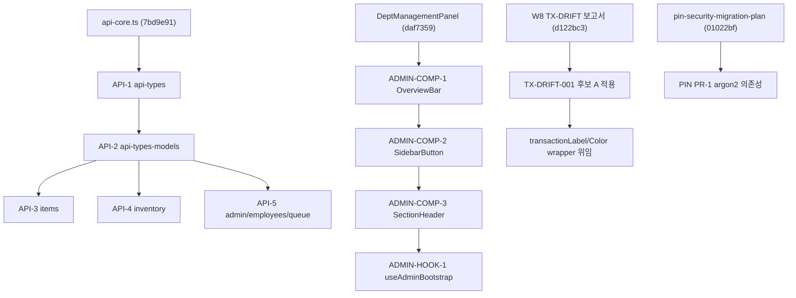

# 다음 분할 로드맵 — 2026-05-04

> **작업 ID:** W10 (Round-2 보완)
> **작성일:** 2026-05-04 (월)
> **기준 브랜치:** `feat/hardening-roadmap`
> **수정 여부:** 없음 (로드맵 문서)

---

## 1. 목적

Round-1 (9건) + Round-2 (10건) 후 진행 중인 분할 작업이 여러 문서에 흩어져 있다. 본 문서는:

- API 도메인 분리 다음 단계
- DesktopAdminView 후속 컴포넌트 분리
- transactionLabel / transactionColor → mes-status 위임
- 관련 의존성 / 위험도 / PR 순서

를 한 곳에 모은다. PIN 마이그레이션은 별도 (`pin-security-migration-plan.md`).

---

## 2. 분할 트랙 3종

### 2-A. API 도메인 분리 (총 5 PR)

api.ts (현재 1450줄) → 도메인별 파일.

| PR | 신규 파일 | 이동 대상 | 위험 |
|---|---|---|---|
| API-1 | `frontend/lib/api-types.ts` | `ProcessTypeCode`, `TransactionType`, `LocationStatus`, enum/literal union | A |
| API-2 | `frontend/lib/api-types-models.ts` | `Item`, `Employee`, `Department`, `ProductModel`, `ShipPackage` 등 interface | B |
| API-3 | `frontend/lib/api/items.ts` | `api.getItems`, `getItem`, `createItem`, `updateItem`, `deleteItem` | C |
| API-4 | `frontend/lib/api/inventory.ts` | `api.receive`, `ship`, `adjust`, `transfer*`, `getInventorySummary` | C |
| API-5 | `frontend/lib/api/admin.ts`, `employees.ts`, `queue.ts` | 나머지 도메인 | C |

**호환:**
- `frontend/lib/api.ts` 가 모든 도메인 API 를 spread 머지하여 동일 export (`api`)
- 외부 호출처 (`@/lib/api` import) 변경 0
- `parseError` 16곳 직접 사용은 점진적으로 `postJson`/`putJson` 으로 통합 (별도 PR API-6 후보)

**의존성:**
- 모든 PR 은 `api-core.ts` (이미 `7bd9e91` 에서 분리) 에 의존
- API-1 → API-2 → API-3,4,5 순서

---

### 2-B. DesktopAdminView 후속 분리 (총 4 PR)

`DesktopAdminView.tsx` 의 잔존 인라인 컴포넌트 (W5 의 DeptManagementPanel 분리 후 4개 남음).

| PR | 분리 대상 | 신규 경로 | 위험 |
|---|---|---|---|
| ADMIN-COMP-1 | `OverviewBar` | `_admin_sections/OverviewBar.tsx` | B |
| ADMIN-COMP-2 | `SidebarButton` | `_admin_sections/SidebarButton.tsx` | A (presentational) |
| ADMIN-COMP-3 | `SectionHeader` | `_admin_sections/SectionHeader.tsx` | A |
| ADMIN-HOOK-1 | PIN 잠금 + 부트스트랩 fetch → `useAdminBootstrap` | `_admin_hooks/useAdminBootstrap.ts` | C |

각 PR 은 props 시그니처 보존 + 동작/스타일 0 변화.

---

### 2-C. transactionLabel / transactionColor → mes-status 위임 (1 PR, TX-DRIFT-001 후행)

| 단계 | 작업 | 의존 |
|---|---|---|
| 1 | TX-DRIFT-001 (후보 A) — backend 16개 정본 기준 프론트 통일 | W8 보고서 |
| 2 | `legacyUi.transactionLabel` 본문을 `mes-status.getTransactionLabel` wrapper 로 | TX-DRIFT-001 완료 |
| 3 | `legacyUi.transactionColor` 본문을 `TRANSACTION_META.tone` 기반 hex 매핑으로 | 동일 |
| 4 | 호출처 점진 직접 import 전환 (W9 정책 따름) | — |

→ TX-DRIFT-001 가 선행되지 않으면 데이터 차이로 W2 같은 롤백 발생 위험.

---

## 3. 의존성 그래프

---

## 4. 권장 PR 순서 (상위 우선)

1. **TX-DRIFT-001** — 백엔드 정본 16개 기준 프론트 enum/라벨 통일 (3개 파일)
2. **API-1** — `api-types.ts` (enum/union 만, 위험 A)
3. **ADMIN-COMP-2** — `SidebarButton` 분리 (가장 짧음)
4. **API-2** — `api-types-models.ts`
5. **ADMIN-COMP-3** — `SectionHeader`
6. **API-3** — `api/items.ts`
7. **ADMIN-COMP-1** — `OverviewBar` (KPI 계산 로직 일부 포함, 좀 더 큼)
8. **API-4** — `api/inventory.ts`
9. **API-5** — 나머지
10. **TX-WRAP** — transactionLabel/Color wrapper 위임 (TX-DRIFT-001 완료 후)
11. **ADMIN-HOOK-1** — `useAdminBootstrap` (가장 위험, 마지막)

---

## 5. 위험도 / 영향 매트릭스

| 트랙 | 위험 | 호환성 영향 | 회귀 가능성 | 권장 시점 |
|---|---|---|---|---|
| API 도메인 분리 | A~C | 0 (re-export) | 매우 낮음 | 이번 라운드 다음 |
| DesktopAdminView 분리 | A~C | 0 (props 보존) | 낮음 | 이번 라운드 다음 |
| transactionLabel wrapper | B | 0 | 중간 (TX-DRIFT-001 선행 필수) | TX-DRIFT-001 후 |
| PIN 마이그레이션 | C~D | 인증 영향 | 높음 | 별도 사이클 |

---

## 6. 본 PR 미수정 사항

- 코드 변경 0
- 다른 보고서 (`pin-security-migration-plan.md`, `transaction-type-drift.md`, `legacy-wrapper-deprecation-plan.md`) 와 교차 참조만

---

## 7. 다음 라운드 후보 백로그

기존 35건 백로그 (`2026-05-02-execution-queue-draft.md`) 와 본 라운드 발견 사항 통합 — Round-3 로 별도 정리 예정.

추가된 항목:
- TX-DRIFT-001 (백엔드 정본 통일)
- API-1~5 (도메인 분리)
- ADMIN-COMP-1~3, ADMIN-HOOK-1
- TX-WRAP

기존 35건과 합산 시 약 45건. 주말 사이클 1회 추가 시 처리 가능.

---

## 8. 관련 보고서

- `pin-security-migration-plan.md` — PIN 마이그레이션 (별도 사이클)
- `2026-05-04-transaction-type-drift.md` — TransactionType 3-way 드리프트
- `2026-05-04-legacy-wrapper-deprecation-plan.md` — wrapper 정책
- `2026-05-04-dockerfile-port-alignment.md` — Dockerfile/compose 정렬
- `2026-05-02-execution-queue-draft.md` — 35건 우선순위 (Round-1 기준)
