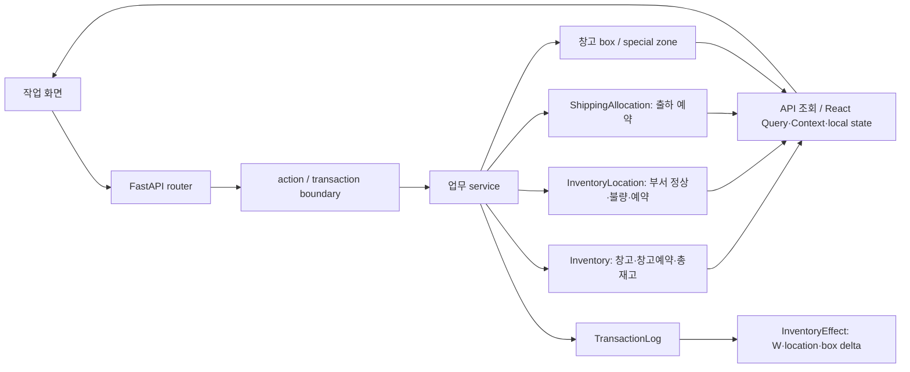
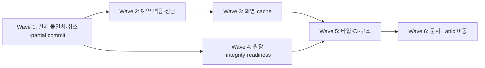
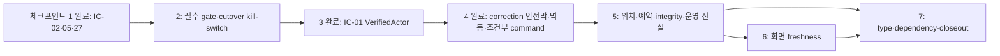

> **추천 모델: GPT-5.6 Sol** - 재고 상태기계, 권한, 동시성, UI 표시, 운영 복구를 함께 바꿔야 하는 고위험 개선입니다.
> **추천 추론 수준: 매우 높음** - 구현마다 물리 재고·예약·업무 상태·원장·화면의 다섯 계약을 교차 검증해야 합니다.
> **추천 실행 형태: 부모 통합 + 영역별 읽기 전용 하위 에이전트** - 구현과 최종 검증은 부모가 소유하고, 독립 경로 조사와 리뷰만 병렬화합니다.

# DEXCOWIN MES 전수 코드 품질·재고 신뢰도 감사 및 개선 계획

- 원 감사 기준일·SHA: 2026-08-13 KST, `71d6a34faf27ef736fe7dc64a5084ff2a7f46893`
- 첫 개선 체크포인트 기준 SHA: `8be64743c65ce6db3c8270d5cc6b73fcf64b216a`
- 두 번째 개선 체크포인트 기준 SHA: `90ce42d9fef0505ccbd7f5b7ea86b60760cb09dd`
- 최신 `main` 동기화 대상 SHA: `78e8023f41ef59528d9d8c07498e7653f9bee247`
- 현재 실행 위치: `C:\ERP\.worktrees\full-code-quality-checkpoint-2`
- Git 상태: 장기 품질 브랜치 `codex/full-code-quality-improvement`. CP4 완료 HEAD `e64a9a12da16f8502ab1a1e82dbed2b1d2648a01`에서 고정 `main` `78e8023f41ef59528d9d8c07498e7653f9bee247`을 품질 worktree 방향에만 통합했고, merge commit `deafc335502b46f9ed068bbb11175361826615ea` 뒤 CP5 W3 제품 commit `530a29ec3a8c315b07004e69b7ab1d6dc17ed4a3`까지 기존 품질 브랜치에 push했다. `main` 역병합·push·PR·force-push는 없음
- 실행 진척: 체크포인트 1·3·4 완료. 체크포인트 2의 `IC-04`·`IC-20`은 저장소 구현·로컬 PostgreSQL 실증과 품질 브랜치 CI 실행까지 통과했지만 required-check 설정 증거는 별도 외부 경계로 남긴다. CP4는 workflow 거래 보정 차단, semantic idempotency, handover/correction/cancel 경합, 삭제 품목 참조 보호를 세 hard stop으로 완료했다. CP5는 S0 최신 main 통합, W1 read-only preflight, Gate A 승인, W2 `IC-06` 물리 위치 원장, W3 `IC-07+IC-08` 공통 예약·출하 상태기계와 Gate B까지 완료했으며 다음 순서는 W4 `IC-03-B`다.
- 잔여 작업: 엄격한 완료 판정상 `IC` 17개가 남는다. `IC-06`, `IC-07`, `IC-08`, `IC-09`, `IC-10`, `IC-11`은 완료했고 `IC-03`은 correction 안전막이 완료된 `PARTIAL`로서 `IC-03-B` 전용 workflow cancel만 남는다. `IC-04`·`IC-20`의 required-check 외부 증거가 확보되면 15개로 줄며, 최종 closeout `DOC-01`, `AT-01`, `AT-02`도 남아 있다.
- 최종 판정: **CP5 GATE B COMPLETE — W4 `IC-03-B` 진입 가능**
- 문서 성격: 현행 코드의 감사 결과이자 후속 구현 순서의 단일 정본

> **증거 시점 안내:** 2~7절의 코드 줄번호와 실패 서술은 2026-08-13 원 감사 snapshot을 보존한다. 이후 `main`이 바꾼 계약과 충돌하는 문장은 `[STALE]` 역사 증거이며, 현재 판정·구현 경계는 8.9.6절과 12.21절이 우선한다.

---

## 1. 작업자용 한 페이지 결론

### 1.1 지금 재고 수량을 믿어도 되는가

**정상적인 단일 작업 흐름에서 보이는 창고·부서 수량은 상당 부분 코드와 테스트로 일관되게 이동한다. 그러나 현재는 아무 조건 없이 “믿고 사용 가능”이라고 판정할 수 없다.**

공급 입고, 창고와 부서 사이 이동, 부서 간 이동, 생산과 BOM 차감, 불량 격리·해제, 순차적인 출하 준비·픽업은 SQLite 격리 테스트에서 재고 셀과 거래 효과가 함께 움직였다. 감사 전용 화면 검증에서도 입고 후 SQL 수량과 작업 화면 수량이 함께 갱신되는 것을 확인했다. 반면 다음 경로는 작업자가 보고 있는 수량이나 업무 상태를 실제 재고와 갈라놓을 수 있다.

1. 프런트의 입출고 쓰기 요청은 15초 후 화면에서 실패로 끝나도 서버 요청을 중단하지 않는다. 작업자가 다시 누르면 새 멱등 키가 발급되어 첫 요청의 지연 성공과 재시도가 모두 반영될 수 있다. `frontend/lib/api-core.ts:210-234`, `frontend/app/mes/_components/_warehouse_v2/useIoSubmit.ts:20-47`
2. 출하 예약은 일반 재고 예약 필드와 별도인 `ShippingAllocation`에만 기록된다. 출하 외 소비 경로가 이 예약을 공통으로 차감하지 않으며, 출하 상태 전이에 request/allocation 행 잠금과 명령 멱등 키가 없다. `backend/app/services/shipping.py:858-899,1485-1536,1670-1769`, `backend/app/models/shipping.py:184-206`
3. 고정 `main`은 append-only `InventoryOperation`과 별도 cancellation operation으로 관련 재고·allocation·업무 상태를 함께 역전한다. 이로써 기존 effect-only 일반 취소 결함은 대체됐지만, workflow 귀속 RECEIVE/SHIP 수량 보정은 여전히 항상 창고 bucket을 바꾸므로 CP4의 첫 안전막으로 남는다. `backend/app/models/inventory_operation.py:54-112`, `backend/app/services/inventory_operation_cancellation.py:772-854`, `backend/app/routers/inventory/transactions.py:1000-1088`
4. 원 감사에서 부서조정 `direction="scrap"`의 무음 성공을 재현했으나, 첫 체크포인트 `IC-02`에서 request enum·service·frontend submit type을 함께 좁혀 모든 subtype을 422로 차단했다. 폐기는 전용 재작업 `scrap_qty` 흐름만 사용한다.
5. 운영 무결성 검사는 부서 예약, 출하 allocation, 창고 박스·특수구역 수량을 검사하지 않고, 누락·0 효과 거래를 경고만 한 뒤 성공 종료할 수 있다. 즉 “검사 통과”가 모든 재고 표현의 일치를 보증하지 않는다. `scripts/ops/check_inventory_integrity.py:62-332,349-409`
6. 기준 SHA의 재고 초기화 도구는 출하 요청·allocation을 지우지 않아 기존 출하가 새 기준 재고를 다시 바꿀 수 있었다. 체크포인트 2 로컬 커밋 `3c75558c`의 `IC-04`는 미래 delta 가능 또는 불일치 출하를 dry-run/apply mutation 전에 차단하고, `CANCELLED` terminal-safe 조합만 허용한다. 이 보호막이 `main`에 통합되기 전과 체크포인트 5 운영 readiness 완료 전에는 실제 cutover를 계속 금지한다.

따라서 현 상태의 운영 조건은 다음과 같다.

- 입출고가 타임아웃되면 즉시 같은 작업을 새로 제출하지 말고 거래 이력과 재고를 먼저 확인한다.
- 출하 준비 완료 후 픽업 전에는 예약 품목을 생산·부서조정·불량 처리로 소비하지 않는다.
- 출하·생산·분해처럼 여러 로그가 한 업무를 이루는 거래는 일반 거래취소 화면으로 임의 취소하지 않는다.
- 일반 `/dept-adjustment`에는 `scrap` 입력이 더 이상 허용되지 않는다. 폐기는 정상/불량 재작업의 전용 폐기 흐름만 사용한다.
- inventory cutover는 출하 미결 건을 별도로 닫고 검증하기 전에는 실행하지 않는다.
- 일일 마감 때 창고·부서 정상·불량·출하 allocation·박스·특수구역을 함께 대조한다. 현행 readiness 성공만으로 대체하지 않는다.

이 조건과 수동 대조를 지킬 수 있을 때만 **조건부 사용 가능**이다. 위 조건을 통제할 수 없다면 운영 관점에서는 **현재 상태로는 신뢰 불가**로 취급해야 한다.

### 1.2 이번 감사가 보증하는 것과 보증하지 않는 것

이 감사는 “올바르게 입력된 재고를 DEXCOWIN MES가 일관되게 이동·표시하는가”를 판정한다. 직원 환경 DB나 실제 창고의 실물을 대조하지 않았으므로, 현재 DB 수량과 실제 보유 수량이 같다는 보증은 별도 재고조사 없이는 내리지 않는다.

판정은 다음 네 단계만 사용한다.

| 판정 | 의미 |
|---|---|
| `VERIFIED` | UI·API·DB·원장 일치와 실패·취소·재시도·경합까지 해당 환경에서 증명 |
| `PARTIAL` | 정상 흐름은 증명됐으나 일부 예외·동시성·화면 갱신이 미검증 |
| `FAILED` | 수량·위치·예약·업무 상태·로그·화면 중 하나 이상의 불일치 또는 무음 실패가 재현/확정 |
| `NOT_VERIFIED` | 실행 환경이나 독립 검증 수단이 없어 증거를 확보하지 못함 |

### 1.3 작업별 요약 판정

| 작업자 업무 | 판정 | 현재 믿을 수 있는 범위 | 남은 핵심 위험 |
|---|---|---|---|
| 공급 입고·창고 보정 | `PARTIAL` | 정상·부족·다중 라인 rollback과 감사 전용 화면 입고 | 결과 불명 재시도의 새 키 중복, PostgreSQL 경합 |
| 창고→부서 | `PARTIAL` | 창고 예약 후 승인, 창고 감소·부서 증가·총량 보존 | 공통 actor 신뢰, 실제 PostgreSQL 승인 경합 일부 |
| 부서→창고 | `PARTIAL` | 부서 예약 후 승인, 부서 감소·창고 증가 | HTTP 전체 경로·승인 전 재고 변동 경합 보강 필요 |
| 부서→부서·인수인계 | `PARTIAL` | 정상 이동·rollback·received 멱등 | handover 문서 행 잠금과 PostgreSQL 이중 수령 미검증 |
| AS·연구 사용출고 | `PARTIAL` | 예약·승인·창고/총재고 감소 | actor 신뢰와 결과 불명 재시도 |
| 생산·BOM backflush | `PARTIAL` | 구성품 감소·완제품 증가·operation 원장·원자 취소·SQLite 1승자 | PostgreSQL 업무별 잠금 증거와 correction 안전막 부족 |
| 분해·재작업 | `PARTIAL` | 부모 감소와 자식 정상/불량/폐기 분기 | 빈 효과 폐기 로그와 복합 취소 계약 |
| 불량 격리·해제 | `PARTIAL` | 정상/불량 버킷 이동과 총량 보존, 중복 격리 방지 | actor 검증, 승인 표시와 실제 즉시 완료 drift |
| 불량 폐기·반품 | `PARTIAL` | 독립 defect/StockRequest 정상 경로 수량 감소와 전용 재작업 폐기 | actor·경합·복합 취소 계약은 계속 보강 필요 |
| 일반 부서조정 `scrap` | `VERIFIED` | `IC-02`에서 모든 subtype 422, service 직접 호출 fail-closed, 실패 전후 raw SQL 재고·로그 불변 | 폐기 기능은 이 표면이 아니라 전용 재작업 흐름만 사용 |
| 순차 출하 준비·픽업·취소 | `PARTIAL` | 단일 호출에서 allocation·재고·로그의 정상 전이 | 행 잠금·멱등·공통 예약 부족 |
| 출하와 operation 취소 결합 | `PARTIAL` | 원 operation의 재고·allocation·workflow 상태를 별도 reversal operation으로 함께 역전 | 실제 PostgreSQL 교차 경합과 후속 공통 예약 계약 부족 |
| 거래 수량보정·취소 | `PARTIAL` | operation 취소 1승자와 레거시 증거 기반 편입, 원본 거래당 순차 correction 1회 | workflow-linked correction·SHIP wrong-bucket·correction 경합 |
| 창고 박스·특수구역 | `PARTIAL` | 위치 표현과 reconcile 조회 | 출고 source 정책·중복 품목·운영 gate 사각지대 |
| 대시보드·입출고·이력 표시 | `PARTIAL` | 정상 입고의 화면/SQL 일치 | mixed cache, 지도 optimistic 경합, 일부 오류 화면 |
| cutover·readiness·복구 | `PARTIAL` | 체크포인트 2 로컬 커밋에서 현행 상태 4종×allocation 9종의 36조합, orphan·손상 원장, rollback, SQLite writer exclusion과 실제 PostgreSQL 두 연결 차단을 검증해 unsafe cutover를 차단 | 체크포인트 5의 WAL·schema·allocation·box readiness와 실제 운영 cutover 승인·실행은 남음 |
| PostgreSQL 동시성 | `PARTIAL` | 폐기 가능한 PostgreSQL 16에서 clean Alembic head와 cutover 1행·창고 지도 3행의 독립 연결 잠금을 skip 없이 검증 | 출하·handover·correction 등 후속 카드의 업무별 경합과 GitHub 필수 job 실행은 남음 |

### 1.4 가장 먼저 할 일

첫 구현 Wave는 구조 미관이 아니라 수량이 틀어질 수 있는 경로를 닫는다.

1. 첫 체크포인트에서 서버 시작 DB 보호 경계를 read-only로 되돌렸다(`IC-27` 완료).
2. 부서조정 `scrap` 무음 성공을 막고 무결성 복구·감사 로그를 한 transaction으로 묶었다(`IC-02`, `IC-05` 완료).
3. 체크포인트 2에서 필수 PostgreSQL·E2E·type gate를 먼저 완성하고, 재고를 다시 바꿀 수 있는 기존 출하가 있으면 cutover를 fail-closed한다(`IC-20`, `IC-04`).
4. 체크포인트 3에서 session 발급 자격을 결정하고 서버 검증 직원 session과 공통 actor 경계를 구현했다(`IC-01` 완료). 이후 mutation API 카드는 이 경계 뒤에서만 배포한다.
5. main 원장을 중복 구현하지 않고 workflow-linked correction 안전막, semantic idempotency, handover/correction 조건부 전이, active/deleted item command 분리를 거쳐 `박스+특수구역+미배치=창고`, 예약·출하 상태기계, blocking integrity 순으로 진행한다(`IC-03`, `IC-06`~`IC-11`, `IC-17`~`IC-19`).

후속 실행의 단일 순서와 각 정지 조건은 8.9절의 체크포인트 2~7을 따른다. 한 체크포인트가 통합·검증·리뷰를 모두 통과하기 전에는 다음 체크포인트를 시작하지 않는다.

---
## 2. 감사 SHA·범위·방법·제약

### 2.1 원 감사 실행 계약 (`71d6a34`)

- 모든 코드 읽기, 격리 DB, 서버, 브라우저, 문서 쓰기는 detached 워크트리에서 수행했다.
- 감사 중 `main`이 이동하더라도 최초 SHA를 유지했다.
- `main`의 미커밋 변경은 가져오거나 수정하지 않았다.
- 제품 코드, 공개 API, DB schema, 제품 타입은 수정하지 않았다.
- tracked 산출물은 이 문서 하나다. 원본 로그·스크린샷·격리 DB·기계 원장은 `_attic/runtime/code-quality-audit/20260813-073216/` 아래 ignored 파일로 보존했다.
- 브랜치 생성, 커밋, 푸시는 수행하지 않았다.
- weekly report 화면, 모바일 하단 탭, desktop shipping 5단계 카드 크기의 동결 범위는 읽고 분류했으나 수정 후보에서 제외했다.

첫 개선 체크포인트는 별도 detached 워크트리와 기준 SHA `8be64743`에서 제품·테스트·운영 helper를 미커밋 working diff로 수정했다. 따라서 위 “제품 코드·공개 API·제품 타입 무수정”과 “tracked 산출물 문서 하나”는 원 감사 단계에만 해당한다. 체크포인트의 의도적 공개 계약 변화는 일반 부서조정 request에서 처리하지 않던 `scrap` enum을 제거한 한 건이며, DB schema·migration과 response schema는 바꾸지 않았다.

### 2.2 직원 환경 비접촉과 사전 해시 조회 기록

사용자가 직원 환경 비접촉을 추가 지시한 이후에는 `C:\ERP-dev`의 파일, DB, 프로세스, 포트, 해시를 포함해 어떤 조회도 수행하지 않았다. 다만 그 지시가 도착하기 전 감사 harness의 초기 보호 절차가 `C:\ERP-dev\backend\mes.db`의 SHA-256을 시작/종료 각 한 번 계산했다. DB 연결·쓰기·프로세스 접근은 없었고 두 해시는 같았다. 이 사실을 숨기지 않고 다음처럼 기록한다.

| 항목 | 결과 |
|---|---|
| 사전 접근 | 파일 SHA-256 읽기 2회 |
| DB connection | 없음 |
| write attempt | 없음 |
| hash 변화 | 없음 |
| 추가 지시 이후 접근 | 없음, 전면 금지 |

evidence status는 `READ_HASH_ONLY_BEFORE_PROHIBITION_UPDATE`로 기록했다.

동적 harness에서 해당 경로를 제거한 뒤 감사 runtime 전체에서 `ERP-dev` 문자열이 남지 않았음을 확인했다. 이 예외 때문에 “직원 환경을 한 번도 읽지 않았다”라고 주장하지 않는다.

첫 개선 체크포인트에서는 시작부터 직원 환경의 파일·해시·검색·DB·process·port를 모두 금지했고 접근은 0이었다. 아래 사전 해시 사건은 원 감사 단계의 역사 기록이며 이번 체크포인트에서 반복되지 않았다.

### 2.3 고정 환경

| 항목 | 값 |
|---|---|
| Git SHA | `71d6a34faf27ef736fe7dc64a5084ff2a7f46893` |
| Alembic revision | `20260812_0019` |
| Python | `3.12.0` |
| Node.js | `v24.15.0` |
| npm | `11.12.1` |

첫 개선 체크포인트는 SHA `8be64743c65ce6db3c8270d5cc6b73fcf64b216a`, Alembic `20260812_0019`, Python `3.12.0`을 유지했다. E2E 정본은 CI와 같은 Node `v20.20.2`이며, `verify_e2e.ps1`은 다른 major에서 Playwright 시작 전에 fail-closed하도록 보강했다.
| frontend lock SHA-256 | `356998dc19dcaee6489a31f68c0f445aad7e5e1868997fcf6d841797bae9d970` |
| 격리 backend/frontend | `127.0.0.1:8022` / `127.0.0.1:3101` |
| PostgreSQL | 환경 부재로 `NOT_VERIFIED` |

### 2.4 누락 방지 manifest

`git ls-files -z` 결과를 정본으로 삼아 경로·크기·해시·역할·영역·검토 그룹·검토 깊이를 기록했다.

| 항목 | 결과 |
|---|---:|
| 추적 파일 | 2,252 |
| 고유 경로 | 2,252 |
| 중복 경로 | 0 |
| 원장에 없는 추적 파일 | 0 |
| 추적되지 않는 원장 항목 | 0 |
| 미분류 | 0 |
| 읽기/형식 검토 미완료 | 0 |
| 읽기 전후 hash mismatch | 0 |

역할 분포는 `runtime 650`, `test 402`, `migration 19`, `CI 1`, `ops 37`, `dev-tool 187`, `documentation 233`, `generated 2`, `asset 711`, `frozen 10`이다. 이는 감사 SHA의 스냅샷 수이며 문서에서 고정된 제품 수량으로 재사용하지 않는다. 가변한 시스템 사실은 `python _attic/backend-scripts/facts.py`로 다시 확인한다.

검토 그룹별 결과:

| 그룹 | 파일 | 검토 방식 | 결과 |
|---|---:|---|---|
| backend runtime/migration | 158 | 전체 UTF-8 읽기, router→service→model/DB 호출 추적, migration chain | 158/158 |
| frontend runtime | 421 | 전체 UTF-8 읽기, page→shell→실제 tab render와 API/state 추적 | 421/421 |
| tests | 402 | 전체 테스트 읽기, signature/router/fixture/dialect/증거 강도 구분 | 402/402 |
| CI·ops·dev-tool·docs | 560 | 전체 텍스트 읽기, consumer·exit code·운영 계약·문서 drift | 560/560 |
| assets·historical binary | 711 | magic/크기/hash/consumer/중복, Office ZIP 내부 구조 | 711/711 |

자산 중 Office 파일 45개는 ZIP 내부를 열어 45/45 정상, XLSX 44개의 201개 sheet metadata(visible 199, hidden 2)를 읽었다. 바이너리는 내용을 코드처럼 해석하지 않고 형식, 실제 consumer, 중복, 보존 정책을 판정했다.

### 2.5 증거 규칙

- `확정`: 현재 실행 경로와 구체적 `file:line`이 연결되고, 테스트 또는 결정적인 코드 상태 전이로 결과가 입증됨.
- `동적 확인`: 격리 DB/브라우저/독립 SQL oracle에서 재현됨.
- `검증 가설`: 위험한 seam은 보이지만 해당 DB dialect 또는 경합을 실행하지 못함. 결함 수로 세지 않음.
- `문서 drift`: live code와 문서가 다름. live code를 기준으로 판정함.
- 서비스 직접 호출 테스트는 primitive 증거로만 사용하며 HTTP 권한·직렬화 증거로 승격하지 않음.
- SQLite WAL/`BEGIN IMMEDIATE` 동시성 결과를 PostgreSQL row-lock 증거로 간주하지 않음.
- 정적 가설을 동적 증거 없이 억지로 `FAILED`로 올리지 않되, 어떤 입력이 무시되는 것처럼 코드상 결과가 결정적인 경우는 확정 finding으로 기록함.

### 2.6 기준선 검증

최초 한 번 다음 전체 gate를 실행했다.

```powershell
powershell -ExecutionPolicy Bypass -File .\scripts\dev\verify_local.ps1 -Mode full -DbReadOnlyCheck -IncludeE2E
```

총 1,051.4초, exit 1이었다.

| gate | 결과 | 해석 |
|---|---|---|
| backend pytest | PASS, 4 skip | PostgreSQL 전용 테스트는 환경 부재 skip |
| OpenAPI drift | PASS | 현 baseline 일치 |
| frontend lint/typecheck | PASS | 현 제품 소스 범위 통과 |
| Vitest/coverage | PASS | 기존 React `act()`/JSX 경고는 남음 |
| production build/bundle | PASS | 빌드·현 bundle gate 통과 |
| DB read-only consistency | PASS | 검사 범위 내 통과 |
| Playwright E2E | FAIL, 14 중 6 pass/8 fail | 공통 helper의 stale selector라는 테스트 결함 |

E2E 실패 화면에는 선택 품목과 활성 하단 `수량 조정` CTA가 보였지만 helper가 먼저 나오는 disabled step-navigation 버튼을 골라 기다렸다. 같은 DOM과 selector로 원인이 결정적이어서 제품·테스트를 고치거나 전체 gate를 반복하지 않았다. `frontend/e2e` 증거가 기준선에서 완전 green이 아니므로 관련 영역의 기존 E2E 보장은 낮춰 평가했다.

### 2.7 의존성 기준선

- `npm ci`: PASS
- `npm ls --depth=0`: PASS
- `pip check`: PASS, broken requirement 없음
- `npm audit --json`: 취약점 보고 20건(critical 3, high 13, moderate 3, low 1)

직접 의존성 중 보고가 연결된 것은 `next@14.2.3`, `vitest@2.1.9`, `@vitest/coverage-v8@2.1.9`, `eslint-config-next`, `postcss`다. production runtime인 Next.js와 개발 도구인 Vitest/ESLint 계열을 같은 운영 위험으로 합치지 않는다. npm은 설치된 Next 범위의 non-major 후보로 `14.2.35`를 제시하므로, 별도 dependency 카드에서 변경 로그·빌드·E2E를 검증한 뒤 올린다.

---
## 3. 전체 아키텍처와 실제 실행 경로

### 3.1 재고의 물리 모델

재고의 기본 불변식은 다음과 같다.

```text
Inventory.quantity
  = Inventory.warehouse_qty
  + Σ InventoryLocation(PRODUCTION).quantity
  + Σ InventoryLocation(DEFECTIVE).quantity
```

근거는 `backend/app/models/inventory.py:46-51,69-77`, `backend/app/services/inv_calc.py:60-72`다. 창고 예약은 `Inventory.pending_quantity`, 부서 예약은 `InventoryLocation.pending_quantity`, 출하 예약은 별도 `ShippingAllocation`으로 표현한다. 이 세 예약 체계는 하나의 공통 source of truth가 아니다.



`InventoryEffect`는 창고·location·box 전후값을 기록하지만 pending, allocation, special zone, StockRequest/IoBatch/ShippingRequest 상태는 기록하지 않는다. 따라서 effect 역재생은 물리 셀 취소 도구이지 모든 업무 상태의 보편적 취소 도구가 아니다. `backend/app/services/inv_effect.py:35-104`

### 3.2 활성 backend 실행 표면

`backend/app/main.py:293-310`의 실제 router 등록부터 다음 경로를 추적했다.

| 표면 | 대표 진입 | 핵심 transaction/module | 물리 재고 역할 |
|---|---|---|---|
| IO V2 | `/api/io/submit` | `io_actions` → `io_dispatch` | 즉시 입고/보정/이동 또는 StockRequest 생성 |
| StockRequest | `/api/stock-requests`와 approve/reject/cancel | `stock_request_actions`, `sr_approval`, `sr_execution` | 예약 후 승인 실행, 불량/재작업 일부 즉시 실행 |
| 부서조정 | `/api/dept-adjustment/submit` | `dept_adjustment.submit_adjustment` | 생산·분해·보정의 별도 표면 |
| 인수인계 | `/api/handovers/{id}/receive` | `handover.receive_handover` | 부서 간 실제 이동과 상태 수령 |
| 생산입고 | `/api/production/receipt` | `production_receipt` | BOM backflush와 완제품 입고 |
| 불량 | `/api/defects/quarantine`, `unquarantine` | `defect_actions`, `inv_defective` | 정상↔불량, 폐기·반품·재작업 |
| 출하 | `/api/shipping/...` | `shipping_actions`, `shipping` | 구성전환, allocation, 픽업 차감·취소 |
| 거래 | `/api/inventory/transactions/...` | `transaction_actions` | 수량정정과 effect 역재생 |
| 창고 지도 | `/api/warehouse-map/...` | boxes/zones routers | box·special zone 표현과 이동 |

같은 업무가 여러 표면에 존재한다. 예를 들어 부서 간 이동은 IO `dept_transfer`와 handover receive가 있고, 생산·분해·보정은 IO V2와 `/dept-adjustment`가 따로 있다. 모든 표면이 동일한 actor, 멱등, 승인, 로그 정책을 공유하지 않으므로 “primitive가 안전하다”는 사실만으로 HTTP 업무 전체를 안전하다고 판정하지 않았다.

### 3.3 실제 frontend render와 수량 흐름

실제 진입은 `frontend/app/mes/page.tsx`에서 `AdminSessionProvider` → `QueryProvider` → `DepartmentsProvider` → `MesLoginGate`를 거쳐 viewport별 desktop/mobile shell을 고른다. desktop은 dashboard, warehouse, shipping, map, defect, history를 렌더하고 mobile은 dashboard, warehouse, defect, history, more를 렌더한다.

서버 상태는 React Query, 직접 fetch, `DepartmentsContext`, local state, SSE revision이 혼재한다. 정상 mutation 후 일부 화면은 invalidate/refetch하지만, 모든 소비자가 같은 cache와 freshness 계약을 사용하지 않는다. 따라서 이 감사는 API 응답뿐 아니라 화면에 보이는 값까지 별도 셀로 취급한다.

확정된 대표 seam:

- 입출고 timeout은 fetch를 abort하지 않고, hook은 결과 불명 key를 보존하지 않는다. `frontend/lib/api-core.ts:210-234`, `frontend/app/mes/_components/_warehouse_v2/useIoSubmit.ts:20-47`
- 창고지도 move/restack은 generation/pending 표시 없이 optimistic mutation을 fire-and-forget한다. 오래된 실패 rollback이 더 최신 성공 화면을 덮을 수 있다. `frontend/app/mes/_components/DesktopWarehouseMapView.tsx:339-451`, `frontend/app/mes/_components/_warehouse_map/WarehouseStages.tsx:652-661`
- 부서 데이터는 React Query, Context 직접 fetch, admin bootstrap, panel mutation이 나뉜다. `frontend/app/mes/_components/DepartmentsContext.tsx:25-69`, `frontend/lib/queries/useDepartmentsQuery.ts:16-63`
- 출하 BOM match 요청은 abort/generation 검증 없이 늦게 도착한 응답이 최신 선택을 덮을 수 있다. `frontend/app/mes/_components/DesktopShippingView.tsx:1471-1498`

### 3.4 트랜잭션과 동시성의 실제 보장 범위

`transactional` action wrapper는 한 요청 안의 재고·로그·업무 상태 rollback을 강화한다. 그러나 transaction 경계가 있다는 사실은 같은 상태를 읽은 두 요청의 중복 실행을 자동으로 막지 않는다. 상태 의존 명령에는 row lock, 조건부 상태 update, active allocation uniqueness, semantic idempotency가 별도로 필요하다.

SQLite 동시성 테스트는 파일 DB, WAL, `NullPool`, `BEGIN IMMEDIATE`로 격리되어 있으며 총량·비음수·1승자 성질을 잘 검증한다. 운영 DB가 PostgreSQL일 때의 `FOR UPDATE`, isolation, unique conflict는 해당 엔진에서 다시 증명해야 한다. 이번 환경에는 ephemeral PostgreSQL이 없어 그 행을 `NOT_VERIFIED`로 남겼다.

---
## 4. 재고 작업별 신뢰도 판정

### 4.1 판정에 사용한 독립 오라클

동적 검증은 애플리케이션 재고 계산 함수를 재사용하지 않고 다음 세 값을 대조한다.

1. 시나리오에 선언한 기대 delta
2. 별도 read-only SQLite connection의 before/after 실제 delta
3. 연결된 `inventory_effect` delta 합계

화면 검증이 있는 행은 네 번째 값으로 작업 화면의 표시 수량을 추가한다. 공통 불변식은 총재고 합, 물리·예약·allocation 비음수, 예약≤해당 물리 버킷, 실패 시 부분 재고/로그/상태 0, 화면과 SQL 일치다.

### 4.2 창고 입고와 보정

**판정: `PARTIAL`.** 공급 입고는 `W+q, T+q`, 창고 보정 입고도 동일하고, 보정 출고는 `W-q, T-q`이며 box tracking이 켜지면 box도 함께 감소한다. action 경계 안에서 후반 실패가 전체 rollback되는 테스트가 있다. 감사 전용 UI 입고에서도 성공 대화상자 후 독립 SQL과 대시보드 수량이 일치했다.

남은 위험은 정상 산술이 아니라 결과 불명 재시도다. `writeJson`이 15초 후 reject해도 원 fetch가 살아 있고 `useIoSubmit`은 새 key를 만든다. 서버도 같은 key의 다른 payload fingerprint를 비교하지 않는다. 따라서 정상·부족·rollback은 강하지만 재시도까지 포함한 `VERIFIED`는 아니다.

### 4.3 창고↔부서와 부서↔부서

**판정: `PARTIAL`.** 창고→부서는 제출 때 `WP+q`, 승인 후 `WP-q, W-q, P[to]+q`로 총량을 보존한다. 부서→창고는 `PP[from]+q` 후 `PP-q, P[from]-q, W+q`다. 부서→부서는 출발 정상재고를 줄이고 도착 정상재고를 올린다. 다중 라인 후반 실패, pending 해제, 승인 재호출, SQLite 경합은 기존 테스트가 잘 잡는다.

다만 직접 StockRequest와 IO 표면의 actor 계약이 같지 않고, 서비스 직접 호출 동시성 증거와 실제 HTTP row-lock 증거를 구분해야 한다. handover는 이미 `received`면 멱등이지만 상태를 읽는 문서 행 잠금이 보이지 않아 PostgreSQL 이중 수령은 미검증이다.

### 4.4 생산·BOM·분해·재작업

**판정: `PARTIAL`.** 생산은 구성품을 각 home department `PRODUCTION`에서 차감하고 결과품을 공정부서에 입고한다. BACKFLUSH/PRODUCE 로그와 effect가 각각 남고, 같은 구성품을 동시에 쓰는 SQLite 테스트는 한 작업만 성공하며 loser의 orphan 로그가 없음을 확인한다. 분해·재작업은 부모 감소와 자식 정상/불량/미회수 폐기 분기를 원자적으로 처리한다.

그러나 생산 receipt의 관련 로그는 같은 reference를 써도 항상 `operation_batch_id`로 묶이지 않는다. 일반 거래취소가 한 로그만 역재생하면 하나의 생산 업무가 분리될 수 있다. 재작업의 미회수 scrap child는 물리 셀 변화 없이 `DEFECT_SCRAP` 빈 effect를 남기며, 일반 취소는 빈 effect를 거부한다. 복합 취소 정책을 업무별 명령으로 고정해야 한다.

### 4.5 불량 격리·해제·폐기·반품

**원 감사 판정: 독립 격리/해제/폐기/반품은 `PARTIAL`, 부서조정 `scrap`은 `FAILED`. 첫 체크포인트에서 후자는 `IC-02`로 422 차단해 `VERIFIED`로 갱신했다.**

창고 또는 정상 부서재고를 불량 버킷으로 옮길 때 총량은 보존되고, 해제는 같은 부서 정상 버킷으로 되돌린다. 폐기·공급사 반품은 불량 또는 정상 source를 줄이고 총재고도 줄인다. semantic duplicate 격리와 SQLite 동시성, ledger 실패 rollback 테스트가 있다.

두 가지 계약 drift가 있다.

- `approval_rules`는 defect quarantine을 승인 대상으로 표시하지만 StockRequest 생성은 defect type의 양 승인 플래그를 false로 강제해 즉시 완료한다. 화면/규칙과 실행 상태가 다르다. `backend/app/services/approval_rules.py:21-24`, `backend/app/services/stock_requests.py:207-224`
- 원 감사 당시 부서조정 schema의 `scrap`은 서비스가 처리하지 않아 이 표면을 `FAILED`로 판정했다. 현재는 request schema와 service가 모든 subtype의 일반 부서조정 `scrap`을 transaction 전에 거부한다.

### 4.6 출하

**판정: 순차 흐름은 `PARTIAL`, 일반 거래취소와 결합한 수명주기는 `FAILED`.**

순차 흐름의 의도는 명확하다.

```text
REQUESTED → PREPARING → PREPARED → PICKED_UP
                     ↘ prepare cancel
PICKED_UP → pickup cancel → PREPARED
```

- 요청·수정·준비 시작은 물리 재고를 바꾸지 않는다.
- 준비 완료는 final PF와 동반품을 `ShippingAllocation.RESERVED`로 예약하지만 `Inventory*.pending`은 올리지 않는다.
- 픽업 완료 때 공정부서 `PRODUCTION`과 총재고가 감소하고 SHIP effect가 생기며 allocation이 `CONSUMED`가 된다.
- 픽업 취소는 PICKUP effect를 역재생하고 allocation을 `RESERVED`로 되돌린다.

기존 순차 테스트는 이 계약을 상당히 잘 검증한다. 하지만 request row와 allocation에 대한 결정적 잠금/조건부 전이가 없어 prepare×2, pickup×2, pickup-vs-cancel 경합은 PostgreSQL에서 미검증이다. 더 중요한 것은 출하 예약을 생산·부서조정·불량 소비가 공통으로 존중하지 않는다는 점이다.

일반 거래취소는 더 직접적인 실패다. SHIP effect를 역재생해 재고만 올려도 ShippingRequest와 ShippingAllocation을 바꾸지 않는다. 이 조합은 코드상 허용 가능한 실행 경로가 연결되므로 출하 업무 상태와 수량 원장의 결합은 `FAILED`다.

### 4.7 거래 정정·취소

**판정: 전체 거래 정정·취소 표면은 `FAILED`; 창고 RECEIVE 정정과 단일 effect 취소만 제한적으로 `PARTIAL`.** 수량정정은 원 로그를 수정하지 않고 차이만큼 새 ADJUST와 edit log를 만든다. 그러나 허용 타입에 SHIP이 포함되고 정정 delta는 항상 `warehouse_qty`에 적용된다. 출하 pickup SHIP은 공정부서 `PRODUCTION`을 줄이므로, 이 로그를 정정하면 원래 location이 아니라 창고를 바꾸는 wrong-bucket 결과가 된다. `backend/app/routers/inventory/transactions.py:77-83,898-902,912,953-982`, `backend/app/services/transaction_actions.py:122-150`, `backend/app/services/shipping.py:1670-1688`

취소는 저장된 effect 전후값을 역재생하며 음수와 빈 effect를 차단한다. 그러나 원 TransactionLog 행의 조건부 상태 update/unique correction이 없고, 업무 request/batch/allocation 상태를 포함하지 않는다.

따라서 history 화면은 “물리 effect 취소 가능”과 “업무 전체 취소 가능”을 구분해야 한다. 출하 픽업, 생산, 분해, 재작업, IO batch에는 각 업무 module의 전용 취소만 허용하는 것이 안전하다.

### 4.8 박스·특수구역과 화면 표시

**판정: `PARTIAL`.** box tracking이 켜진 창고 출고는 box를 함께 줄이지만 창고 입고는 box를 자동으로 늘리지 않는다. special zone은 reconcile에 포함되지만 일반 창고 출고 source 선택에는 포함되지 않는다. box에 같은 품목이 중복된 payload가 들어오면 effect snapshot key가 덮이는지 추가 검증이 필요하다.

프런트의 정상 입고 수량은 감사 UI에서 SQL과 일치했지만, 창고지도 optimistic request가 겹치면 오래된 실패가 최신 성공을 롤백할 수 있다. 부서·출하·대시보드가 하나의 query cache를 공유하지 않아 mutation 후 화면별 freshness가 다를 수 있다.

### 4.9 운영 검증·백업·cutover

**판정: 제한된 검사 primitive는 `PARTIAL`; 전체 운영 신뢰 gate로는 증거 부족이며 cutover는 정책 결정 전 사용 차단.** 도구가 전혀 쓸모없다는 의미가 아니라, 도구의 성공을 전체 재고 신뢰의 증명으로 사용할 수 없다는 뜻이다.

- integrity는 기본 음수, warehouse pending, total 합, 일부 orphan/stale reservation을 검사한다.
- location pending의 음수/초과와 StockRequest 대조, ShippingAllocation 상태·합, box/special-zone 고아·음수·합계는 검사하지 않는다.
- missing/zero effect는 경고만 하고 exit 0이다.
- snapshot 비교는 창고와 정상 생산부서 중심이며 불량·예약·allocation·box/zone을 포함하지 않고 차이가 있어도 보고서 생성 성공으로 exit 0이다.
- backup verifier는 고정 테이블 목록만 검사하고 Alembic head/전체 schema를 증명하지 않는다.
- readiness의 backup freshness는 SQLite main 파일 mtime 중심이라 WAL의 후속 쓰기를 놓칠 수 있다.
- cutover는 shipping lifecycle을 남긴 채 기준 재고를 교체할 수 있다.

이 영역은 실제 재고 P0/P1 다음의 운영 신뢰 Wave에서 blocking gate로 강화한다.

---
## 5. 재고 이동·예약·원장 70행 매트릭스

### 5.1 표기와 읽는 법

- `W/WP`: 창고 실재고/창고 예약
- `P[D]/PP[D]`: 부서 D 정상재고/정상재고 예약
- `F[D]/FP[D]`: 부서 D 불량재고/불량재고 예약
- `T`: `Inventory.quantity`
- `A/B/Z`: `ShippingAllocation`/box item/special-zone item
- `0`: 변화 없음, `-`: 해당 셀 없음 또는 적용 안 됨
- “총량 보존”은 같은 품목의 단순 위치 이동에 적용한다. BOM 생산·분해는 품목별 수량 단위가 달라 전체 개수 합을 보존 대상으로 삼지 않는다.
- 각 행의 테스트는 현재 존재하는 가장 강한 증거다. 서비스 테스트는 HTTP actor/권한 증거로 읽지 않는다.

모든 정상 inventory primitive는 pending을 제외한 가용량을 조건부 update로 검사한다. `backend/app/services/inventory.py:131-173,195-246`, `backend/app/services/inv_transfer.py:69-166,275-317`, `backend/app/services/inv_defective.py:79-212`

### 5.2 IO V2: 14행

공통 진입은 `POST /api/io/submit`, saved draft 제출이며 transaction 경계는 `io_actions`가 소유한다. `backend/app/routers/io.py:237-290`, `backend/app/services/io_actions.py:15-30`

| # | 화면/API·작업 | actor·승인 | 기대 delta와 상태 | 원장·취소/실패 | 현 증거·공백 |
|---:|---|---|---|---|---|
| 1 | 입출고·`receive_supplier` | 활성 requester, 즉시 | `W+q,T+q`; batch completed | RECEIVE+effect; 전체 rollback | `io_dispatch.py:325-337,440-495`; `test_io_dispatch.py:196-217`; PG 경합 공백 |
| 2 | 입출고·`warehouse_adjust_in` | 창고 primary/deputy, PIN 없음 | `W+q,T+q` | ADJUST+effect | `io_preview.py:99-153`; `test_io_v2.py:1590-1634`; semantic retry 공백 |
| 3 | 입출고·`warehouse_adjust_out` | 창고 primary/deputy | `W-q,T-q`, tracking 시 `B-q` | ADJUST+effect; 부족 시 전부 rollback | `io_dispatch.py:382-413`; special-zone source 공백 |
| 4 | 입출고·`warehouse_to_dept` | 창고 승인/self 즉시 | 제출 `WP+q`; 승인 `WP-q,W-q,P[to]+q,T0` | TRANSFER_TO_PROD+effect; reject/cancel WP 해제 | `sr_execution.py:90-101,309-388,471-489`; `test_io_v2.py:681+,855+` |
| 5 | 입출고·`dept_to_warehouse` | 창고 승인 | 제출 `PP[from]+q`; 승인 `PP-q,P[from]-q,W+q,T0` | TRANSFER_TO_WH+effect | `io_dispatch.py:936-977`; HTTP E2E 보강 필요 |
| 6 | 입출고·`dept_transfer` | 생성 line 즉시, manual은 부서 승인 | `P[from]-q,P[to]+q,T0`; manual 대기 `PP[from]+q` | TRANSFER_DEPT+effect | `io_dispatch.py:353-365`; `test_io_dispatch.py:366-390`; 권한 matrix 공백 |
| 7 | 입출고·`produce` | 생성 line 즉시 | `P[to]+q,T+q` | PRODUCE+effect | `io_dispatch.py:325-337`; preview/BOM 계약 의존 |
| 8 | 입출고·`disassemble` | 생성 line 즉시 | 부모 `P-q,T-q`; 자식 `P+q,T+q` | 부모/자식별 log+effect; 다중 line 원자 | `io_preview.py:402-485`, `io_dispatch.py:440-495` |
| 9 | 입출고·`adjust_in` | 해당 부서 self 또는 부서 승인 | 승인 전 물리 0; 승인 `P+q,T+q` | ADJUST+effect | `io_dispatch.py:249-278,706-798` 관련 테스트 |
| 10 | 입출고·`adjust_out` | 부서 승인 | 대기 `PP+q`; 승인 `PP-q,P-q,T-q` | ADJUST+effect | `test_io_dispatch.py:850-976`; 승인부서-line 일치 회귀 공백 |
| 11 | 입출고·창고발 `defect_quarantine` | 표시상 승인, 실제 무승인 즉시 | `W-q,F[to]+q,T0` | MARK_DEFECTIVE+effect | `approval_rules.py:21-24` ↔ `stock_requests.py:207-224`; 정책 drift |
| 12 | 입출고·생산발 `defect_quarantine` | 위와 동일 | `P[from]-q,F[to]+q,T0` | MARK_DEFECTIVE+effect | `test_io_dispatch.py:393-416`; 표시/실행 일치 테스트 없음 |
| 13 | 입출고·`supplier_return` | 즉시 | `F[from]-q,T-q` | SUPPLIER_RETURN+effect | `io_dispatch.py:288-311`; semantic retry 공백 |
| 14 | 입출고·AS/연구 `internal_use_out` | 허용 부서 requester 또는 창고 역할, 창고 승인 | 대기 `WP+q`; 승인 `WP-q,W-q,T-q`, tracking 시 `B-q` | INTERNAL_USE+effect | `io_preview.py:41-96`; `test_io_v2.py:330-617` |

### 5.3 직접 StockRequest: 20행

공통 진입은 `POST /api/stock-requests`, 실행 handler와 로그 연결은 `sr_execution`이다. `backend/app/routers/stock_requests.py:52-88`, `backend/app/services/sr_execution.py:80-222,335-410`

| # | request type/source | actor·승인 | 기대 delta와 상태 | 원장·취소/실패 | 현 증거·공백 |
|---:|---|---|---|---|---|
| 15 | `RAW_RECEIVE` | 창고 승인 | 제출 물리 0; 승인 `W+q,T+q`, COMPLETED | RECEIVE+effect | `test_sr_execution.py:191-214`; 중복 요청 공백 |
| 16 | `RAW_SHIP` | 창고 승인 | `WP+q` → `WP-q,W-q,T-q,B-q` | SHIP+effect | `test_sr_execution.py:215-234,629-649` |
| 17 | `WAREHOUSE_TO_DEPT` | 창고 승인 | `WP+q` → `WP-q,W-q,P[to]+q,T0` | TRANSFER_TO_PROD+effect | `test_stock_requests.py:219-393` |
| 18 | `DEPT_TO_WAREHOUSE` | 창고 승인 | `PP[from]+q` → `PP-q,P[from]-q,W+q,T0` | TRANSFER_TO_WH+effect | `test_sr_execution.py:260-303`; HTTP 정상 delta 보강 |
| 19 | `DEPT_INTERNAL` | 승인 없음, 즉시 | `P[from]-q,P[to]+q,T0` | TRANSFER_DEPT+effect | `test_stock_requests.py:592-663`; requester/source 권한 공백 |
| 20 | `MARK_DEFECTIVE_WH` | 강제 무승인 즉시 | `W-q,F[to]+q,T0` | MARK_DEFECTIVE+effect | `test_sr_execution.py:349-370` |
| 21 | `MARK_DEFECTIVE_PROD` | 강제 무승인 즉시 | `P[from]-q,F[to]+q,T0` | MARK_DEFECTIVE+effect | `test_sr_execution.py:371-402` |
| 22 | `SUPPLIER_RETURN` | 무승인 즉시 | `F[from]-q,T-q` | SUPPLIER_RETURN+effect | `test_defect_flow.py:899-970` |
| 23 | `PACKAGE_OUT` | 창고 승인 | `WP+q` → `WP-q,W-q,T-q,B-q` | SHIP+effect | `sr_execution.py:146-149`; 전용 HTTP 회귀 부족 |
| 24 | 직접 `INTERNAL_USE` | 직접 create 거부, IO만 허용 | 변화 없음, validation error | log 없음 | `sr_validation.py:94-104`; `test_stock_requests.py:88-218` |
| 25 | `MANUAL_ADJUSTMENT` | IO 전용 생성 후 부서 승인 | IO line에 따른 `P/PP/T` | line별 ADJUST/이동 effect | `stock_requests.py:249-303`, `io_dispatch.py:249-278`; handler 예외 의도적 |
| 26 | `DEFECT_SCRAP` | 무승인 즉시 | `F-q,T-q` | DEFECT_SCRAP+effect | `test_defect_flow.py:682-733` |
| 27 | `DEFECT_RETURN` | 무승인 즉시 | `F-q,T-q` | SUPPLIER_RETURN+effect | `test_defect_flow.py:899-970` |
| 28 | `DEFECT_DISASSEMBLE` | 무승인 즉시 | 부모 `F-q,T-q`; 자식별 `P/F+q` 또는 미입고 | DISASSEMBLE·RECEIVE·MARK_DEFECTIVE·SCRAP effect | `sr_execution.py:268-286`; `test_defect_flow.py:741-898` |
| 29 | `SCRAP_NORMAL`, warehouse | 무승인 즉시 | `W-q,T-q,B-q` | DEFECT_SCRAP+effect | `test_inv_defective.py:397-408` |
| 30 | `SCRAP_NORMAL`, production | 무승인 즉시 | `P[from]-q,T-q` | DEFECT_SCRAP+effect | `test_inv_defective.py:409-422` |
| 31 | `RETURN_NORMAL`, warehouse | 무승인 즉시 | `W-q,T-q,B-q` | SUPPLIER_RETURN+effect | `test_defect_flow.py:593-628`; source별 HTTP 보강 |
| 32 | `RETURN_NORMAL`, production | 무승인 즉시 | `P[from]-q,T-q` | SUPPLIER_RETURN+effect | `test_defect_flow.py:976+` |
| 33 | `REWORK_NORMAL`, warehouse | 무승인 즉시 | 부모 `W-q,T-q,B-q`; 자식별 `P/F+q` 또는 미입고 | 부모 DISASSEMBLE+자식 log/effect | `sr_execution.py:289-311`; source별 HTTP 보강 |
| 34 | `REWORK_NORMAL`, production | 무승인 즉시 | 부모 `P[from]-q,T-q`; 자식별 `P/F+q` | 위와 동일 | `test_sr_execution.py:436+`; PG 경합 공백 |

불량·정상 직접처리 계열의 실제 approval flag 강제 해제는 `backend/app/services/stock_requests.py:207-224`에서 확인된다. 이를 의도된 업무 정책으로 유지할지, approval rule과 맞출지는 구현 전에 결정해야 한다.

### 5.4 독립 생산·보정·handover·defect: 9행

| # | 화면/API·작업 | actor·승인 | 기대 delta와 상태 | 원장·취소/실패 | 현 증거·공백 |
|---:|---|---|---|---|---|
| 35 | `/dept-adjustment/submit`, production | 활성 사번, PIN/승인 없음 | out `P-q,T-q`; defective `P-q,F+q,T0`; in `P+q,T+q` | BACKFLUSH/MARK_DEFECTIVE/PRODUCE+effect | `dept_adjustment.py:211-315`; SQLite 동시성만 |
| 36 | 같은 API, disassembly | 동일 | 부모 out; 자식 normal/defective in | DISASSEMBLE/RECEIVE/MARK_DEFECTIVE+effect | `dept_adjustment.py:198-289`; service tests |
| 37 | 같은 API, correction | 동일 | `P∓q,T∓q`; defective 이동은 T0 | ADJUST 또는 MARK_DEFECTIVE+effect | `test_dept_adjustment.py:278-298` |
| 38 | 같은 API, `direction=scrap` | **원 감사:** schema 허용, 승인 없음. **현재:** request validation 422 | 원 감사에서는 어떤 셀도 바뀌지 않은 채 HTTP 201/success/processed 0. 현재는 mutation 전 거부 | 현재 log/effect 없음·재고 불변 | 원 감사 in-memory HTTP `FAILED`; `IC-02` 이후 router/service RED→GREEN과 raw SQL 불변으로 `VERIFIED` |
| 39 | `/production/receipt` | `producer_employee_code` optional; 누락 시 익명 귀속, 승인/PIN 없음 | 각 구성품 `P[home]-q,T-q`; 결과품 `P[to]+q,T+q` | BACKFLUSH/PRODUCE+effect; 전체 rollback | `schemas/item.py:162-164`, `inventory/_tx_helper.py:14-29`, `production_receipt.py:47-190`; SQLite 1승자 |
| 40 | `/handovers/{id}/receive` | 수령부서 직원+PIN | `P[from]-q,P[to]+q,T0`; SUBMITTED→RECEIVED | TRANSFER_DEPT+effect; 재호출 no-op | `handover.py:181-232`; `test_handover.py:104-358`; PG 이중 수령 공백 |
| 41 | `/defects/quarantine`, warehouse | 직원 존재 확인, active/PIN/role 없음 | `W-q,F[to]+q,T0` | MARK_DEFECTIVE+effect | `routers/defects.py:293-331`; semantic duplicate tests; actor 공백 |
| 42 | `/defects/quarantine`, production | 위와 동일 | `P[from]-q,F[to]+q,T0` | MARK_DEFECTIVE+effect | `test_defective_concurrent.py:122+`; SQLite 경합 |
| 43 | `/defects/unquarantine` | 직원 존재 확인, 승인/PIN 없음 | `F[D]-q,P[D]+q,T0` | UNMARK_DEFECTIVE+effect | `defect_actions.py:86-130`; `test_defect_flow.py:500-548`; key 없음 |

### 5.5 출하: 11행

| # | 화면/API·작업 | actor·승인 | 기대 delta와 상태 | 원장·취소/실패 | 현 증거·공백 |
|---:|---|---|---|---|---|
| 44 | 독립 구성전환 `/shipping/component-change`, `/io/item-conversion` | 서로 다른 active actor 계약, PIN 없음 | source PA/추가품 `P-q`; target PA/회수품 `P+q`; 품목별 T 동기화 | BACKFLUSH/PRODUCE/RECEIVE+effect | `shipping.py:1313-1424`; `test_shipping.py:767-836`; actor drift |
| 45 | request 연결 구성전환 | active header actor+부서 | 44와 동일, PREPARING만 | 위 log/effect + event/revision | `shipping.py:529-548,1449-1468`; request lock 공백 |
| 46 | 출하요청 생성 | actor 검증 없이 이름 문자열 | 재고/A 0; REQUESTED, item graph | event/revision, 재고 log 없음 | `routers/shipping.py:416-438`; rollback test |
| 47 | 요청 수정·invoice | active header actor, PIN 없음 | 재고/A 0; 상태 유지 | revision/event | `routers/shipping.py:441-480`; 준비 이력 후 제한은 service |
| 48 | send-to-prep | actor 없음 | 재고/A/log 0; REQUESTED→PREPARING | 상태만 | `shipping.py:570-580`; 이중 호출 lock 공백 |
| 49 | checklist update/clear | actor 없음 | 재고/A/status/log 0; checklist만 | overwrite 가능 | `routers/shipping.py:500-510`; 동시 overwrite 공백 |
| 50 | request cancel | active header actor, PIN 없음 | REQUESTED/PREPARING→CANCELLED; 재고/A/log 0 | 준비 이후 금지 | `shipping.py:532-547` |
| 51 | prepare complete | active header actor, PIN 없음 | 물리/pending/log 0; `A RESERVED+q`; PREPARING→PREPARED | 준비취소가 A RELEASED | `shipping.py:1485-1536,1601-1630`; allocation/request lock 없음 |
| 52 | prepare cancel | actor 없음 | `A RESERVED→RELEASED`; PREPARED→PREPARING | legacy PREPARE effect만 역재생 | `shipping.py:1633-1668`; linked 구성전환은 유지 |
| 53 | pickup complete | actor 없음, 준비 actor를 log에 재사용 | final/동반품 `P[D]-q,T-q`; `A RESERVED→CONSUMED`; PREPARED→PICKED_UP | SHIP+effect | `shipping.py:1548-1598,1670-1705`; 이중 pickup 공백 |
| 54 | pickup cancel | actor 없음 | effect 역재생 `P/T+q`; `A CONSUMED→RESERVED`; PICKED_UP→PREPARED | pickup logs cancelled | `shipping.py:1708-1769`; 이중/교차 취소 공백 |

### 5.6 거래 정정·취소: 4행

| # | 화면/API·작업 | actor·승인 | 기대 delta와 상태 | 원장·업무 상태 | 현 증거·공백 |
|---:|---|---|---|---|---|
| 55 | 수량보정 | active 직원+PIN, 본인/approver | RECEIVE는 `W,T∓delta`; **location에서 발생한 SHIP도 W를 바꾸므로 wrong-bucket** | 원 log 유지, 새 warehouse ADJUST+edit log/effect | `inventory/transactions.py:77-83,898-982`, `transaction_actions.py:122-179`, `shipping.py:1670-1688`; `FAILED` |
| 56 | 일반 거래취소 | active+PIN, 본인/approver | 한 log effect 역재생, T 재동기화 | log cancelled; request/batch/allocation 불변 | `transaction_actions.py:182-257`; `test_transaction_cancel.py:108-208`; 이중 취소 PG 공백 |
| 57 | `operation_batch_id` 복합 취소 | 위와 동일 | 같은 batch active effects 전부 역재생 | logs cancelled; IoBatch/StockRequest 상태 불변 | `transaction_actions.py:212-257`; all-or-nothing test |
| 58 | legacy `defect-disassemble:` 그룹 취소 | 위와 동일 | 같은 reference active effects 역재생 | request/reason lifecycle 불변 | `transaction_actions.py:221-257`; 빈 effect child 정책 공백 |

### 5.7 승인·반려·실패·사용자 취소: 9행

PostgreSQL일 때 router는 action 전에 StockRequest를 `FOR UPDATE`로 조회하고 SQLite에서는 생략한다. `backend/app/routers/stock_requests.py:395-403`

| # | 상태 전이 | actor·승인 | 기대 물리/예약·상태 | 원장·실패 | 현 증거·공백 |
|---:|---|---|---|---|---|
| 59 | 창고 self approval | requester가 warehouse primary/deputy | 예약 대기 없이 즉시 실행→COMPLETED | 업무별 log/effect | `sr_execution.py:437-496`; self actor 신뢰 문제 |
| 60 | 부서 self approval | requester가 해당 부서 primary/deputy | IO manual line 즉시 실행→request/batch COMPLETED | line별 log/effect | `io_dispatch.py:220-242`; role matrix |
| 61 | warehouse approve | active warehouse role+PIN | RESERVED pending 해제 후 실행; dual이면 다음 승인 대기 | 성공 시 업무 log, 재호출 completed no-op | `sr_approval.py:39-107`; concurrency tests 있으나 PG 환경 의존 |
| 62 | department approve | active 해당 부서 role+PIN | location pending 해제 후 실행; dual 순서 검사 | 성공 시 업무 log | `sr_approval.py:110-189`; role/line matrix |
| 63 | warehouse reject | role+PIN+사유 | RESERVED pending 해제, 물리/log 0, REJECTED | notification 포함 router commit | `sr_approval.py:234-267`; notification fault test 공백 |
| 64 | department reject | role+PIN+사유 | pending 해제, 물리/log 0, REJECTED | 위와 동일 | `sr_approval.py:272-316`; router transaction fault 공백 |
| 65 | approval execution failure | 승인 transaction rollback 후 별도 failure transaction | 물리/log 0, best-effort pending 해제, FAILED_APPROVAL | 원 실패와 상태 기록 원자성 분리 | `stock_request_actions.py:52-155`; failure tests |
| 66 | request cancel | 본인 또는 approver+PIN | RESERVED pending 해제, 물리/log 0, CANCELLED | 승인과 경합 시 결정적 1상태 필요 | `sr_approval.py:319-357`; 일부 conflict test signature 재검증 필요 |
| 67 | revert-to-draft | 본인+PIN | StockRequest CANCELLED/pending 해제; IoBatch DRAFT | 재고/log 0 | `routers/stock_requests.py:619-653`; 재제출 전체 회귀 공백 |

### 5.8 박스·특수구역 표현: 3행

| # | 화면/API·작업 | actor·승인 | 기대 delta와 상태 | 원장 | 현 증거·공백 |
|---:|---|---|---|---|---|
| 68 | box tracking on/off | admin PIN | `W/P/F/T/A/B/Z` 수량 0, 설정만 | 재고 log 없음 | `warehouse_map/boxes.py:37-49`; 활성화 시 기존 W/B 자동 reconcile 없음 |
| 69 | box CRUD/move/restack | warehouse manager | `B` 배치/수량만, `W/T` 0 | 일반 재고 log 없음 | `warehouse_map/boxes.py:118-327`; row-lock tests; duplicate item effect 가설 |
| 70 | special-zone CRUD/items | warehouse manager | `Z`만 변화, `W/T` 0 | 일반 재고 log 없음 | `warehouse_map/zones.py:70-143`; reconcile 조회는 B+Z, 출고 자동 source 아님 |

### 5.9 매트릭스 누락 검증

- `main.py`의 재고 관련 router 등록과 모든 POST/PUT/PATCH/DELETE decorator를 역대조했다.
- `StockRequestTypeEnum` 17개와 `_LINE_HANDLERS` 16개를 대조했다. 차이인 `MANUAL_ADJUSTMENT`는 누락이 아니라 IO 전용 `execute_batch_after_dept_approval` 경로다. `backend/app/services/io_dispatch.py:249-278`
- 16개 handler가 모두 transaction type mapping을 갖는지 확인했다.
- `TransactionTypeEnum` producer를 IO, StockRequest, 생산, 출하, 불량, 보정에서 역검색했다.
- 상태만 바뀌는 draft CRUD까지 endpoint 원장에는 포함하되, 위 70행은 물리 변화와 요구된 승인·출하·표현 상태를 중심으로 구성했다.

---
## 6. 확정 코드 품질 finding과 검증 가설

### 6.1 분류 규칙

| 상태 | 의미 |
|---|---|
| `CONFIRMED` | 현재 코드의 입력·분기·결과가 연결되어 계약 위반 또는 보호 부재가 확정됨 |
| `REPRODUCED` | 격리 실행에서 실제 불일치/실패를 재현함 |
| `PLAUSIBLE_NOT_REPRODUCED` | 위험 경로는 있으나 필요한 경합·지연·dialect 실행을 못함 |
| `POLICY_DECISION` | 코드 변경 전 제품 규칙을 정해야 함 |
| `TEST_DEFECT` | 제품 결함이 아니라 검증 자체가 현재 계약을 따라가지 못함 |
| `RESOLVED_CHECKPOINT_1` | 첫 품질 개선 체크포인트에서 실패 테스트와 회귀 검증을 거쳐 해소됨. 표의 원인·재현 근거는 역사 추적을 위해 유지 |
| `MITIGATED_CHECKPOINT_1` | 첫 체크포인트의 정본 실행 경로는 안전해졌지만 보조 진입점·운영 정책 등 후속 범위가 남음 |

우선순위는 `P0 데이터 손상·보안`, `P1 재고·업무 신뢰`, `P2 운영·테스트·유지보수`, `P3 위생`이다. P0/P1이라도 `PLAUSIBLE_NOT_REPRODUCED`이면 구현 전에 재현 테스트를 먼저 쓴다.

### 6.2 P0/P1 확정 finding

| ID | 우선 | 상태 | 작업자 영향 | 근거와 근본 원인 |
|---|---|---|---|---|
| `CQ-001` | P0 | `CONFIRMED` | 클라이언트가 피해 직원의 ID/header를 함께 보내 타 직원으로 위장하거나, 일부 경로는 익명/비활성 actor로 재고·출하 상태를 바꿔 감사 귀속을 오염시킬 수 있음 | mutation마다 클라이언트 body/header 직원 ID를 신뢰하고 서버가 발급·검증한 직원 귀속 session/token이 없음. `frontend/lib/api-core.ts:148`, `useCurrentOperator.ts:54,109-110`, StockRequest `routers/stock_requests.py:52-89`, defect `routers/defects.py:293-307,364-370`, production `routers/production.py:40-59`, shipping pickup `routers/shipping.py:576-579` |
| `CQ-002` | P0 | `CONFIRMED` | 출하 픽업이나 생산의 로그 하나를 일반 취소하면 물리 재고와 업무 상태가 갈라질 수 있음 | 일반 취소가 shipping phase/request/allocation과 생산 관련 로그를 묶지 않고 effect만 역재생. `transaction_actions.py:201-247`, `production_receipt.py:116-196`, `shipping.py:953-988,1633-1768` |
| `CQ-003` | P1 | `RESOLVED_CHECKPOINT_1` | 폐기 성공으로 오해했지만 수량·로그가 그대로 남았음 | 원인은 router schema가 `scrap`을 허용하지만 service가 처리하지 않은 계약 분리였다. 첫 체크포인트에서 모든 subtype의 일반 부서조정 `scrap`과 service 직접 unknown direction을 transaction 전에 거부하고, accepted line과 log 수가 다르면 전체 rollback하도록 수정했다. 전용 재작업 `scrap_qty`는 유지했다. RED 3 router + 5 service, GREEN 관련 34개와 독립 SQL 무변경 증거는 12.9절에 보존한다. |
| `CQ-004` | P1 | `RESOLVED_CHECKPOINT_1` | 무결성 보정과 audit가 분리되거나 보정 건수가 `?`로 남을 수 있었음 | 원인은 service 내부 commit, router의 두 번째 commit, `fixed_count` 오타였다. 첫 체크포인트에서 service를 flush-only로 바꾸고 router가 PIN lazy change→repair→audit flush→한 commit을 소유하며 `report.repaired`를 기록하도록 수정했다. dry-run은 legacy·missing PIN도 지속하지 않고 audit/flush/commit 실패 rollback은 독립 SQL로 증명했다. |
| `CQ-005` | P1 | `CONFIRMED` | 같은 key로 품목/수량을 바꾼 요청이 409가 아니라 이전 성공처럼 돌아와 새 작업이 조용히 버려질 수 있음 | IO/StockRequest key unique만 있고 payload fingerprint 비교 없이 기존 record 반환. `models/io_batch.py:58`, `routers/io.py:257-267`, `services/io_draft.py:165-185`, `models/stock_request.py:78-80`, `routers/stock_requests.py:90-100` |
| `CQ-006` | P1 | `CONFIRMED` | 출하 준비로 잡아둔 품목을 생산·IO·일반 출고가 먼저 소비하여 픽업이 실패할 수 있음 | 출하 allocation은 별도 계층이고 다른 소비 primitive가 조회하지 않음. `shipping.py:858-899`, `io_dispatch.py:340-350,391-394`, `sr_execution.py:84-87,146-161`, `production_receipt.py:133-135` |
| `CQ-007` | P1 | `CONFIRMED` | 창고 지도상 특수구역 수량이 출고 후 남거나, 중복 box row의 취소가 일부 행만 복원할 수 있음 | physical placement는 box+zone을 합치지만 출고/effect는 box만 처리. duplicate item insert 허용, effect는 box_id key와 `.first()` 사용. `warehouse_map.py:84-91,183-225,358-386`, `inv_effect.py:35-69,129-144`, `routers/warehouse_map/boxes.py:150-162,200-204` |
| `CQ-009` | P1 | `CONFIRMED` | 삭제된 품목이 새 입출고 명령에 다시 쓰여 이력 보존과 활성 catalog 의미가 섞일 수 있음 | 공용 단건 repository와 IO preview가 `deleted_at`을 보지 않으며 soft-delete는 open command 참조를 확인하지 않음. `repositories/item_repository.py:1-18`, `services/io_preview.py:170-174`, `routers/items.py:629-659` |
| `CQ-010` | P1 | `CONFIRMED` | 부서 편집 후 “저장하고 이동”이 실제 저장 완료를 기다리지 않거나 오류가 나도 이동할 수 있음 | child가 real dirty를 계산하지만 parent는 `deptDirty=false`, save는 void fire-and-forget. `AdminDepartmentsSection.tsx:65-74,331-332`, `_department_parts/DeptDetailView.tsx:71-103`, `dirty-guard.tsx:221-229` |
| `CQ-011` | P1 | `CONFIRMED` | 출하 화면에 진입만 해도 미저장 경고가 뜨며 실제 수정 여부를 구분하지 못함 | `requestWork/prepWork/historyWork` view 이름으로 dirty를 정함. `DesktopShippingView.tsx:428-431` |
| `CQ-012` | P1 | `CONFIRMED` | readiness 성공인데도 부서 예약·출하 allocation·box/zone 불일치가 남을 수 있음 | integrity hard-fail 범위가 warehouse pending/total/orphan 중심이며 location pending·allocation·map을 조회하지 않고 missing/zero effect는 WARN-only. `check_inventory_integrity.py:62-332,368-395`, `operational_readiness.py:90-104` |
| `CQ-024` | P1 | `CONFIRMED` | 공정부서 출하의 수량을 정정하면 원래 출하 location이 아니라 창고 재고가 변해 위치별 수량이 틀어짐 | SHIP을 correctable로 허용하지만 correction은 항상 `new_warehouse`와 `adjust_warehouse`를 사용하고, shipping pickup은 department location을 소비. `routers/inventory/transactions.py:77-83,898-982`, `transaction_actions.py:122-150`, `shipping.py:1670-1688` |
| `CQ-025` | P1 | `CONFIRMED` | 재고 KPI 숫자와 카드를 눌러 보이는 목록의 모집단이 달라 작업자가 “전체 품목” 수량을 잘못 이해할 수 있음 | KPI 숫자는 MES 코드의 `-PA-`/`-PF-` 품목을 제외하지만 summary와 카드 클릭 목록은 계속 포함하고 `ALL` 설명은 “전체 품목”이다. `useDesktopInventoryDerivations.tsx:21-24,47-76,89-99`, `_inventory_sections/inventoryFilter.ts:34-40`, `_hooks/__tests__/useDesktopInventoryDerivations.test.tsx:40-84` |
| `CQ-027` | P0 | `RESOLVED_CHECKPOINT_1` | 기본 `backend/mes.db`와 실제 `DATABASE_URL` 대상이 갈려 잘못된 DB를 보호·검증할 수 있었음 | 첫 체크포인트에서 helper를 `bootstrap_db.py --check`의 machine-readable 결과만 해석하는 read-only adapter로 축소했다. helper는 DB path를 해석·열지 않고 backup/migration/restore도 수행하지 않는다. alternate SQLite URL과 sentinel DB의 SHA·mtime 불변을 Start/Report 실패 matrix에서 검증했다. |
| `CQ-028` | P1 | `RESOLVED_CHECKPOINT_1` | 평상시 서버 시작이 DB migration을 수행하고 직원용 일반 시작이 전용 preflight를 우회할 수 있었음 | `start.bat`은 read-only readiness 결과가 0이 아니면 해당 exit code로 서버 시작 전에 중단한다. development는 명시적 `bootstrap_db.py --all`, employee profile은 승인된 sync/deploy 절차만 안내하며 helper의 mutation command는 0이다. |

`CQ-007`의 “zone이 출고 source가 아니다”라는 구조는 확정이지만, 실제 어떤 zone부터 소비해야 하는지는 제품 정책이다. 중복 row 취소의 구체적 오복원은 동적 재현 후 수정을 확정한다.

### 6.3 P0/P1 고위험 검증 가설·정책 결정

| ID | 우선 | 상태 | 현재 확인한 사실 | 결함 확정에 필요한 증거/결정 |
|---|---|---|---|---|
| `RV-001` | P0 | `PLAUSIBLE_NOT_REPRODUCED` | 15초 timeout이 fetch를 abort하지 않고 hook은 generic timeout에서 key를 폐기함. `api-core.ts:210-235`, `useIoSubmit.ts:20-44` | deferred response가 commit 후 늦게 도착하는 테스트에서 새 key retry가 실제 중복 반영되는지 재현. 결과 불명 동안 동일 key 보존은 재현 전에도 예방 카드로 진행 가능 |
| `RV-002` | P0 | `POLICY_DECISION` | cutover가 shipping lifecycle을 삭제하지 않고 새 baseline을 commit하며 남은 PREPARED request의 pickup 경로가 존재. `inventory_cutover.py:304-387`, `shipping.py:1692-1705` | open shipping 차단·삭제·승계 중 하나를 결정하고 cutover→pickup 통합 테스트. 결정 전 cutover 운영 금지 |
| `RV-003` | P1 | `PLAUSIBLE_NOT_REPRODUCED` | shipping prepare는 unlocked check-then-insert, 상태 transition version 없음. `shipping.py:56-58,858-885,1485-1536,1601-1629` | PostgreSQL 두 connection/barrier로 prepare×2, pickup×2, pickup-vs-cancel을 실행해 결정적 성공자 수 검증 |
| `RV-004` | P1 | `PLAUSIBLE_NOT_REPRODUCED` | handover, correction, cancel은 업무/log row를 잠그고 상태를 재확인하는 공통 조건부 전이가 없음 | PostgreSQL 두 connection에서 receive×2, correction×2, cancel×2, correction-vs-cancel. `handover.py:181-225`, `inventory/transactions.py:905-986`, `transaction_actions.py:122-247` |
| `RV-005` | P1 | `PLAUSIBLE_NOT_REPRODUCED` | 창고 지도 move/restack이 전체 이전 snapshot으로 optimistic rollback하며 in-flight 재드롭 차단이 없음. `DesktopWarehouseMapView.tsx:338-450`, `WarehouseStages.tsx:621-664` | deferred 두 요청을 역순 성공/실패시켜 오래된 rollback이 최신 성공을 덮는지 hook/component test |
| `RV-006` | P1 | `PLAUSIBLE_NOT_REPRODUCED` | 출하 BOM 자동/수동 match가 같은 state를 generation/abort 없이 갱신. `DesktopShippingView.tsx:1236-1252,1471-1498` | 두 payload의 응답 순서를 역전해 최신 fingerprint만 반영되는지 테스트. frozen인 것은 step 5 카드 크기뿐이며 hook/상태 계약 개선은 크기·layout을 건드리지 않음 |
| `RV-007` | P1 | `POLICY_DECISION` | IO preview는 defect quarantine을 승인 대상으로 표시하지만 호환 StockRequest는 approval flag를 false로 강제해 즉시 완료한다. canonical `/api/defects/quarantine`는 명시적 즉시 경로와 semantic idempotency를 가짐. `io_preview.py:337-344,677-681`, `io_dispatch.py:167-198`, `stock_requests.py:207-224`, `routers/defects.py:293-342` | IO도 즉시 처리가 맞는지 승인 대기가 맞는지 결정하고 preview→submit E2E로 응답 상태와 수량을 고정 |
| `RV-008` | P1 | `RESOLVED_CHECKPOINT_1` | 기존에는 두 schema 준비 실행이 같은 outdated check 뒤 stop/backup/migrate로 진입할 가능성이 있었음 | `IC-27`이 일반 start/report 경로의 write·stop·backup·migration을 모두 제거해 이 경로의 경합 자체가 사라졌다. 향후 명시적 prepare 도구를 새로 만들 경우에는 별도 target mutex와 두 process barrier 증명이 다시 필요하다. |

“ShippingAllocation에 unique constraint가 없다”는 사실만으로 결함을 확정하지 않는다. final PF와 여러 companion을 별도 row로 저장하는 구조에서 어떤 business key가 유일해야 하는지 먼저 정의해야 한다. 필요한 것은 막연한 `(request_id,item_id)` unique가 아니라 active allocation identity와 상태 전이의 명시적 계약이다.

### 6.4 P2 운영·테스트·구조 finding

| ID | 상태 | 내용·영향 | 근거 |
|---|---|---|---|
| `CQ-013` | `CONFIRMED` | backup verifier가 고정 20개 테이블만 검사하고 Alembic head/전체 schema를 증명하지 않는다. restore 기본은 inventory check도 선택 사항이다. | `scripts/ops/_verify_backup.py:28-93`, `scripts/ops/restore_db.py:221-248` |
| `CQ-014` | `CONFIRMED` | readiness가 SQLite main DB mtime으로 backup freshness를 판단해 WAL에만 있는 후속 쓰기를 놓칠 수 있다. DB가 없을 때 eager check가 traceback하거나 일반 SQLite URL의 integrity subprocess가 빈 DB 파일을 만들 가능성도 있다. | `operational_readiness.py:49-92,114-128`, `backend/app/database.py:48-55` |
| `CQ-015` | `RESOLVED_CHECKPOINT_1` | baseline E2E 실패의 stale selector와 자가승인 기대 drift를 Gate 0에서 고쳤고, 사용자가 닫을 수 있던 visible 전용 backend 콘솔도 숨김 실행으로 보강했다. CI E2E non-blocking은 `IC-20`, 보조 E2E 진입점의 Node 20 계약은 `CQ-030`으로 남는다. | RED 단일 0/1, focused 1/1·3/3, 무계측 Node 20 정본 전체 14/14, 숨김 backend 적용 후 전체 14/14. 12.9절 evidence |
| `CQ-016` | `MITIGATED_CHECKPOINT_2_REPO` | 체크포인트 2 로컬 커밋에 Alembic-head PostgreSQL 2-connection 필수 job과 단계적 Ruff/mypy 0-error 범위를 추가했다. 전체 backend Ruff 사전 부채 184건은 숨기지 않고 `NOT_FULL_COVERAGE`로 남겼으며, 실제 CI 실행은 최종 push 전까지 보류한다. | `.github/workflows/ci.yml`, `backend/pyproject.toml`, `backend/scripts/verify_postgres_concurrency.py` |
| `CQ-017` | `MITIGATED_CHECKPOINT_2_REPO` | app typecheck와 별도로 unit test manifest/type baseline 및 E2E zero-error typecheck를 blocking gate로 추가했다. unit test 기존 진단 409건은 정규화 baseline으로 고정해 신규 종류·증가만 막으며, 실제 CI 실행은 최종 push 전까지 보류한다. | `frontend/tsconfig.tests.json`, `frontend/tsconfig.e2e.json`, `frontend/scripts/typecheck-baseline.mjs`, `frontend/scripts/verify-test-typecheck-manifest.mjs` |
| `CQ-018` | `CONFIRMED` | 수동 DTO에 `package_out`이 빠지고 defect `mes_code` nullability가 backend와 다르다. | `frontend/lib/api/types/stock-requests.ts:18-36`, `frontend/lib/api/types/defects.ts:6-16`, `backend/app/routers/defects.py:48-58` |
| `CQ-019` | `CONFIRMED` | 부서 server state를 React Query, Context fetch, admin bootstrap/panel mutation이 따로 소유해 freshness/error/loading 계약이 다르다. | `DepartmentsContext.tsx:25-69`, `useDepartmentsQuery.ts:16-63`, `useAdminBootstrap.ts:68-78`, `DeptManagementPanel.tsx:51-93` |
| `CQ-020` | `CONFIRMED` | active shipping list는 무제한/N+1이고 mobile은 추가 page를 소비하지 않아 데이터 증가 시 최신 화면/응답성이 나빠질 수 있다. | `routers/shipping.py:149-169,392-404,659-711`, `useShippingQuery.ts:51-57`, `MobileShippingScreen.tsx:39-42,182-188` |
| `CQ-021` | `CONFIRMED` | production deploy를 주장하는 orphan `scripts/prod/deploy.ps1`이 pull exit, backup, migration, post-verify, health/restart를 보장하지 않는다. | `scripts/prod/deploy.ps1:1-20`; repo consumer 0 |
| `CQ-022` | `CONFIRMED` | active 운영/온보딩 문서에 깨진 상대 링크, PostgreSQL 필수 서술과 현 SQLite 운영 충돌, `/legacy` URL drift가 있다. | `_attic/docs/operations/DAILY_OPERATION_CHECKLIST.md:37-45,129-135`, `_attic/ONBOARDING.md:41-54` |
| `CQ-023` | `CONFIRMED` | 현재 dependency audit에 20건이 보고됐고 production Next와 dev tooling 취약점을 분리해 올려야 한다. | `frontend/package.json:19-40`, 감사 `npm audit --json` evidence |
| `CQ-026` | `CONFIRMED` | handoff는 이미 열린 결과에서 다른 작성자로 바꿀 때만 animation을 요구하지만 구현·테스트는 첫 작성자 선택에도 적용한다. | `_attic/handoff/archive/2026-08-28-todo-baseline/2026-07-24-shipping-sales-followup-todo.md:262-275`, `_daily_report/DailyWorkReportScreen.tsx:278-298`, 관련 test `:155-166` |
| `CQ-029` | `RESOLVED_CHECKPOINT_1` | schema readiness는 `0=READY`, `2=NOT_READY`, `3=CHECK_ERROR`로 분리되고 status/watch가 이를 다른 label로 표시한다. | Start/Report × ready/not-ready/check-error/malformed/missing·wrong path/launch-error behavior matrix와 상시 Windows pytest wrapper |
| `CQ-030` | `RESOLVED_CHECKPOINT_2_REPO` | 로컬 E2E가 Node 20을 강제하지 않아 Node 24 PATH에서 Next worker 조기 종료와 연결 거부 연쇄 실패가 발생할 수 있었음 | 체크포인트 1의 wrapper guard에 더해 `.nvmrc`, `engines.node`, 모든 npm E2E script, Playwright config/global setup에 Node 20 fail-closed 계약을 연결했다. 지원하지 않는 Node에서는 npx·Playwright·제품 서버 호출이 0이며, 실제 CI 성공은 외부 대기다. |

### 6.5 보존해야 할 현재 강점

개선은 다음 자산을 깨뜨리지 않는 방식으로 진행한다.

- `T = W + Σ location` 동기화와 정렬된 inventory lock primitive
- `InventoryEffect` 기반 셀 delta와 취소 rollback
- StockRequest pending 예약과 승인 실패 rollback
- IO action의 단일 transaction 경계
- defect semantic idempotency의 same-key/different-payload 409 패턴
- 출하 전용 prepare/pickup cancel이 request·allocation·effect를 함께 다루는 구조
- OpenAPI drift CI와 production build/bundle gate
- desktop/mobile IO 공유 hook이라는 ADR-0003 결정
- weekly report, 모바일 하단 탭, desktop shipping step 5 카드 크기의 동결 계약

### 6.6 과장하지 않을 내용

- PostgreSQL 경합을 실행하지 않았으므로 “동시 출하가 이미 중복 차감됐다”고 쓰지 않는다.
- timeout 중복은 구조적으로 가능하지만 이번 harness에서 실제 지연 commit+새 key 중복을 재현하지 않았다.
- cutover 후 재차감도 위험 경로와 정책 누락은 확정이나 실제 통합 실행은 하지 않았다.
- item image의 byte 중복은 품목별 동일 사진 alias일 수 있어 곧바로 삭제하지 않는다.
- SWR와 일부 export의 production caller 0은 측정·제거 후보이지 재고 결함이 아니다.
- frozen 영역을 둘러싼 refactor는 명시 승인 없이는 수행하지 않는다.

---
## 7. 과거 `QP-001`~`QP-023` 재판정

2026-07-10 문서는 당시 SHA의 역사 자료로 보존하고 이 문서가 현행 판정을 supersede한다. 상태는 `해결`, `부분 해결`, `미해결`, `대체`, `근거 부족`만 사용한다. “해결”은 원래 카드의 완료 조건을 현재 코드와 테스트가 충족한다는 뜻이지 관련 영역에 새 문제가 전혀 없다는 뜻은 아니다.

| QP | 현 상태 | 현재 근거와 판단 | 이번 successor |
|---|---|---|---|
| `QP-001` 결과 불명·semantic idempotency | **해결** | CP4에서 IO·StockRequest에 actor+route+payload SHA-256 fingerprint를 저장하고 same-key/different-semantics와 legacy null fingerprint를 `IDEMPOTENCY_CONFLICT`로 거부했다. frontend는 `ResultUnknownError` 동안 같은 key+payload를 보존하며 PostgreSQL 응답 유실 재시도도 물리 반영 최대 1회를 증명했다. | `IC-09` 완료 |
| `QP-002` 행위자 위조 차단 | **해결** | `VerifiedActorRouter`가 등록된 모든 mutation을 기본 보호하고, 양방향 route/service manifest가 예외와 actor consumer의 차집합 0을 검사한다. body/header 식별값 불일치는 쓰기 전에 `ACTOR_MISMATCH`로 거부한다. | `IC-01` 완료 |
| `QP-003` 운영 DB·dialect 정합 | **부분 해결** | production mode SQLite guard와 SQLite WAL lock이 있고 `IC-27`로 startup check의 DB identity 분리는 해소됐다. 체크포인트 2 로컬 커밋에 Alembic-head PostgreSQL 2-connection 공통 runner와 필수 CI job을 추가했고, 폐기 가능한 로컬 PostgreSQL 16에서 clean migration과 4개 잠금 행을 실제 실행했다. GitHub 필수 job과 후속 업무별 경합은 남는다. | `IC-08`, `IC-18`; `IC-20` GitHub 증거 대기, `IC-27` 완료 |
| `QP-004` 승인 정책 단일 진실 | **부분 해결** | 입출고 subtype 상수와 drift test는 생겼지만 role/self/admin/list/count/button 판정은 같은 policy를 쓰지 않는다. `approval_rules.py:1-29`, `sr_execution.py:453-483` | `IC-24`; IO defect 표시/실행은 별도 `RV-007` 결정 |
| `QP-005` 불량 idempotency·actor | **해결** | 기존 same-key/different-payload semantic matcher·중복 race 보호에 더해, 불량 격리·해제·재작업이 세션 `Employee` actor만 서비스와 원장에 전달하고 위조 요청은 delta 0으로 거부한다. | `IC-01` 완료 |
| `QP-006` 출하 원자 상태 전이 | **해결** | CP5 W3에서 request/allocation·재고 위치를 결정적 순서로 잠그고, 공통 availability와 shipping command receipt·expected status/version·동일 결과 replay를 한 transaction에 연결했다. 준비·픽업·각 취소와 예약-vs-타 업무 PostgreSQL 경합은 winner 1·loser mutation 0으로 증명했다. | `IC-07`, `IC-08` 완료 |
| `QP-007` 거래 정정·취소 수명주기 | **부분 해결** | main operation 원장·원자 취소·레거시 증거 편입에 더해 CP4가 workflow-linked·wrong-bucket correction을 차단하고 correction/handover/cancel PostgreSQL 경합을 1승자화했다. 남은 범위는 각 업무의 effects·allocation/pending·상태·event를 함께 되돌리는 `IC-03-B` 전용 workflow cancel이다. | `IC-03` PARTIAL, `IC-10` 완료 |
| `QP-008` integrity repair 단일 commit | **해결** | `IC-05`에서 service 내부 commit을 제거하고 router가 repair→audit flush→한 commit을 소유한다. audit summary는 `report.repaired`를 사용하며 audit/flush/commit 실패가 재고·audit를 함께 rollback함을 독립 SQL로 증명했다. | `IC-05` 완료 |
| `QP-009` soft-deleted 품목 계약 | **해결** | repository의 active/deleted-inclusive 조회를 분리하고 command·preview는 active만 사용한다. soft-delete는 item 선잠금 뒤 활성 IO·StockRequest·ShippingRequest·양방향 BOM 참조를 `ITEM_IN_USE`로 거부하며 history/audit/restore는 삭제 품목을 보존한다. | `IC-11` 완료 |
| `QP-010` 부서 dirty/save Promise | **미해결** | parent dirty false 고정과 void save가 남는다. | `IC-12` |
| `QP-011` 출하 BOM race·dirty 의미 | **미해결** | dirty는 view 기반으로 확정 drift, BOM match는 generation/abort 없이 경쟁 가능하다. step 5 frozen layout을 건드리지 않고 hook/baseline만 고친다. | `IC-13` |
| `QP-012` 필수 E2E gate | **부분 해결** | Gate 0의 selector/lifecycle 복구에 이어 체크포인트 2 로컬 커밋에서 E2E `continue-on-error`를 제거하고 Node 20 blocking job을 추가했다. 고정 main이 `REQUESTED→PREPARING` command를 제거한 뒤에는 출하 생성 결과 `PREPARING`과 목록·상세 진입을 검증하는 현행 smoke로 교체했다. 로컬 E2E와 계약은 통과했으며 새 CI 실행·required-check 적용은 최종 push 전까지 보류한다. | `IC-20` 외부 증거 대기 |
| `QP-013A` 공통 식별 경계 | **해결** | DB-backed opaque session, 공통 `VerifiedActor`, bootstrap/system 예외 manifest, 로그인·최초 변경·일반 변경 공통 rate-limit 계약을 적용했다. | `IC-01` 완료 |
| `QP-013B` PIN 보안 이행 | **해결** | 승인 설계로 PIN을 mutation credential로 격상했다. 신규 hash는 PBKDF2-HMAC-SHA256 600,000회·무작위 salt를 사용하고 legacy SHA-256은 성공 검증 transaction에서만 승격한다. 기본/미설정 PIN은 10분 active challenge 행의 opaque token을 원자 회전해 호출자에게 다시 전달하고, credential 예산 안에서만 새 PIN 설정을 허용하며 그 전에는 작업 세션을 발급하지 않는다. | `IC-01` 완료; HTTPS는 후속 `SEC-01` |
| `QP-014` backend 품질 gate | **부분 해결** | 체크포인트 2 working diff에 필수 PostgreSQL job과 Ruff 3파일·mypy 2파일의 0-error blocking 범위를 추가했다. 로컬 PostgreSQL runner는 실제 엔진에서 통과했지만 전체 backend Ruff 사전 부채 184건, Python matrix 확대와 GitHub job 실행은 남는다. | `IC-20` GitHub 증거 대기, 이후 범위 확대 |
| `QP-015` frontend test type·coverage | **부분 해결** | product typecheck에 더해 unit test manifest/baseline과 E2E zero-error typecheck를 blocking gate로 추가했다. 고정 main 통합 뒤 현행 manifest는 266파일, 받아들인 기존 진단 ceiling은 429건이며 이후 신규 종류·증가는 차단한다. 위험 module coverage 확대와 baseline 감축은 남는다. | `IC-20` 외부 증거 대기, 이후 baseline 감축 |
| `QP-016` 접근성 공통 계약 | **미해결** | 일부 화면 테스트는 있으나 공통 focus/error/live-region 계약과 필수 a11y gate는 없다. frozen nav styling은 제외한다. | `IC-23` |
| `QP-017` server-state seam | **부분 해결** | QueryProvider와 departments query는 생겼지만 Context/direct fetch/admin bootstrap/panel mutation이 병존한다. production SWR consumer는 확인되지 않았다. | `IC-14` |
| `QP-018` shipping frontend module 심화 | **근거 부족** | 대형 조정 component는 남지만 구조 분해 자체보다 QP-006/011과 pagination이 선행이다. 선행 seam을 닫은 뒤 다시 측정한다. | `IC-13`, `IC-16`, `IC-24` 후 재평가 |
| `QP-019` desktop/mobile IO 공통화 | **해결** | 두 shell이 실제로 `useIoSubmit` 등 공용 hook을 사용해 ADR-0003과 일치한다. 추가 통합을 위한 중복 결함 근거가 없다. | 변경 없음 |
| `QP-020` OpenAPI↔frontend type | **미해결** | OpenAPI drift gate는 있으나 frontend는 수동 DTO이며 `package_out`/nullable drift가 확인됐다. | `IC-21` |
| `QP-021` health·오류·shipping 조회 | **부분 해결** | live DB ping과 history pagination이 있고 `IC-27`로 schema report exit 의미는 분리됐다. true liveness/readiness 분리, active list pagination, mobile load-more는 부족하다. | `IC-16`, `IC-19`; `IC-27` 완료 |
| `QP-022` bundle·responsive shell·문서 | **부분 해결** | build/bundle gate는 통과. client width shell swap/static import와 문서 drift는 남는다. responsive shell은 `IC-24`에서 실제 bundle/render 측정 후 변경 여부를 결정하고 문서는 `DOC-01`로 고친다. | `IC-24`, `DOC-01` |
| `QP-023` 측정형 위생 | **부분 해결** | BOM cache와 query-zero test는 개선됨. SWR/useResource 미사용, hook suppression, BOM bytes, dependency는 측정 후 처리한다. | `IC-22`, `IC-24`, `AT-01` |

### 7.1 재판정 요약

| 상태 | 수 |
|---|---:|
| 해결 | 6 |
| 부분 해결 | 8 |
| 미해결 | 9 |
| 대체 | 0 |
| 근거 부족 | 1 |

`QP-013`을 A/B 두 결정으로 나눠 세었기 때문에 표의 판정 행은 24개지만 원래 QP 번호는 23개 모두 정확히 한 번 이상 판정했다.

---
## 8. 결정 완료된 구현 카드와 Wave

### 8.1 공통 구현 규칙

모든 재고 카드는 다음 순서로 구현한다.

1. 실패/경합을 재현하는 테스트와 expected delta를 먼저 작성한다.
2. 업무 command의 transaction owner를 하나로 정한다.
3. 물리 재고, pending/allocation, request/batch 상태, log/effect, UI invalidation을 한 합격 조건으로 묶는다.
4. SQLite 정상·실패를 통과한 뒤 잠금 관련 카드는 PostgreSQL 두 connection에서도 통과시킨다.
5. API/type/schema 변경은 같은 카드에서 migration, OpenAPI, frontend consumer, docs까지 완료한다.
6. migration은 upgrade와 downgrade 또는 명시적 forward-only 복구 절차를 함께 검증한다.

대규모 refactor는 카드의 실패 테스트가 국소 수정으로 해결되지 않을 때만 한다. frozen UI의 layout·크기는 어떤 카드도 수정하지 않는다.

### 8.2 Wave 1 — 실제 재고 불일치·부분 commit·잘못된 취소

#### `IC-27` 서버 시작의 read-only DB 경계

- **체크포인트 상태:** `완료`. behavior RED/GREEN, Windows pytest 상시 편입, 실제 schema check 30초 timeout과 hang→exit 3까지 완료했다. 제품 API·schema 변화는 없다.
- **작업자 영향:** 평상시 서버 시작이 어떤 DB도 변경하지 않으며, ready 표시는 실제 `DATABASE_URL` 대상의 read-only 검사 결과만 의미한다.
- **근거/근본 원인:** 최신 delta의 `CQ-027`~`CQ-029`. PowerShell helper는 고정 `backend/mes.db`를 보호하지만 Python check/migrate는 `DATABASE_URL`을 사용했고 start/report/prepare 의미와 exit code가 섞였다.
- **수정 경계:** `ensure-schema-ready.ps1`의 `Start`와 `Report`를 모두 `bootstrap_db.py --check`만 실행하는 read-only adapter로 축소한다. stop, backup, migration, restore, 사후 mutation 검사를 제거한다. `start.bat`은 nonzero에서 서버를 시작하지 않고 development에는 명시적 `bootstrap_db.py --all`, employee에는 승인된 동기화·배포 절차를 안내한다. status/watch는 exit 의미를 그대로 표시한다.
- **API/type/schema:** 제품 API와 제품 DB schema 변화 없음. helper 종료 계약은 `0=READY`, `2=NOT_READY`, `3=CHECK_ERROR`로 고정한다. `bootstrap_db.py --check`의 machine-readable output으로 not-ready와 실행 오류를 구분하되 helper가 별도 DB path를 추측하지 않는다.
- **실패·복구 정책:** target을 해석하지 못하거나 check process를 시작할 수 없거나 30초 안에 끝나지 않으면 exit 3, 정상 check 결과가 구버전/불일치면 exit 2다. 두 경우 모두 server start와 DB write는 0이다. 일반 start는 backup·migration·자동 restore를 절대 수행하지 않는다.
- **테스트:** alternate SQLite `DATABASE_URL`과 sentinel `backend/mes.db`, ready/not-ready/check error/hang, missing/wrong path, start의 migration 호출 0, status/watch의 distinct exit 표시, helper source의 write command 부재를 임시 root·가짜 command로 검증한다. 직원 경로·DB·프로세스·포트에는 접근하지 않는다.
- **합격 조건:** (1) start 경로 DB write 0, (2) helper의 stop/backup/migrate/restore 호출 0, (3) check가 참조하는 DB identity는 `DATABASE_URL` 하나, (4) READY/NOT_READY/CHECK_ERROR가 exit로 구분, (5) non-ready/error 뒤 server process 0, (6) 제품 API/schema 변화 0.
- **의존성/롤백:** 최신 delta에서 발견된 P0 보호 경계이므로 다른 카드보다 먼저 배포한다. rollback도 read-only check를 유지하며 interactive migration으로 돌아가지 않는다. 명시적 prepare/deploy 안전성은 `IC-17`·`IC-18`에서 별도 완성한다.

#### `IC-01` 서버 검증 직원 세션과 VerifiedActor mutation 경계

- **체크포인트 상태:** `완료`. 승인 설계, TDD 구현, 카드별 focused 검증, SQLite 전체 gate, Node 20 frontend 정본 gate와 Playwright 16/16을 통과했다. 체크포인트 3 전용 PostgreSQL 폐기 경합은 URL 부재로 `NOT_VERIFIED`이며 통과로 계산하지 않는다.
- **작업자 영향:** 누가 수량을 바꿨는지 믿을 수 없으면 수량이 맞아도 원장과 책임 추적을 믿을 수 없다.
- **근거/근본 원인:** `CQ-001`. router마다 body UUID, 사번 header, 이름 문자열, 무입력을 다르게 신뢰한다.
- **수정 경계:** 로그인 성공 시 backend가 CSPRNG opaque token의 SHA-256 digest만 `operator_sessions`에 저장하고 브라우저에는 HttpOnly·SameSite=Lax cookie를 발급한다. 절대 만료는 12시간이며 로그아웃, PIN 변경·초기화, 직원 비활성화·삭제, backend `boot_id` 변경에서 즉시 폐기한다. `VerifiedActorRouter`는 등록된 모든 POST/PUT/PATCH/DELETE를 기본 보호하고, IO·StockRequest·불량·생산·출하·부서조정·거래 정정/취소·인수인계·창고지도·설정/관리자 복구까지 동일한 서버 `Employee` actor만 service에 전달한다. `_actor.py`와 감사 계층은 request state adapter로 축소했으며 frontend cache와 식별 header는 권한 source가 아니다.
- **API/type/schema:** additive migration `20260819_0023`이 `employees.pin_requires_change`, `operator_sessions`, `admin_audit_logs.bootstrap_employee_id`와 인덱스를 추가하고 legacy null/default/custom PIN을 backfill한다. `POST /api/operator-session`, `GET /api/operator-session`, `DELETE /api/operator-session`, `POST /api/operator-session/complete-pin-change`를 추가했다. 기존 `POST /api/employees/{employee_id}/verify-pin`은 한 release 동안 canonical service를 호출하는 alias다. body/header 직원 claim이 session actor와 다르면 403이며, default/미설정 PIN은 409 challenge만 만들고 작업 세션을 발급하지 않는다.
- **PIN·감사 정책:** 신규 PIN은 PBKDF2-HMAC-SHA256 600,000회·무작위 salt의 버전형 문자열로 저장하고, legacy 비기본 SHA-256은 로그인 성공 transaction에서만 승격한다. 기본 PIN challenge는 `verified_actor`가 아니며 `bootstrap_employee_id`와 request ID로 별도 감사한다. 관리자 PIN의 기존 결정론적 hash 계약은 직원 PBKDF2 helper와 분리해 유지한다.
- **실패·취소·경합 정책:** actor 검증 실패는 mutation 전에 401/403으로 끝나며 재고·요청·로그·event가 0이다. mutation dependency는 session·employee 행을 잠그고, 폐기와 경합할 때 SQLite `BEGIN IMMEDIATE` 또는 PostgreSQL `FOR UPDATE`의 한 순서만 성공할 수 있게 한다. actor는 transaction 중간에 body 값으로 교체할 수 없다.
- **테스트:** migration upgrade/forward-compatible 재실행, null/default/custom PIN, 정상·변조·만료·revoke·restart·비활성·삭제 cascade, 기본 PIN mutation 0, spoof·rollback, route/service manifest 양방향 차집합 0, 실제 IO·StockRequest·불량·생산·출하·부서조정·거래·인수인계·창고지도·설정 경계를 검증했다. frontend는 로그인·최초 변경·reload 복원·logout·401 복귀와 실제 쿠키 E2E를 검증했다.
- **합격 조건:** 등록된 공통 dependency 우회 mutation router 0, manifest 미분류/중복 0, 피해자 ID/header만 아는 client의 피해자 mutation 0, default/미설정 PIN의 새 PIN 설정 전 mutation 0을 충족했다. SQLite 경합은 통과했고 PostgreSQL 경합은 `TEST_POSTGRES_URL` 부재로 `NOT_VERIFIED`다.
- **의존성/롤백:** `IC-02`·`IC-05`의 국소 데이터 수정과 병렬 설계할 수 있으나, 나머지 mutation API 카드는 이 경계 이후 배포한다. rollback은 서버 session 발급/검증을 한 release 호환 mode로 유지하되 무검증 header 신뢰로 되돌아가지 않고 mutation을 fail-closed한다.

#### `IC-02` 부서조정 `scrap` 무음 성공 제거

- **체크포인트 상태:** `완료`. 일반 부서조정 `scrap`은 모든 subtype에서 422이고 service 직접 호출도 transaction 전에 fail-closed한다. 요청 enum·frontend submit type·OpenAPI baseline을 함께 좁혔고 관련 backend 34개와 frontend typecheck, 명세·품질 review를 통과했다.
- **작업자 영향:** 폐기 완료 메시지를 믿었는데 수량이 남는 직접 오류를 제거한다.
- **근거/근본 원인:** 원 감사의 `CQ-003` 호출 경로에서 Pydantic은 `scrap`을 받지만 service 처리 순서·transaction type map은 이를 처리하지 않아 입력 line이 성공 응답 안에서 사라졌다. 현재는 아래 수정 경계로 해소됐다.
- **수정 경계:** 첫 배포에서는 `/api/dept-adjustment/submit`의 `scrap`을 모든 subtype에서 422로 차단한다. router validation뿐 아니라 service 직접 호출도 알 수 없는 direction을 transaction 전에 거부한다. accepted line 수와 생성된 거래 수가 다르면 성공할 수 없게 하고, frontend 부서조정 submit 타입에서만 `scrap`을 제거한다. 재작업 화면의 `scrap_qty` 결정 타입과 `REWORK_NORMAL`·`DEFECT_DISASSEMBLE` 전용 흐름은 유지한다.
- **API/type/schema:** 기존 부서조정 request의 허용 enum만 좁아진다. response와 DB schema 변화 없음. 일반 부서조정 요청만으로 이론 자식·업무 batch·취소 귀속을 증명할 수 없으므로 informational scrap log는 이번 카드에서 추가하지 않는다.
- **실패·취소 정책:** `scrap` 또는 알 수 없는 direction은 transaction 진입 전 422이며 재고·요청·로그가 0이어야 한다. 처리된 거래 수가 accepted line 수와 다르면 전체 rollback한다.
- **테스트:** router/service 각각의 scrap 거부, service의 알 수 없는 direction, 혼합 line에서 transaction 전 거부와 부분 로그 0, 정상 in/out/defective의 정확한 processed count를 검증한다.
- **합격 조건:** 부서조정의 어떤 accepted line도 처리 없이 사라지지 않고, `scrap`은 모든 subtype에서 422이며 전용 재작업 `scrap_qty` 경로에는 delta가 없다.
- **의존성/롤백:** 독립 국소 수정이며 `IC-01`과 병렬 개발 가능하다. rollback도 `scrap`을 무음 허용하지 않고 fail-closed 422를 유지한다.

#### `IC-03` 업무 수명주기와 일반 거래취소 분리

- **2026-08-28 체크포인트 상태:** `PARTIAL`. 고정 `main`의 operation identity·원자 취소·증거 기반 legacy 편입에 더해 CP4가 correction 안전막을 완료했다. workflow-linked, 다중/non-warehouse effect, 취소됨, 이미 정정됨 거래는 안정된 `CORRECTION_CONFLICT` reason으로 0 mutation 거부되고, 단일 warehouse effect의 단순 RECEIVE/SHIP 및 이를 증명하는 operationless legacy log만 한 번 정정된다.
- **해결·대체 경계:** 별도 `operation_batch_id`나 중복 원장은 만들지 않았다. additive `20260828_0031` partial unique index가 원본 거래당 correction 한 번을 DB에서도 강제하고, 대상 log·owning operation·inventory row 잠금 뒤 최신 correction/cancellation 상태를 재계산한다. CP4 구현 commit은 `78c01d6a14fdf16e52ce0bdf8d3df03f7a768f95`다.
- **남은 경계:** `IC-03-B`만 남는다. shipping pickup, production receipt, IO batch, StockRequest, defect disassembly의 전용 workflow cancel이 effects, allocation/pending, request/batch status, event를 한 transaction으로 되돌리는 계약은 체크포인트 5 범위다.
- **작업자 영향:** 취소 후 수량은 돌아왔는데 출하/생산/요청 상태는 완료로 남는 상태를 막는다.
- **근거/근본 원인:** 원 감사 `CQ-002`의 취소 절반은 main 원장으로 해소됐고 `CQ-024` correction 결함은 CP4 안전막으로 해소됐다. 남은 successor는 `IC-03-B` 전용 workflow cancel이다.
- **수정 경계:** correction 안전막은 완료됐다. 일반 취소 원장과 operation identity는 유지했고, 후속 수정은 `IC-03-B`의 전용 workflow cancel에 한정한다.
- **API/type/schema:** 기존 URL·성공 response shape를 유지하면서 correction 충돌만 HTTP 409 `CORRECTION_CONFLICT`로 표준화했다. `20260828_0031`은 기존 main migration을 수정하지 않는 additive revision이다.
- **실패·취소·경합 정책:** 하나의 업무는 관련 effects, allocations/pending, request/batch status, events가 한 transaction에서 모두 되돌아가거나 전부 그대로 남는다. 이미 다음 업무가 소비한 재고라면 음수 방지와 409가 우선이다.
- **테스트:** CP4는 실제 PostgreSQL 두 connection barrier에서 correction×2와 correction-vs-cancel 성공자 정확히 1, loser orphan/effect/log 0을 검증했다. 체크포인트 5에서는 업무별 정상/중복/부분 실패/다음 업무 소비 후 cancel matrix를 별도로 검증한다.
- **합격 조건:** correction 쪽 location/workflow wrong-bucket과 중복 반영은 0으로 완료했다. 카드 전체 완료에는 `IC-03-B` 업무 cancel matrix의 부분 상태 0이 남는다.
- **의존성/롤백:** additive 0031과 correction classifier는 독립 배포·rollback 가능하다. `IC-03-B`는 `IC-07`·`IC-08` 뒤에 수행한다.

#### `IC-04` inventory cutover의 미결 출하 차단

- **체크포인트 상태:** `저장소 구현·이중 리뷰·로컬 PostgreSQL 증명 완료, GitHub 필수 job 대기`. 현행 4개 status×9개 allocation 조합의 persisted 36행, legacy `PICKED_UP`, orphan allocation/log, 손상 effect, CLI evidence, SQLite writer exclusion과 rollback을 검증했다. 공식 EDB PostgreSQL 16의 폐기 가능한 로컬 DB에서 공통 runner의 cutover 두 연결 차단도 skip 없이 통과했다.
- **작업자 영향:** 새 기준 재고를 올린 직후 과거 출하가 다시 차감하는 위험을 제거한다.
- **근거/근본 원인:** `RV-002`. cutover의 삭제 집합과 shipping lifecycle의 소유권이 분리되어 있다.
- **수정 경계:** `scripts/ops/inventory_cutover.py`, cutover runbook, 관련 ops tests. 제품 runtime shipping service는 cutover용 우회 로직을 넣지 않는다.
- **업무 결정:** shipping history를 유지하는 `--keep-history`는 허용하지 않는다. 상태×allocation 조합상 향후 pickup·cancel 등으로 재고를 다시 증감할 수 있는 `ShippingRequest` 또는 `ShippingAllocation`이 하나라도 존재하면 cutover를 0 mutation으로 fail-closed한다. 단순히 terminal row가 존재한다는 이유만으로 영구 차단하지 않고, 각 조합의 미래 허용 command와 inventory delta 가능성을 선언적 표로 판정한다. 승계가 필요하면 nonterminal뿐 아니라 `PICKED_UP/CONSUMED`의 역취소 가능성까지 포함한 모든 lifecycle을 내보내 별도 migration plan으로 승인한다. 자동 삭제·자동 승계는 기본값으로 두지 않는다.
- **API/type/schema:** CLI preflight와 evidence report만 변경, schema 없음. 결과에 request/status/allocation 합과 차단 이유를 남긴다.
- **실패·취소 정책:** preflight 실패는 어떠한 테이블도 변경하지 않는다. apply 중 실패는 기존 single transaction rollback과 backup 복구 경로를 유지한다.
- **테스트:** PREPARING/PREPARED/PICKED_UP/CANCELLED별 cutover, active/released/consumed allocation, `--keep-history` 거부, cutover→pickup과 cutover→pickup-cancel 차단, dry-run/apply, 후반 failure rollback. 삭제된 `REQUESTED`는 현행 persisted matrix에 포함하지 않는다.
- **합격 조건:** 미결 출하가 있는 기본 apply는 0 mutation으로 실패하고, 성공 cutover 뒤 old request가 새 baseline을 소비할 경로가 없다.
- **의존성/롤백:** open shipping 처리 정책 승인이 선행이다. CLI guard는 제거 가능하지만 운영 runbook에는 구버전 실행 금지와 백업 복구 절차를 유지한다.

#### `IC-05` 무결성 복구·audit 단일 transaction

- **체크포인트 상태:** `완료`. service flush-only, router 단일 commit, 정확한 repaired count, dry-run 0 write와 네 실패 지점 rollback을 검증했다. legacy 평문 PIN migration과 누락 PIN 생성도 dry-run에서는 지속하지 않고 실제 repair의 같은 최종 commit에 포함한다.
- **작업자 영향:** 재고 보정이 있으면 반드시 정확한 감사 흔적이 함께 남는다.
- **근거/근본 원인:** `CQ-004`. service commit과 router audit commit이 분리되고 field 이름이 틀렸다.
- **수정 경계:** `services/integrity.py`는 mutation 후 `flush`와 `RepairReport`만 반환하고, `routers/settings.py` action boundary가 repair→audit→한 commit을 소유한다.
- **API/type/schema:** response field는 기존 `repaired` 유지, schema 없음. audit summary도 `report.repaired` 사용.
- **실패·취소 정책:** inventory flush, audit record/flush, final commit 어느 단계가 실패해도 repair·PIN lazy change·audit가 함께 rollback된다. dry-run은 PIN 생성·migration을 포함해 write/audit/commit 0이다.
- **테스트:** inventory flush, audit record/flush, final commit fault injection, 정확한 repaired count, no mismatch, 20개 sample cap, legacy 평문·누락 PIN의 dry-run 0 commit과 실제 repair 1 commit.
- **합격 조건:** service 내부 commit 0, 실패 주입 후 quantity/audit 모두 before와 같고 정상 시 둘 다 한 commit으로 존재.
- **의존성/롤백:** 독립 국소 수정이며 `IC-01`과 병렬 개발 가능하다. transaction owner 변경은 schema가 없어 코드 revert 가능하고, 잘못 남은 과거 `?` audit은 변경하지 않고 새 기록부터 정확히 쓴다.

#### `IC-06` 창고 물리 위치(box·special zone) 정책 preflight와 정합화

- **체크포인트 상태:** `완료`. W1 read-only preflight와 Gate A 승인 뒤 additive `20260831_0032`로 `warehouse_unplaced_items`를 도입했고, 전체 활성 품목에 `B+활성 Z+U=W`를 적용했다. 구현 commit은 `e1a55b835137aa0092c41c1340263e77b0829a3c`다.
- **작업자 영향:** 지도상 재고와 창고 총재고가 출고·취소 뒤 달라지는 위험을 줄인다.
- **근거/근본 원인:** `CQ-007`. reconcile source와 outbound/effect source가 다르고 중복 row identity가 불명확하다.
- **수정 경계:** `warehouse_map` service, inventory effect·취소, box/zone/unplaced model·schema·router, 품목 lifecycle, seed·운영 스크립트와 화면 표시 계약을 함께 맞췄다. 주간보고·모바일 하단 탭·출하 5단계 동결 파일은 변경하지 않았다.
- **업무 결정:** `W`는 회계 총량이고, tracking 활성 품목의 물리 배치 원장은 `B + Z + U = W`를 항상 만족해야 한다. `B`는 box, `Z`는 special zone, `U`는 명시적인 미배치 bucket이다. 위치가 정해지지 않은 입고를 숨은 차이로 남기지 않고 `U`에 기록하며, 출고 command는 작업자가 실제 source를 고르거나 사전에 확정된 결정적 priority를 사용해야 한다.
- **API/type/schema:** `(box_id,item_id)`, `(zone_id,item_id)`, unplaced `item_id`를 unique로 만들고 기존 B/Z UUID는 보존한다. duplicate·orphan·음수·비활성 zone 수량·`B+Z>W`는 migration에서 자동 merge/backfill하지 않고 fail-closed한다. map/reconcile 응답에는 B/Z/U와 invariant를 additive로 노출한다.
- **실패·취소 정책:** 출고는 `R1 box → 활성 zone(display_order·zone_id·row_id) → U` 순서로 차감한다. contract v2는 실제 B/Z/U row UUID effect를 남기고 취소·정정은 그 행만 정확히 역전한다. 행 소실·후속 소비·비활성 zone 충돌은 409와 mutation 0이며 legacy v1 위치는 추정하지 않는다.
- **테스트:** migration fresh/upgrade/downgrade·late DDL rollback, box+zone+unplaced 혼합, 부족, consume/cancel/correction, item delete/restore, seed·ops script, PostgreSQL restack/outbound·삭제·취소·부서/불량 교차 경합을 검증했다. fresh DB 순서 의존 fixture 결함도 격리·원상복구 방식으로 수정했다.
- **합격 조건:** 전체 활성 품목에서 `W=B+활성 Z+U`, 실제 SQL delta와 v2 effect row UUID가 일치하고 PostgreSQL 필수 runner가 fresh 최초 실행부터 52/52·skip 0이다.
- **의존성/롤백:** `0032`는 additive이며 legacy 위치를 추정해 backfill하지 않는다. 배포 전 W1 preflight report를 보존하고 anomaly가 있으면 migration과 outbound가 fail-closed한다.

### 8.3 Wave 2 — 예약·멱등성·잠금·원자 상태 전이

#### `IC-07` 출하 예약을 모든 소비 경로가 존중하는 공통 availability

- **체크포인트 상태:** `완료`. CP5 W3 commit `530a29ec3a8c315b07004e69b7ab1d6dc17ed4a3`에서 공통 availability와 동일 transaction 재검산을 적용했다.
- **작업자 영향:** 준비 완료한 출하가 다른 작업 때문에 픽업 직전에 부족해지는 일을 막는다.
- **근거/근본 원인:** `CQ-006`. StockRequest pending과 ShippingAllocation이 분리되고 primitive마다 보는 예약이 다르다.
- **수정 경계:** 순수 `stock_availability` policy module을 만들고 warehouse/department consume, production backflush, IO, defect, shipping prepare가 같은 계산과 lock order를 사용한다. `ShippingAllocation`은 상세 예약 ledger로 유지하되 공통 blocked quantity에 포함한다.
- **API/type/schema:** 1차는 schema 없이 query/policy를 통일할 수 있다. 성능상 materialized reserved field가 필요하다는 측정이 나오면 별도 migration으로 분리한다.
- **실패·취소·경합 정책:** 예약 owner 자신만 자신의 allocation을 소비할 수 있고 다른 command는 `physical - stock_pending - active_shipping_reserved` 범위만 사용한다. release/consume은 request transition과 한 transaction이다.
- **테스트:** prepare→생산/부서조정/불량/일반 출고 시도, 반대 순서, exact remaining, 여러 출하, cancel release, 후반 failure, PostgreSQL cross-race.
- **합격 조건:** active reservation 합이 물리 위치를 넘지 않고, 예약 품목을 타 업무가 선점하는 scenario 0.
- **의존성/롤백:** `IC-08`의 상태 전이 identity와 함께 설계하고 `IC-06` 정책과는 독립이다. 공통 policy를 feature flag로 두지 말고 adapter 수준에서 이전 계산으로 revert 가능하게 하되 신규 예약 데이터 형식은 바꾸지 않는다.

#### `IC-08` 출하 command receipt와 조건부 상태 전이

- **체크포인트 상태:** `완료`. additive `20260831_0033`과 CP5 W3 commit `530a29ec3a8c315b07004e69b7ab1d6dc17ed4a3`에서 command receipt, semantic replay, expected status/version, 원자 취소를 적용했다.
- **작업자 영향:** 중복 클릭·네트워크 재시도·동시 작업자가 준비/픽업을 두 번 실행하지 못한다.
- **근거/근본 원인:** `RV-003`. transaction wrapper는 있지만 request/allocation 직렬화와 command identity가 없다.
- **수정 경계:** `shipping_workflow` module 뒤에 request lock, deterministic inventory lock, expected-state transition, command receipt/fingerprint를 모은다. router는 입력과 오류 mapping만 한다.
- **API/type/schema:** `client_request_id`와 semantic fingerprint를 prepare/pickup/cancel command에 추가하고 receipt unique를 위한 additive table/columns migration을 검토한다. 기존 client는 key 없이 1회 호출 가능하되 deprecation 경고를 둔다.
- **실패·취소·경합 정책:** 동일 key/동일 payload는 기존 결과, 동일 key/다른 payload는 409. expected status가 아니면 no-op 성공이 아니라 현재 상태를 포함한 409. exactly one command만 물리 delta를 만든다.
- **테스트:** SQLite 순차 retry, PostgreSQL prepare×2/pickup×2/prepare-cancel/pickup-cancel 교차 barrier, audit/event failure rollback, loser orphan 0.
- **합격 조건:** 모든 경합 행의 성공자 수가 결정적이고 allocation/effect/event가 승자 command 한 세트뿐이다.
- **의존성/롤백:** `IC-07` availability contract와 `IC-09` fingerprint 정규화 pattern을 재사용한다. receipt migration은 additive이며 새 write를 구버전과 혼용하지 않도록 배포 순서를 backend→frontend로 고정한다.

#### `IC-09` IO·StockRequest 결과 불명과 semantic idempotency

- **체크포인트 상태:** `완료`. `io_batches`·`stock_requests.request_fingerprint VARCHAR(64)`와 actor+route+command+재고 의미 payload의 canonical SHA-256을 `20260828_0031`에 추가했다. 동일 actor+route+key+fingerprint만 replay하고 다른 의미 또는 legacy null fingerprint는 HTTP 409 `IDEMPOTENCY_CONFLICT`와 0 mutation이다. frontend `ResultUnknownError`는 transport uncertainty 동안 same key+payload를 유지한다. 구현 commit은 `1618a88c325564548f187e7fb62f76a0096d4ab5`다.
- **작업자 영향:** timeout 뒤 재시도가 중복되거나, 수정한 재시도가 조용히 이전 결과로 바뀌는 일을 막는다.
- **근거/근본 원인:** `RV-001`, `CQ-005`.
- **수정 경계:** frontend transport는 `AbortController`와 명시적 `ResultUnknownError`를 제공한다. `useIoSubmit`은 결과 불명 동안 같은 key+payload fingerprint를 보존하고 이력 확인 UI를 제공한다. backend IO/StockRequest는 canonical payload fingerprint를 저장·비교한다.
- **API/type/schema:** IoBatch/StockRequest에 fingerprint additive column과 backfill 정책이 필요하다. canonical JSON은 object key와 의미상 unordered collection만 안정 정렬하고, bundles·lines처럼 API가 list로 받는 ordered collection의 순서는 보존한다. decimal normalization, actor/route/command를 포함하되 UI-only field는 제외한다. 따라서 같은 line의 순서만 바꾼 요청도 다른 fingerprint다.
- **실패·취소·경합 정책:** same key+same fingerprint만 기존 결과; same key+different fingerprint 409; timeout/connection loss는 key 유지; 명시적 성공/검증된 실패 뒤에만 새 key.
- **테스트:** fake timer/deferred fetch late success, response loss 후 retry, same key same/different payload, 두 connection insert race, legacy null fingerprint, multi-line ordering.
- **합격 조건:** 결과 불명 scenario에서 가능한 물리 반영은 최대 1회이고 payload 변경은 절대 이전 성공으로 응답하지 않는다.
- **의존성/롤백:** `IC-01` verified actor를 fingerprint actor input으로 사용한다. nullable fingerprint로 시작하고 모든 writer가 채운 뒤 constraint를 강화하며 frontend key 보존은 먼저 배포 가능하다.

#### `IC-10` handover·correction·cancel 조건부 전이

- **체크포인트 상태:** `완료`. handover는 owning row를 잠그고 `SUBMITTED`를 재검증한 뒤 inventory를 결정적 순서로 잠근다. correction은 log·operation·inventory를 잠근 뒤 최신 상태를 재계산하며 기존 cancel 원장과 같은 잠금 순서를 사용한다. 실제 PostgreSQL의 handover×2, correction×2, cancel×2, correction-vs-cancel, rollback 후 retry와 응답 유실 retry에서 물리 반영 최대 1·성공자 1·loser orphan/부분 log 0을 증명했다.
- **작업자 영향:** 같은 인수인계 수령·수량정정·취소를 두 사람이 동시에 실행해 이중 반영하는 가능성을 제거한다.
- **근거/근본 원인:** `RV-004`.
- **수정 경계:** 각 command가 owning document/log를 `FOR UPDATE` 또는 `WHERE status=expected` update로 선점한 뒤 inventory lock을 결정적 순서로 잡는다. stale absolute correction 계산은 lock 안에서 다시 한다.
- **API/type/schema:** correction 1회 정책이면 DB unique `(original_log_id, active)`를 명시한다. 아니라면 revision/version을 둔다. API는 conflict를 409로 통일한다.
- **실패·취소·경합 정책:** 정확히 한 winner, loser mutation/log 0. correction-vs-cancel의 우선순위는 먼저 lock을 얻은 유효 command로 하고 다른 쪽은 최신 상태 409.
- **테스트:** 실제 PostgreSQL 두 connection barrier, loser orphan, rollback 후 재시도, HTTP router lock 경로까지 검증.
- **합격 조건:** handover×2, correction×2, cancel×2, correction-vs-cancel에서 성공자와 최종 delta가 모두 결정적이다.
- **의존성/롤백:** 공통 PostgreSQL harness `IC-20`이 필요하다. unique/version migration 전에 중복 preflight를 수행하고 conflict row가 있으면 배포 중단하며 조건부 transition code는 기존 sequential behavior와 호환한다.

#### `IC-11` soft-deleted 품목 command 계약

- **체크포인트 상태:** `완료`. item repository를 `get_active`와 `get_including_deleted`로 분리하고, command/preview는 active만, history/audit/restore는 deleted-inclusive만 사용한다. 구현·보완 commit은 `a62546a5e689a2a6311471ed0965eb879939841a`, `19d030b1d060ae1b74424843d9388438779f9951`다.
- **작업자 영향:** 목록에서 삭제한 품목이 새 작업에 다시 나타나거나 이동하는 혼란을 막는다.
- **근거/근본 원인:** `CQ-009`.
- **수정 경계:** repository에 `get_active`와 `get_including_deleted`를 명시하고 command/preview는 active만, history/audit는 including-deleted만 사용한다. soft-delete preflight가 open IO/StockRequest/shipping/BOM 참조를 검사한다.
- **API/type/schema:** open reference가 있으면 HTTP 409 `ITEM_IN_USE`, `extra.total`, 최대 50개의 `refs(kind/id/status)`를 반환한다. schema 변경 없음.
- **실패·취소 정책:** BOM 자동 삭제는 금지한다. item row를 먼저 잠근 뒤 활성 IO·StockRequest·ShippingRequest의 base/BOM/companion/allocation 및 양방향 BOM 참조를 재검증하고, 참조 0일 때만 `deleted_at`과 audit을 한 transaction에서 확정한다. history는 품목 snapshot으로 계속 보인다.
- **테스트:** deleted item preview/submit/restore, open draft/reserved/prepared reference, history 조회, concurrent delete-vs-submit.
- **합격 조건:** 새 command가 deleted item을 수용하는 활성 경로 0, 과거 거래 조회는 유지.
- **의존성/롤백:** `IC-01` actor와 무관한 독립 command lookup 변경이다. repository call-site 변경은 국소 revert 가능하며 DB 데이터 변형이 없다.

---

### 8.4 Wave 3 — 화면 수량 갱신과 cache 일관성

#### `IC-12` 부서 관리 dirty와 저장 Promise

- **작업자 영향:** 저장하지 않은 부서 변경을 잃거나, 저장 실패인데 화면이 이동하는 일을 막는다.
- **근거/근본 원인:** `CQ-010`. parent guard와 child form이 서로 다른 dirty/save 계약을 갖는다.
- **수정 경계:** `DeptDetailView`의 form state와 save command를 한 hook으로 소유하고 parent는 그 `dirty`와 `Promise`만 registry에 등록한다.
- **API/type/schema:** 기존 department API 유지. frontend save 반환형을 `Promise<SaveResult>`로 명시한다.
- **실패·이동 정책:** save 성공과 baseline 갱신 후에만 이동; 실패하면 현재 화면 유지·오류 표시·dirty 유지. 중복 save는 하나의 in-flight Promise를 공유한다.
- **테스트:** field edit/no edit, save success/failure, global navigation, local tab, 중복 클릭, component unmount.
- **합격 조건:** hardcoded dirty/save placeholder 0, 이동 guard가 실제 persistence 완료를 기다림.
- **의존성/롤백:** `IC-14` Query 통일 전에도 독립 적용 가능하다. hook adapter를 이전 child callback에 연결할 수 있게 API 호출 자체는 바꾸지 않는다.

#### `IC-13` 출하 BOM match generation과 실제 payload dirty

- **작업자 영향:** 늦은 BOM 응답이 최신 선택을 덮거나, 화면 진입만으로 미저장 경고가 뜨는 일을 제거한다.
- **근거/근본 원인:** `CQ-011`, `RV-006`.
- **수정 경계:** 순수 payload fingerprint와 `AbortController`/generation을 가진 `useShippingBomMatch`를 만들고 request/prep/history editable payload별 baseline으로 dirty를 계산한다. `DesktopShippingView`는 orchestration만 한다.
- **API/type/schema:** backend API 변경 없음. hook result에 fingerprint/status/error를 명시한다.
- **실패·이동 정책:** 최신 generation만 state를 갱신하고 abort는 오류 toast가 아니다. save 성공 후 baseline 교체, view 이동은 dirty가 아니다.
- **테스트:** 두 deferred match 역순 완료, manual-vs-auto 요청, abort, payload revert, view-only navigation, save failure.
- **합격 조건:** stale response 적용 0, 편집 전 dirty false, 원값 복귀 dirty false.
- **의존성/롤백:** shipping step 5 카드 높이/grid/overflow는 건드리지 않는다. hook을 제거해도 기존 API payload는 유지된다.

#### `IC-14` 부서 server state의 React Query 단일화

- **작업자 영향:** 관리자에서 바꾼 부서가 다른 화면에 오래된 이름·색상·권한으로 남는 일을 줄인다.
- **근거/근본 원인:** `CQ-019`.
- **수정 경계:** React Query를 서버 상태 정본으로 하고 `DepartmentsContext`는 query data의 색상 lookup adapter로 축소한다. admin bootstrap/panel mutation은 공용 query/mutation hook을 사용한다.
- **API/type/schema:** 없음. query key와 invalidation contract를 문서화한다.
- **실패·갱신 정책:** mutation 성공 시 정확한 query key invalidate/update; 실패 시 cache를 성공처럼 바꾸지 않음. 로그인/로그아웃 시 사용자 종속 cache 정리.
- **테스트:** mutation→desktop/mobile/admin 동시 갱신, error/loading, staleTime 내 수동 refresh, 재로그인.
- **합격 조건:** 부서 목록의 직접 fetch owner 0, 한 mutation 뒤 모든 consumer가 같은 revision을 봄.
- **의존성/롤백:** `IC-12` save contract 뒤에 admin mutation을 전환한다. Context facade를 유지해 consumer를 단계적으로 전환하고 마지막에 직접 fetch를 제거한다.

#### `IC-15` 창고지도 optimistic mutation 순서 보장

- **작업자 영향:** 빠르게 두 번 이동했을 때 화면이 실제 서버 배치와 반대로 되돌아가는 가능성을 없앤다.
- **근거/근본 원인:** `RV-005`.
- **수정 경계:** map mutation별 operation ID/generation, 대상 box pending 표시, settled 후 query invalidation을 공용 hook으로 모은다.
- **API/type/schema:** 가능하면 server response revision을 사용하고, 없으면 frontend serialization부터 적용한다. API schema 추가는 별도 작은 카드로 분리 가능하다.
- **실패·갱신 정책:** 같은 대상의 in-flight 중복 drag를 막거나 queue한다. 오래된 실패는 최신 state를 rollback하지 않고 서버 refetch로 수렴한다.
- **테스트:** deferred move A 실패/B 성공 역순, A 성공/B 실패, restack+move, unmount, cache remount.
- **합격 조건:** 모든 완료 순서에서 최종 UI=server response/query cache이며 stale full-snapshot rollback 0.
- **의존성/롤백:** `IC-06`의 box/zone policy 승인 전에는 frontend 순서 보장만 수정한다. optimistic을 끄고 pessimistic refetch로 안전하게 후퇴할 수 있다.

#### `IC-16` 출하 active list pagination과 모바일 소비

- **작업자 영향:** 출하 건수가 늘어도 최신 건 누락·느린 화면·메모리 증가 없이 탐색할 수 있다.
- **근거/근본 원인:** `CQ-020`.
- **수정 경계:** active/history 공통 cursor 또는 page contract, service bulk loading, desktop/mobile load-more를 정렬 기준 하나로 맞춘다.
- **API/type/schema:** response에 stable cursor/has_more를 추가하되 기존 list 응답 호환 기간을 둔다. DB index는 query plan 측정 후 migration한다.
- **실패·갱신 정책:** 새 event 수신 시 첫 page만 invalidate하고 이미 로드한 page 중복 ID를 제거한다.
- **테스트:** page boundary 동일 timestamp, 신규/취소 이벤트, mobile 추가 page, N+1 query count, empty/error.
- **합격 조건:** active endpoint가 무제한 전체 목록을 반환하지 않고, desktop/mobile이 같은 정렬·중복 제거 계약을 사용한다.
- **의존성/롤백:** backend query plan과 frontend adapter를 같은 change에서 검증한다. 호환 endpoint/response adapter를 한 release 유지한다.

#### `IC-25` 재고 KPI 모집단을 작업자에게 명시

- **작업자 영향:** KPI 카드 숫자와 카드를 눌러 나온 목록 행 수가 다른 이유를 화면에서 즉시 이해하게 한다.
- **근거/근본 원인:** `CQ-025`. 숫자는 PA·PF를 제외하지만 summary와 목록 filter는 PA·PF를 포함하고 현재 설명은 이를 구분하지 않는다.
- **수정 경계:** `useDesktopInventoryDerivations.tsx`의 `ALL` hint를 `PA·PF 제외 품목`으로 바꾸고 공용 KPI panel에 `KPI 숫자는 PA·PF 중간품목을 제외하며, 좁힌 목록에는 PA·PF가 표시될 수 있음`을 상시 표시한다. PA/PF 판별, 네 숫자, `matchesKpi`, `onSummaryChange`, 생산 가능수량 계산은 바꾸지 않는다.
- **API/type/schema:** 없음. desktop/mobile이 같은 hook과 panel 계약을 소비한다.
- **실패·갱신 정책:** loading·filter 변경 중에도 모집단 설명을 숨기지 않는다. 검색·부서·공정 filter와 카드 클릭 결과는 현행을 유지한다.
- **테스트:** hook characterization에서 숫자 제외와 목록 포함을 유지하며 새 hint를 검증하고, KPI panel 및 desktop/mobile smoke에서 네 숫자와 설명 문구가 함께 보이는지 확인한다.
- **합격 조건:** 네 숫자를 전체 목록 행 수로 오인하게 만드는 `전체 품목` 문구 0, PC·모바일 설명 누락 0, 기존 숫자·목록·callback delta 0.
- **의존성/롤백:** 물리 재고 카드와 독립된 Wave 3 표시 계약이다. 안내 문구와 hint만 되돌릴 수 있으며 API·DB 계산에는 영향이 없다.

### 8.5 Wave 4 — 원장·무결성·운영 readiness

#### `IC-17` 재고 integrity를 모든 표현 계층의 blocking gate로 확장

- **작업자 영향:** “검사 통과”의 의미를 창고 총량뿐 아니라 예약·출하·지도까지 넓힌다.
- **근거/근본 원인:** `CQ-012`.
- **수정 경계:** `check_inventory_integrity.py`에 location pending 범위와 active StockRequest 대조, ShippingAllocation↔request status/위치재고, box+zone 합/고아/음수를 추가한다. app detailed health는 동일 순수 check 결과를 adapter로 소비한다.
- **API/type/schema:** check ID와 severity를 안정된 JSON schema로 출력한다. legacy cutoff 이후 missing/invalid effect는 FAIL, 이전 데이터는 명시적 legacy warning으로 구분한다.
- **실패 정책:** blocking mismatch 하나라도 exit 1. warning-only는 check ID와 수량을 보여준다. tool 자체 오류와 data violation exit를 구분한다.
- **테스트:** 각 invariant를 하나씩 깨뜨린 DB, 여러 mismatch, warning cutoff, SQLite/PostgreSQL query, health/readiness propagation.
- **합격 조건:** 필수 불변식 표의 각 항목에 최소 1개의 fail test가 있고 false-green 0.
- **의존성/롤백:** `IC-06`의 W/B/Z 정책과 `IC-07` reservation contract가 선행한다. 새 check를 ID별로 일시 warning 전환할 수 있지만 데이터 손상 P0 check는 flag로 우회하지 않는다.

#### `IC-18` backup·restore·readiness의 schema와 WAL 증명

- **작업자 영향:** 최신이라고 믿은 backup이 WAL 쓰기를 놓치거나 필수 테이블이 빠진 채 valid가 되는 일을 막는다.
- **근거/근본 원인:** `CQ-013`, `CQ-014`.
- **수정 경계:** backup artifact에 source snapshot metadata, Alembic revision, 전체 expected schema manifest를 넣고 verifier가 integrity/FK/head/schema를 확인한다. freshness는 source snapshot sequence/metadata로 비교한다. restore는 verify와 post-restore check를 기본값으로 한다.
- **API/type/schema:** 운영 artifact manifest JSON 추가. 제품 DB schema 변화 없음.
- **실패·복구 정책:** DB missing/empty이면 후속 validator를 실행하지 않고 즉시 요약된 FAIL. SQLite validator는 read-only URI/query-only로만 열어 실패 경로가 빈 DB 파일을 만들지 않는다. stale/invalid backup은 traceback이 아니라 FAIL. PostgreSQL은 pg_dump exit만으로 valid 처리하지 않고 임시 restore 검증 경로를 둔다.
- **테스트:** WAL-only write 뒤 backup freshness, table/column/index 누락, wrong head, corrupt FK, missing DB에서 파일 생성 0과 후속 subprocess 0, staged restore failure와 원 DB 보존.
- **합격 조건:** backup valid가 감사 SHA의 schema head와 복구 가능한 snapshot을 의미하고 readiness가 항상 명시적 exit code를 반환한다.
- **의존성/롤백:** `IC-17`의 check ID/schema를 소비하므로 그 contract 뒤에 적용한다. manifest 없는 legacy backup은 `legacy-unverified`로 읽기만 허용하고 새 verifier 결과를 위조해 PASS시키지 않는다.

#### `IC-19` health endpoint 의미 분리

- **작업자 영향:** 프로세스가 살아 있는지와 업무를 받아도 되는지를 운영자가 구분할 수 있다.
- **근거/근본 원인:** `/health/live`가 DB SELECT에 의존하고 detailed는 total 식 일부만 반영한다. `backend/app/main.py:319-378`, `services/integrity.py:88-118`
- **수정 경계:** live는 process event loop만, ready는 DB 연결·schema head·필수 dependency, detailed/integrity는 업무 불변식을 담당한다.
- **API/type/schema:** health response field를 versioned 문서로 고정하고 deploy/readiness scripts consumer를 함께 수정한다.
- **실패 정책:** DB down은 live 200/ready 503, invariant mismatch는 ready 정책 결정에 따라 503 또는 별도 operational block으로 명시한다.
- **테스트:** process up/DB down/wrong schema/invariant fail, deployment script routing.
- **합격 조건:** 각 endpoint가 한 의미만 가지며 운영 문서와 script가 같은 endpoint를 사용한다.
- **의존성/롤백:** `IC-17` check severity와 `IC-18` operational consumer contract 뒤에 적용한다. 기존 `/health/live` alias를 한 release 유지하되 새 orchestration은 `/health/ready`로 먼저 전환한다.

### 8.6 Wave 5 — 일반 구조·타입·테스트 seam

#### `IC-20` 필수 E2E·test type·PostgreSQL gate 복구

- **체크포인트 상태:** `저장소 구현·이중 리뷰·로컬 PostgreSQL 증명 완료, 실제 CI·required-check 증거 대기`. 체크포인트 1의 selector·숨김 backend를 유지하면서 `.nvmrc`/`engines.node`/모든 E2E entry의 Node 20 fail-closed, unit 247파일 manifest와 409진단 baseline, E2E zero-error typecheck, blocking 출하 smoke, 단계적 Ruff/mypy, Alembic-head PostgreSQL 2-connection 공통 runner/job을 구현했다. URL 부재 시 runner는 거짓 성공 대신 exit 3 `NOT_VERIFIED`이며, 폐기 가능한 로컬 PostgreSQL 16에서는 clean base→head와 필수 4행을 skip 없이 통과했다.
- **작업자 영향:** 실제로 깨진 재고/승인/화면 흐름이 CI에서 초록으로 통과하지 못하게 한다.
- **근거/근본 원인:** 체크포인트에서 해결한 `CQ-015`, `CQ-030`과 남은 `CQ-016`, `CQ-017`.
- **수정 경계:** 완료된 selector/runtime guard를 유지하고 핵심 smoke E2E는 blocking job으로 분리한다. Node 20 버전 파일과 `engines.node`로 설치 단계도 맞춘다. 별도 test tsconfig로 unit/e2e typecheck, backend Ruff/mypy 단계적 baseline, PostgreSQL concurrency job을 추가한다.
- **API/type/schema:** 없음. CI artifact naming과 required check 설정 변경.
- **실패 정책:** flaky 격리는 quarantine 목록·owner·만료일이 있는 경우만 허용하고 핵심 재고 smoke는 `continue-on-error` 금지.
- **테스트:** Node 20에서 기존 14 E2E와 신규 shipping smoke를 포함한 15 E2E, 지원하지 않는 Node major의 npx 호출 0 fail-fast, test source typecheck, PG race matrix.
- **합격 조건:** baseline E2E 14/14, 전용 backend 콘솔 노출 0, 로컬·CI Node major drift 0, 지원하지 않는 runtime에서 Next worker cascade 전 명시적 오류, 필수 job non-optional, tests/e2e type error가 CI를 실패시킴.
- **의존성/롤백:** `IC-08`·`IC-10` 완료 선언에 필요한 선행 infrastructure다. 신규 broad lint는 기존 debt를 baseline file로 단계 적용하되 핵심 E2E/PG safety job은 optional로 되돌리지 않는다.

#### `IC-21` OpenAPI 기반 frontend DTO 연결

- **작업자 영향:** backend가 보내는 null/enum을 화면이 잘못 가정해 수량 작업이 중단되는 일을 줄인다.
- **근거/근본 원인:** `CQ-018`, 수동 DTO drift.
- **수정 경계:** OpenAPI에서 생성한 raw types와 업무 친화 adapter를 분리한다. 직접 hand-written enum은 adapter 테스트로만 유지한다.
- **API/type/schema:** generated 파일은 CI에서 재생성 diff 0을 확인한다. `package_out`, nullable `mes_code`를 먼저 맞춘다.
- **실패 정책:** unknown enum은 조용히 기본 동작하지 않고 안전한 표시/명령 차단을 한다.
- **테스트:** OpenAPI generation snapshot, nullable/unknown enum fixtures, request serialization.
- **합격 조건:** backend enum/nullable 변경 시 CI가 frontend drift를 같은 PR에서 검출한다.
- **의존성/롤백:** 현재 OpenAPI drift gate를 generator source로 재사용한다. generated raw type 위에 기존 public adapter를 유지해 화면을 단계 전환한다.

#### `IC-22` dependency 취약점 분리 업그레이드

- **작업자 영향:** production runtime 취약점은 신속히 줄이고, dev-tool 대규모 upgrade가 제품 회귀와 섞이지 않게 한다.
- **근거/근본 원인:** `CQ-023`, 현재 audit 20건.
- **수정 경계:** 1차 Next `14.2.3→14.2.35` 호환 범위, 2차 Vitest/coverage, 3차 ESLint/PostCSS로 PR을 분리한다.
- **API/type/schema:** 없음. lockfile과 build artifact만 변함.
- **실패 정책:** 각 단계마다 advisory가 실제 runtime/dev 어느 bundle에 도달하는지 기록하고 `--force` 자동 적용 금지.
- **테스트:** npm audit diff, lint/type/unit/coverage/build/bundle/E2E. Next 단계는 login·desktop/mobile shell·API proxy smoke 필수.
- **합격 조건:** critical production-runtime finding 0 또는 vendor 예외 문서, 각 upgrade gate green.
- **의존성/롤백:** `IC-20`의 green E2E/build gate가 선행한다. 단계별 lockfile revert 가능하게 묶지 않는다.

#### `IC-23` 접근성·오류·focus 공통 계약

- **작업자 영향:** 키보드·보조기술 사용자와 오류 상황의 작업 복구 가능성을 높인다.
- **근거/근본 원인:** QP-016, 일부 화면마다 focus/error/live region 구현이 다르다.
- **수정 경계:** 공용 dialog/sheet/form error primitive와 axe/focus helper를 실제 render path에 적용한다.
- **API/type/schema:** 없음.
- **실패 정책:** mutation 오류는 focus 가능한 summary와 필드 연결, dialog 닫힘 후 trigger focus 복원.
- **테스트:** keyboard-only, axe, focus trap/return, loading/error retry. frozen mobile nav style은 변경하지 않는다.
- **합격 조건:** 핵심 입출고·출하·불량·부서 관리 경로의 공통 a11y tests가 blocking.
- **의존성/롤백:** 공통 primitive를 먼저 만든 뒤 화면별 전환하고 `IC-20`의 E2E/a11y gate를 사용한다. adapter를 유지하며 시각 frozen 범위 불변 screenshot을 검증한다.

#### `IC-24` 일반 module locality 정리

- **작업자 영향:** 직접적인 화면 변화보다 이후 재고 수정이 한 정책만 고치도록 만들어 회귀 가능성을 낮춘다.
- **근거/근본 원인:** approval role 판단, shipping orchestration, server state, health/ops policy가 여러 adapter에 분산돼 있다.
- **수정 경계:** 앞 카드에서 두 번째 consumer가 확인된 policy만 깊은 module로 추출한다. 특히 approval_rules가 subtype뿐 아니라 warehouse/department/self/admin scope를 제공하고 submit/list/count/button adapter가 같은 결과를 사용하게 한다. responsive shell은 client-width swap/static import가 실제 duplicate bundle·상태 reset을 만드는지 bundle/render 측정부터 하고, 증거가 있을 때만 경계를 바꾼다. 한 번만 쓰이는 helper를 추상화하지 않는다.
- **API/type/schema:** 앞 카드의 public contract를 유지하는 facade를 둔다.
- **실패 정책:** 기존 characterization tests를 먼저 고정하고 refactor 전후 delta/API snapshot을 비교한다.
- **테스트:** approval role/self/admin/list/count/button 순수 matrix와 router/UI integration, responsive shell hydration/state continuity/bundle measurement, import cycle, query count.
- **합격 조건:** 같은 정책의 write owner가 하나이고 approval 계산의 service/UI drift가 0이며, responsive shell 변경은 측정 근거와 regression을 모두 충족할 때만 수행된다.
- **의존성/롤백:** `IC-07`~`IC-23`의 행동 seam이 먼저 닫힌 뒤 측정한다. facade 단위로 revert하고 대규모 파일 이동과 행동 변경을 같은 change에 섞지 않는다.

### 8.7 Wave 6 — 문서 정합성과 `_attic` 물리 이전

#### `IC-26` 일일보고 작성자 전환 animation 계약 정합화

- **작업자 영향:** 첫 작성자 조회는 즉시 열리고 이미 보고 있던 작성자에서 다른 작성자로 이동할 때만 전환 맥락을 제공한다.
- **근거/근본 원인:** `CQ-026`. handoff의 확정 동작과 구현·테스트가 서로 다르다.
- **수정 경계:** 작성자 클릭 직전 선택값이 존재하고 새 ID와 다를 때만 결과 animation을 한 번 활성화한다. 첫 선택, 같은 작성자 재선택, 내 일보↔전체 일보, 날짜 변경, 거래 상세 toggle에는 적용하지 않는다. query, read-only 권한, save/dirty guard는 유지한다.
- **API/type/schema:** 없음.
- **실패·이동 정책:** loading/error/empty 결과에서도 같은 전환 판정을 사용하고 `prefers-reduced-motion` 계약을 유지한다.
- **테스트:** 첫 작성자 선택에는 class 0, 두 번째 다른 작성자에는 1회, 같은 작성자·탭·날짜·상세 toggle에는 0을 검증한다.
- **합격 조건:** 서로 다른 작성자 간 전환만 animation 1회이며 조회·권한·저장·dirty 동작 delta 0.
- **의존성/롤백:** 데이터 카드와 독립된 Wave 6 UX 정합화다. 단일 화면 상태와 관련 테스트만 되돌린다.

#### `DOC-01` live 문서 정합화

- **작업자 영향:** 잘못된 URL·DB·검증 명령으로 운영자가 안전하지 않은 경로를 실행하는 일을 막는다.
- **근거/수정 경계:** `CQ-022`. daily checklist의 깨진 script 링크·DB 서술, onboarding의 `/legacy`와 5-gate drift, glossary broken link, stale architecture 표지를 live code에 맞춘다. 활성 handoff의 직원 서버 과거 관찰에는 `[HISTORICAL — 재확인 금지]`를 붙이고, 실행 지시는 detached 감사·개선 워크트리의 전용 DB와 전용 port만 가리키게 한다. 직원 환경의 파일·DB·프로세스·port는 읽기·조회·연결·비교도 금지한다고 명시한다.
- **API/schema·실패 정책:** 제품 API/schema 변화 없음. 존재하지 않는 명령을 추측해 쓰지 않고 실행 불가능한 항목은 명시적으로 deprecated/역사 자료로 표기한다.
- **테스트:** 모든 상대 링크 존재, 명령 dry parse, `/mes` 실제 route, `verify_local` 현 gate와 문서 표 대조.
- **합격 조건:** live 문서의 깨진 내부 링크 0, 실행 지시 문맥의 직원 서버 접근 0. 과거 감사·regression·직원 서버 관찰은 재실행 금지 표지와 함께 역사 자료로 보존하고 내용을 현행처럼 재작성하지 않는다.
- **의존성/롤백:** 관련 행동 카드가 확정된 뒤 문구를 갱신한다. 문서 diff만 revert 가능.

#### `AT-01` consumer 0 파일의 실제 `_attic` 이전

이 카드는 사용자 지시로 **실제 후속 구현 목표**에 포함한다. 다만 본 감사의 산출물 계약은 tracked 문서 하나이므로 이번 감사 실행에서는 파일을 옮기지 않는다. 앞의 재고 P0/P1을 닫은 뒤 독립 change로 다음 source→target을 다시 preflight하고 이동한다.

- **작업자 영향:** active 실행 경로와 one-off/historical 도구를 분리해 실수로 오래된 script를 운영 경로처럼 실행하는 위험을 줄인다.
- **근거/수정 경계:** consumer audit의 `NO_RUNTIME_CONSUMER_CONFIRMED`, `CQ-021`, ATTIC_POLICY. 아래 source·target과 같은 change의 모든 import/path/doc만 수정한다.
- **API/schema·실패 정책:** 제품 API/schema 없음. preflight에서 새 consumer가 하나라도 나오면 해당 파일 이동은 중단한다.
- **테스트/합격 조건:** 아래 1~5 절차의 old-path 0, import/parser/dry-run, docs/backend gate, Git rename/hash가 모두 통과해야 한다.
- **의존성/롤백:** Wave 1~5 뒤 마지막 독립 change. 표의 각 파일을 원위치하고 참조 patch를 역적용하는 exact rollback manifest를 남긴다.

| 분류 | source | target | 함께 갱신할 것 |
|---|---|---|---|
| app runtime consumer 0 | `backend/app/services/seed_cleanup.py` | `_attic/backend-scripts/seed_cleanup.py` | `_attic/scripts/dev/import_inventory_cleanup.py` import/sys.path, 이동 파일 `REPO_ROOT`, `_attic/backend-scripts/seed.py`, 관련 docs |
| one-off data/Excel | `scripts/dev/_kwon_match_v3.py` | `_attic/scripts/dev/_kwon_match_v3.py` | 참조 0 재확인 |
| one-off data/Excel | `scripts/dev/a_file_mes_code_apply.py` | `_attic/scripts/dev/a_file_mes_code_apply.py` | 참조 0 재확인 |
| one-off data/Excel | `scripts/dev/auto_link_pa_af_demo.py` | `_attic/scripts/dev/auto_link_pa_af_demo.py` | 참조 0 재확인 |
| one-off data/Excel | `scripts/dev/auto_link_pf_pa.py` | `_attic/scripts/dev/auto_link_pf_pa.py` | 참조 0 재확인 |
| one-off data/Excel | `scripts/dev/build_candidate_table.py` | `_attic/scripts/dev/build_candidate_table.py` | 참조 0 재확인 |
| one-off data/Excel | `scripts/dev/dump_db_to_excel.py` | `_attic/scripts/dev/dump_db_to_excel.py` | 참조 0 재확인 |
| one-off data/Excel | `scripts/dev/expand_green_split_rows.py` | `_attic/scripts/dev/expand_green_split_rows.py` | 참조 0 재확인 |
| one-off data/Excel | `scripts/dev/pa_af_match_candidates.py` | `_attic/scripts/dev/pa_af_match_candidates.py` | 참조 0 재확인 |
| one-off data/Excel | `scripts/dev/rename_db_dump_sheets.py` | `_attic/scripts/dev/rename_db_dump_sheets.py` | 참조 0 재확인 |
| one-off data/Excel | `scripts/dev/rewrite_output_with_a_as_truth.py` | `_attic/scripts/dev/rewrite_output_with_a_as_truth.py` | 참조 0 재확인 |
| one-off data/Excel | `scripts/dev/seed_history_cases.py` | `_attic/scripts/dev/seed_history_cases.py` | 참조 0 재확인 |
| unsafe orphan deploy | `scripts/prod/deploy.ps1` | `_attic/scripts/prod/deploy.ps1` | consumer 0, 안전한 현 sync 경로 문서화 |
| 완료 handoff | `_attic/handoff/archive/2026-08-28-todo-baseline/2026-07-28-dashboard-admin-ui-todo.md` | `_attic/handoff/archive/2026-07-28-dashboard-admin-ui-todo.md` | active handoff와 `docs/superpowers/plans/`의 실제 참조 갱신 |
| 완료 handoff | `_attic/handoff/archive/2026-08-28-todo-baseline/2026-07-28-history-admin-bom-todo.md` | `_attic/handoff/archive/2026-07-28-history-admin-bom-todo.md` | active handoff와 `docs/superpowers/plans/`의 실제 참조 갱신 |
| 완료 handoff | `_attic/handoff/archive/2026-08-28-todo-baseline/2026-08-03-admin-export-followup-todo.md` | `_attic/handoff/archive/2026-08-03-admin-export-followup-todo.md` | active handoff와 `docs/superpowers/plans/`의 실제 참조 갱신 |

이동 절차와 합격 조건:

1. `rg`로 basename·import·문서·CI·운영 consumer를 다시 검색한다. consumer가 하나라도 생겼으면 이동을 보류한다.
2. `git mv`로 source→target을 같은 change에서 완료하고 모든 import/path/doc를 함께 바꾼다.
3. old path/name을 코드와 `_attic/docs`, README에서 검색해 의도된 historical literal 외 0건으로 만든다.
4. Python import smoke, parser/dry-run fixture, 관련 backend/docs gate를 실행한다.
5. rollback은 파일을 원위치하고 import·`REPO_ROOT`·문서 patch를 함께 역적용한다.

#### `AT-02` 중복 asset·historical 보존 정리

- **작업자 영향:** 실제 화면 자산은 보존하면서 불필요한 복사본과 repo 용량을 안전하게 줄인다.
- **근거/수정 경계:** asset hash/consumer audit. frontend unused login copy와 검증된 duplicate만 대상으로 하며 item alias와 historical 원본은 제외한다.
- **API/schema·실패 정책:** 제품 API/schema 없음. consumer/hash가 하나라도 다르면 삭제하지 않는다.
- **테스트/합격 조건:** frontend build, asset manifest, login screenshot, broken consumer 0, 삭제 hash report.
- **의존성/롤백:** `AT-01`과 별도 change. attic의 byte-identical 원본 또는 Git에서 exact hash를 복원한다.

- frontend login의 unused 9개(`letter_C/D/E/I/N/O/W/X.png`, `registered.png`)는 `_attic/docs/design/ERP Login/assets/`의 byte-identical 원본이 이미 있으므로 consumer 0을 재확인한 뒤 frontend copy 삭제 후보다. `dexray-pointing-left.webp`는 실제 consumer라 유지한다.
- item image 543개는 manifest와 1:1이고 동일 사진이 품목 alias일 수 있으므로 자동 삭제하지 않는다. content-address/alias 전환은 별도 측정 카드다.
- `_attic/data`의 원본 Excel/DB/handoff 자료는 외부 보관 확인 전 삭제·이동하지 않는다.
- regression screenshot의 byte 중복은 역사 증거 링크를 보존하는 dedupe 방식이 결정될 때까지 유지한다.
- 완료 조건은 broken consumer 0, frontend build, asset manifest test, login screenshot, 삭제 목록 hash report다.
- rollback은 attic 원본에서 동일 hash copy를 복원한다.

### 8.8 Wave 의존 관계와 중단 조건



다음 조건이면 구현을 멈추고 제품 결정을 요청한다.

- disassembly scrap의 회수/폐기 의미가 위 결정과 다를 때
- cutover open shipping을 차단 대신 승계해야 할 때
- box/special zone 중 어느 계층이 회계 source인지 합의되지 않았을 때
- PIN을 단순 식별이 아니라 인증 수단으로 바꾸려 할 때
- 운영 DB가 SQLite인지 PostgreSQL인지 결정과 배포 환경이 다를 때

### 8.9 첫 체크포인트 이후 실행 로드맵

> **추천 모델: GPT-5.6 Sol** - 인증, 재고 원장, 동시성, 운영 복구가 서로의 선행조건인 고위험 계획입니다.
>
> **추천 추론 수준: 매우 높음** - 각 체크포인트에서 물리 재고·예약·업무 상태·원장·화면을 함께 검증해야 합니다.
>
> **추천 실행 형태: 부모 통합 + 경계가 겹치지 않는 카드별 하위 에이전트** - 구현 파일 소유권을 분리하고 최종 통합·검증·상태 갱신은 부모가 맡습니다.

**남은 실행 GOAL:** 체크포인트 5 Gate B까지 확립한 작업자 신뢰 경계, 물리 위치 원장, 공통 예약, 출하 조건부 상태 전이, semantic idempotency, command 경합, 삭제 품목 참조 보호를 기반으로 남은 17개 IC 카드를 의존 순서대로 구현해 잘못된 취소와 운영 false-green을 제거한다. `IC-04`·`IC-20`은 저장소·로컬 PostgreSQL 구현과 품질 브랜치 CI 실행이 끝났지만 required-check 외부 증거 대기 상태이므로 이 수에 포함한다.

#### 8.9.1 카드 수와 체크포인트 수

`IC-01`~`IC-27` 중 체크포인트 1에서 `IC-02`, `IC-05`, `IC-27`, 체크포인트 3에서 `IC-01`, 체크포인트 4에서 `IC-09`, `IC-10`, `IC-11`, 체크포인트 5 W2에서 `IC-06`, W3에서 `IC-07`, `IC-08`을 완료했다. `IC-03`은 correction 안전막만 완료한 `PARTIAL`이므로 남은 수에 포함한다. 체크포인트 2의 `IC-04`·`IC-20`은 저장소 구현·이중 리뷰·로컬 PostgreSQL 실증과 품질 브랜치 CI 성공까지 확보했지만 required-check 설정 증거가 없어 엄격한 완료 상태로 올리지 않는다. 따라서 **남은 IC는 17개**이며, 체크포인트 2 외부 증거가 확보되는 즉시 15개로 줄어든다. `DOC-01`, `AT-01`, `AT-02`는 IC 수에 포함하지 않고 마지막 closeout으로 수행한다.

| 구간 | 상태 | 이 구간에서 완전히 닫는 IC | 구간 종료 후 남은 IC |
|---|---|---|---:|
| 체크포인트 1 | `완료` | `IC-02`, `IC-05`, `IC-27`; `IC-20` 일부 | 24 |
| 체크포인트 2 | `로컬 구현·리뷰·커밋·PostgreSQL 실증 완료 / GitHub 증거 보류` | `IC-04`, `IC-20` | 외부 증거 전 24, 통과 후 22 |
| 체크포인트 3 | `완료 / PostgreSQL 경합 NOT_VERIFIED` | `IC-01` | 외부 증거 전 23, 통과 후 21 |
| 체크포인트 4 | `완료` | `IC-09`, `IC-10`, `IC-11`; `IC-03`은 correction 안전막까지 완료된 `PARTIAL` | 외부 증거 전 20, 통과 후 18 |
| 체크포인트 5 | `진행 중 — Gate B 완료, W4 IC-03-B 대기` | `IC-03`, `IC-06`, `IC-07`, `IC-08`, `IC-17`, `IC-18`, `IC-19` | 외부 증거 전 13, 통과 후 11 |
| 체크포인트 6 | `대기` | `IC-12`, `IC-13`, `IC-14`, `IC-15`, `IC-16`, `IC-25`, `IC-26` | 외부 증거 전 6, 통과 후 4 |
| 체크포인트 7 | `대기` | `IC-21`, `IC-22`, `IC-23`, `IC-24`; 이후 `DOC-01`, `AT-01`, `AT-02` closeout | 외부 증거 전 2, 통과 후 0 |

체크포인트를 합치지 않는다. 특히 2는 후속 동시성 증거와 cutover kill-switch, 3은 actor trust root, 4는 일반 command의 안전 차단·멱등·경합, 5는 물리 원장부터 운영 readiness까지의 엄격한 직렬 chain이다. 6과 7도 화면 행동과 계약·정리 작업을 분리해 행동 변경과 물리 이동을 같은 diff에 섞지 않는다.

#### 8.9.2 모든 후속 체크포인트의 실행 계약

각 체크포인트는 다음 계약을 반복한다.

1. **이전 체크포인트 통합 승인:** 현재 detached working diff를 자동 commit·push·merge하지 않는다. 사용자가 이전 체크포인트의 통합을 명시적으로 승인한 뒤 최신 `main`의 정확한 SHA를 새 기준으로 고정한다.
2. **분리 워크트리:** 움직이는 branch 이름이 아니라 고정 SHA에서 detached 개선 워크트리를 만들거나 현재 워크트리를 명시적으로 재생성한다. 브랜치·commit·push는 별도 사용자 지시 없이는 0이다.
3. **delta 감사:** 이전 감사 SHA와 새 기준 SHA 사이의 모든 변경 경로를 manifest로 만들고, 해당 체크포인트 카드의 전제·API·migration·테스트가 아직 유효한지 먼저 판정한다.
4. **Goal:** 실행 승인 직후 해당 체크포인트에 적힌 `GOAL` 문구 그대로 Codex Goal을 만들고 토큰 예산은 두지 않는다.
5. **TDD와 독립 오라클:** RED→최소 구현→GREEN 순서를 지키고 재고 카드는 기대 delta, 독립 SQL delta, `inventory_effect` delta를 대조한다. PostgreSQL 경합 카드는 실제 두 connection barrier 없이는 `VERIFIED`로 올리지 않는다.
6. **파일 소유권:** 같은 충돌군의 카드를 두 구현 에이전트에게 동시에 맡기지 않는다. 충돌군은 인증/mutation router, 출하·취소, 예약 primitive, 창고 위치/integrity, 부서 관리 frontend, 출하 frontend, CI·generated type이다.
7. **검증:** 카드별 focused gate와 리뷰를 먼저 통과시킨 뒤 체크포인트 끝에 `verify_local.ps1 -Mode full -DbReadOnlyCheck -IncludeE2E`를 한 번 실행한다. 마지막 변경이 docs-only면 전체 gate를 반복하지 않고 docs gate와 `git diff --check`만 다시 실행한다.
8. **안전 경계:** `C:\ERP-dev`는 파일·해시·검색·DB·process·port까지 접근 0이다. worktree `backend/mes.db`도 테스트 fixture로 사용하지 않고 temp SQLite와 ephemeral PostgreSQL만 사용한다.
9. **동결 경계:** 주간보고, 모바일 하단 tab 디자인, 출하 step 5 카드 높이·grid·overflow는 변경 0이어야 한다.
10. **정지:** 명세 리뷰와 코드 품질 리뷰의 Critical/Important를 모두 해소하고 문서의 카드 상태·증거·남은 위험을 갱신한 뒤 즉시 멈춘다. 다음 체크포인트를 자동으로 시작하지 않는다.

각 run의 원본 로그·SQL snapshot·브라우저 evidence·리뷰 결과는 `_attic/runtime/code-quality-improvement/<run_id>/`에만 저장한다. tracked 산출물은 해당 체크포인트 구현과 이 단일 정본 문서의 상태 갱신뿐이다.

#### 8.9.3 체크포인트 2 — 필수 검증 기반과 cutover kill-switch `[GPT-5.6 Sol] [순차]`

**GOAL:** 후속 동시성 카드를 증명할 Node·E2E·type·PostgreSQL 필수 gate를 완성하고, 향후 재고를 바꿀 수 있는 기존 출하가 있는 cutover를 mutation 전에 차단한다.

- [x] **`IC-20` 저장소 구현:** 체크포인트 1의 selector·Node 20·숨김 backend 보강을 유지하고, Node version file·`engines.node`, test/e2e typecheck, blocking 핵심 E2E, 필수 PostgreSQL two-connection job, 단계적 Ruff/mypy baseline을 구현하고 이중 리뷰를 통과했다.
- [ ] **필수 job 증명:** local wrapper의 Node·test·PostgreSQL 계약과 폐기 가능한 PostgreSQL 16의 4개 필수 행은 증명했다. 같은 계약의 GitHub CI 성공과 required-check 적용을 확인하고, `continue-on-error`로 핵심 재고 smoke를 우회할 수 없게 한다.
- [x] **`IC-04` 상태표:** 현행 4개 shipping request status×9개 allocation 조합에서 앞으로 허용되는 pickup/cancel과 가능한 inventory delta를 36개 persisted 조합으로 고정했다. 단순 terminal row 존재와 실제 미래 delta 가능성을 구분한다.
- [x] **`IC-04` kill-switch:** 미래 delta 가능 lifecycle, orphan, 손상 evidence가 하나라도 있으면 cutover dry-run/apply 모두 0 mutation으로 실패하고 상태별 evidence를 남긴다. 자동 삭제·자동 승계·실제 cutover 실행은 하지 않는다.

`IC-20`을 먼저 완료하고 그 gate 위에서 `IC-04`를 구현한다. 이 순서를 바꾸면 후속 PostgreSQL 경합 카드의 합격 증거를 만들 수 없고 cutover 안전 회귀도 CI가 차단하지 못한다.

**비범위:** 직원 환경 배포·동기화, 실제 inventory cutover 실행, shipping lifecycle 승계, 제품 재고 mutation service 변경. cutover가 실행 가능한지에 대한 최종 readiness는 체크포인트 5의 `IC-17`~`IC-19`까지 끝난 뒤에만 판단한다.

**실행 전 정지 gate:** CI required-check를 바꿀 권한이 없거나 운영 DB dialect와 PostgreSQL 검증 계약이 다르거나 상태×allocation별 미래 delta 판정이 합의되지 않으면 구현·완료 선언을 중단한다.

**필수 검증:** Node 20 blocking E2E 14/14, unsupported Node의 npx 호출 0, test/e2e type error failure, 실제 PostgreSQL 두 connection smoke, PREPARING/PREPARED/PICKED_UP/CANCELLED와 allocation 9종의 cutover matrix, 후반 failure rollback. Matrix의 기대 결과는 세 부류로 고정한다. `FUTURE_DELTA` 또는 `INCONSISTENT` 조합은 apply 실패·0 mutation, `TERMINAL_SAFE` 조합은 apply 허용·기준재고 반영 후 과거 request의 미래 delta 0, dry-run은 모든 조합에서 mutation 0이다.

**완료·정지 조건:** 핵심 safety job optional 0, 미래 재고 delta 가능 출하의 cutover mutation 0, 폐기 가능한 PostgreSQL 16의 clean Alembic head와 두 연결 필수 4행은 저장소 diff와 로컬 검증으로 충족했다. 같은 PostgreSQL·E2E 계약의 실제 GitHub CI 실행과 required-check 적용이 남았으므로 체크포인트와 Goal은 아직 완료로 표시하지 않는다. 그 증거가 확보되면 `IC-20`과 `IC-04`를 완료 처리하고 즉시 멈춘다.

#### 8.9.4 체크포인트 3 — 신뢰 가능한 작업자 actor `[GPT-5.6 Sol] [순차]`

**GOAL:** 세션 발급 자격을 명시적으로 결정하고 DB-backed 12시간 서버 세션을 모든 재고 mutation의 단일 VerifiedActor 경계로 만든다.

- [x] **인증 bootstrap 결정:** 승인 설계 `docs/superpowers/specs/2026-08-19-verified-operator-session-design.md`에서 PIN의 mutation credential 격상, PBKDF2 600,000회, rate-limit, default/미설정 PIN의 대면 최초 변경 절차와 1회 challenge를 고정했다.
- [x] **`IC-01` session core:** 무작위 opaque token의 hash만 DB에 저장하고 HttpOnly·SameSite=Lax cookie, 12시간 절대 만료, logout·credential 변경·직원 비활성화/삭제·`boot_id` 변경 revoke를 적용했다.
- [x] **mutation surface manifest:** FastAPI의 모든 POST/PUT/PATCH/DELETE와 실제 service actor consumer를 양방향 manifest로 고정했다. bootstrap/system 예외는 이유 map과 정확히 일치하며 신규 미분류 route는 test에서 실패한다.
- [x] **`VerifiedActor` 전환:** IO, StockRequest, defect, production, shipping, dept-adjustment, transaction correction/cancel, handover, warehouse-map, settings/admin repair를 포함한 활성 mutation은 공통 dependency의 `Employee`만 service에 전달한다.
- [x] **호환 경계:** 기존 PIN 확인 alias는 canonical session service를 사용하고, 무자격/default actor는 작업 세션을 받지 못한다. session actor와 body/header claim이 다르면 mutation 전에 401/403으로 끝난다.

이 체크포인트는 단독 실행한다. 인증과 mutation router를 여러 구현 에이전트가 동시에 고치면 호환 alias·cookie·actor audit 경계가 갈라질 수 있으므로 characterization 조사만 병렬화하고 production diff는 한 owner가 순차 소유한다.

**결정 결과:** PIN을 mutation credential로 격상하되 4자리 PIN의 한계를 인정하고, PBKDF2·rate-limit·기본 PIN 최초 변경·세션 revoke를 함께 적용했다. 기본 PIN challenge는 강한 본인 확인이 아니므로 관리자 대면 설정을 운영 절차로 고정하고, HTTP 전송 구간 위험과 `Secure` cookie 강제는 후속 `SEC-01`로 남긴다.

**비범위:** 부서별 권한 matrix 재설계, responsive login UI 개편, 직원 환경 배포, 회사 도메인·DNS·HTTPS·인증서·Caddy. 후속 `SEC-01` 전에는 신뢰할 수 없는 네트워크나 인터넷 공개에 안전하다고 판정하지 않는다.

**필수 검증:** session migration upgrade/forward recovery, 정상 발급, 변조·만료·revoke·restart, 비활성 actor, 다른 body/header, 피해자 식별값 위장, mutation surface manifest 양방향 차집합 0, transaction/handover/warehouse-map/settings를 포함한 우회 scan, 실제 pickup·production·defect·correction·handover의 SQL delta와 audit actor, frontend login/logout/reload E2E.

**완료·정지 조건:** session 발급 credential 모순 0, 공통 dependency 우회 mutation router 0, actor 불일치·무자격 session의 inventory/request/log/event 0을 SQLite·HTTP·브라우저에서 충족했다. PostgreSQL 전용 폐기 경합은 `NOT_VERIFIED`로 남기되 사용자의 환경 부재 예외에 따라 `IC-01`과 체크포인트 3을 완료 처리하고, 체크포인트 4를 시작하지 않고 멈춘다.

#### 8.9.5 체크포인트 4 — correction 안전막·semantic idempotency·조건부 command `[완료] [GPT-5.6 Sol] [부분 병렬]`

**진입·완료 상태:** 2026-08-28 최신 `main` `759067e`, 승인된 0024 repair `0379648e`, 승인된 0029 repair `0142a569`를 품질 브랜치에 통합한 GREEN 기준선에서 시작했다. `main`의 inventory-operation 원장·원자 취소를 정본으로 유지한 채 아래 세 hard stop을 모두 완료했으며 CP5는 시작하지 않았다.

**GOAL:** workflow 귀속 거래의 잘못된 수량 보정을 fail-closed하고, IO·StockRequest 결과 불명 재시도와 handover·correction·cancel 경합에서 중복 재고 반영을 제거하며, active item command와 deleted history의 경계를 분리한다.

| 카드 | 최종 판정 | `main`이 해결·대체한 범위 | CP4 완료 결과와 남은 범위 |
|---|---|---|---|
| `IC-03-A` | `PARTIAL` | operation identity·역전 operation·workflow effect 전체 취소와 증거 기반 legacy 편입은 `RESOLVED_BY_MAIN`; 별도 `operation_batch_id` migration과 linked cancel 409 설계는 `SUPERSEDED` | correction 안전막은 완료. `IC-03-B` 전용 workflow cancel만 CP5에 남음 |
| `IC-09` | `완료` | unique `client_request_id`와 기존 결과 반환을 확장 | actor+route+ordered-payload fingerprint, semantic conflict 409, 결과 불명 key 보존 완료 |
| `IC-10` | `완료` | cancel owning operation lock·plan 재검산·SQLite 동시 취소 1승자는 `RESOLVED_BY_MAIN` | handover/correction owning-row lock과 PostgreSQL 전체 경합 증거 완료 |
| `IC-11` | `완료` | deleted item을 포함하는 operation history는 `RESOLVED_BY_MAIN` | active command lookup, open-reference delete 409, delete-vs-submit 경합 완료 |

제품 카드끼리의 `CONFLICT`는 없다. 품질 operator-session revision 충돌은 main 공개 chain 뒤에 품질 전용 `20260827_0030`을 두어 구조상 해소했다. 0024 repair는 두 `pg_attribute` query를 table/partitioned-table로 제한해 index 오인을 없앴고, 0029 repair는 `transaction_logs.operation_role` 추가 전에 PostgreSQL named enum을 명시적으로 생성하되 기존 type drift를 fail-closed한다. 두 repair의 실제 PostgreSQL fresh/upgrade/rollback/retry 증거와 단일 Alembic head가 확보되어 기준선 migration `CONFLICT`는 **RESOLVED**다.

**구현 순서와 고정 결정:** 아래 세 구간을 순서대로 수행한다. 각 구간은 RED→GREEN, focused gate, 명세·품질 리뷰의 Critical/Important 0을 만든 뒤 다음으로 간다. 추가 제품 결정 승인은 필요 없다.

1. **`IC-03-A` + correction 쪽 `IC-10`:** 원본 거래당 correction은 한 번만 허용한다. `quantity_correct_transaction`이 stale ORM 객체를 받지 않고 대상 log를 transaction 안에서 잠근 뒤 최신 correction/cancellation 상태와 inventory를 다시 읽어 delta를 계산한다. `operation_id`만으로 차단하지 않고 operation을 함께 잠가 비재고 effect·업무 참조가 없으며 대상 log의 단일 `warehouse` cell effect만 소유하는 비-workflow RECEIVE/SHIP인지 증명한다. 같은 단일 effect를 증명하는 operationless legacy log까지 simple warehouse correction으로 허용하고, 나머지 workflow·다중/non-warehouse effect는 machine-readable 409로 차단한다. 허용 경로만 기존 ADJUST 이력을 유지한다. main 취소 서비스·operation schema·`operation_batch_id`에는 변경 0이다.
2. **`IC-09` + handover/cancel 쪽 `IC-10`:** IO와 StockRequest의 canonical fingerprint는 `VerifiedActor.employee_id`, route/command, 재고 의미를 가진 payload 전체를 포함한다. object key와 의미상 unordered collection만 안정 정렬하고 bundles·lines의 입력 순서는 보존하므로 line 순서 변경도 different payload다. same actor+route+key+fingerprint만 기존 결과를 반환하며 어느 한 항목이라도 다르거나 legacy fingerprint가 null이면 409다. frontend는 timeout·abort·connection loss·late response의 `ResultUnknown`에서 같은 key+fingerprint를 유지하고 명시적 성공 또는 확정 4xx 뒤에만 폐기한다. handover receive는 ID를 받아 transaction 안에서 문서 행을 잠그고 `SUBMITTED`를 재검증한 뒤 inventory를 결정적 순서로 잠근다. 기존 cancel 코드는 바꾸지 않고 PostgreSQL 증거만 보강한다.
3. **`IC-11`:** repository를 `get_active`와 `get_including_deleted`로 분리한다. command/preview는 전자, history/audit/restore는 후자를 사용한다. soft-delete는 item 행을 먼저 잠그고 IO batch `draft/submitted/reserved/partially_completed`, StockRequest `draft/submitted/reserved`, ShippingRequest `PREPARING/PREPARED/PICKED_UP`, 어느 BOM 방향이든 활성 참조가 하나라도 있으면 참조 종류·식별자를 담은 409를 반환한다. BOM 자동 삭제는 금지하고 참조 0일 때만 `deleted_at`과 audit을 같은 transaction에서 확정한다.

**내부 hard stop:** 1번의 correction 안전막·PostgreSQL correction 경합을 통과한 뒤 첫 정지, 2번의 semantic idempotency·handover/cancel PostgreSQL 경합을 통과한 뒤 두 번째 정지, 3번을 통합한 뒤 체크포인트 전체 gate를 한 번 실행하고 종료한다. 전용 shipping allocation 예약과 box/zone 물리 원장은 이 체크포인트에서 바꾸지 않는다.

**필수 검증:** workflow-linked·non-warehouse correction 409와 재고·업무 상태 불변, simple warehouse correction 1회와 두 번째 409, response loss·late success·same/different actor/route/fingerprint·legacy null fingerprint, 실제 PostgreSQL 두 connection의 handover×2/correction×2/cancel×2/correction-vs-cancel과 rollback 재시도, deleted command/preview, open reference별 delete 409, concurrent delete-vs-submit, deleted history 보존. 각 mutation은 기대 delta·독립 SQL delta·operation/effect delta를 대조한다.

**완료·정지 결과:** workflow-linked correction의 warehouse wrong-bucket 0, 결과 불명 재시도의 물리 반영 최대 1회, handover/correction/cancel winner 1·loser orphan 0, deleted item 신규 command 0을 충족했다. actual PostgreSQL runner 29/29, 구간별 GitHub CI 6/6, 독립 명세·품질 리뷰 Critical/Important 0으로 `IC-09`, `IC-10`, `IC-11`을 완료하고 `IC-03`은 correction 안전막까지 완료된 `PARTIAL`로 기록했다. 체크포인트 5는 시작하지 않는다.

#### 8.9.6 체크포인트 5 — 물리 위치·출하 예약·운영 진실 `[GPT-5.6 Sol] [엄격 순차]`

**GOAL:** 창고 물리 원장, 공통 availability, shipping 상태기계, 전용 workflow 취소, blocking integrity, backup, health를 하나의 검증 사슬로 완성한다.

- [x] **`IC-06` read-only preflight (2026-08-31):** 모든 활성 품목의 `W`, box `B`, 활성 special zone `Z`, unplaced 후보 `U=W-B-Z`, duplicate·orphan·음수·초과배치를 mutation 없이 보고하고 input snapshot과 report hash를 고정했다. SQLite와 PostgreSQL의 repeatable read-only snapshot, 교차 dialect canonical hash, schema drift fail-closed를 검증했으며 runtime·schema·재고 mutation은 0이다.
- [x] **`IC-06` runtime 완료 (2026-09-01):** Gate A 승인 뒤 additive `0032`, 전체 활성 품목 `B+활성 Z+U=W`, 결정적 출고 순서, stable row UUID effect, 정확 취소·정정, anomaly fail-closed를 구현했다. fresh PostgreSQL 최초 runner 52/52·skip 0, 전체 gate와 GitHub CI 6/6, 독립 리뷰 Critical/Important/Minor 0으로 완료했다.
- [x] **`IC-07` + `IC-08` 같은 release 완료 (2026-09-02):** 모든 소비 primitive가 stock pending과 active shipping allocation을 함께 보는 공통 availability를 사용한다. shipping prepare/pickup/cancel은 request lock·deterministic inventory/location/allocation lock·expected status/version·command receipt를 같은 transaction에 적용한다. 실제 PostgreSQL 필수 runner 79/79, 최종 full gate 18/18, Playwright 17/17, GitHub CI 6/6, 독립 리뷰 Critical/Important/Minor 0으로 Gate B를 통과했다.
- [ ] **`IC-03-B` 완료:** shipping pickup, production receipt, IO batch, StockRequest, defect disassembly의 전용 workflow cancel이 effects, allocation/pending, request/batch status, event를 한 transaction으로 되돌리고 history router는 `CancelPolicy` 결과만 소비한다.
- [ ] **`IC-17` 완료:** location pending, StockRequest, ShippingAllocation, box/zone/unplaced, orphan, effect cutoff를 안정된 check ID/severity로 검사하고 blocking mismatch는 exit 1로 만든다.
- [ ] **`IC-18` 완료:** backup artifact가 snapshot metadata·Alembic head·전체 schema·WAL 시점을 증명하고 restore는 verify와 post-check를 기본값으로 한다.
- [ ] **`IC-19` 완료:** live는 process, ready는 DB/schema/dependency, detailed/integrity는 업무 불변식이라는 단일 의미로 나누고 운영 consumer를 함께 전환한다.

순서는 `IC-06 read-only preflight`→사용자 승인→`IC-06 runtime`→`IC-07+IC-08`→`IC-03-B`→`IC-17`→`IC-18`→`IC-19`다. `IC-07` availability만 먼저 배포하면 race에서 초과예약될 수 있으므로 `IC-08`의 request/allocation lock·receipt와 같은 release checkpoint에서 함께 닫는다. 각 카드는 별도 change/evidence를 가질 수 있지만 이 순서를 건너뛰지 않는다.

이 큰 사슬에는 세 번의 **내부 hard stop**을 둔다. 첫째, `IC-06` read-only preflight의 mutation 0·snapshot/report hash를 검증하고 Gate A 승인을 받은 뒤 runtime을 적용한다. 둘째, `IC-06` runtime과 `IC-07+IC-08`의 PostgreSQL reservation/shipping race가 통과하면 명세·품질 리뷰를 받아 Critical/Important 0을 확인한다. 셋째, `IC-03-B`의 모든 workflow cancel matrix와 재고 3자 대조 뒤 다시 리뷰한다. 사용자는 2026-09-01에 남은 CP5를 별도 승인 대기 없이 끝내도록 승인했으므로, 총괄은 각 hard stop의 증거·리뷰가 GREEN이면 다음 작업으로 자동 진행한다. 각 구간은 독립 rollback evidence를 가진다.

**비범위:** 화면 미관, 실제 cutover 실행, 자동 duplicate merge, 직원 환경 readiness. 체크포인트 2의 `IC-04`는 kill-switch일 뿐이며 이 체크포인트 전체가 끝나기 전에는 cutover 실행 가능 판정을 내리지 않는다.

**실행 전 결정 gate:** outbound 물리 source를 작업자가 선택할지 결정적 priority를 사용할지, duplicate row 처리, legacy effect cutoff, invariant mismatch를 ready 503으로 볼지 별도 operational block으로 둘지를 승인받는다. PostgreSQL two-connection 또는 backup/restore 검증 dialect를 확보하지 못하면 완료 처리하지 않는다.

**필수 검증:** box+zone+unplaced consume/cancel, 동시 restack/outbound, prepare→생산/부서조정/불량 교차 소비, prepare×2/pickup×2/prepare-cancel/pickup-cancel, shipping pickup·production receipt·IO batch·StockRequest·defect disassembly 각각의 정상/중복/부분 실패/다음 업무 소비 후 cancel, invariant별 broken DB, WAL-only write freshness, missing schema/head/FK, staged restore failure, live/ready/detailed matrix. 재고 행은 expected/SQL/effect 3자 대조, 경합은 PostgreSQL winner 1·loser orphan 0을 증명한다.

**완료·정지 조건:** `B+Z+U=W`, 예약 선점 0, shipping 경합 winner 1, 업무 cancel 부분 상태 0, integrity false-green 0, backup valid가 복구 가능 snapshot을 의미하고 health endpoint별 의미가 하나다. `IC-03`, `IC-06`, `IC-07`, `IC-08`, `IC-17`, `IC-18`, `IC-19`를 완료하고 멈춘다.

#### 8.9.7 체크포인트 6 — 화면 freshness와 작업자 표시 `[GPT-5.6 Sol] [영역별 병렬]`

**GOAL:** frontend의 저장·dirty·비동기 응답·cache·pagination·KPI 의미를 backend 정본과 맞춰 작업자가 보는 상태가 실제 서버 상태와 어긋나지 않게 한다.

- [ ] **`IC-12`→`IC-14` 완료:** 실제 department form의 dirty와 Promise save를 먼저 고친 뒤 React Query를 부서 server state의 단일 정본으로 만들고 Context는 lookup adapter로 축소한다.
- [ ] **`IC-13`→`IC-16` 완료:** shipping BOM match generation과 실제 payload dirty를 먼저 고친 뒤 active/history pagination·bulk loading·desktop/mobile load-more를 적용한다.
- [ ] **`IC-15` 완료:** warehouse map mutation을 operation ID/generation과 query invalidation으로 직렬화해 오래된 rollback이 최신 성공을 덮지 못하게 한다. 이는 체크포인트 5의 위치 원장 계약을 소비한다.
- [ ] **`IC-25` 완료:** KPI 숫자의 PA·PF 제외 모집단과 목록 포함 가능성을 desktop/mobile에 항상 명시한다.
- [ ] **`IC-26` 완료:** 첫 일보 작성자 선택은 animation 0, 서로 다른 작성자 전환만 1회가 되도록 handoff와 live 구현을 맞춘다.

`IC-12`, `IC-13`, `IC-15`, `IC-25`, `IC-26`은 실제 파일 소유권이 다를 때 병렬 가능하다. `IC-14`는 `IC-12` 뒤, `IC-16`은 `IC-13`과 체크포인트 5의 shipping API/state contract 뒤에 둔다. 출하 frontend의 `IC-13`과 `IC-16`은 한 owner가 순차 수행한다.

각 카드/의존 묶음 뒤 **내부 hard stop**을 둔다. `IC-12→14`, `IC-13→16`, `IC-15`, `IC-25`, `IC-26`은 각각 focused GREEN·화면 계약 리뷰·rollback evidence를 남긴 뒤에만 통합한다. 체크포인트 말미에만 full gate를 한 번 실행한다.

**비범위·동결 정지 gate:** backend 재고 정책 변경, responsive shell 구조 변경, 출하 step 5 카드 높이·grid·column·overflow, 모바일 하단 tab, 주간보고 파일은 범위 밖이다. frozen diff가 하나라도 생기면 즉시 멈춘다.

**필수 검증:** save failure·중복 save·navigation guard, department mutation 뒤 desktop/mobile/admin 동시 갱신, deferred BOM 역순·abort·payload revert, pagination 동일 timestamp·event invalidation·N+1 count, optimistic A/B 역순 성공·실패와 cache remount, desktop/mobile KPI 설명, 일보 첫/다른/같은 작성자·탭·날짜 animation matrix. 대표 재고 화면은 UI·API·독립 SQL을 대조하고 frozen 범위 characterization/screenshot을 보존한다.

**완료·정지 조건:** persistence 전 이동 0, stale state 적용 0, UI=server=query cache, active endpoint 무제한 list 0, KPI 모집단 설명 누락 0, 일보 animation drift 0, frozen UI 변경 0. `IC-12`, `IC-13`, `IC-14`, `IC-15`, `IC-16`, `IC-25`, `IC-26`을 완료하고 멈춘다.

#### 8.9.8 체크포인트 7 — type·dependency·접근성·locality·closeout `[GPT-5.6 Sol] [엄격 순차]`

**GOAL:** 안정된 제품 행동 위에서 OpenAPI type, dependency, 접근성, 정책 locality를 각각 독립적으로 강화하고 live 문서와 `_attic` 물리 경계를 최종 정리한다.

- [ ] **`IC-21` 완료:** OpenAPI generated raw type과 업무 adapter를 분리하고 nullable·unknown enum·request serialization drift가 같은 change에서 CI에 잡히게 한다.
- [ ] **`IC-22` 완료:** Next runtime, Vitest/coverage, ESLint/PostCSS를 세 개의 독립 change로 올리고 각각 `npm audit` 도달 범위·rollback·full gate evidence를 남긴다. `--force` 자동 적용은 금지한다.
- [ ] **`IC-23` 완료:** 핵심 IO·shipping·defect·department 경로의 공용 error/focus/a11y contract를 blocking test로 만든다.
- [ ] **`IC-24` 완료:** approval role/self/admin/list/count/button와 앞 카드에서 두 번째 consumer가 확인된 policy만 공통 module로 모은다. 행동 변경과 광역 파일 이동은 섞지 않는다.
- [ ] **`DOC-01` 완료:** live 운영·온보딩·handoff의 URL, DB, gate, 링크를 현행 코드와 맞추고 역사 관찰에는 재실행 금지 표지를 붙인다.
- [ ] **`AT-01` 완료:** 각 source의 consumer 0을 다시 확인한 뒤 `git mv`, import/path/doc 갱신, old path 0, import/parser/dry-run을 같은 change에서 끝낸다.
- [ ] **`AT-02` 완료:** 실제 consumer가 없는 byte-identical frontend 자산만 hash report와 함께 제거하고 item 이미지·원본 data·regression evidence는 보존한다.
- [ ] **최종 재감사:** `QP-001`~`QP-023`, `CQ`, `RV`, `IC` 상태를 재집계하고 재고 작업 70행 matrix와 작업자 결론을 현재 SHA에서 다시 판정한다.

순서는 `IC-21`→`IC-22`의 세 단계→`IC-23`→`IC-24`→`DOC-01`→`AT-01`→`AT-02`→최종 재감사다. 각 화살표는 **내부 hard stop**이다. 앞 change의 focused/full gate, 명세·품질 리뷰, rollback evidence를 승인한 뒤 다음 change로 넘어간다. `_attic`은 삭제 장소가 아니라 역사·one-off 보존 위치이며 외부 보관 확인 없는 `_attic/data` 삭제는 금지한다.

**비범위:** 새 업무 행동, item 이미지 자동 삭제, 근거 없는 responsive shell 변경, 대규모 refactor. responsive shell은 bundle·state reset 측정이 실제 문제를 증명할 때만 별도 승인 change로 수행한다.

**실행 전 결정 gate:** `RV-007`의 IO defect quarantine이 즉시 완료인지 승인 대기인지 확정하지 못하면 approval locality 정리를 중단한다. 새 consumer가 생겼거나 historical 원본/rollback hash가 불명확한 파일·asset은 이동·삭제하지 않는다.

**필수 검증:** generated type diff 0, dependency 단계별 audit·lint·type·unit·coverage·build·bundle·E2E, keyboard/axe/focus return, approval 순수 matrix+router/UI integration, import cycle/query count, live docs 링크·명령 dry parse, old-path 양방향 검색 0, Git rename/hash, asset manifest·login screenshot, 전체 manifest 차집합 0.

**완료·정지 조건:** 미완료 IC 0, OpenAPI/type drift 0, production critical 취약점 0 또는 승인된 vendor 예외, 핵심 a11y gate blocking, 공통 정책 write owner 하나, live 문서 broken link 0, 실행 지시의 직원 환경 접근 0, 이동 대상 old path 0, 보존 대상 손실 0. 최종 재고 신뢰도 판정과 남은 `NOT_VERIFIED`만 보고하고 전체 품질 개선 Goal을 종료한다.

#### 8.9.9 체크포인트 간 의존 관계



다음 제품 작업은 체크포인트 5의 첫 hard stop인 `IC-06 read-only preflight`다. CP4는 완료했지만 CP5는 시작하지 않았으며, preflight가 mutation 0·snapshot/report hash를 증명한 뒤에도 runtime 적용은 사용자 승인 전까지 금지한다. 체크포인트 2의 품질 브랜치 CI 성공을 required-check 설정 완료로 오인하지 않는다. 후속 구현자는 새 operation identity를 설계하지 말고 `IC-03-B`를 `IC-07`·`IC-08` 뒤에 수행한다.

---
## 9. 테스트·운영 검증 보강안

### 9.1 재고 테스트의 공통 oracle

각 지원 operation은 개별 assertion 모음이 아니라 같은 matrix runner로 검증한다.

```text
before SQL snapshot
  → command(API 또는 public action)
  → after SQL snapshot
  → expected delta == actual delta == InventoryEffect delta
  → pending/allocation/request/batch/event/box/zone invariant
  → 사용자 화면 visible value
```

필수 evidence field는 다음 19개로 고정한다.

```text
run_id, git_sha, schema_revision, db_engine, scenario_id, actor,
operation, parameters, before_cells, expected_deltas, actual_deltas,
effect_deltas, visible_values, request_ids, log_ids, invariants,
outcome, mismatches, evidence_paths
```

독립 SQL oracle은 애플리케이션 `inv_calc`, availability, effect capture 함수를 재사용하지 않는다. 기대 delta도 테스트 안에서 명령 이름으로 자동 추론하지 않고 시나리오에 명시한다.

### 9.2 operation별 필수 scenario 축

| 축 | 모든 mutation에 필요한 행 |
|---|---|
| 수량 | 정상, 정확히 전량, 1개 부족, 0/음수/decimal 경계 |
| line | 단일, 다중, 같은 품목 중복, 후반 line 실패 |
| 상태 | 정상 상태, stale/terminal 상태, 다음 단계 이후 재호출 |
| 승인 | self, warehouse, department, dual, reject, execution fail, user cancel |
| 재시도 | same key/same payload, same key/different payload, key 없음, response loss |
| 경합 | command×동일 command, approve/reject/cancel, correction/cancel, prepare/pickup/cancel |
| 예약 교차 | StockRequest pending과 일반 소비, ShippingAllocation과 생산/조정/불량/출고 |
| failure injection | inventory flush, effect insert, log insert, notification, event, audit, final commit |
| 취소 | 정상 취소, 다음 업무 소비 후 취소, 복합 batch, 빈/legacy effect |
| UI | 성공·실패·결과 불명, invalidate/refetch, 탭 이동, 새로고침, 재로그인 |

부서 axis는 enum 이름을 하드코딩한 몇 개 예제로 끝내지 않고 실행 시 활성 부서 목록을 seed manifest에 담아 각 지원 source/target 조합을 생성한다. 실제 운영 데이터는 fixture로 쓰지 않는다.

### 9.3 DB engine별 역할

- **in-memory SQLite:** 순수 service와 기본 router 기능의 빠른 격리.
- **temporary file SQLite + WAL/NullPool:** 현 운영형 lock/rollback과 독립 connection.
- **ephemeral PostgreSQL:** `FOR UPDATE`, unique conflict, isolation, check-then-insert race의 필수 증거.
- **실제 직원/운영 DB:** 자동 테스트 대상 아님. 별도 승인된 read-only stocktake/reconciliation에서만 사용.

PostgreSQL이 없는 개발 환경에서는 관련 테스트를 PASS로 세지 않고 `NOT_VERIFIED` evidence를 생성한다. CI의 필수 PostgreSQL job이 준비되기 전에는 shipping/handover/correction 동시성 카드를 완료로 표시하지 않는다.

### 9.4 UI 3자 대조

Playwright는 두 독립 `BrowserContext`와 두 DB connection을 사용한다. 한 context가 mutation하고 다른 context가 dashboard/detail/history/map을 다시 열어 다음을 대조한다.

- 화면 총재고와 위치별 수량
- API response 수량과 revision
- 독립 SQL snapshot
- transaction log/effect
- pending/allocation/request status

요소 선택자는 텍스트가 같은 disabled step과 enabled CTA를 구분하도록 role, container, visible, enabled 상태를 함께 사용한다. 현재 baseline helper 실패가 다시 검증을 무력화하지 않게 selector contract 자체도 테스트한다.

### 9.5 운영 도구별 합격 계약

| 도구 | 현재 의미 | 강화 후 성공의 의미 |
|---|---|---|
| `check_inventory_integrity.py` | 제한된 total/pending/orphan과 effect warning | 모든 물리·예약·allocation·map 필수 불변식 0 mismatch |
| `verify_inventory_snapshot.py` | Excel↔MES 비교 보고서, 차이도 exit 0 | 계속 “비교 보고서”로 명명; operational integrity PASS로 오용 금지 |
| `_verify_backup.py` | SQLite integrity/FK/고정 table count | source revision·전체 schema·snapshot metadata·복구 가능성 증명 |
| `operational_readiness.py` | local SQLite DB/backup/integrity wrapper | DB identity·schema·fresh backup·blocking inventory checks를 명시적으로 집계 |
| `inventory_cutover.py` | 일부 lifecycle 삭제 후 baseline | open shipping 0, dry-run manifest 승인, backup, apply, post-reconcile까지 한 run evidence |
| `restore_db.py` | SQLite staged replace, check 선택 | verify와 post-restore integrity 기본, 실패 시 원본 보존 증명 |

### 9.6 CI 계층

1. **PR fast gate:** backend unit/router, frontend lint/type/unit, OpenAPI generation, docs links.
2. **PR safety gate:** inventory matrix SQLite, 핵심 Playwright smoke, build/bundle, migration upgrade/downgrade.
3. **필수 PostgreSQL gate:** 승인·출하·handover·correction/cancel·reservation cross-race.
4. **scheduled deep gate:** 전체 E2E, dependency audit, backup/restore/cutover rehearsal, query count/performance.

핵심 재고 smoke와 PostgreSQL safety는 `continue-on-error`를 허용하지 않는다. scheduled deep gate 실패는 자동으로 숨기지 않고 owner와 artifact를 남긴다.

### 9.7 카드 완료 evidence

각 구현 PR/작업은 다음을 남긴다.

- 변경 전 failing scenario ID와 mismatch
- 변경 후 동일 scenario PASS JSON
- 관련 unit/router/UI/PG JUnit
- migration revision과 upgrade/downgrade 결과
- API/OpenAPI/type diff
- `git diff --check`와 범위별 `verify_local`
- 실제 DB 미접근 또는 승인된 read-only 접근 기록
- rollback 명령과 검증 결과

“테스트 통과” 한 문장만으로 재고 카드를 닫지 않는다.

---
## 10. 전체 파일 감사 원장

### 10.1 원장의 정본과 무결성

최종 파일 원장은 `git ls-files -z`의 2,252개 경로에 대해 다음 열을 가진다.

```text
path, role, area, review_group, review_depth, review_status,
is_text, line_count, size_bytes, sha256, frozen,
consumer_or_entrypoint, test_or_evidence, finding_ids
```

대형 2,252행 표를 이 문서 본문에 그대로 복제하면 구현 판단을 가리고 수동 복사 drift를 만든다. 따라서 **경로·파일 hash·분류의 정본은 기계 원장**, 이 장은 그 원장과 Git 집합의 완전성·검토 깊이·consumer 연결 결과를 고정한다. 원장과 enrichment는 동일 run evidence에 있으며 아래 SHA-256으로 변경 여부를 확인한다.

| 파일 | 역할 | 행 | SHA-256 |
|---|---|---:|---|
| `tracked-file-ledger.csv` | Git 경로·role·area·group·depth·file hash 정본 | 2,252 | `435944A41472DCE930DCD5667C70B9A0D819B4A6C5228E170BEBBACF41B8EF22` |
| `tracked-file-ledger.json` | 동일 원장의 JSON 표현 | 2,252 | `433260E51B26088776F29892DCA8B4D937A3CED1CC3CB8A611764B9ED5C4270E` |
| `manifest-summary.json` | 집계 | 1 | `5F33F1F240EB9984F622D91D415A423F883CE3DD7C64423F0CC93A23255FB995` |
| `backend-runtime-enrichment.csv` | backend 158개 실제 caller/entry/test/finding 검토 | 158 | `B42EBA1BBA076757FF73D5F9C23FBFDD8A57E3312A069EC9A99FE925E11C43D8` |
| `remaining-groups-enrichment.csv` | frontend/test/ops/docs/assets 2,094개 직접 참조 또는 정직한 group-level evidence | 2,094 | `71AEADE1708C6913ECD77D905CDFD1B0026CEA9C053F0EC2A803DB6B3D273E6B` |

enrichment join 검증 결과:

| 항목 | 결과 |
|---|---:|
| original ledger | 2,252 |
| backend enrichment | 158 |
| remaining enrichment | 2,094 |
| combined unique path | 2,252 |
| 빈 필드 | 0 |
| duplicate path | 0 |
| ledger only | 0 |
| enrichment only | 0 |
| `review_status=reviewed` | 2,252 |

consumer를 실제 import/ref로 확인하지 못한 파일은 이름만 보고 추측하지 않고 `NO_RUNTIME_CONSUMER_CONFIRMED`로 기록했다. 역사 문서·asset처럼 runtime consumer 개념이 맞지 않는 항목은 `HUMAN_AGENT_OR_HISTORICAL_CONTEXT` 또는 해당 group-level evidence를 기록했다. 이는 “consumer가 절대 없다”는 단정이 아니라 이번 SHA에서 활성 runtime consumer를 확인하지 못했다는 뜻이다.

### 10.2 역할 원장

| role | 파일 | 검토 기준 |
|---|---:|---|
| runtime | 650 | 실제 import/render/router/service/repository/model/DB 경로 |
| test | 402 | 현재 signature, router vs service, fixture/schema/dialect, assertion 증거 강도 |
| migration | 19 | 0001→0019 chain, upgrade/downgrade, dialect/data 보존 |
| CI | 1 | 실제 필수/optional gate, runtime version, artifact |
| ops | 37 | read/write 범위, exit code, backup/restore/readiness/cutover 계약 |
| dev-tool | 187 | active consumer, one-off, path/config, attic 후보 |
| documentation | 233 | live/historical 구분, code drift, link/command |
| generated | 2 | 생성 source와 consumer, 재생성 가능성 |
| asset | 711 | magic, size, hash, manifest/consumer, duplicate, Office 내부 구조 |
| frozen | 10 | 내용/consumer는 읽되 개선 수정 범위에서 제외 |

합계는 2,252다.

### 10.3 영역 원장

| area | 파일 |
|---|---:|
| frontend | 1,233 |
| attic | 427 |
| backend | 331 |
| agent-tooling | 148 |
| scripts | 70 |
| root | 39 |
| docker | 2 |
| CI | 1 |
| dev | 1 |

### 10.4 검토 그룹별 evidence

| group | 파일 | bytes | 검토 결과 |
|---|---:|---:|---|
| backend-runtime | 158 | 1,186,285 | 전체 text 31,224 lines, hash mismatch 0, migration chain 포함 |
| frontend-runtime | 421 | 3,247,804 | 전체 text 85,772 lines, 실제 page→shell→tab render, unread 0 |
| tests | 402 | 3,394,652 | 전체 test 읽기, signature/router/fixture/dialect 증거 분리, unread 0 |
| ops-docs-tooling | 560 | 8,755,031 | 전체 text, CLI exit/consumer/link/보존 정책, unread 0 |
| assets-historical | 711 | 124,927,211 | magic/hash/size/consumer, Office ZIP 45/45, unread 0 |
| **합계** | **2,252** | **141,510,983** | Git↔ledger 차집합 0 |

### 10.5 backend runtime 원장 결론

- `backend/app` 139개 runtime과 migration 19개를 router 등록에서 역추적했다.
- 158개 enrichment의 빈 필드/중복/차집합은 모두 0이다.
- direct test가 확인되지 않은 backend 파일은 10개이며 구현 카드에서 해당 seam을 보강한다.
- 활성 app/settings/bootstrap consumer가 없고 attic wrapper만 참조하는 유일한 runtime 이동 후보는 `backend/app/services/seed_cleanup.py`다.
- 나머지 runtime 파일은 실제 등록/import consumer 또는 Alembic chain이 있어 이름만으로 attic 후보로 올리지 않았다.

### 10.6 frontend runtime 원장 결론

- 421개를 UTF-8 전체 읽기하고 file hash를 전후 대조했다.
- 실제 render는 `app/mes/page.tsx`의 provider/login/shell 경계와 desktop/mobile tab consumer로 확인했다.
- dead export/component는 runtime import graph에서 분리했지만, frozen 범위·public facade·test consumer를 확인한 뒤 Wave 5/6에서만 제거한다.
- 543 item image는 manifest 543 entry와 1:1이며 missing/unmanifested target 0이다.

### 10.7 test 원장 결론

- 402개 모두 현재 import/signature를 읽었다.
- 서비스 직접 호출은 primitive evidence, TestClient/Playwright는 HTTP·UI evidence, file SQLite는 현 dialect 동시성, PostgreSQL test만 PG evidence로 분리했다.
- `Base.metadata.create_all()` fixture와 Alembic-head harness를 구분했다.
- 현재 선택 실행 19개가 통과했어도 전체 70행 matrix를 동적으로 증명한 것으로 과장하지 않는다.

### 10.8 ops·docs·tooling 원장 결론

- active/one-off/historical 역할을 분리했다.
- backup, restore, integrity, readiness, cutover, snapshot의 실제 read/write와 exit code를 추적했다.
- broken link와 stale 문서는 `CQ-022/DOC-01`, consumer 0 one-off는 `AT-01`에 연결했다.
- `.agents/skills/improve-codebase-architecture/SKILL.md:68-70`의 존재하지 않는 참조는 shared workflow repair 후보지만 재고 P0/P1보다 뒤에 둔다.

### 10.9 asset·historical 원장 결론

- 711개 magic signature 정상, 형식 불량 0.
- Office 45개 내부 ZIP 정상, XLSX 44개 201 sheet metadata(visible 199, hidden 2) 확인.
- content duplicate는 75세트/184파일, 여분 copy 109개, 15,756,827 bytes이지만 곧바로 삭제하지 않았다.
- frontend item image 중복은 업무 alias 가능성, `_attic/data`는 원본 증거 보존 의무가 있어 별도 정책 없이 정리하지 않는다.
- 실제 consumer가 있는 logo/icon/font/template는 유지한다.

### 10.10 원장 재생성·검증 방법

1. 고정 SHA에서 `git ls-files -z`를 다시 얻는다.
2. 각 path의 size/hash/text 여부와 역할 분류를 생성한다.
3. review group별 전체 읽기/metadata audit 후 enrichment를 join한다.
4. Git 집합과 ledger 집합의 양방향 차집합, duplicate, blank, status를 검사한다.
5. 위 SHA-256과 다르면 다른 snapshot임을 명시하고 이 문서의 숫자를 덮어쓰지 않는다.

원장은 감사 증명용 snapshot이다. 현재 제품의 가변 품목/부서/모델 수를 이 숫자에서 추론하지 않는다.
## 11. `_attic` 이동·보존 후보

### 11.1 판정 원칙

`_attic`은 쓰레기통이 아니라 runtime/tool 필수 위치 밖의 역사 자료, one-off 도구, 완료 계획을 보존하는 곳이다. 이동은 코드 품질 refactor와 섞지 않고 Wave 6의 독립 change로 수행한다.

이동 후보 조건:

1. 활성 app/CI/ops/tool consumer가 0이거나 attic wrapper만 consumer다.
2. source가 현재 디렉터리의 책임과 맞지 않는다.
3. target과 실행 방법이 명확하다.
4. 모든 import/path/doc를 같은 change에서 고칠 수 있다.
5. old name/path 검색 0과 관련 gate를 증명할 수 있다.

### 11.2 실제 이동 목표

`AT-01`에 나열한 다음 묶음을 실제 후속 목표로 확정한다.

- app runtime consumer 0: `backend/app/services/seed_cleanup.py` 1개
- `scripts/dev`의 one-off data/Excel 도구 11개
- consumer 0이면서 안전한 배포 경로가 아닌 `scripts/prod/deploy.ps1` 1개
- 완료 상태가 문서 안에서 확인된 active handoff 3개

총 16개 source를 이동 대상으로 삼되, 구현 직전 HEAD에서 consumer를 다시 검사한다. 새 consumer가 생긴 파일은 자동으로 목록에서 제외하고 근거를 문서화한다.

### 11.3 삭제/중복 정리 후보

| 후보 | 판정 | 조건 |
|---|---|---|
| frontend login unused 9개 | frontend copy 삭제 후보 | 실제 consumer 0, attic design 원본과 SHA 동일, login build/screenshot PASS |
| item image content duplicate 61세트/153파일 | 자동 삭제 금지 | 품목코드별 alias인지 확인 후 manifest가 content-address를 지원할 때만 |
| regression/screenshot byte duplicate | 보류 | historical link와 증거 chain을 보존하는 dedupe 방식 필요 |
| production caller 0인 SWR/useResource | package/code 제거 측정 후보 | bundle/import/lock consumer 재확인 후 별도 hygiene change |

### 11.4 반드시 보존할 것

- `_attic/data`의 과거 재고·입출고 원본과 handoff: 외부 storage 이관 확인 전 삭제 금지
- 2026-07-10 품질 감사: 당시 SHA의 historical snapshot으로 보존, 이 문서가 현행 successor
- `[STALE]` 표지가 있는 `ARCHITECTURE.md`: 거짓 현행 문서로 쓰지 않되 역사 자료로 보존
- ADR-0001~0005: 현 코드와 대조한 결정 기록으로 유지
- weekly report frozen backend/frontend와 regression evidence
- item image manifest 543 entry와 실제 asset 543개의 1:1 연결
- `dexcowin-logo`, icons, Pretendard font, ledger templates와 실제 consumer가 있는 login asset
- Alembic 0001→0019 migration chain 전부
- `_archive/`, `frontend/_archive/`: 이번 범위에서 수정하지 않음

### 11.5 이동 검증 checklist

- [ ] source→target 표와 consumer 0 evidence 갱신
- [ ] `git mv`와 모든 참조 수정이 한 diff
- [ ] old basename/path의 코드·문서 검색 결과 0 또는 historical 예외 목록
- [ ] Python import/parser/dry-run, frontend asset/build, docs link gate
- [ ] Git rename detection과 파일 hash 확인
- [ ] rollback source/target과 역패치 명령 기록
- [ ] `_attic/docs/ATTIC_POLICY.md`의 실행 위치와 새 파일 역할 일치

---
## 12. 명령·결과·증거 부록

### 12.1 감사 스냅샷과 manifest

| 목적 | 명령/방법 | 결과 |
|---|---|---|
| detached SHA 고정 | `git switch --detach main`을 clean worktree에서 실행 | `71d6a34...`, detached 유지 |
| 전체 파일 정본 | `git ls-files -z` 기반 ledger | 2,252 path, 양방향 차집합 0, 중복 0 |
| schema | worktree 전용 `backend/mes.db`에 `python bootstrap_db.py --all` | `20260812_0019` |
| frontend install | `npm ci` | PASS |
| Python dependency | `pip check` | PASS |
| direct dependency tree | `npm ls --depth=0` | PASS |
| dependency advisory | `npm audit --json` | 20건 보고, 운영/dev 분리 필요 |

기계 증거 root:

```text
_attic/runtime/code-quality-audit/20260813-073216/
```

주요 파일:

- `run-metadata.json`
- `tracked-file-ledger.csv`, `tracked-file-ledger.json`, `manifest-summary.json`
- `backend-runtime-enrichment.csv`, `remaining-groups-enrichment.csv`
- `baseline-summary.json`, `dependency-summary.json`
- `baseline-e2e/`의 DOM/error context/screenshot
- `dynamic-inventory/`의 schema, JSON, JUnit, screenshot, logs

### 12.2 전체 기준선

```powershell
powershell -ExecutionPolicy Bypass -File .\scripts\dev\verify_local.ps1 -Mode full -DbReadOnlyCheck -IncludeE2E
```

| 결과 | 값 |
|---|---|
| duration | 1,051.4초 |
| exit | 1 |
| PASS | backend pytest, OpenAPI, lint, typecheck, Vitest/coverage, build, bundle, DB read-only |
| FAIL | Playwright 14 중 8 |
| 분류 | `TEST_DEFECT`: stale common selector가 disabled step button을 선택 |
| 재실행 | 없음. captured DOM으로 결정적이며 감사에서 제품/테스트를 수정하지 않음 |

### 12.3 격리 재고 동적 검증

전용 SQLite DB와 backend `8022`, frontend `3101`을 사용했다. seed namespace는 `AUDIT_20260813`, 두 BrowserContext와 독립 read-only sqlite connection을 사용했다.

최종 결과는 `PASS_WITH_NOT_VERIFIED_GAPS`다.

| 증거 | 결과 |
|---|---|
| UI 입고 scenario | PASS |
| API | `POST /api/io/submit` 201, `batch_id` 캡처 |
| 화면 총재고 | 501 |
| 독립 SQL 총재고 | 501 |
| expected warehouse delta | `+1` |
| actual SQL delta | `+1` |
| effect delta | `+1` |
| invariant | nonnegative, total sum, three-way equal 모두 true |
| mismatch | 0 |
| 선택 pytest | 19 collect, 19 PASS, test defect 0 |
| 19-field evidence validator | 25/25 valid, invalid 0 |

19개 선택 테스트는 다음 위험을 포함했다.

- 창고→부서 pending, 부족, 다중 line 후반 rollback
- approve/reject/requester cancel과 pending 해제
- IO exact duplicate retry와 shortage 전체 rollback
- approve×2, approve/reject, approve/cancel conflict
- 생산입고 동일 구성품, 부서조정, 불량 격리 SQLite 경합
- 출하 prepare/pickup/cancel의 event failure rollback과 allocation/status 복원

추가로 `HTTP-DEPT-ADJUSTMENT-SCRAP-001`을 in-memory SQLite HTTP로 좁게 실행했다.

| 항목 | 관찰 |
|---|---|
| request | correction subtype, scrap 3 |
| HTTP | 201 |
| response | `success=true`, `processed_count=0`, transaction IDs 0 |
| production | 10→10 |
| total | 10→10 |
| transaction log | 0→0 |
| 판정 | 감사 시점에는 무음 no-op을 재현해 `CQ-003` `REPRODUCED`; 첫 체크포인트 `IC-02`에서 `RESOLVED_CHECKPOINT_1` |

### 12.4 원 감사(`71d6a34`)의 명시적 `NOT_VERIFIED`

| gap | 이유 | 후속 카드 |
|---|---|---|
| exact full depletion의 이번 새 UI run | 선택 harness에서 별도 실행하지 않음; 기존 service tests는 있음 | inventory matrix 확장 |
| browser 실제 response-loss injection | server duplicate retry만 선택 실행 | `IC-09` |
| shipping prepare/pickup/cancel 두 connection race | 전용 PG/동시 harness 미실행 | `IC-08` |
| ShippingAllocation vs production/dept-adjust/defect cross-race | 이번 run 미실행 | `IC-07` |
| PostgreSQL 전체 | 원 감사 당시 연결 환경 없음, 연결 시도 안 함. 체크포인트 2에서 cutover·창고 지도 선택 4행은 로컬 PostgreSQL로 해소했으나 후속 업무별 경합과 GitHub job은 남음 | `IC-08`, `IC-10`; `IC-20` GitHub 증거 대기 |

이 gap은 PASS 수에 포함하지 않았다. 기존 정상 테스트가 있다고 해서 해당 경합을 `VERIFIED`로 올리지 않는다.

### 12.5 harness 자체 오류와 처리

최종 제품 판정 전에 harness 오류를 제품 결함과 분리했다.

| 단계 | 분류 | 원인 | 처리 |
|---|---|---|---|
| runner parse | `TEST_DEFECT` | Windows PowerShell 5.1에서 null-coalescing syntax 불가 | runner syntax 교정 |
| module resolution | `TEST_DEFECT` | evidence directory에서 frontend Playwright package 해석 실패 | config resolution 교정 |
| first UI evidence locator | `TEST_DEFECT` | table row가 semantic role을 button으로 override | 실제 item text→container locator로 교정 |
| SQL UUID join | `TEST_DEFECT` | SQLite UUID storage가 hyphen을 생략 | oracle normalize 교정 |
| final narrow UI rerun | PASS | 같은 business scenario | three-way evidence 생성 |

앞선 실패 실행의 전용 DB와 프로세스는 매번 teardown했고 최종 evidence는 마지막 clean run만 판정에 사용했다.

### 12.6 종료 안전성

- backend 8022 listener: 0
- frontend 3101 listener: 0
- 전용 PID: 0
- 감사 전용 DB: 제거 완료
- worktree/main DB 시작·종료 hash: 동일
- outside-evidence test artifact: 제거 완료
- tracked 제품 코드/schema 변경: 0
- 최종 tracked 변경 목표: 이 문서 1개
- 직원 환경: 추가 금지 지시 전 파일 hash 읽기 2회 외 DB 연결·쓰기·process/port 접근 없음; 지시 이후 접근 0

### 12.7 전체 감사 완료 checklist

- [x] Git manifest와 감사 원장 양방향 차집합 0
- [x] 2,252개 역할/영역/검토 그룹/깊이 분류
- [x] backend/frontend/tests/ops/docs/assets 그룹 unread 0
- [x] 70개 활성 재고/상태/표현 행 작성
- [x] `QP-001`~`QP-023` 전부 재판정
- [x] 정상 UI/API/SQL/effect 대표 3자 대조
- [x] 확정 finding과 미재현 가설 분리
- [x] 모든 구현 카드에 테스트·합격 조건·rollback 기재
- [x] 실제 `_attic` 이동 source→target과 검증 계획 포함
- [x] 독립 manifest/요구사항 review의 Critical/Important 지적 반영
- [x] 독립 근거/우선순위/구현 가능성 review의 Critical/Important 지적 반영
- [x] docs gate·`git diff --check`·tracked 변경 1개 최종 확인


### 12.8 첫 체크포인트 실행 시작점과 완료 기록

이 절은 체크포인트 1을 시작할 때 확정했던 범위의 역사 기록이다. 최신 `main` delta를 먼저 감사하고 Gate 0에서 Playwright 14개 기준선 신뢰를 복구한 뒤 다음 세 카드만 구현했다.

1. `IC-27` 서버 시작의 read-only DB 경계
2. `IC-02` 부서조정 scrap 무음 성공 차단/정상 계약
3. `IC-05` integrity repair와 audit 단일 transaction

세 카드는 failing evidence, 카드별 명세·코드 품질 review, 통합 gate를 거쳐 완료됐고 `IC-01` 이후 Wave는 시작하지 않았다. **현재의 다음 실행 시작점과 단일 순서는 8.9절 체크포인트 2~7이며**, 체크포인트 2는 후속 카드가 의존할 Node·E2E·type·PostgreSQL 필수 gate인 `IC-20`을 먼저 닫고, 그 위에서 미래 재고 delta가 가능한 출하만 차단하는 `IC-04` cutover kill-switch를 구현한다.

### 12.9 최신 `main` delta 감사와 첫 체크포인트 (`71d6a34..8be64743`)

- **기준:** 역사적 전수 감사 SHA `71d6a34`의 증거·판정은 보존하고, 최신 개선 기준 SHA `8be64743c65ce6db3c8270d5cc6b73fcf64b216a`를 별도 delta로 감사한다.
- **범위:** 전체 변경 22경로 중 runtime/migration 9/9, frontend·test·handoff 12/12, 이 감사 문서 1/1을 검토해 양방향 차집합 0으로 닫는다.

| 변경 경로 | delta 판정 |
|---|---|
| `_attic/docs/research/2026-08-13-full-code-quality-audit-and-improvement-plan.md` | 역사적 전수 감사 산출물. 최신 SHA·finding·결정·첫 체크포인트 증거를 이 절에 추가하되 원 감사 증거를 덮어쓰지 않음 |
| `_attic/handoff/archive/2026-08-28-todo-baseline/2026-07-24-shipping-sales-followup-todo.md` | KPI 모집단 정책 근거와 일보 animation drift 확인. 직원 서버 재확인 지시는 `DOC-01` 정리 대상 |
| `backend/alembic/versions/20260812_0018_drop_model_pf_pins.py` | data-change/allowed table/완료 validator/fail-closed downgrade는 positive delta. isolated preflight E2E는 미검증 |
| `backend/tests/ops/test_employee_schema_preflight.py` | migration 정책 단위 근거는 강화됐으나 실제 preflight 전체 경로 대신 직접 table 제거를 사용 |
| `backend/tests/ops/test_employee_sync_safety.py` | helper 배포·start delegation의 문자열 계약만 검증하고 DB target·exit·실제 동작은 미검증 |
| `frontend/app/mes/_components/CapacityDetailModal.tsx` | desktop 중복 badge만 제거하고 mobile badge와 생산가능수량 계산은 유지. 신규 재고 mutation finding 없음 |
| `frontend/app/mes/_components/DesktopShippingView.tsx` | detail/revision/hub 표시 delta만 존재. `CQ-011`, `RV-006` 미해결이고 출하 5단계 동결 계약은 불변 |
| `frontend/app/mes/_components/__tests__/CapacityDetailModal.mobile.test.tsx` | mobile badge 보존 characterization |
| `frontend/app/mes/_components/__tests__/CapacityDetailModal.test.tsx` | desktop 열·badge delta와 수량/병목 불변 검증 |
| `frontend/app/mes/_components/__tests__/DesktopShippingView.test.tsx` | detail·revision·hub와 동결 step 5 검증. 기존 비동기 `act(...)` warning 때문에 전체 E2E 근거로는 사용하지 않음 |
| `frontend/app/mes/_components/_daily_report/DailyWorkReportEditor.tsx` | read-only card 높이·내부 scroll만 변경. 저장·재고 계약 delta 없음 |
| `frontend/app/mes/_components/_daily_report/DailyWorkReportScreen.tsx` | 전체 일보 layout delta와 첫 작성자부터 animation이 붙는 `CQ-026` 확인 |
| `frontend/app/mes/_components/_daily_report/__tests__/DailyWorkReportEditor.test.tsx` | read-only 내부 scroll characterization |
| `frontend/app/mes/_components/_daily_report/__tests__/DailyWorkReportScreen.test.tsx` | 첫 선택 animation을 현행으로 고정해 handoff 정책 drift를 재확인 |
| `frontend/app/mes/_components/_hooks/__tests__/useDesktopInventoryDerivations.test.tsx` | KPI 숫자는 PA·PF 제외, callback/list는 포함하는 이중 모집단을 직접 고정해 `CQ-025` 확정 |
| `frontend/app/mes/_components/_hooks/useDesktopInventoryDerivations.tsx` | desktop/mobile 공용 KPI의 숫자·목록 모집단 불일치와 오해 가능한 `전체 품목` 문구 확인 |
| `scripts/dev/ensure-schema-ready.ps1` | 고정 `mes.db` 보호와 `DATABASE_URL` check/migrate 분리, start mutation, Report false-green의 핵심 근거 |
| `scripts/dev/status-servers.ps1` | Report nonzero만 오류로 처리해 기존 exit 0 false-green을 소비 |
| `scripts/dev/sync-to-employee.ps1` | helper가 직원 runtime 배포 대상임을 정적으로만 확인. 실행·직원 환경 접근 없음 |
| `scripts/dev/tests/runtime-control-batch-files.ps1` | 호출 순서·문자열 gate는 있으나 target·exit·실제 read-only behavior 증거 없음 |
| `scripts/dev/watch-service.ps1` | backend watcher가 Report false-green을 소비 |
| `start.bat` | 일반 서버 시작 전에 interactive migration을 허용해 read-only start 계약과 충돌 |

- **신규 판정:** delta에서 `CQ-025/IC-25`, `CQ-026/IC-26`, `CQ-027`~`CQ-029/IC-27`, 검증 가설 `RV-008`을 추가했다. 이 중 `CQ-027`~`CQ-029`와 `RV-008`은 첫 체크포인트의 `IC-27`로 해소했고, `CQ-011`, `RV-006`, `IC-13`은 미해결/불변이다.
- **positive delta:** migration `20260812_0018`은 `model_pf_pins` 제거를 data-change로 분류하고 allowed table·완료 validator·fail-closed downgrade를 명시했다. 다만 실제 isolated preflight 전체 실행 증거는 아직 없다.
- **동결 판정:** `DesktopShippingView.tsx`의 출하 작성 5단계 `BOM·동반 출하품` 및 `변경된 구성품`의 높이·grid·column·overflow 계약은 delta가 없고 기존 characterization test 범위도 유지된다.
- **사용자 결정:** 작업자 인증은 DB-backed 12시간 서버 session, 추적 재고는 `박스 + 특수구역 + 명시적 미배치 = 창고 총량`, cutover는 재고를 다시 변경할 수 있는 기존 출하가 있으면 fail-closed로 고정한다.
- **직원 환경:** 이 delta 감사와 체크포인트에서는 직원 환경 파일·DB·process·port 접근을 모두 금지한다. 관련 handoff 실행 지시는 `DOC-01`에서 전용 detached 워크트리 절차로 교체한다.

#### Gate 0 — E2E 기준선 신뢰 복구

| 단계 | 결과 | 증거·판정 |
|---|---|---|
| RED | 단일 approval spec 0/1, exit 1 | visible한 disabled step-nav를 먼저 선택해 timeout. `gate0-red-io-approval-cycle.log` |
| 최소 수정 | test-only 3파일 | 공용 helper와 창고 보정 assertion은 `disabled:false`로 enabled CTA를 선택한다. 원자재 입고 test는 현 자가승인 즉시 반영 message·이름·주석에 맞췄다. 제품·layout·config·package/lock delta 0 |
| focused GREEN | 단일 1/1, 관련 3/3 | `gate0-green-io-approval-cycle.log`, `gate0-green-targeted-remaining.log` |
| Node 24 조사 | full run에서 Next listener 조기 소실 재현 | listener worker가 먼저 사라지고 Next CLI가 이를 session stop `exit 0`으로 가리는 경로까지 확인했다. Node 24에서의 worker 종료 발신자는 미확정이며, 진단 wrapper/preloader/config 변경은 전부 제거했다. 이 문제는 아래의 사용자 종료와 별개다. |
| 정본 GREEN | Node 20.20.2, 원본 `verify_e2e.ps1`, 14/14, exit 0, 72.408초 | PATH만 Node 20으로 고정하고 `NODE_OPTIONS`·preload·wrapper·추가 listener/file hook 없이 실행. `gate0-node20-clean-preflight.txt`, `gate0-node20-clean-full14.log`, `gate0-node20-clean-metadata.txt` |
| 환경 계약 고정 | 정본 gate에서 Node 20 외 fail-closed | `verify_e2e.ps1`이 major 20을 Playwright 전에 검사하고 `verify_local -IncludeE2E`도 이 wrapper를 사용한다. RED에서 Node 24가 npx를 호출하고 성공했으며, GREEN에서 Node 20은 npx 호출·Node 24는 호출 0/명시 오류와 full gate 위임을 Windows pytest로 검증했다. `gate0-node20-guard-red-confirmed.log`, `gate0-node20-guard-green-final.log` |
| 전용 backend 창 종료 재현·보강 | visible detached 콘솔을 사용자가 닫아 8021 소실 | `global-setup.ts`의 Windows detached uvicorn에 `windowsHide: true`를 추가했다. 같은 Node 20 정본 E2E를 다시 실행해 14/14, exit 0, 72.3초를 확인했다. `final3-verify-local-full.log`, `final4-e2e-hidden-backend.log` |
| 안전 가드 | DB·lockfile 불변, 8021/3100 listener 0 | `backend/mes.db` SHA-256 `6977FE...A391A`, lockfile SHA-256 `356998...D970` 전후 동일. E2E DB·PID·seed 파일 0. 최종 명세·품질 review Critical/Important 0 |

Gate 0은 CI 정본과 같은 Node 20에서 닫고 정본 로컬 검증 entrypoint에도 같은 major를 fail-closed로 고정했다. Node 24에서 별도로 관찰된 Next worker 종료 발신자는 확정하지 못했으므로 Node 24 지원을 주장하지 않는다. 최종 통합 E2E의 8021 소실은 visible한 전용 backend 콘솔을 사용자가 닫은 사건으로 확정했고, 숨김 실행 후 14/14로 재검증했다. `npm run test:e2e` 같은 보조 진입점, Node version 파일·package engine·CI blocking 정책은 `IC-20`의 후속 범위다.

#### 첫 구현 묶음 결과

| 카드 | RED | 구현·GREEN | 독립 검증·review | 상태 |
|---|---|---|---|---|
| `IC-27` | 기존 adapter가 ready marker를 `READY`로 보고하지 못했고, 기존 process harness는 `TimeoutSeconds=0`을 무시해 1.174초 뒤 정상 반환 | Start/Report를 read-only `--check` adapter로 축소하고 exit `0/2/3`과 실제 check 30초 timeout을 고정. PowerShell behavior PASS, Windows pytest wrapper 포함 관련 pytest 21 passed, runtime static PASS | alternate SQLite·sentinel SHA/mtime 불변, 실패 matrix별 check 정확히 1회·launch 0, hang process tree 정리와 exit 3. 최종 명세·품질 review Critical/Important 0 | `완료` |
| `IC-02` | router `scrap` 3 subtype가 201·processed 0으로 성공했고 service validation/atomicity 5개 실패 | router/service가 scrap·unknown·nonpositive를 transaction 전에 거부하고 accepted line/log count 불일치를 rollback. 관련 backend 34 passed, frontend typecheck 통과 | 애플리케이션 계산을 재사용하지 않은 raw SQL로 실패 전후 inventory location·log가 같음을 확인. 카드 명세·품질 review Critical/Important 0 | `완료` |
| `IC-05` | service rollback, 정상 atomic commit, audit record/flush/final commit fault 등 기존 5개와 legacy 평문 PIN 경계 2개가 실패 | service는 flush만 하고 router가 PIN lazy change→repair→audit flush→한 commit. dry-run은 PIN 생성·migration도 지속하지 않는다. integrity service/router 34개와 PIN 회귀를 합친 52개 통과 | file SQLite의 별도 raw SQL connection으로 정상 `repaired 2 rows`, dry-run 0 row, inventory/audit flush·record·commit 실패 원상복구, legacy·missing PIN의 0/1 commit과 실패 rollback을 확인. 최종 명세·품질 review Critical/Important 0 | `완료` |

증거 정본은 ignored 디렉터리 `_attic/runtime/code-quality-improvement/20260813-115532-checkpoint1/`의 `ic27/`, `ic02/`, `ic05/`와 Gate 0 로그에 보존한다. 작업 파일은 `IC-27` 8개, `IC-02` 6개(요청 enum·frontend submit type·OpenAPI baseline 포함), `IC-05` 4개, Gate 0 7개(test-only 보정 3, Node runtime guard·정본 위임 2, Windows 회귀 test 1, 전용 backend 숨김 실행 1), 감사 문서 1개로 전체 26개다. DB migration·response schema·frozen UI는 변경하지 않았고, 공개 API 변화는 일반 부서조정 request에서 처리하지 않던 `scrap`을 제거한 의도적 축소 하나뿐이다.

최종 통합 검증은 `verify_local.ps1 -Mode full -DbReadOnlyCheck -IncludeE2E`로 수행했다. backend pytest, OpenAPI drift, frontend strict lint·typecheck, Vitest 232파일/1,861테스트와 coverage threshold(전체 statement 92.5%), production build, bundle 2,381,157 bytes/한도 2,381,316.096 bytes, DB read-only consistency는 통과했다. E2E는 사용자가 visible 전용 backend 콘솔을 닫은 외부 중단으로 2/14 뒤 실패했으며, 원인 제거 1줄만 반영한 뒤 영향받는 정본 E2E를 재실행해 14/14를 통과했다. 변경 범위가 전용 E2E 프로세스 표시 방식뿐이므로 이미 통과한 비영향 gate는 반복하지 않았다. 종료 시 `mes.db`·lockfile 해시 불변, E2E 임시 DB/PID/seed 0, 8021·3100 listener 0을 확인했다.

### 12.10 체크포인트 2 저장소 구현과 외부 증거 경계 (`90ce42d9`)

> **역사 증거:** 이 절의 `REQUESTED` 상태·45행·15개 E2E 수치는 당시 SHA의 결과다. 고정 main `38551726`이 해당 상태와 command를 제거했으므로 현행 계약·수치는 8.9.3·8.9.5와 12.15절을 우선한다.

- **기준:** 최신 `main`의 고정 SHA `90ce42d9fef0505ccbd7f5b7ea86b60760cb09dd`에서 `C:\ERP\.worktrees\full-code-quality-checkpoint-2` detached worktree를 만들었다. branch·commit·push는 수행하지 않았다.
- **delta:** 직전 체크포인트 통합 뒤 `ab8b2a1e..90ce42d9`의 28개 commit, 281개 변경 경로를 manifest로 다시 읽어 `IC-04`·`IC-20`의 전제와 동결 범위를 재판정했다.
- **기준선:** Python dependency, 전용 Alembic `20260818_0022`, backend, frontend lint/type/Vitest/coverage/build/bundle, docs, DB read-only와 Node 20 E2E 14/14가 구현 전 통과했다. 최초 frontend 시도는 `npm ci`가 끝나기 전 시작한 환경 경쟁이었고 설치 완료 뒤 같은 gate가 통과했다.
- **당시 환경:** 최초 저장소 구현·리뷰 시점에는 `TEST_POSTGRES_URL`, Docker/Podman, `psql`이 없어 실제 PostgreSQL 연결을 시도하지 않았다. 이후 12.12절에서 공식 배포 archive의 폐기 가능한 로컬 PostgreSQL cluster를 별도로 구성해 이 공백을 닫았다. GitHub repository admin 권한은 확인했지만 기존 `main` branch protection/ruleset은 없었고, uncommitted workflow를 먼저 required check로 설정하지 않았다.

#### `IC-20` 필수 gate

| 경계 | 저장소 구현·로컬 증거 | 남은 증거 |
|---|---|---|
| Node | `.nvmrc`, `engines.node >=20 <21`, npm·Playwright config/global setup·PowerShell entrypoint의 Node 20 fail-closed. 지원하지 않는 Node에서는 npx·Playwright·서버 호출 0 | 새 commit의 GitHub Node 20 E2E 성공 |
| frontend type | product typecheck, unit 247파일 manifest 양방향 차집합 0, 기존 409진단 normalized baseline의 신규 종류·증가 차단, E2E zero-error typecheck | 기존 409진단 감축은 후속 debt이며 이번 카드의 거짓 0으로 세지 않음 |
| backend quality | Ruff 3파일·mypy 2파일 0-error blocking 범위와 확대 절차. 전체 Ruff 사전 부채 184건은 `NOT_FULL_COVERAGE`로 명시 | 범위 확대는 후속 change |
| 핵심 E2E | `[STALE]` 당시 기존 14개와 실제 UI 출하 `REQUESTED→PREPARING` smoke를 blocking `npm run test:e2e`로 연결하고 `continue-on-error` 제거 | 당시 새 workflow의 실제 15/15 CI |
| PostgreSQL | Alembic head 확인 뒤 public table의 독립 Session/PID 2개로 warehouse-map 3행과 cutover lock 1행을 실행하는 공통 runner. ACK·test DB 이름·URL 동일성·`current_database()`를 mutation 전에 검사하며 URL 없음은 exit 3. 폐기 가능한 로컬 PostgreSQL 16에서 skip 0·4행 PASS | 같은 4행의 GitHub job 성공 뒤 check context를 required로 설정 |

`IC-20` 명세 리뷰와 코드 품질 리뷰는 저장소 diff에 Critical/Important 0을 판정했다. 로컬 실제 PostgreSQL 증거까지 확보했지만 CI와 required-check가 없으므로 결과 상태는 `APPROVED_LOCAL_PG_WITH_GITHUB_PENDING`이다.

#### `IC-04` cutover kill-switch

| 검증 경계 | 결과 |
|---|---|
| 선언적 상태표 | `[STALE]` 당시 `REQUESTED`, `PREPARING`, `PREPARED`, `PICKED_UP`, `CANCELLED` × allocation 9조합의 persisted 45행을 `FUTURE_DELTA`·`INCONSISTENT`·`TERMINAL_SAFE`로 판정. 현행은 4상태×9조합=36행 |
| legacy·손상 상태 | allocation 없는 legacy `PICKED_UP`도 유효 PICKUP effect가 있으면 취소 가능하므로 `FUTURE_DELTA`; orphan allocation/log, unknown transaction type/status, 빈·0·bool·float·string·범위 밖 effect는 `INCONSISTENT` |
| mutation 0 | unsafe dry-run/apply, `--keep-history`, 열린 transaction, 미지원 dialect를 fail-closed. 후반 target failure와 lock failure는 history·inventory 전체 rollback |
| terminal-safe | `CANCELLED`이며 allocation 없음/`RELEASED`만 허용. 적용 후 기존 request의 prepare/pickup/cancel command가 재고를 바꾸지 못함 |
| 증거 출력 | safe summary와 unsafe exception/CLI 모두 request/status/disposition, allocation 상태별 수량 합, active phase, pickup/effective effect/malformed count를 보존 |
| 경합 | SQLite `BEGIN IMMEDIATE` 실제 두 writer exclusion 통과. PostgreSQL은 3개 public table의 `ACCESS EXCLUSIVE` lock 뒤 두 번째 connection `ROW EXCLUSIVE` 차단·rollback 후 재진입 test를 공통 runner에 연결 |

최초 저장소 focused 검증은 관련 188개 중 **184 PASS, PostgreSQL 전용 4 SKIP**였고 URL 부재 runner는 의도한 `NOT_VERIFIED`, exit 3을 반환했다. 이후 12.12절의 실제 PostgreSQL 재검증에서 공통 runner 4행과 관련 집중 회귀 211개를 skip 없이 통과했다. `IC-04`의 최초 명세·품질 리뷰 Important 6개 고유 항목을 TDD로 보강한 뒤 두 재리뷰 모두 Critical/Important 0을 확인했다. 현재 상태는 `APPROVED_LOCAL_PG_WITH_GITHUB_PENDING`이다. 실제 cutover, 자동 삭제·승계, 직원 환경 접근은 수행하지 않았고, Checkpoint 5와 별도 사용자 승인 전 실제 운영 cutover 금지는 유지한다.

#### 최종 로컬 검증

정본 명령 `verify_local.ps1 -Mode full -DbReadOnlyCheck -IncludeE2E`를 Node 20.20.2에서 한 번 실행했다. frontend lint·app/unit/E2E type·coverage·build·bundle은 모두 통과했고 backend Ruff/mypy도 통과했다. backend PostgreSQL gate가 전용 URL 부재를 exit 3으로 정확히 차단했기 때문에 전체 명령의 최종 exit는 1이며, 같은 backend 묶음의 후속 pytest/OpenAPI와 docs·DB·E2E는 fail-fast로 실행되지 않았다. 이는 성공으로 기록하지 않고 다음 직접 증거로 누락 gate를 보완했다.

- backend full pytest: 1,642개 중 **1,636 PASS, PostgreSQL/환경 전용 6 SKIP**, exit 0
- OpenAPI drift: baseline 일치, exit 0
- Node 20 Playwright: 기존 14개 + 신규 출하 smoke, **15/15 PASS**, exit 0
- docs: 14개 중 13 PASS·Windows symlink 권한 1 SKIP, maintained link·whitespace PASS
- DB read-only: inventory mismatch 0, exit 0
- `git diff --check`: PASS, 실질 변경 경로 35개(기존 18 + 신규 17)
- worktree `backend/mes.db` SHA-256: 전후 `F427E7E53BFABEA900D6D6A6A18385BE09734966DC89F182FFA33C2DC53061B5`
- 종료 상태: 8021·3100 listener 0, `mes_e2e.db`·E2E PID file 0

#### 현재 정지 조건

저장소 diff 기준으로 `IC-04`·`IC-20` 구현과 리뷰를 완료했고, 12.12절에서 **실제 PostgreSQL 4행 skip 0**도 충족했다. 그러나 새 GitHub E2E·PostgreSQL job 성공과 두 safety context의 required-check 적용은 push 보류 결정 때문에 남아 있다. 사용자는 장기 품질 브랜치의 로컬 커밋과 주기적 `main` 동기화를 승인하고 push는 최종 완료 시점까지 보류했다. 따라서 로컬 구현은 다음 체크포인트 준비에 사용할 수 있지만 `IC-04`·`IC-20`과 Goal은 GitHub 증거 전까지 엄격한 완료로 올리지 않는다.

### 12.11 로컬 장기 품질 브랜치와 최신 `main` 동기화 (`38162da8`)

- **브랜치 경계:** detached 작업을 `codex/full-code-quality-improvement` 로컬 브랜치로 전환하고 체크포인트 2의 35개 경로를 `3c75558c`에 커밋했다. upstream·원격 branch·push·PR·`main` 역병합은 모두 0이다.
- **동기화 방향:** `origin/main`의 최신 `dcf5835e`를 품질 브랜치로만 병합해 merge commit `38162da8`을 만들었다. 메인 워크트리 파일은 수정하지 않는다. 이후에도 `체크포인트 로컬 커밋 → origin/main fetch/merge → delta 감사 → 통합 검증` 순서를 반복하고, 품질 브랜치를 `main`으로 보내는 작업은 전체 closeout 뒤 별도 사용자 승인으로만 수행한다.
- **충돌 감사:** 품질 커밋의 35개 변경 경로와 `90ce42d9..dcf5835e`의 20개 변경 경로 사이 교집합은 0이었고 ort merge conflict도 0이었다.
- **대시보드 delta:** `a370f4ba`는 불용 품목을 기본 목록/KPI에서 제외하고 명시적 불용 filter를 추가했으며 선택 chip을 엄격한 AND로 평가한다. 이는 화면 filter 변화이고 재고 mutation은 없다. PA·PF를 KPI 숫자에서 제외하면서 카드 목록에는 포함할 수 있는 `CQ-025`의 이중 모집단은 `useDesktopInventoryDerivations.tsx:21-24,58-76,99-100`과 `inventoryFilter.ts:37-43`에서 그대로이므로 `IC-25`를 해결 처리하지 않는다.
- **BOM delta:** `dcf5835e`는 BOM tree의 modal 전용 부서 역순 query와 `production_capacity_ignored` 표시 필드를 추가하고 데스크톱 BOM 읽기 화면을 개선했다. 재고 수량·BOM mutation·출하 동결 영역은 바꾸지 않는다. backend schema는 필드를 기본값이 있는 boolean으로 내보내고 frontend 수동 DTO는 optional로 복제하므로 즉시 동작 결함은 재현되지 않았지만, 수동 API type drift를 없애는 `CQ-018/IC-21`의 근거를 보강한다. `backend/app/schemas/item.py:165-169`, `frontend/lib/api/types/catalog.ts:29-37`.
- **병합 후 검증:** backend BOM·production capacity 24개 PASS, frontend inventory derivation/filter/detail 42개 PASS, OpenAPI baseline 일치, frontend strict lint와 app typecheck PASS. 병합 전 staged full gate는 frontend lint·app/unit/E2E type·coverage·build·bundle과 backend Ruff/mypy가 통과했고, 전용 PostgreSQL URL 부재만 exit 3 `NOT_VERIFIED`였다.
- **진입 조건:** 최신 `main` delta에서 새 P0/P1 재고 mutation 결함이나 frozen UI 변경은 확인되지 않았다. 체크포인트 2의 로컬 PostgreSQL 증거는 12.12절에서 확보했지만 GitHub CI·required-check는 push 보류 결정 때문에 남아 있으므로, 후속 카드가 원격 필수 gate까지 완료됐다고 전제하지 않는다.

### 12.12 체크포인트 2 로컬 PostgreSQL 실증과 통합 gate (`e6db237b`)

- **격리 경계:** [EDB 공식 PostgreSQL binary archive](https://www.enterprisedb.com/download-postgresql-binaries?lang=en)의 Windows x64 PostgreSQL 16.15를 ignored runtime에만 풀었다. archive는 332,441,502 bytes, SHA-256 `25E6FCDFB8CAEC38691BF461125E7564508760666F7B8E5DC6A5F0818F58F81E`였고 실행 파일은 Authenticode `NotSigned`이므로 운영 배포 신뢰 근거로 사용하지 않는다. `127.0.0.1:55432`의 폐기 가능한 cluster와 `test_dexcowin_ci`만 사용했으며 Windows service·registry·전역 `PATH` 변경은 0이다.
- **migration RED→GREEN:** 빈 PostgreSQL DB의 base→head가 `20260807_0016`에서 enum column의 기존 default를 cast하지 못해 중단됐다. offline/online 양쪽 migration에 `DROP DEFAULT → TYPE 변환 → typed DEFAULT 복원` 순서를 고정하고 순서 회귀 테스트를 추가했다.
- **schema verifier RED→GREEN:** 실제 head DB가 boolean·sequence·enum default, PostgreSQL `ANY(ARRAY)` check constraint와 `items.mes_code` 생성열 reflection 차이 때문에 28건 drift로 오탐됐다. PostgreSQL default는 Alembic dialect 비교에 맡기고, check의 IN/ANY 및 유일한 기존 생성열의 reflection artifact만 좁게 정규화했다. 일반 계산식의 의미 있는 괄호와 허용값·literal 변경은 계속 mismatch가 되며, 실제 default 변경도 `modify_default`로 탐지함을 테스트했다.
- **runtime RED→GREEN:** 공통 두 연결 runner의 실제 창고 이동이 commit 뒤 expired ORM object에서 `box_id`를 다시 읽어 `ObjectDeletedError`를 냈다. commit 전에 immutable response ID를 캡처하는 국소 수정으로 두 경합 테스트를 복구했다.
- **실제 PostgreSQL 증거:** clean `bootstrap_db.py --all`과 read-only `--check`가 Alembic head `20260818_0022`에서 통과했다. 공통 runner는 cutover 1행과 창고 지도 3행을 독립 connection으로 실행해 **4/4 PASS, skip 0**이었다. migration·cutover·창고 지도 관련 집중 회귀 **211/211**도 같은 엔진에서 통과했다.
- **전체 정본 gate:** Node 20과 위 전용 PostgreSQL URL을 명시한 `verify_local.ps1 -Mode full -DbReadOnlyCheck -IncludeE2E`가 exit 0이었다. backend Ruff/mypy/PostgreSQL/full pytest/OpenAPI, frontend lint/app·unit·E2E type/coverage/build/bundle, docs, worktree DB read-only, Playwright **15/15**가 모두 통과했다. 그 뒤 계산식 의미 괄호를 보존하는 좁은 fail-closed guard를 추가한 최종 코드에는 staged smart backend gate를 다시 실행해 Ruff/mypy/PostgreSQL 4행/full pytest/OpenAPI가 모두 exit 0임을 확인했다. worktree `backend/mes.db` SHA-256은 전후 `F427E7E53BFABEA900D6D6A6A18385BE09734966DC89F182FFA33C2DC53061B5`로 같았다.
- **잔존·정리:** runner 종료 뒤 임시 schema와 public의 item/inventory/box/shipping/log 테스트 row가 모두 0임을 SQL로 확인했다. `test_dexcowin_ci`를 삭제하고 전용 cluster를 정상 종료했으며 `pg_ctl status=3`, `pg_isready=2`로 비실행을 확인했다. 원본 로그는 `_attic/runtime/code-quality-improvement/20260819-cp2-postgres-evidence/`에 보존한다.
- **남은 외부 경계:** GitHub에 push하지 않았으므로 새 E2E·PostgreSQL workflow의 원격 성공과 required-check 적용은 아직 증명되지 않았다. 회사 도메인·DNS·홈페이지·인증서와 직원 환경은 이번 실증 범위 밖이며 변경하지 않는다.

### 12.13 체크포인트 3 `IC-01` 검증된 작업자 세션 결과 (working diff)

- **기준·격리:** `27da6e25718453378160fb9b930d8ed9cff8b622` 위 로컬 품질 브랜치 working diff에서만 구현했다. `C:\ERP` 메인 워크트리는 `AGENTS.md` 읽기 외 수정·복사·stash·reset·commit을 하지 않았고, `C:\ERP-dev`의 파일·해시·검색·DB·process·port에는 접근하지 않았다. branch 전환·commit·push·PR과 체크포인트 4 이후 카드는 0이다.
- **migration·PIN:** additive `20260819_0023`은 정상 `0022→0023` upgrade에서 legacy/null/default/custom PIN의 `pin_requires_change`를 backfill하고 `operator_sessions`와 bootstrap audit actor 필드를 추가한다. 부분 배포 재실행은 기존 column/table/index의 정확한 형상을 검증·복구하되, 이미 존재하는 `pin_requires_change=true`는 custom legacy hash라도 보수적으로 유지해 새 PIN 변경을 요구한다. 신규 직원 PIN은 PBKDF2-HMAC-SHA256 600,000회·무작위 salt이며, legacy 비기본 SHA-256은 성공 로그인 transaction에서만 승격한다. 기본/미설정 PIN은 10분 active challenge 행의 opaque token을 원자 회전해 호출자에게 usable cookie를 다시 발급하고, credential 예산 10회 안에서만 허용한다. 새 PIN 설정·재로그인 전 operator session과 mutation은 0이며 challenge 이력은 삭제하지 않는다.
- **session·폐기:** DB에는 CSPRNG token의 SHA-256 digest만 저장하고 브라우저에는 HttpOnly·SameSite=Lax cookie를 둔다. 절대 12시간·sliding 0이며 logout, 일반 PIN 변경, 관리자 초기화, 비활성화, hard delete cascade, `boot_id` 변경에서 기존 세션이 무효화된다. 로그인 KDF는 검증된 client IP별 60회/5분, 새 세션 발급은 직원+IP별 10회/5분이며 성공에도 resource 예산을 reset하지 않는다. 같은 유효 cookie는 기존 행을 재사용하고 직원별 현재 boot active operator session은 32행으로 제한한다. HTTP LAN에서는 `Secure`를 강제하지 못하는 전송 위험을 운영 문서에 남겼고 HTTPS·인증서는 후속 `SEC-01`로 분리했다.
- **actor manifest:** 실제 등록된 모든 HTTP mutation은 `VERIFIED_ACTOR`, `AUTH_BOOTSTRAP`, `SYSTEM_EXCEPTION` 중 정확히 하나이며 bootstrap/system 예외는 이유 map과 일치한다. Employee-annotated service actor consumer도 독립 discovery와 선언 manifest의 양방향 차집합이 0이다. IO, StockRequest, 불량, 생산, 출하, 부서조정, 거래 정정·취소, 인수인계, 창고지도, 설정·관리자 복구와 히스토리 showcase service caller까지 서버 `Employee` actor로 전환했다.
- **spoof·rollback·SQLite:** header/body 피해자 claim, 기본 PIN, 비활성·만료·revoke·restart·삭제·malformed cookie는 mutation 전에 401/403/409로 끝나며 inventory/request/log/event delta 0을 검증했다. SQLite session-vs-revoke 양 순서와 mutation 동시성, migration forward recovery, hard-delete cascade를 포함한 backend 전체 수집 1,898건 중 **1,882 PASS, 환경 전용 16 SKIP, 실패 0**이었다.
- **PostgreSQL:** `tests/concurrency/test_operator_session_postgres.py`를 공통 PostgreSQL runner와 필수 계약 test에 연결해 mutation-first/revoke-first 두 잠금 순서를 정의했다. 그러나 이번 실행 환경의 `TEST_POSTGRES_URL`은 미설정이므로 이 실제 두 연결 행은 **`NOT_VERIFIED`**이며 skip을 PASS로 계산하지 않는다. 사용자 지시의 환경 부재 예외에 따라 이 항목을 잔존 증거로 명시하고 CP3 완료를 막는 거짓 blocker로 만들지 않는다.
- **frontend·브라우저:** Node 20.20.2 정본 frontend gate에서 strict lint, app/unit/E2E type, 테스트 계약 16/16, 254개 test manifest, 기존 test 진단 386개 대비 신규 종류·증가 0, Vitest **250파일/2,075테스트 PASS**, statement coverage 93.65%·branch 88.22%·function 90%, production build, bundle **2,431,128 bytes / 2,432,696.32 bytes 한도**를 통과했다. 전용 `mes_e2e.db`, 8021/3100만 사용한 Playwright는 **16/16 PASS**였고, E01/E22/E04의 실제 HttpOnly session을 setup에서 1회씩 발급한 뒤 각 새 context가 cookie와 `GET /api/operator-session`으로 actor를 재검증해 운영 발급 상한을 우회하지 않았다. teardown은 실제 `backend/mes.db` SHA-256 `F427E7E53BFABEA900D6D6A6A18385BE09734966DC89F182FFA33C2DC53061B5` 불변, listener 0, 임시 DB·seed·결과물 0을 확인했다.
- **OpenAPI·운영:** `_dev/baselines/openapi.json`은 현재 `app.openapi()`와 구조 일치하고, 운영 문서는 대면 최초 PIN 설정, 12시간·폐기·단일 worker `boot_id`, 실패 코드·rate-limit, 90일 이상 보존·batch cleanup, token/PIN 비로그, HTTP 위험을 설명한다. frozen 주간보고, 모바일 하단 tab 디자인, desktop shipping step 5 크기는 변경하지 않았다.
- **정적·통합 gate:** backend Ruff 전체, mypy blocking baseline, OpenAPI exact 비교, frontend strict lint·app/test/E2E type·coverage·build·bundle, maintained Markdown link checker와 `git diff --check`가 통과했다. 별도 명세 리뷰와 코드 품질 리뷰는 최종 트리에서 **Critical 0 / Important 0 / Minor 0**으로 판정했다. PostgreSQL runner는 `TEST_POSTGRES_URL` 부재를 `NOT_VERIFIED`로 종료했으며 PASS로 기록하지 않았다.
- **기존 변경 보존:** 시작 시 이미 미커밋이던 frontend 6파일(`CapacityDetailModal`, `DesktopHistoryView.state`, `useHistoryData`, `MobileHistoryScreen.history-data`, bundle-size script/test)과 operator handoff 문서는 되돌리거나 CP3 단독 변경으로 오인하지 않았다.

### 12.14 최신 `main` 동기화와 체크포인트 4 진입 전 delta 감사

- **동기화 경계:** 원격 품질 브랜치와 일치하던 `88cdd25b` 위에서 `origin/main`을 품질 워크트리 방향으로만 병합했다. 첫 검증 기준 `ea6da670` 뒤 원격이 다시 이동해 추가 UI 커밋 `bf8d5412`와 이를 포함한 최신 merge `957ec65805c3efe820416e49ba6eb839d6364665`까지 이어서 병합했다. 이전 동기화 기준 `c01034a3..957ec658`은 20개 커밋(비병합 19개)·127개 변경 경로다. `C:\ERP` 메인 워크트리와 `C:\ERP-dev`는 수정·복사·stash·reset·commit·push하지 않았다.
- **delta 판정:** 부서 입출고의 차감 부서 선택, AS·연구 사용출고 BOM 모드, BOM 고정 자식수량, 생산능력·입출고·이력 UI와 개발 진단 도구 변경을 router→service→schema/test 및 실제 render 경로까지 재대조했다. 새 P0/P1 재고 mutation 결함은 확정되지 않았고, 기존 `IC-03` 이후 카드의 완료 상태도 올리지 않았다.
- **마지막 UI delta:** `bf8d5412`의 9개 경로는 `/mes` → `DesktopMesShell` → `DesktopWarehouseView` → `IoComposeView` → `IoTargetPicker` 실제 렌더 경로에서 품목 선택만 전체 화면으로 전환한다. 재고 API·수량 계산·DB mutation은 없고, 관련 4파일·43개 테스트와 strict lint·app typecheck가 PASS했다. 모바일 하단 탭과 desktop shipping step 5 동결 경로는 포함하지 않는다.
- **migration 직렬화:** 체크포인트 3의 작업자 세션 migration `20260819_0023` 뒤에 최신 `main`의 사용출고 BOM migration을 `20260820_0024`로 직렬화했다. Alembic ScriptDirectory와 CLI는 단일 head `20260820_0024`이며, 품질 워크트리 전용 `backend/mes.db`만 `0022→0023→0024`로 올렸다. 메인·직원 DB는 접근하거나 변경하지 않았다.
- **병합 정합성:** CP3의 서버 검증 `VerifiedActor`·작업자 세션 계약과 최신 `main`의 AS·연구 BOM 분기, 출고 승인 부서, 고정 자식수량을 함께 유지했다. OpenAPI baseline은 현재 `app.openapi()`와 exact 일치하고 schema read-only check와 독립 inventory integrity 검사는 모두 PASS다.
- **backend 통합:** 전체 1,922개를 4개 격리 worker로 수집해 **1,906 PASS, 환경 전용 16 SKIP, 실패 0**으로 종료했다. 백업 안전성 test의 “두 subprocess가 같은 1초 안에 끝나야 함”이라는 Windows 시간 의존 조건은 동일 publish 이름을 고정 주입하는 결정적 충돌 test로 바꿨고, 무작위 기본 PIN hash가 pytest parameter ID에 들어가 worker별 수집명이 달라지던 CP3 test는 고정 ID로 바꿨다. 두 보강의 focused RED/GREEN도 별도로 확인했다.
- **frontend 통합:** Node 20.20.2에서 app/unit/E2E type, 255파일·2,142 Vitest, coverage(statement 93.74%, branch 88.30%, function 90%), production build를 통과했다. unit-test TypeScript baseline은 기존 386개에서 383개로 줄었고 신규 종류·증가는 0이다. 첫 검증 시 최신 `main`의 빌드 산출물도 2,458,398 bytes로 2.325MB 한도를 이미 넘었고 초기 통합 결과는 2,461,169 bytes였다. 마지막 전체 화면 UI까지 포함해 다시 build한 최종 결과는 **2,463,257 bytes**이며, 두 승인 기능 집합을 수용하는 최소 2.350MB 한도(2,464,153.6 bytes)에서 gate·계약 test가 PASS했다.
- **브라우저·종료:** 전용 `mes_e2e.db`, 8021/3100만 사용한 Playwright는 16/16 PASS였고 teardown에서 실제 `backend/mes.db` SHA-256 전후 `598BD3606C91543C19B05CD17B2CB6F49609F45297A4764C7332C17EC990D448` 불변, listener·임시 DB·seed·결과물 0을 확인했다.
- **잔존 경계:** 체크포인트 3 전용 PostgreSQL 두 연결 경합은 `TEST_POSTGRES_URL` 부재로 계속 `NOT_VERIFIED`이며 PASS로 세지 않는다. 최신 `main`에서 이미 커밋된 주간보고 화면 변경은 사용자 기능 변경으로 그대로 보존했지만 품질 동기화 과정에서 동결 파일을 추가 수정하지 않았고, 모바일 하단 탭과 desktop shipping step 5 동결 계약도 변경하지 않았다. 체크포인트 4 제품 구현은 0이다.
- **Git closeout:** 이 동기화는 merge commit으로 `codex/full-code-quality-improvement`에만 push한다. `main` push·PR·품질 브랜치의 `main` 병합은 수행하지 않으며, 다음 작업은 clean 품질 브랜치에서 체크포인트 4 승인 범위만 시작한다.

### 12.15 체크포인트 4 실행 전 고정 `main` 동기화·재감사 (`38551726`)

- **동기화 경계:** 원격 품질 브랜치 `e0706c6`에서 시작해 사용자 지정 고정 `main` SHA `38551726bba7d8253ad19fb39b146e7c60c2bc2d`만 `--no-ff`로 병합했다. 로컬 merge commit은 `a7bae88f804fd865eeaafd47dcb30dd558857717`이며 부모는 `e0706c6`과 고정 `main`이다. `C:\ERP` 메인 워크트리는 읽기 전용 상태 확인만 했고 `C:\ERP-dev`는 파일·해시·검색·DB·process·port를 포함해 접근하지 않았다.
- **전수 manifest:** 직전 merge-base `957ec65805c3efe820416e49ba6eb839d6364665..38551726`의 74개 commit을 누락 없이 manifest로 고정하고 전체 변경 300경로와 CP4 관련 113경로를 재감사했다. 원본 목록·차집합·정적 감사 결과는 ignored 증거 디렉터리 `_attic/runtime/code-quality-improvement/20260827-170256-cp4-sync-audit/`에 보존한다.
- **migration 직렬화:** 고정 `main`의 배포 가능 공개 migration `20260820_0023`~`20260826_0029`는 blob을 수정하지 않고 그대로 보존했다. 품질 전용 작업자 세션 migration만 `20260827_0030_add_operator_sessions.py`로 재배치해 `0029→0030` 단일 head를 만들었다. SQLite의 fresh·`0029→0030`·실패 rollback은 통과했고 품질 워크트리 `backend/mes.db`는 head `0030`이다.
- **병합 계약:** 고정 `main`이 도입한 inventory-operation 원장·취소·adoption을 중복 구현하지 않는다. merge 경계에서 작업자 세션 actor 검증과 공개 inventory-operation 계약을 함께 유지하고, 제거된 출하 `REQUESTED`/`send-to-prep` 계약을 현행 `PREPARING` 4상태×9조합=36행 및 UI list/detail E2E로 정리했다. CP4 제품 코드는 구현하지 않았다.
- **CP4 카드 재분류:** `IC-03-A=PARTIAL`(원장 identity·취소·adoption은 `RESOLVED_BY_MAIN`; 새 operation batch/취소 409 설계는 `SUPERSEDED`; 잘못된 bucket·workflow/non-inventory side effect가 있는 correction 안전성은 `OPEN`), `IC-09=OPEN`(key 재사용에 actor·route·ordered payload fingerprint 없음), `IC-10=PARTIAL`(cancel lock/code와 SQLite winner는 `RESOLVED_BY_MAIN`; handover·correction 잠금 및 PostgreSQL 증거는 `OPEN`), `IC-11=PARTIAL`(삭제 history 보존은 `RESOLVED_BY_MAIN`; active command/delete reference 거부는 `OPEN`). baseline migration 문제는 제품 카드와 섞지 않고 별도 `CONFLICT`로 둔다.
- **제품 구현자가 따를 단일 범위:** baseline이 다시 통과하기 전 CP4 제품 구현을 시작하지 않는다. 권한 해소 뒤에는 8.9.5의 세 구간을 그대로 따른다. 1번은 `IC-03-A` correction proof와 correction 쪽 `IC-10` owning-row lock, 2번은 `IC-09` fingerprint/replay와 handover/cancel 쪽 `IC-10` PostgreSQL 경합, 3번은 `IC-11` active reference 보호다. fingerprint는 object key와 의미상 unordered collection만 정규화하고 ordered bundle/line 순서는 보존한다.
- **현재 검증:** focused backend 최종 회귀 126/126, backend full 2,130개 중 2,113 PASS·환경 전용 17 SKIP·FAIL 0, SQLite migration 3경로, Ruff·mypy·OpenAPI, frontend lint·app/unit/E2E type, Vitest 262파일·2,329테스트와 coverage, production build, bundle 2,500,688/2,500,853.76 bytes, 전용 DB Playwright 17/17을 통과했다. unit-test type 정본은 266파일·기존 429진단이며 신규 종류·증가는 0이다. 독립 명세·품질 리뷰에서 안전하게 해소할 수 있는 제품 범위·actor spoof·E2E fallback/cleanup 지적은 모두 반영했고 최종 재리뷰는 명세 Critical/Important 0, 코드 품질 Critical/Important/Minor 0으로 승인됐다. 공식 full은 frontend 7개 gate와 docs·Ruff·mypy까지 통과했지만 PostgreSQL `state=empty`에서 fail-closed됐고, 빈 DB `bootstrap_db.py --all`이 아래 공개 `0024` 오류를 직접 재현했다. 이를 성공으로 기록하지 않으며 전체 명령의 최종 exit는 1이다. 전체 수치와 종료 자원 상태는 `_attic/handoff/2026-08-27-2012-cp4-sync-audit-final-handoff.md`에 고정한다.
- **차단 충돌:** 빈 PostgreSQL 16의 base→head가 고정 `main` 공개 migration `20260821_0024_remove_shipping_requested_status.py`에서 중단된다. 해당 검사 SQL이 `pg_class.relkind`를 제한하지 않아 `ix_shipping_requests_status` index의 `status` attribute를 enum column으로 오인한다. 이 blob은 고정 `main`과 정확히 같고 0024 이전 실패이므로 후속 0030으로 복구할 수 없다. 공개 migration 불변 조건 아래에는 합법적인 저장소 수정이 없으므로 전체 PostgreSQL/full gate, 최종 commit·push, CP4 진입을 차단한다. 고정 `main`의 교정 SHA를 새로 지정하거나 0024 수정 예외를 명시 승인받아야 한다.
- **원격 관찰:** 기존 원격 품질 SHA `e0706c6`의 GitHub CI run `32437802361`은 성공했다. 고정 `main` SHA의 run `33050070103`은 bundle-size에서 실패했고 당시 workflow에는 품질 PostgreSQL job이 없었다. `main` branch protection 조회는 404로 설정된 required check가 없음을 확인했으며 설정은 변경하지 않았다. gate가 붉은 현재 로컬 75개 ahead commit은 push하지 않는다.

### 12.16 PostgreSQL 0024 repair 통합과 0029 후속 blocker (`759067e`) `[SUPERSEDED_BY_12.17]`

- **격리·기준:** `C:\ERP`의 `main == origin/main == 759067e031aaf8245347952be3e86474981cab29`와 사용자 dirty 9개는 읽기 전용으로 확인했다. `C:\ERP-dev`에는 접근하지 않았다. 별도 `C:\ERP\.worktrees\fix-postgres-shipping-status-0024`와 branch `codex/fix-postgres-shipping-status-0024`를 `759067e`에서 만들었고 CP4 제품 코드는 변경하지 않았다.
- **main 추가 delta:** `38551726..759067e`는 commit 1개·변경 경로 8개다. 체크리스트·이력 상세 panel UI와 handoff만 바뀌었고 migration, 인증, inventory-operation, 주간보고, 모바일 하단 tab, desktop shipping step 5 동결 경로와 교집합은 0이다.
- **0024 TDD repair:** 먼저 두 query 모두 table/partitioned-table만 읽는 테스트와 실제 PostgreSQL index/table/partitioned-table 테스트를 RED로 확인했다. production 변경은 `20260821_0024_remove_shipping_requested_status.py:147-175`의 두 query에 `relation.relkind IN ('r', 'p')`를 한 줄씩 추가한 것이 전부다. repair commit은 `0379648ef024c665f19fa1d037a5bccb21729bd8`이며 branch는 push하지 않았다.
- **0024 실제 PostgreSQL 증거:** 폐기 가능한 PostgreSQL 16 DB에서 일반 `ix_shipping_requests_status.status`는 무시하면서 `0023→0024`가 성공했고, 별도 table과 partitioned-table의 enum column은 정확한 relation 이름으로 실패했다. 실패 transaction은 revision `0023`, 기존 5개 enum label, 임시 replacement type 0을 유지했으며 원인 table 제거 뒤 같은 DB의 retry가 revision `0024`, 4개 현행 label로 성공했다. repair staged smart gate의 backend full pytest와 OpenAPI도 exit 0이었다.
- **품질 통합:** 시작 dirty manifest 20 tracked+3 untracked가 정확히 일치할 때만 stash `2ecf798c683e058d5224fbfd9588f9ab19acb687`를 만들었다. 최신 main merge `ed47a46830bd94ee06183746e454a83eb30e4346`과 repair merge `cd7a81c9edc136b3be9bcce71a15ef709ae0aed0`을 품질 브랜치 방향으로만 적용했다. stash는 23/23 충돌 없이 복원한 뒤 삭제했다. Alembic은 `20260826_0029→20260827_0030` 단일 head이고 기존 main migration diff는 품질 선행 `0016` 교정, 이번 승인 `0024` 교정, 품질 전용 `0030`뿐이다.
- **새 실제 PostgreSQL blocker:** 품질 worktree의 빈 PostgreSQL DB에 공식 `bootstrap_db.py --all`을 실행하면 0024는 통과하지만 `20260826_0029_inventory_operations.py:459-500`에서 `inventory_operation_role_enum`이 존재하지 않아 `transaction_logs.operation_role` 추가가 `UndefinedObject`로 실패한다. 해당 0029 blob `7fd8fa7ee53a1707148fd99bb75b163b6b202b37`은 `759067e`와 품질 HEAD가 같아 merge 결함이 아니다. 실패 후 public table 0, `alembic_version` 없음, 해당 enum 0으로 transactional rollback됐다.
- **중단 판정:** 기존 main migration revision을 추가로 고쳐야 하면 중단한다는 사용자 hard stop을 적용했다. 품질 branch의 전체 full gate, 새 GitHub E2E/PostgreSQL run, required-check 재판정, 독립 최종 리뷰, dirty 변경 commit·push는 실행하지 않았다. 기존 원격 `e0706c6`의 과거 성공은 현재 `cd7a81c9` 증거로 승격하지 않는다.
- **CP4 재판정:** 제품 delta가 없으므로 `IC-03-A=PARTIAL`, `IC-09=OPEN`, `IC-10=PARTIAL`, `IC-11=PARTIAL`로 유지한다. 제품 카드 사이 conflict는 없고 baseline migration만 `CONFLICT`다. 다음 작업은 새 main 기반 별도 repair branch에서 0029 PostgreSQL enum 생성/재실행/rollback을 TDD로 교정한 뒤 이 품질 브랜치에 통합하는 것이며, 그 전에는 8.9.5의 제품 파일을 건드리지 않는다.

### 12.17 PostgreSQL 0029 repair 통합과 CP4 GREEN 기준선 (`cd2c86b9`)

- **승인·격리:** 사용자가 0029 별도 repair를 명시 승인했다. 수정은 `C:\ERP\.worktrees\fix-postgres-shipping-status-0024`의 `codex/fix-postgres-shipping-status-0024`에서 수행했고 `C:\ERP` main과 `C:\ERP-dev`는 수정하지 않았다.
- **TDD repair:** `20260826_0029_inventory_operations.py`가 PostgreSQL named enum을 만들지 않고 column을 추가하던 RED를 고정한 뒤, column 추가 전에 enum을 생성하고 동일 type 재사용·label drift fail-closed·실패 rollback/retry 계약을 최소 변경으로 구현했다. repair commit은 `0142a5696cc3d6c10343d6f6537d0c99d75659de`, 품질 merge commit은 `cd2c86b9410610d237a899dd22ef25f6d9a62ace`다.
- **실제 PostgreSQL:** PostgreSQL 16.15에서 fresh→0030, 0028→0029, 기존 enum 재사용, label/schema drift 거부, 의도적 후반 실패의 전체 rollback과 동일 DB retry를 포함한 migration 행렬 15/15가 통과했다. 통합 뒤 별도 동시성 gate 14/14도 통과했다.
- **전체 기준선:** Node 20.20.2에서 `verify_local.ps1 -Mode full -DbReadOnlyCheck -IncludeE2E` exit 0. backend Ruff·mypy·full pytest·OpenAPI, frontend lint·app/test/E2E type·coverage·build·bundle, docs whitespace/link, DB read-only와 Playwright 17/17이 모두 통과했다.
- **검증 환경 격리:** 실제 PostgreSQL용 `TEST_POSTGRES_URL`, `DATABASE_URL`, `DEXCOWIN_POSTGRES_TEST_ACK`는 concurrency gate에만 노출되고 backend full pytest·OpenAPI에는 전달되지 않도록 `verify_local.ps1`의 process 환경을 격리했다. runtime 계약 테스트는 두 번의 concurrency gate 사이에서도 원래 값을 복원함을 증명한다.
- **종료 상태:** 품질 worktree `backend/mes.db` SHA-256은 검증 전후 `90FA7ABE83D2A8BF545531C15CDB75FDA2A3B9F519AA86F6EC396B8DE616C71E`로 불변이다. 일회용 PostgreSQL DB와 E2E DB는 삭제했고 8021·3100·3300·55432 listener는 0이다. 동결 UI 추가 변경은 0이다.
- **CP4 판정:** 기준선 `CONFLICT`는 `RESOLVED`. 제품 카드는 구현 전 상태인 `IC-03-A=PARTIAL`, `IC-09=OPEN`, `IC-10=PARTIAL`, `IC-11=PARTIAL`을 유지하며 8.9.5의 세 hard stop을 그대로 실행한다.

### 12.18 체크포인트 4 구현 완료와 CP5 정지 경계

- **고정 경계:** 품질 worktree `C:\ERP\.worktrees\full-code-quality-checkpoint-2`, branch `codex/full-code-quality-improvement`, 고정 main `759067e031aaf8245347952be3e86474981cab29`에서만 실행했다. CP4 도중 main 추가 merge·push, 새 branch, PR, force-push, `C:\ERP` main worktree 변경, `C:\ERP-dev` 접근은 없었다.
- **Hard stop A — correction 안전막:** `78c01d6a14fdf16e52ce0bdf8d3df03f7a768f95`가 단순 단일 warehouse RECEIVE/SHIP만 원본당 한 번 정정하고 workflow-linked·다중/non-warehouse effect, 취소됨, 이미 정정됨을 `CORRECTION_CONFLICT`로 차단한다. 대상 log·owning operation·inventory lock과 `20260828_0031` partial unique index를 함께 적용했다. GitHub CI run `33099973906`은 6/6 success다.
- **Hard stop B — semantic idempotency·조건부 전이:** `1618a88c325564548f187e7fb62f76a0096d4ab5`가 IO·StockRequest fingerprint와 frontend `ResultUnknownError`, handover owning-row lock을 구현했다. same actor+route+key+fingerprint만 replay하고 의미가 다르거나 legacy null fingerprint면 `IDEMPOTENCY_CONFLICT`로 0 mutation 거부한다. GitHub CI run `33110611616`은 6/6 success다.
- **Hard stop C — 삭제 품목 참조 보호:** `a62546a5e689a2a6311471ed0965eb879939841a`와 security manifest 보완 `19d030b1d060ae1b74424843d9388438779f9951`이 active/deleted repository 경계, item-first lock, 활성 IO·StockRequest·ShippingRequest·BOM 참조의 `ITEM_IN_USE`, delete-vs-submit 직렬화를 완성했다. BOM은 자동 삭제하지 않고 참조 0일 때만 `deleted_at`+audit을 확정한다. 최종 GitHub CI run `33117217612`은 6/6 success다.
- **실제 PostgreSQL 증거:** PostgreSQL 16 두 connection barrier와 migration fresh/0030→0031/rollback을 포함한 runner 29/29가 통과했고 Alembic은 `20260828_0031 (head)` 단일 head다. correction×2, correction-vs-cancel, handover×2, cancel×2, rollback 후 retry, 응답 유실 retry, delete-vs-submit은 각각 winner 1·loser mutation/orphan/부분 log 0을 증명했다.
- **통합 gate:** Node 20.20.2와 일회용 PostgreSQL 16에서 `verify_local.ps1 -Mode full -DbReadOnlyCheck -IncludeE2E` 최종 exit 0, 18/18 gate가 통과했다. backend Ruff·mypy·PostgreSQL 29/29·full pytest·OpenAPI, frontend lint·app/test/E2E type·coverage·production build·bundle, docs whitespace/link, DB read-only, Playwright 17/17이 모두 PASS했다. 초기 통합 시도는 Windows timeout test process가 `HasExited` 확인 직후 자연 종료하는 cleanup race 한 건을 드러냈고, `scripts/dev/tests/schema-readiness-adapter.ps1:36`에서 이미 종료한 `taskkill` 오류를 무해하게 처리하도록 보완한 뒤 집중 회귀 3/3과 최종 full gate를 통과했다.
- **리뷰·동결:** 각 hard stop의 독립 명세·품질 리뷰는 Critical/Important 0이다. 주간보고, 모바일 하단 tab 디자인, desktop shipping step 5 카드 크기/grid/overflow 변경은 0이다.
- **종료 상태:** 품질 worktree `backend/mes.db` SHA-256은 검증 전후 `90FA7ABE83D2A8BF545531C15CDB75FDA2A3B9F519AA86F6EC396B8DE616C71E`로 불변이다. 일회용 PostgreSQL DB는 drop 후 remaining 0이고 cluster를 정상 종료했다. E2E 임시 DB 0, 8021·3100·3300·55432 listener 0이다.
- **최종 카드 상태:** `IC-09=완료`, `IC-10=완료`, `IC-11=완료`, `IC-03=PARTIAL(correction 안전막 완료, IC-03-B 남음)`. 다음 시작점은 CP5 `IC-06 read-only preflight`지만 이 실행에서는 CP5를 시작하지 않는다.

### 12.19 고정 main `78e8023f` S0 동기화·재감사와 CP5 진입 기준선

- **격리·Git 경계:** 품질 worktree `C:\ERP\.worktrees\full-code-quality-checkpoint-2`, branch `codex/full-code-quality-improvement`의 clean HEAD/upstream `e64a9a12da16f8502ab1a1e82dbed2b1d2648a01`에서 시작했다. `C:\ERP`의 `main == origin/main == 78e8023f41ef59528d9d8c07498e7653f9bee247`과 clean 상태는 읽기 전용으로만 확인했고, `C:\ERP-dev`는 파일·검색·해시·DB·process·port를 포함해 접근하지 않았다. merge-base는 `759067e031aaf8245347952be3e86474981cab29`이며, 고정 main을 `git merge --no-ff --no-commit`으로 품질 worktree 방향에만 통합했다. commit·push·branch 변경·PR은 수행하지 않았다.
- **delta manifest:** merge-base 이후 품질 전용 28개 commit, main 전용 15개 commit, main 변경 175경로, 양쪽 교집합 24경로를 고정했다. 충돌은 아래 11경로였고 conflict marker와 unmerged entry를 모두 제거했다.
  - backend: `backend/app/routers/stock_requests.py`, `backend/app/services/io_dispatch.py`
  - frontend 계약·테스트: `frontend/app/mes/_components/_history_sections/__tests__/historyShared.golden.test.ts`, `frontend/app/mes/_components/_warehouse_v2/useIoSubmit.ts`, 그 테스트, `frontend/app/mes/_components/login/MesLoginGate.tsx`, `OperatorLoginCard.tsx`, 그 테스트
  - 검증·운영: `frontend/scripts/check-bundle-size.mjs`, 그 테스트, `scripts/dev/start-backend.ps1`
- **충돌 통합 계약:** StockRequest draft 복귀는 CP4 `VerifiedActor`와 main의 연결 request 전체 잠금·취소·rollback·draft 복원을 함께 유지한다. IO draft submit은 main의 `draft→submitted` 조건부 UPDATE를 batch-first 잠금 순서로 유지하고, actor+route+batch ID+정규화된 저장 내용 SHA-256을 성공 transaction에 기록한다. 같은 actor·route·batch의 exact retry만 현재 결과를 재생하며 다른 actor, 바뀐 저장 내용·route, legacy null fingerprint는 실패 폐쇄한다. replay는 재고·로그·operation·StockRequest를 다시 만들지 않고 domain event와 ActivityAudit도 중복 기록하지 않는다. frontend는 기존 draft 제출에도 공통 `ResultUnknown` pending command를 적용해 unmount·module reload 뒤 원래 batch ID를 보존하고 성공 또는 확정 4xx에서만 지운다. 신규 일반 제출의 동일 key/snapshot 보존도 그대로 유지한다. 로그인은 서버 operator session·최초 PIN challenge를 정본으로 두고 일반 로그인 실패 시 PIN focus 복구를 더했다. 이력 날짜 golden은 KST 경계와 CP4 취소/identity 표면을 함께 검증한다. backend 시작은 main의 triggerless Windows Task Scheduler supervisor를 유지하면서 단일 worker와 proxy header 비활성화를 child command에 고정했다.
- **main positive delta와 잔여 범위 확대:** BOM tree API가 `backend/app/routers/bom.py:268-275`에서 `build_af_capacity_bom_cache`와 `compute_additional_producible_quantity`를 호출하고, `frontend/app/mes/_components/_inventory_sections/BomDetailModal.tsx:119-129`가 이를 표시한다. 이는 읽기 전용 표시 개선이지만 물리 재고를 소비하는 production capacity 계산이 availability의 추가 소비자가 되었으므로 `IC-07`의 공통 pending+shipping reservation 적용 표면이 넓어졌다. `scripts/dev/runtime-task-control.ps1`과 `register-runtime-tasks.ps1`은 runtime owner·등록 schema·재시도 상태를 새 운영 계약으로 만들고, `start-backend.ps1:24`, `status-servers.ps1:80-82,131`은 여전히 `/health/live`를 준비 상태처럼 소비한다. 따라서 integrity 결과 전파, backup/restore 후 runtime owner 복구 검증, live/ready consumer 전환의 `IC-17`·`IC-18`·`IC-19` 범위도 새 Task Scheduler 소비자를 포함하도록 넓어졌다.
- **생성물·schema:** 최종 코드에서 OpenAPI baseline을 재생성해 SHA-256 `0B1B0A027169625DA05203BBD8720D7CC5F3BB625576A9D4A6507070A32A70D4`로 고정했고 두 번째 독립 생성과 byte exact 일치했다. Alembic은 `20260828_0031 (head)` 단일 head다. 공식 Node 20.20.2 production build가 통과했고 산출물 2,508,001 bytes를 수용하는 최소 bundle 한도는 2.392MB(2,508,193.792 bytes)다.
- **동결 경계:** 주간보고 backend/frontend, 모바일 하단 tab 디자인, desktop shipping step 5의 대상 blob은 모두 고정 main `78e8023f`와 exact 일치한다. S0가 해당 동결 계약을 별도로 수정한 경로는 0이다.
- **리뷰 보완:** 초기 독립 리뷰의 frontend 외부 30회/내부 90회 Important를 외부 90회로 보완했지만, 후속 supervisor 검토에서 backend 내부·외부 30회와 frontend 내부·외부 90회도 외부 호출이 먼저 시작하면 같은 시간 창 때문에 먼저 timeout될 수 있음이 확인됐다. backend의 별도 helper를 제거하고 공통 `Wait-RuntimeHttp200`으로 backend·frontend 모두 내부 90회, 외부 120회를 명시했으며 91번째 시도에서 외부 readiness가 성공하는 계약을 고정했다. Windows CI arbitrary checkout은 `resolve-server-profile.ps1 -TestRepoRoot`로 test profile을 만든 뒤 순수 `New-RuntimeTaskSpecification` builder에 주입하고, 실제 등록·start/status consumer는 strict `Get-RuntimeTaskSpecification` wrapper만 사용하도록 분리했다. production allowlist 밖 `-RuntimeRepoRoot`는 task action 전에 실패 폐쇄하며 production script에는 `TestRepoRoot`가 도달하지 않는다. 이 경계의 arbitrary checkout RED→GREEN과 register `-PreflightOnly`/`-WhatIf` fail-closed 계약을 포함한 runtime path·task 집중 회귀 40/40이 통과했다. 또 기존 IO draft 저장의 item-first와 제출의 batch-first 순서가 교차해 두 connection의 save→submit·submit→save 모두 실제 PostgreSQL `DeadlockDetected` RED를 재현했다. 저장도 기존 batch row `FOR UPDATE` 뒤 item lock을 잡는 batch-first로 통일했고, 두 방향 barrier 회귀와 기존 응답 유실 회귀를 포함한 필수 PostgreSQL runner 32/32(skip 0, exit 0), SQLite/API 직접 영향 회귀 31/31이 통과했다. 최종 independent rereview는 supervisor가 수행하므로 내부 승인 판정은 하지 않는다. 기존 Minor 1건은 `MesLoginGate`가 주 시작일을 브라우저 local timezone에서 계산한 뒤 KST 문자열로 바꾸어 비-KST 브라우저의 KST 월요일 경계에서 이전 주를 prefetch할 수 있다는 잔여 위험이다. 동결 주간보고 경로와 주 계산을 함께 통일하는 별도 승인 전에는 추가 제품 변경을 하지 않는다.

| 잔여 카드 | S0 재판정 | 최신 main 반영 뒤 남은 정확한 경계 |
|---|---|---|
| `IC-06` | `PREFLIGHT_COMPLETE / RUNTIME_OPEN` | read-only preflight가 W/B/active-Z/U 후보, duplicate stable row identity, inactive zone, placement orphan, 음수·초과배치를 보고한다. SQLite·PostgreSQL의 repeatable read-only snapshot과 교차 dialect hash를 실증했고 runtime·schema·재고 mutation은 0이다. Gate A 승인 뒤에만 `0032` 물리 원장을 시작한다. |
| `IC-07` | `OPEN` | 공통 availability와 pending+active shipping allocation 적용은 미구현이다. BOM tree의 추가 생산 가능 수량이 production capacity 소비자를 하나 더 드러내 적용·검증 표면이 넓어졌다. |
| `IC-08` | `OPEN` | IO draft 조건부 전이와 StockRequest 연결 복귀는 국소 hardening이다. shipping request/allocation lock·expected state·command receipt와 prepare/pickup/cancel 경합 계약은 미구현이다. |
| `IC-03-B` | `PARTIAL` | CP4 correction 안전막은 유지된다. shipping pickup, production receipt, IO batch, StockRequest, defect disassembly 전용 cancel의 effect·allocation/pending·상태·event 단일 transaction 복원은 미구현이다. |
| `IC-17` | `OPEN` (범위 확대) | 안정된 inventory check ID/severity와 blocking exit는 미구현이다. Task Scheduler owner/status/retry가 새 운영 소비자가 되어 integrity 결과 전파 matrix에 포함해야 한다. |
| `IC-18` | `OPEN` (범위 확대) | snapshot metadata·Alembic head·전체 schema·WAL 복구 증명은 미구현이다. DB restore 뒤 Task Scheduler 등록 schema·owner·재시도 상태까지 검증하는 운영 복구 경계가 추가됐다. |
| `IC-19` | `OPEN` (범위 확대) | live/process, ready/DB·schema·dependency, detailed/integrity 분리는 미구현이다. start/status/supervisor recovery의 `/health/live` 소비를 새 ready 계약으로 함께 전환해야 한다. |

- **역사적 최종 검증과 정지 판정 기록:** 최초 staged merge snapshot의 정본 `verify_local.ps1 -Mode full -DbReadOnlyCheck -IncludeE2E`는 18개 gate를 선택했으나 963.047초 뒤 backend full pytest의 새 service 보안 manifest 2건·중복 raw PIN surface 1건과 frontend unit-test type baseline의 신규 진단 4건에서 exit 1로 중단됐다. 이 역사적 실패는 그대로 보존하며, `revert_to_draft`의 중복 raw PIN 검사만 제거하되 기존 rate-limited cancel PIN 검증을 유지하고 actor/read-only manifest와 main test fixture 타입을 최소 보완했다. 실패 직접 회귀는 backend 63/63, frontend known 진단 423개·신규 0, 관련 Vitest 16/16으로 통과했다. 후속 supervisor 지적에 따라 Windows CI test-only root, 기존 IO draft의 exact semantic replay, backend·frontend 내부 90회/외부 120회 readiness를 보완했고, runtime 경로·task 계약 35/35, frontend focused 4파일 36/36, app/test type gate, 실제 PostgreSQL draft 경합·응답 유실 회귀가 통과했다. 이 변경을 포함한 첫 final rerun은 922.216초에 새 순수 helper `fingerprint_io_draft_submit`의 read-only 보안 분류 누락 1건이 두 manifest test에서 검출되어 exit 1이었고, 기존 fingerprint helper와 같은 exact read-only 분류 한 줄을 추가한 뒤 보안 manifest 28/28을 통과했다. 재검토 전 staged rerun은 Node 20.20.2와 폐기 가능한 PostgreSQL 16에서 974.851초, exit 0, 18/18이다. backend Ruff·mypy·PostgreSQL concurrency 30/30(skip 0, 새 draft race·응답 유실 포함)·full pytest·OpenAPI, frontend lint·app/test/E2E type·94.22% line coverage·production build·bundle, docs whitespace/link, DB read-only, Playwright 17/17이 모두 PASS했다. OpenAPI SHA-256은 `0B1B0A027169625DA05203BBD8720D7CC5F3BB625576A9D4A6507070A32A70D4`, `backend/mes.db` SHA-256은 전후 `90FA7ABE83D2A8BF545531C15CDB75FDA2A3B9F519AA86F6EC396B8DE616C71E`로 불변이고 동결 12 blob은 고정 main과 exact 일치한다. PostgreSQL test DB remaining 0, E2E 임시 DB 0, 8021·3100·3300·55432 listener 0이며 중지한 일회용 cluster 디렉터리는 휴지통으로 이동해 원래 경로에서 제거했다. 재검토 Important 보완 뒤 동일 staged snapshot을 Node 20.20.2와 폐기 가능한 PostgreSQL 16.15에서 다시 실행한 최종 full gate도 898.108초, exit 0, 18/18이다. backend Ruff·mypy·PostgreSQL concurrency 32/32(skip 0, save↔submit 두 lock 방향 포함)·full pytest·OpenAPI, frontend lint·app/test/E2E type·94.22% line coverage·production build·bundle 2/2, docs 3/3, DB read-only, Playwright 17/17이 모두 PASS했다. `mes.db`와 OpenAPI SHA-256은 위 값으로 불변이고 동결 12/12 blob은 고정 main과 exact 일치한다. 이번 test DB remaining 0, E2E 임시 DB 0, 8021·3100·3300·55432 listener 0이며 정상 종료한 일회용 cluster는 휴지통으로 이동해 원래 경로에서 제거했다. full gate는 GREEN이지만 최종 independent rereview는 supervisor 몫이므로 내부 완료 승인·commit·push는 하지 않는다.

- **현재 코드 보완 후 최종 gate:** runtime task builder 분리와 arbitrary Windows checkout 계약을 포함한 현재 staged snapshot에서 Node 20.20.2·폐기 가능한 PostgreSQL 16.15로 `verify_local.ps1 -Mode full -DbReadOnlyCheck -IncludeE2E`를 다시 실행해 904.466초, exit 0, 18/18 PASS를 확인했다. backend Ruff·mypy·PostgreSQL concurrency 32/32(skip 0)·full pytest·OpenAPI, frontend lint·app/test/E2E type·94.22% line coverage·production build·bundle, docs 3/3, DB read-only, Playwright 17/17이 모두 통과했다. 증거 로그는 `_attic/runtime/code-quality-improvement/20260831-120815/s0-main-sync/42-final-full-gate-supervisor-r3.log`다. 임시 PostgreSQL DB remaining 0, cluster는 정상 종료 후 휴지통으로 이동했고, E2E 임시 DB와 8021·3100·3300·55432 listener는 0이다.
- **DB baseline 차단 해소:** 위 현재 gate는 실행 중 품질 worktree 전용 `backend/mes.db`가 `0FC2AE454B6724413C9E27AFB2CB156C8B35D3817DB0BA4DB17313EC39E2BAA6`(1,347,584 bytes)로 전후 불변임을 확인했지만, 사고 전 기준선 `90FA7ABE83D2A8BF545531C15CDB75FDA2A3B9F519AA86F6EC396B8DE616C71E`의 정확한 바이트는 backup·snapshot·임시·휴지통에서 찾지 못했다. 사용자는 2026-08-31에 `C:\ERP` 개발 환경과 `C:\ERP-dev` 직원 환경에 영향이 없다는 조건으로 격리 품질 DB의 재생성을 승인했다. `0FC2...` 사고 파일은 `_attic/runtime/code-quality-improvement/20260831-120815/s0-main-sync/mes-db-after-accidental-bootstrap.db`와 `mes-db-before-user-approved-reset-20260831-162216.db`에 보존했다. 명시적 품질 DB URL로 fresh→`20260828_0031`을 부트스트랩한 새 기준선은 `D0419DC051B881DA145B466AF99490570D18C47BCAAE990C57FFD4476FE28147`이며 read-only check 전후 동일하다. `items=0`, `inventory_operations=0`, `transaction_logs=0`, `stock_requests=0`, `shipping_requests=0`이고, `C:\ERP\backend\mes.db`는 전후 `E468424B11DCCCF26B14C1850AB498072FEB94E1D9CFE71A9F0A5BD8442AFC23`으로 불변이다. `C:\ERP-dev`는 접근하지 않았다.

**S0 종료 판정:** 코드·PostgreSQL·전체 gate·동결 UI·격리 DB 기준선은 GREEN이다. merge commit `deafc335502b46f9ed068bbb11175361826615ea`를 기존 품질 브랜치에 push했고 GitHub CI run `33368657382`의 Verification policy, PostgreSQL concurrency, Windows ops profile, frontend, Playwright E2E, backend 6개 job이 모두 success다. 다음 단일 작업은 8.9.6의 `IC-06 read-only preflight`다. preflight의 snapshot/report hash와 mutation 0 증거를 만든 직후 Gate A에서 정지하고, 사용자 승인 전에는 `IC-06` runtime·schema·재고 mutation 및 후속 `IC-07+IC-08`을 시작하지 않는다.

### 12.20 CP5 W1 `IC-06` read-only preflight와 Gate A

- **변경 경계:** `backend/scripts/inventory_location_preflight.py`, 전용 테스트, PostgreSQL 필수 runner 등록만 변경했다. API·model·migration·제품 runtime·화면 변경은 0이다.
- **read-only 계약:** SQLite는 파일 `mode=ro`, `query_only`, 명시적 transaction을 사용한다. PostgreSQL은 `REPEATABLE READ READ ONLY` transaction을 사용한다. 양쪽 모두 예외 경로까지 rollback·close/dispose하며 여러 SELECT가 하나의 snapshot만 본다.
- **보고 계약:** 모든 활성 품목에 대해 `W=Inventory.warehouse_qty`, `B=box row 합`, `Z=활성 special-zone row 합`, `U 후보=W-B-Z`를 계산한다. W-only, inactive-zone 수량, container/item duplicate와 stable row ID, item·container·box-angle orphan, 음수, `B+Z>W`를 canonical 순서로 보고한다.
- **fail-closed 계약:** 필수 table·column과 PostgreSQL `BASE TABLE`을 강제한다. 동명 view, schema drift, 비정수·비정상 활성값, driver·연결·query 오류는 성공 보고서를 만들지 않으며 DB 접근 예외는 연결 정보와 SQL을 노출하지 않는다.
- **격리 DB 결과:** 승인된 품질 worktree DB의 snapshot SHA-256은 `545b3864293b0d920ed8f48b5c37b590af34118b027b4249b5dbfd2958140abe`, report SHA-256은 `02ffdf0518d28bfa62186194c9e24910c4b1a8444862b3b6181fd919a1f83fe5`다. 이 fresh 품질 DB에는 inventory row와 anomaly가 모두 0이며, 이는 직원 환경의 실제 재고 판정이 아니다.
- **검증:** SQLite focused 9/9, 실제 PostgreSQL 16.15 focused 15/15, 필수 PostgreSQL runner 38/38(skip 0), 검증 runner 계약 12/12, Ruff·mypy·`git diff --check`가 통과했다. 품질 `backend/mes.db` SHA-256은 전후 `D0419DC051B881DA145B466AF99490570D18C47BCAAE990C57FFD4476FE28147`로 불변이다.
- **구현·원격 증거:** W1 구현 commit은 `1c7bb1538ca18c88d3dbdeb8d1621eb72b396051`이며 기존 품질 branch에만 push했다. GitHub CI run `33396543900`의 PostgreSQL concurrency, Windows ops profile, frontend, verification policy, Playwright E2E 17/17, backend 전체 6개 job이 모두 success다.
- **독립 리뷰:** 최종 명세 리뷰와 운영·품질 리뷰 모두 Critical 0, Important 0, Minor 0이다.
- **격리·종료:** 55432 listener와 postmaster PID는 0이다. 폐기 가능한 중지 cluster는 ignored evidence 경로에만 보존했으며 개발·직원 서버는 시작·연결·변경하지 않았다. `C:\ERP-dev`는 접근하지 않았다.
- **증거:** `_attic/runtime/code-quality-improvement/20260831-170648/cp5-ic06-preflight/`.

**Gate A 판정:** W1은 `APPROVAL-READY`다. 사용자 승인 전에는 `20260831_0032` migration, `warehouse_unplaced_items`, B/Z/U runtime mutation, `IC-07+IC-08`을 시작하지 않는다. 승인 시 이미 결정된 정책인 `박스 → 활성 특수구역 → 미배치` 출고 우선순위, duplicate·orphan·`B+Z>W` fail-closed, 전체 활성 품목 적용, legacy 위치 자동 backfill 금지를 그대로 구현한다.

---

### 12.21 CP5 W3 `IC-07+IC-08` 공통 예약·출하 상태기계와 Gate B

- **구현·Git:** 품질 worktree의 기존 branch `codex/full-code-quality-improvement`에서만 구현했고 제품 commit `530a29ec3a8c315b07004e69b7ab1d6dc17ed4a3`을 같은 원격 branch에 push했다. 새 branch·force-push·PR·main push/merge는 없었다.
- **공통 availability:** 물리 수량에서 StockRequest pending과 active ShippingAllocation을 함께 차감하고, shipping pickup만 자기 request의 `RESERVED` allocation을 owner exemption으로 소비한다. 생산 backflush, IO, StockRequest, 부서조정, 불량, 출하 준비, BOM 추가 생산가능수량이 같은 계산과 transaction 내 재검산을 사용한다.
- **조건부 명령:** additive `20260831_0033`의 `shipping_command_receipts`가 actor·route·client request ID·semantic fingerprint·expected/result status·operation·response snapshot을 보존한다. 동일 key·동일 의미는 원 결과를 replay하고, 다른 payload는 `IDEMPOTENCY_CONFLICT`, 상태·version drift는 `SHIPPING_STATE_CONFLICT`로 mutation 0 거부한다.
- **상태·취소:** 준비·픽업·각 취소는 request→item/inventory→B/Z/U/location→allocation/receipt 순서로 잠그고 재고·allocation·effect·event·receipt를 한 transaction으로 commit 또는 rollback한다. 준비 취소는 allocation을 해제하고 `PREPARING`, 픽업 취소는 재고와 allocation을 복원해 `PREPARED`로 돌아간다.
- **Gate RED와 보완:** 첫 full gate가 신규 public service 11개의 보안 분류 누락, StockRequest 재작업 예약 해제의 재귀 item 선잠금 회귀, legacy shipping 취소 테스트 기대값 drift로 backend 6건을 검출했다. 보안 manifest를 exact 분류하고 재귀 부모·자식을 pending 해제 전에 정렬 선잠금했으며 generic 취소의 출하 전용 blocker 우선순위를 테스트에 반영했다. 실패 6건과 backend 전체 gate를 다시 통과했고 최종 patch 독립 리뷰는 Critical/Important/Minor 0이다.
- **PostgreSQL·집중 검증:** 실제 PostgreSQL 16.15 필수 runner 79/79, 실패·오류·skip 0이다. prepare×2, pickup×2, prepare-vs-cancel, pickup-vs-cancel, 저장-vs-제출 양방향, 예약-vs-생산/IO/부서조정/불량에서 winner 1, replay 물리 반영 최대 1회, loser mutation·orphan·부분 effect/event 0을 확인했다. W3 backend 집중 회귀는 247 PASS·PG 전용 5 SKIP이며 그 5건은 실제 PostgreSQL runner에서 별도 통과했다. Node 20 focused frontend는 179/179이고 신규 type 진단은 0이다.
- **최종 로컬 gate:** `verify_local.ps1 -Mode full -DbReadOnlyCheck -IncludeE2E`는 972.998초, 18/18 PASS다. backend Ruff·mypy·PostgreSQL concurrency·full pytest·OpenAPI, frontend lint·app/test/E2E type·coverage·production build·bundle, docs 3/3, DB read-only, Playwright 17/17이 모두 통과했다. 정본 로그는 `_attic/runtime/code-quality-improvement/20260902-cp5-w3-gateb/verify-full-gate-final.log`다.
- **GitHub CI:** run `33578029469`에서 Verification policy, PostgreSQL concurrency, Windows ops profile, frontend, Playwright E2E, backend 6개 job이 모두 success다.
- **불변·동결·종료:** 품질 `backend/mes.db` SHA-256은 전후 `D0419DC051B881DA145B466AF99490570D18C47BCAAE990C57FFD4476FE28147`로 불변이다. 일회용 PostgreSQL DB는 drop했고 cluster는 정상 종료했으며 55432·8021·3100·3300 listener는 0이다. 중지한 cluster 파일은 ignored evidence 경로에만 남고 실행 영향은 없다. 주간보고, 모바일 하단 tab, desktop shipping step 5 카드 크기·grid·overflow 추가 변경은 0이며 `C:\ERP-dev`에는 접근하지 않았다.

**Gate B 판정:** `IC-07`, `IC-08`은 `완료`다. 다음 단일 구현 범위는 W4 `IC-03-B` 전용 workflow 취소이며, W5 `IC-17` 이후 카드는 W4 증거·리뷰가 GREEN이 된 뒤에만 시작한다.

---
