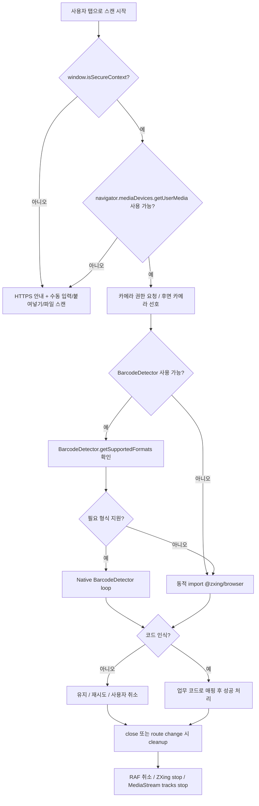
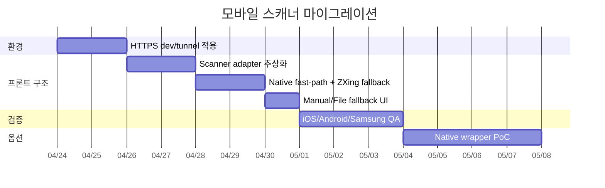

# 모바일 바코드 스캔 아키텍처 조사 보고서

## Executive summary

현재 `Hw-03/ERP`의 모바일 스캐너는 **공유 모달 하나가 네이티브 `BarcodeDetector`와 `getUserMedia()`에 직접 의존**하는 구조이고, **소프트웨어 디코더 fallback이 없으며**, **보안 컨텍스트(`window.isSecureContext`)를 사전에 확인하지 않습니다**. 실제 호출부는 창고 입출고/부서 입출고 두 개의 모바일 위저드에서 이 모달을 그대로 재사용합니다. `frontend/package.json`에도 `@zxing/browser`, `html5-qrcode`, `quagga`, `dynamsoft` 같은 대체 스캐너 의존성이 없습니다. 즉, 지금 실패하면 바로 “스캔 불가”로 끝나는 구조입니다. fileciteturn12file0L1-L1 fileciteturn13file0L1-L1 fileciteturn14file0L1-L1 fileciteturn15file0L1-L1

모바일에서 `http://192.168.x.x:3000`로 접속하는 현재 개발 패턴은 카메라 스캔과 매우 상극입니다. `getUserMedia()`와 `BarcodeDetector`는 모두 **secure context 전용**이고, 브라우저가 예외적으로 신뢰하는 것은 `localhost`·`127.0.0.1` 같은 로컬 루프백뿐입니다. 휴대폰에서 같은 LAN IP로 여는 `http://192.168.x.x`는 이 예외에 포함되지 않으므로, “사파리도 안 되고 크롬도 안 되는” 현상은 개별 브라우저의 문제가 아니라 **배포 경로 자체가 카메라 API 요구조건을 만족하지 못하는 구조적 문제**로 보는 것이 맞습니다. citeturn22search1turn1search2turn22search3turn22search4

iOS 쪽은 더 보수적으로 봐야 합니다. Apple은 iOS/iPadOS 17.4+ EU에서만 별도 entitlement로 **alternative browser engine**을 허용하고 있으므로, 일반적인 실무 환경에서는 Safari/Chrome/Edge on iOS가 대체로 같은 WebKit 제약을 공유합니다. 그래서 iPhone에서 “사파리 대신 크롬으로 바꿔보자”는 해결책이 되지 않는 경우가 많습니다. 게다가 iOS 홈스크린 PWA는 브라우저 탭과 다른 `Web.app` 프로세스/저장소로 동작하고, WebKit에는 홈스크린 PWA나 SPA 라우팅 중 카메라가 얼거나 끊기는 회귀 이슈가 실제로 보고되어 있습니다. citeturn3search1turn7search0turn18search0turn2search5turn2search8

따라서 현 시점의 최종 권장안은 명확합니다. **운영·개발 접속을 HTTPS로 바꾸고**, 스캐너 엔진은 **`BarcodeDetector`를 “있으면 쓰는 fast-path”로만 두고**, 실제 신뢰 경로는 **`@zxing/browser` 동적 로딩 fallback + 수동 입력/붙여넣기/파일 스캔 fallback**으로 재설계해야 합니다. 오프라인·현장 안정성·사내 배포 요구가 커지면 그때 **Capacitor/React Native 네이티브 브리지**를 별도 트랙으로 검토하는 것이 비용 대비 효율이 가장 좋습니다. citeturn19search0turn22search5turn9search0turn9search1turn24search0turn15search0turn16search0

## Repository findings

먼저 현재 저장소에서 “카메라/바코드 스캔 관련 활성 코드”를 확인하면, 스캔 엔진은 사실상 한 파일에 집중되어 있고, 나머지 화면은 그 모달을 호출만 하는 구조입니다. fileciteturn12file0L1-L1 fileciteturn13file0L1-L1 fileciteturn14file0L1-L1

| 파일 경로 | 역할 | 현재 동작과 문제점 |
|---|---|---|
| `frontend/app/legacy/_components/BarcodeScannerModal.tsx` | 공용 모바일 스캔 모달 | `supported`를 `!!window.BarcodeDetector`로만 판단하고, 성공 시 바로 `navigator.mediaDevices.getUserMedia()`를 호출합니다. 즉 **네이티브 API 의존 구조**입니다. `window.isSecureContext`, `navigator.mediaDevices` 존재 여부, `BarcodeDetector.getSupportedFormats()` 확인이 없고, unsupported UI는 “Chrome 또는 Edge 최신 버전”을 안내해 **iOS Chrome이 WebKit 제약을 공유한다는 현실과도 어긋납니다**. 장점은 언마운트 시 `stream?.getTracks().forEach(stop)` cleanup은 이미 들어 있다는 점입니다. fileciteturn12file0L1-L1 |
| `frontend/app/legacy/_components/mobile/io/warehouse/WarehouseWizardSteps.tsx` | 창고 입출고 모바일 품목 선택 단계 | 스캔 버튼으로 `BarcodeScannerModal`을 열고, 스캔된 값은 `barcode`, `erp_code`, `0 제거한 erp_code`와 매칭합니다. 즉 **업무 로직은 괜찮지만 스캔 엔진 실패 시 전체 UX가 막히는 구조**입니다. fileciteturn13file0L1-L1 |
| `frontend/app/legacy/_components/mobile/io/dept/DeptWizardSteps.tsx` | 부서 입출고 모바일 품목 선택 단계 | 위와 동일하게 공용 모달에 의존합니다. 품목 매칭도 거의 같은 방식이라, **창고/부서 화면이 동시에 같은 취약점을 공유**합니다. fileciteturn14file0L1-L1 |
| `frontend/package.json` | 프런트 의존성 정의 | 현재 의존성에는 `@zxing/browser`, `html5-qrcode`, `quagga`, `dynamsoft`가 없습니다. 즉 **네이티브 API 실패 시 사용할 소프트웨어 디코더 경로가 애초에 설치되어 있지 않습니다**. fileciteturn15file0L1-L1 |

이 저장소 관점에서 가장 중요한 해석은 두 가지입니다. 첫째, 스캔 문제는 화면 여러 개를 각각 고칠 일이 아니라 **`BarcodeScannerModal.tsx` 한 곳에서 엔진 추상화 계층을 만들면 대부분 해결**됩니다. 둘째, 현재 설계는 안드로이드 Chromium 계열의 “잘 되는 환경”을 전제로 한 구현이라서, iOS/WebKit/비보안 접속 같은 **현장 편차를 흡수하는 레이어가 비어 있습니다**. fileciteturn12file0L1-L1 fileciteturn13file0L1-L1 fileciteturn14file0L1-L1

## Web platform constraints

`getUserMedia()`는 카메라 접근의 출발점인데, MDN은 이 API를 **secure context 전용**이라고 명시합니다. 보안이 확보되지 않은 문서에서는 `navigator.mediaDevices`가 `undefined`가 될 수 있고, 카메라 권한 요청 자체가 막힐 수 있습니다. 같은 문서에서 `localhost`, `127.0.0.1`, `*.localhost`, `file://` 같은 경우는 잠재적으로 신뢰 가능한 origin 예외로 설명하지만, 일반적인 LAN IP인 `192.168.x.x`는 여기에 등장하지 않습니다. 그래서 개발 PC에서 `http://localhost:3000`이 되는 것과, 휴대폰에서 `http://192.168.0.63:3000`이 되는 것은 전혀 다른 문제입니다. citeturn22search1turn1search2turn1search7

`BarcodeDetector`도 마찬가지로 secure context 전용이며, MDN은 이 API를 **experimental**·**not Baseline**으로 분류합니다. 다시 말해 “브라우저에 있으면 빠르게 쓰기 좋은 API”이지, 단독으로 믿고 운영할 수준의 호환성 보증 수단은 아닙니다. 또한 정적 메서드 `getSupportedFormats()`가 따로 제공되므로, 형식 지원 여부는 UA 문자열이 아니라 **런타임에서 직접 검증**하는 것이 맞습니다. citeturn22search5turn22search4turn23search9

iOS에서는 브라우저 브랜드보다 엔진 제약이 더 중요합니다. Apple 문서상 iOS/iPadOS에서 alternative browser engines는 **EU, iOS 17.4+**, 그리고 별도 entitlement 조건에서만 허용됩니다. 즉 대부분의 기업·현장 배포 환경에서는 Chrome on iOS도 Safari와 같은 WebKit 계열 제약을 받는다고 보는 편이 안전합니다. 이 때문에 “Safari에서는 안 되지만 Chrome에서는 된다”는 Android식 기대를 iPhone에 그대로 적용하면 자주 실패합니다. citeturn3search1turn3search0

PWA도 만능 해법이 아닙니다. web.dev는 iOS/iPadOS 홈스크린 웹앱이 브라우저 탭과 별도 `Web.app`로 동작하고, Safari 탭과 저장소를 공유하지 않는다고 설명합니다. 동시에 WebKit 버그 트래커에는 iOS 홈스크린 PWA에서 카메라가 얼어붙거나, `history.pushState()` 같은 SPA 라우팅 이후 카메라 스트림이 사라지는 회귀가 실제로 기록되어 있습니다. 즉 PWA 설치는 UX 개선 수단이지, **iOS 카메라 안정성 보증 수단이 아닙니다**. citeturn7search0turn18search0turn2search5turn2search8

반대로 Android Chrome은 웹 경로 중 가장 유리합니다. Chrome 개발 문서는 **Barcode detection이 Chrome 83에서 launch**되었다고 설명하고, `getUserMedia()`는 최신 브라우저 전반에 넓게 보급되어 있습니다. 그래서 Android Chrome에서는 native fast-path가 꽤 잘 맞아들어갈 수 있지만, 이 장점이 곧바로 iOS로 전이되지는 않습니다. citeturn19search0turn22search0

아래 표는 실무적으로 중요한 차이를 정리한 것입니다.

| 환경 | 실제 제약 | 설계 해석 |
|---|---|---|
| iOS Safari / iOS Chrome / iOS Edge | 대부분 WebKit 제약 공유, 브랜드 변경만으로 API 한계가 바뀌지 않을 수 있음 citeturn3search1turn3search0 | `BarcodeDetector`를 주력으로 두지 말고 fallback 전제를 깔아야 함 |
| iOS 홈스크린 PWA | 설치 UX는 좋아지지만 저장소가 분리되고, WebKit 카메라 회귀 이슈가 존재 citeturn7search0turn18search0turn2search5turn2search8 | PWA는 보조 옵션, 스캔 안정성 해법은 아님 |
| Android Chrome | secure context만 맞추면 웹에서 가장 좋은 native path 후보 citeturn19search0turn22search0 | `BarcodeDetector` fast-path + JS fallback 구조가 가장 효율적 |
| HTTP LAN IP 주소 | secure context 예외가 아님 citeturn22search1turn1search2 | 모바일 개발/검증은 HTTPS 또는 터널이 사실상 필수 |

## Scanner option comparison

아래 비교표는 “현 저장소에 가장 현실적으로 붙일 수 있는 선택지”를 기준으로 작성했습니다. 패키지 규모는 **공식 npm unpacked size** 또는 **브라우저 내장 여부** 기준의 참고값이며, 실제 번들 영향은 동적 import·tree-shaking·WASM 자산·네이티브 프레임워크 포함 여부에 따라 달라집니다. citeturn20search1turn17search0turn13search0turn14search1turn25search4turn16search0

| 이름 | 라이선스 | 지원 형식 | iOS/Android 브라우저 적합성 | 장점 | 단점 | 번들/패키지 규모 | 유지보수 상태 |
|---|---|---|---|---|---|---|---|
| **Native `BarcodeDetector`** | 브라우저 내장 | 형식은 런타임별 상이, `getSupportedFormats()`로 확인 필요 citeturn23search9turn22search5 | Android Chromium 쪽이 상대적으로 유리, iOS는 의존 금지 수준으로 보는 편이 안전 citeturn19search0turn22search5turn3search1 | 0KB, 빠름, 배터리 효율 좋음 | experimental, non-Baseline, 브라우저별 편차 큼 | **0KB** | 브라우저 벤더 의존 citeturn22search5turn22search4 |
| **`@zxing/browser` + ZXing core** | MIT(`@zxing/browser`) 기반 오픈소스 citeturn20search1turn9search0 | 1D/2D 다중 형식: UPC/EAN, Code39/128, ITF, QR, Data Matrix, Aztec, PDF417 등 citeturn9search1 | `getUserMedia()`가 되는 현대 모바일 브라우저 전반에서 fallback로 적합. iOS는 WebKit 카메라 품질 영향은 그대로 받음 citeturn22search0turn20search0 | 커스텀 UI에 잘 붙고, native API가 없어도 동작, 제어권 높음 | CPU 사용량↑, 네이티브보다 느릴 수 있음, iOS 고질 버그 자체를 없애진 못함 | **약 5.4MB unpacked** citeturn20search1 | core repo는 2025-12까지 활동, browser layer는 2024-05 release 기준 안정적이지만 아주 활발하진 않음 citeturn20search3turn10search0 |
| **QuaggaJS / Quagga2** | MIT citeturn13search0turn14search1 | 주력은 1D(EAN, Code128, Code39, UPC 등). Quagga2는 외부 reader로 QR 확장 가능 citeturn13search0turn14search2 | secure origin + MediaDevices 기반. 원본 QuaggaJS는 문서/출시가 오래되어 현대 iOS/QR 요구에는 불리 citeturn13search0turn14search2 | 1D locator/회전 내성에 강점, 오래된 노하우 | QR이 핵심이면 부적합, 원본은 사실상 stale, 단일 라이브러리로 끝내기 어려움 | **약 2.2–2.6MB unpacked** citeturn14search1turn13search0 | 원본은 매우 오래됨, Quagga2 포크는 2025-12까지 유지 중 citeturn14search0turn14search2 |
| **`html5-qrcode`** | Apache-2.0 citeturn17search0 | QR + 여러 1D/2D 형식, ZXing 기반 확장형 목록 제공 citeturn21search0 | 문서상 Android/iOS/Chrome/Firefox/Safari/Edge/Opera 지원, iOS는 15.1+ 전제. 다만 프로젝트 자체는 maintenance mode citeturn21search0 | 넣기 쉽고 UI 포함, 파일 스캔 fallback도 쉬움 | **유지보수 모드**, 커스텀 UI 자유도 낮음, 저장소 작성자가 새 owner를 찾는 상태 | **약 2.63MB unpacked** citeturn17search0 | 낮음. 최신 release는 2023-04, README에 maintenance mode 명시 citeturn21search0turn21search1 |
| **Dynamsoft Barcode Reader JS** | 상용(`SEE LICENSE IN LICENSE`) citeturn25search0turn25search4 | QR, Data Matrix, PDF417, Aztec, MaxiCode, Code128/39, EAN-13, UPC-A, GS1 등 50+ citeturn12search0 | 공식 docs상 Chrome 78+, Firefox 68+, Safari 14+, Edge 79+, iOS 14.3+ 웹뷰 카메라 스트리밍 고려 citeturn12search0turn25search9 | 인식률·속도·다중 바코드·엔터프라이즈 지원이 매우 좋음 | 라이선스 비용, WASM/엔진 자산 셋업, 번들 큼 | **현재 bundle 기준 약 25.5–25.7MB unpacked** citeturn25search4turn25search5 | 높음. 최근 버전·문서·상용 지원 지속 citeturn12search0turn25search4 |
| **네이티브 브리지** (`@capacitor-mlkit/barcode-scanning`, `react-native-vision-camera`) | Apache-2.0 / MIT citeturn15search7turn16search0 | ML Kit 혹은 네이티브 카메라 스택 기반 QR/Barcode 다중 지원 citeturn15search0turn16search0 | 브라우저가 아니라 **네이티브 앱/하이브리드 앱 경로**. iOS/Android 현장 신뢰성이 최고 | 카메라 제어·오프라인·성능·기기 호환성이 가장 좋음 | 앱 패키징, 배포, QA, 운영 복잡도 증가 | Capacitor plugin 약 **0.2–0.4MB**, VisionCamera JS 패키지 **1.16MB** + 네이티브 바이너리 별도 citeturn15search7turn16search0 | 높음. 최근 publish 지속 citeturn15search0turn16search0 |

이 비교에서 실무적으로 가장 중요한 결론은, **현재 ERP 저장소에는 이미 커스텀 스캔 모달/UI가 존재**하므로, 별도 UI가 강한 `html5-qrcode`보다 **`@zxing/browser`를 “디코더 엔진”으로만 fallback 연결**하는 편이 구조적으로 더 자연스럽다는 점입니다. Quagga 계열은 QR까지 포함한 단일 해법으로는 애매하고, Dynamsoft는 좋지만 “지금 당장 막힌 현장 스캔”을 푸는 1차 처방으로는 비용과 자산 크기가 큽니다. fileciteturn12file0L1-L1 citeturn20search1turn21search0turn13search0turn12search0

## Deployment paths for mobile camera access

스캐너가 좋아도 접속 경로가 잘못되면 카메라가 열리지 않습니다. 현장 마찰을 기준으로 보면, 개발/검증용 최적해와 운영용 최적해를 분리해서 보는 것이 맞습니다.

| 옵션 | 어떻게 문제를 푸는가 | 장점 | 단점 | 평가 |
|---|---|---|---|---|
| **Next.js HTTPS dev server** | `next dev --experimental-https`로 로컬 개발 서버를 HTTPS로 시작 citeturn6search0turn6search3 | 개발 PC에서는 빠르고 단순 | 휴대폰에서 LAN 호스트/IP로 열 때는 **그 인증서를 기기가 신뢰해야 함**. `localhost` 예외는 폰의 `192.168.x.x` 접속에 적용되지 않음 citeturn6search0turn22search1turn1search2 | **단독으로는 모바일 검증용 최적해가 아님** |
| **ngrok** | 공개 HTTPS URL을 만들어 로컬 서버로 TLS 터널링 citeturn5search0turn5search1 | 모바일에서 즉시 접속 가능, 유효한 인증서 자동 제공, 설정이 쉬움 | 외부 네트워크 의존, 무료 플랜/도메인 제약, 데이터 노출 관리 필요 | **개발·QA용 가장 실용적** |
| **Cloudflare Tunnel** | `cloudflared`가 outbound-only 터널로 공개 호스트명 연결 citeturn4search3turn4search10 | 유효 HTTPS, 공개 IP 불필요, 장기 운영형도 가능 | 초기 설정이 ngrok보다 약간 무거움. Quick Tunnel은 테스트 전용·제약 존재 citeturn4search10 | **개발·스테이징 겸용으로 우수** |
| **사내 LAN HTTPS** | 내부 DNS/리버스프록시/사내 CA로 신뢰 가능한 HTTPS 제공 | 외부 서비스 없이 내부망 고속 사용 가능 | 인증서 배포·기기 신뢰 루트 관리가 번거롭고, IP 인증서 처리도 까다로움 | **운영망에는 좋지만 셋업 난이도 높음** |
| **PWA 설치** | 홈스크린 아이콘/standalone shell 제공 citeturn7search0turn18search0 | 앱 같은 UX, 일부 오프라인 보완 | secure context·엔진 제약을 없애지 못하고, iOS는 카메라 회귀 이슈가 있음 citeturn2search5turn2search8 | **보조 수단이지 해법이 아님** |
| **Capacitor/React Native 네이티브 래퍼** | 웹뷰 밖에서 네이티브 카메라/ML Kit/AVFoundation 사용 citeturn15search0turn16search0 | 현장 안정성 최고, 오프라인·카메라 제어 우수 | 앱 빌드/배포/업데이트 프로세스가 추가됨 | **2차 고도화 옵션** |

개발자의 마찰을 가장 적게 줄이는 조합은 **“로컬 HTTP 앱 + 공개 HTTPS 터널”**입니다. 이 경로에서는 최종 origin이 HTTPS이므로, 휴대폰에서 카메라 권한 요구가 정상적으로 동작할 가능성이 가장 높습니다. 반대로 “로컬 네트워크 IP로 직접 접속”은 secure context 문제, 인증서 신뢰 문제, iOS/WebKit 문제를 한꺼번에 떠안게 됩니다. citeturn5search0turn5search1turn4search3turn22search1

## Recommended architecture

추천 아키텍처는 한 문장으로 요약하면 이렇습니다. **접속은 HTTPS, 엔진은 native fast-path + ZXing fallback, UX는 항상 manual fallback 보장**입니다. 이 구조가 현재 ERP 코드베이스와 가장 잘 맞습니다. 공용 모달 하나만 교체하면 창고/부서 입출고 화면 전체가 동시에 개선되기 때문입니다. fileciteturn12file0L1-L1 fileciteturn13file0L1-L1 fileciteturn14file0L1-L1



핵심 포인트는 세 가지입니다. 첫째, **스캔 시작은 반드시 사용자 탭 제스처에서 시작**해야 합니다. 둘째, `BarcodeDetector`는 있어도 바로 쓰지 말고 `getSupportedFormats()`로 필요한 형식을 지원하는지 먼저 확인해야 합니다. 셋째, 어떤 경로로도 카메라가 안 열리면 **수동 입력/붙여넣기/하드웨어 바코드 스캐너(키보드 웨지) 입력**이 즉시 가능한 UI를 남겨야 합니다. secure context 조건과 `BarcodeDetector`의 런타임 형식 확인은 MDN에서 직접 지원하는 공식 시나리오입니다. citeturn22search3turn22search4turn23search9

아래는 현재 저장소에 바로 넣기 좋은 의사코드입니다.

```ts
type ScanEngine = "native" | "zxing" | "manual";

const WANTED_FORMATS = [
  "qr_code",
  "code_128",
  "code_39",
  "ean_13",
  "ean_8",
  "upc_a",
  "upc_e",
  "data_matrix",
] as const;

export async function startRobustScanner(
  videoEl: HTMLVideoElement,
  onDetected: (code: string, engine: ScanEngine) => void,
) {
  let rafId = 0;
  let zxingControls: { stop?: () => void | Promise<void> } | null = null;

  const cleanup = async () => {
    cancelAnimationFrame(rafId);

    try {
      await zxingControls?.stop?.();
    } catch {
      // noop
    }

    const stream = videoEl.srcObject as MediaStream | null;
    stream?.getTracks().forEach((track) => track.stop());
    videoEl.pause();
    videoEl.srcObject = null;
  };

  if (!window.isSecureContext) {
    return { engine: "manual" as const, reason: "insecure-context", cleanup };
  }

  if (!navigator.mediaDevices?.getUserMedia) {
    return { engine: "manual" as const, reason: "no-getusermedia", cleanup };
  }

  const stream = await navigator.mediaDevices.getUserMedia({
    audio: false,
    video: {
      facingMode: { ideal: "environment" },
      width: { ideal: 1280 },
      height: { ideal: 720 },
    },
  });

  videoEl.srcObject = stream;
  await videoEl.play();

  const NativeDetector = (window as any).BarcodeDetector as
    | undefined
    | (new (options?: { formats?: string[] }) => {
        detect: (source: HTMLVideoElement) => Promise<Array<{ rawValue: string }>>;
      });

  if (NativeDetector && typeof NativeDetector.getSupportedFormats === "function") {
    try {
      const supported: string[] = await NativeDetector.getSupportedFormats();
      const usable = WANTED_FORMATS.filter((f) => supported.includes(f));

      if (usable.length > 0) {
        const detector = new NativeDetector({ formats: usable });

        const tick = async () => {
          if (videoEl.readyState >= 2) {
            const results = await detector.detect(videoEl);
            if (results[0]?.rawValue) {
              onDetected(results[0].rawValue, "native");
              await cleanup();
              return;
            }
          }
          rafId = requestAnimationFrame(() => void tick());
        };

        rafId = requestAnimationFrame(() => void tick());
        return { engine: "native" as const, cleanup };
      }
    } catch {
      // native path 실패 시 zxing fallback
    }
  }

  const ZXing = await import("@zxing/browser");
  const reader = new ZXing.BrowserMultiFormatReader();

  zxingControls = await reader.decodeFromConstraints(
    { audio: false, video: { facingMode: { ideal: "environment" } } },
    videoEl,
    (result) => {
      const text = result?.getText?.();
      if (text) {
        onDetected(text, "zxing");
        void cleanup();
      }
    },
  );

  return { engine: "zxing" as const, cleanup };
}
```

cleanup 쪽은 더 엄격하게 가는 편이 좋습니다. `MediaStreamTrack.stop()`은 MDN이 권장하는 방식대로 모든 track에서 호출해야 하고, ZXing는 readme 예제에서 반환된 `controls.stop()`으로 스캔을 종료하도록 안내합니다. iOS SPA 회귀를 피하려면 **모달 close뿐 아니라 route change 직전에도 cleanup을 강제**하는 것이 좋습니다. citeturn24search0turn24search6turn20search0turn2search8

```ts
useEffect(() => {
  let scanner: Awaited<ReturnType<typeof startRobustScanner>> | null = null;

  void (async () => {
    scanner = await startRobustScanner(videoRef.current!, handleDetected);
  })();

  return () => {
    void scanner?.cleanup?.();
  };
}, []);

function closeScanner() {
  void scannerRef.current?.cleanup?.();
  setOpen(false);
}
```

현 UI 설계상 추가로 권장하는 것은 다음 세 단계입니다. **첫째**, unsupported/error 문구를 “Chrome 또는 Edge 최신 버전” 같은 브라우저 브랜드 추천이 아니라, **`HTTPS 필요` / `카메라 권한 거부` / `이 브라우저는 소프트웨어 fallback으로 전환` / `수동 입력 사용`**처럼 행동 지시형으로 바꾸는 것. **둘째**, 수동 입력 창은 스캐너 모달 안에 함께 두어서 현장 사용자가 막히지 않게 하는 것. **셋째**, 엔진 선택 결과(`native`/`zxing`/`manual`)를 로깅해서 실제 장치군별 성공률을 수집하는 것입니다. 이 데이터가 쌓이면 나중에 “언제 네이티브 래퍼로 가야 하는지”도 훨씬 명확해집니다. fileciteturn12file0L1-L1

## Migration plan and testing checklist

권장 마이그레이션은 한 번에 크게 뒤엎기보다, **접속 경로 → 엔진 추상화 → fallback UX → 디바이스 QA** 순으로 가는 편이 리스크가 낮습니다.



우선순위는 다음과 같습니다.

| 우선순위 | 작업 | 이유 |
|---|---|---|
| 높음 | `BarcodeScannerModal.tsx`를 `engine adapter` 구조로 분리 | 현재 공용 모달 한 곳만 바꾸면 두 업무 화면이 동시에 개선됨 fileciteturn12file0L1-L1 |
| 높음 | `window.isSecureContext` / `navigator.mediaDevices` 사전 점검 추가 | 사용자가 “왜 안 되는지”를 먼저 알 수 있어야 함 citeturn22search3turn22search1 |
| 높음 | `@zxing/browser` 동적 import fallback 추가 | 현재 저장소에 fallback이 전혀 없기 때문 fileciteturn15file0L1-L1 citeturn20search1 |
| 높음 | 수동 입력·붙여넣기·파일 스캔 fallback 항상 노출 | 현장 중단을 막는 최후 안전망 |
| 중간 | dev/staging을 ngrok 또는 Cloudflare Tunnel로 표준화 | 모바일 검증 품질을 빠르게 끌어올림 citeturn5search1turn4search10 |
| 중간 | 엔진 사용 경로/성공률 telemetry 추가 | 어떤 장치에서 어느 경로가 깨지는지 수집 |
| 낮음 | Capacitor/React Native POC | 1차 웹 안정화 이후 ROI 판단 |

검증 체크리스트는 브라우저 브랜드보다 **장치/엔진/배포 경로** 중심이어야 합니다.

| 테스트 대상 | 확인 항목 | 기대 결과 |
|---|---|---|
| iOS Safari | tunnel HTTPS URL에서 스캔 시작, 5회 반복 open/close, 권한 허용/거부, 회전, 백그라운드 복귀 | 최소한 `zxing` 또는 `manual`로는 빠져나가야 하며, close 후 카메라 점유가 남지 않아야 함 |
| iOS Chrome | 위와 동일 | Safari와 유사 행동을 전제로 검증; “Chrome이면 된다” 가정 금지 citeturn3search1 |
| Android Chrome | native path / zxing path / manual path 각각 확인 | native 가능 시 가장 빠르고, 불가해도 zxing fallback으로 동작해야 함 citeturn19search0turn20search1 |
| Samsung Browser | 권한, 후면 카메라, torch/zoom, zxing fallback 확인 | Android Chrome과 같다고 가정하지 말고 별도 검증 |
| 권한 거부 케이스 | 카메라 거부 후 수동 입력/파일 fallback 진입 | 업무 중단 없이 코드 입력 가능 |
| 비보안 경로 | `http://192.168.x.x` 접속 시 안내 메시지 | “HTTPS 필요”가 즉시 보여야 하며, 의미 없는 카메라 재시도 금지 |
| SPA 이동/모달 종료 | route change, close, back navigation | stream track / decoder가 정상 해제되어야 함 citeturn24search0turn2search8 |
| PWA 설치 iOS | 홈스크린 실행, 첫 스캔, 재실행 | 실패 가능성 자체를 점검하고, 운영 주 경로로 채택할지 별도 판단 citeturn2search5turn7search0 |

검증용 명령 예시는 다음 정도면 충분합니다.

```bash
# Next.js HTTPS 개발 서버
npm run dev -- --hostname 0.0.0.0 --experimental-https

# ngrok
ngrok http 3000

# Cloudflare Quick Tunnel
cloudflared tunnel --url http://localhost:3000
```

```js
// 브라우저 콘솔 확인 포인트
window.isSecureContext
!!navigator.mediaDevices?.getUserMedia
"BarcodeDetector" in window
await BarcodeDetector?.getSupportedFormats?.()
```

Next.js는 `next dev --experimental-https`를 공식 제공하고, ngrok/Cloudflare Tunnel 모두 로컬 서비스를 HTTPS 공개 URL로 노출하는 표준 방식을 문서화하고 있습니다. secure context와 런타임 capability 체크는 MDN이 직접 제시하는 공식 확인 지점입니다. citeturn6search0turn5search1turn4search10turn22search3turn22search1turn23search9

## Risks, limitations, and final recommendation

가장 큰 리스크는 세 가지입니다. 첫째, **iOS/WebKit 회귀는 웹 코드만으로 완전히 제거할 수 없는 영역**이 있다는 점입니다. 둘째, `BarcodeDetector`는 공식적으로도 experimental/not-Baseline이라서, 저장소 주석처럼 “Safari 17+면 된다” 수준으로 믿고 운영 경로에 두기 어렵습니다. 셋째, 상용 SDK나 네이티브 브리지로 가면 안정성은 좋아지지만 개발·배포·유지 비용이 크게 늘어납니다. citeturn22search5turn22search4turn2search5turn2search8

그래서 최종 권장안은 다음 한 줄입니다. **필드 마찰을 최소화하려면 “HTTPS + `BarcodeDetector`는 fast-path만 + `@zxing/browser` fallback + 수동 입력 UI”를 기본 해법으로 채택하고, 오프라인·엔터프라이즈 안정성이 핵심 요구가 되는 시점에만 네이티브 래퍼를 올리는 것이 가장 합리적입니다.** 이 안은 현재 ERP 저장소의 공용 모달 구조와도 잘 맞고, Android에서는 빠르며, iOS에서는 적어도 “완전히 막히는 구조”를 피할 수 있습니다. fileciteturn12file0L1-L1 citeturn20search1turn19search0turn15search0turn16search0

## Open questions and limitations

현재 조사에서 일부 세부 사항은 intentionally 보수적으로 정리했습니다. Apple/WebKit 공식 문서만으로는 현 시점 iOS Safari의 `BarcodeDetector`를 운영 레벨로 신뢰할 만큼 명확한 지원 보증을 확인하기 어려웠습니다. 따라서 본 보고서는 iOS에서 `BarcodeDetector`를 “있으면 쓰는 보너스”가 아니라 **“없다고 가정해도 돌아가야 하는 옵션”**으로 취급했습니다. citeturn22search5turn23search0

또한 비교표의 크기 수치는 공식 npm의 unpacked size를 주로 사용한 **참고값**입니다. 실제 앱 초기 다운로드 크기와 런타임 체감은 동적 import 여부, bundler 설정, WebAssembly 별도 자산, 네이티브 프레임워크 포함 여부에 따라 달라집니다. 따라서 기술 선택의 최종 근거는 표의 크기 숫자 하나가 아니라, **현재 ERP 코드 구조와 현장 운영 요구**여야 합니다. citeturn20search1turn17search0turn25search4turn16search0