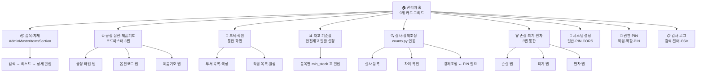

# 2026-05-02-admin-redesign.md — 2026-05-02-admin-redesign.md 설명

## 이 파일은 무엇을 책임지나

`2026-05-02-admin-redesign.md`는 현재 운영 코드가 아니라 과거 자료나 실험 결과를 보관한 참고 파일입니다.

## 업무 흐름에서의 의미

과거 맥락을 이해하는 데 도움은 되지만, 현재 운영 기준으로 바로 사용하면 안 됩니다.

## 언제 보면 좋나

- 과거 자료의 의미를 확인할 때
- 현재 코드와 비교할 참고 근거가 필요할 때

## 중요한 내용

이 파일에서 눈에 띄는 구조는 다음과 같습니다.

- `관리자 모드 재설계 — 2026-05-02`
- `1. 현재 vs 재설계 매핑`
- `2. 재설계 Mermaid 다이어그램`
- `3. 영역별 상세 설계`
- `영역 1 — 관리자 홈 카드 그리드`
- `영역 2 — 품목·자재 마스터`
- `영역 3 — 공정·옵션·제품기호 코드마스터`
- `영역 4 — 부서·직원 통합`
- `영역 5 — 재고 기준값`
- `영역 6 — 실사·강제조정`

## 연결되는 파일

- [[ERP/_attic/docs/research/📁_research]] — 이 파일이 속한 폴더의 안내판입니다.

## 조심할 점

보관 자료입니다. 현재 코드처럼 믿고 수정하거나 실행하지 않습니다.

## 핵심 발췌

```md
# 관리자 모드 재설계 — 2026-05-02

> **작업 ID:** MES-ADMIN-001~002  
> **작성일:** 2026-05-02 (토)  
> **기준 브랜치:** `feat/hardening-roadmap` (단일 — 초기 분석 브랜치 `claude/analyze-dexcowin-mes-tGZNI` 폐기)  
> **수정 여부:** 없음 (설계 문서만)

---

## 1. 현재 vs 재설계 매핑

| 재설계 영역 | 현재 파일 | 현재 섹션 ID | 누락/문제 |
|---|---|---|---|
| 1. 관리자 홈 | 없음 | — | 홈 없이 items 섹션으로 바로 진입 |
| 2. 품목·자재 마스터 | `AdminMasterItemsSection.tsx` | `items` | process_type_code 수정 불가 버그 |
| 3. 공정·옵션·제품기호 | `AdminModelsSection.tsx` | `models` | 코드 마스터 3종이 한 섹션에 혼재 |
| 4. 부서·직원 | `AdminDepartmentsSection.tsx` + `AdminEmployeesSection.tsx` | `departments` + `employees` | 분리됨, 색상 5곳 중복 |
| 5. 재고 기준값 | items 내 `min_stock` 필드 | — | 전용 화면 없음 |
| 6. 실사·강제조정 | `/counts` 별도 라우트 | — | 관리자 메뉴 미연결 |
| 7. 손실·폐기·편차 | `/loss`, `/scrap`, `/variance` 개별 API | — | 관리자 화면 없음 |
| 8. 시스템 설정 | `settings.py` (PIN, CSV, 초기화) | `settings` | PIN은 SHA-256, DEFAULT 0000 취약 |
| 9. 권한·PIN | `pin_auth.py`, `employees.py` | settings 일부 | 직원별 PIN 관리 불명확 |
| 10. 감사 로그 | `admin_audit.py` | — | 화면 없음, API만 존재 |

---

## 2. 재설계 Mermaid 다이어그램


