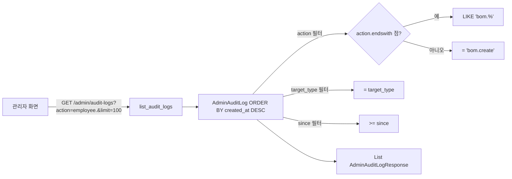

# 📦 admin_audit.py — 관리자 감사 로그 조회 (읽기 전용)

> [!summary] 역할
> `AdminAuditLog` 테이블의 내용을 조회하는 **읽기 전용** 라우터.  
> 쓰기(write)는 `app.services.audit.record()` 가 각 라우터 내부에서 직접 호출한다.  
> 이 파일은 "누가 언제 무엇을 했는가"를 관리자 화면에 보여주는 역할만 한다.

#layer/backend #topic/router #topic/admin-audit

---

## 1. 역할

- `GET /admin/audit-logs`: 최근 감사 로그 목록 조회 (최신순)
- action prefix 필터 (`bom.` → `bom.` 로 시작하는 모든 action)
- target_type, since(시각) 필터 지원
- 응답 모델은 로컬 정의 `AdminAuditLogResponse` (Pydantic)

## 2. 원본 위치

```
erp/backend/app/routers/admin_audit.py
```

## 3. import

| 모듈 | 용도 |
|------|------|
| `app.models.AdminAuditLog` | ORM 감사 로그 테이블 |
| `fastapi.APIRouter, Depends, Query` | 라우터 |
| `pydantic.BaseModel, ConfigDict` | 로컬 응답 스키마 |

## 4. export (endpoint 목록)

| Method | Path | 설명 |
|--------|------|------|
| GET | `/admin/audit-logs` | 감사 로그 목록 (최신순, 최대 2000) |

## 5. 참조처

- 프론트엔드 관리자 PIN 잠금 화면 (감사 로그 탭)
- 감사 기록은 다음 라우터들이 `audit.record()` 로 작성:
  - `employees.py` (생성/수정/삭제/PIN 변경)
  - `settings.py` (PIN 변경, repair, reset)
  - `transactions.py` (meta-edit, quantity-correction)
  - `admin_audit_csv.py` 와는 다른 테이블 (`AdminAuditLog` vs `TransactionLog`)

## 6. 업무 흐름



## 7. 핵심 함수

### `list_audit_logs`

```python
@router.get("/audit-logs", response_model=List[AdminAuditLogResponse])
def list_audit_logs(
    db: Session = Depends(get_db),
    limit: int = Query(100, ge=1, le=2000),
    action: Optional[str] = Query(None, description="정확히 일치 또는 prefix (예: bom.)"),
    target_type: Optional[str] = Query(None),
    since: Optional[datetime] = Query(None, description="이 시각 이후만 (UTC)"),
):
    """최근 감사로그 조회. 관리자 PIN 잠금 화면에서만 호출 (현재 별도 인증 미적용)."""
    q = db.query(AdminAuditLog).order_by(AdminAuditLog.created_at.desc())
    if action:
        if action.endswith("."):
            q = q.filter(AdminAuditLog.action.like(f"{action}%"))
        else:
            q = q.filter(AdminAuditLog.action == action)
    if target_type:
        q = q.filter(AdminAuditLog.target_type == target_type)
    if since:
        q = q.filter(AdminAuditLog.created_at >= since)
    return q.limit(limit).all()
```

### `AdminAuditLogResponse` 스키마 (로컬 정의)

```python
class AdminAuditLogResponse(BaseModel):
    audit_id: uuid.UUID
    actor_pin_role: str
    action: str
    target_type: str
    target_id: Optional[str] = None
    payload_summary: Optional[str] = None
    request_id: Optional[str] = None
    created_at: datetime

    model_config = ConfigDict(from_attributes=True)
```

- `actor_pin_role`: 어떤 역할로 작업했는지 (admin/employee)
- `payload_summary`: 변경 요약 (예: "홍길동 PIN 변경")
- `request_id`: 동일 요청에서 발생한 여러 audit 을 묶는 키

## 8. 위험 포인트

> [!warning] 별도 인증 미적용
> docstring 에 "현재 별도 인증 미적용" 명시됨.  
> 감사 로그 조회 자체에 PIN 이 필요없다 — 프론트 화면에서 PIN 잠금 화면이 보호하지만,  
> API 직접 호출은 누구나 가능하다.

> [!note] action prefix 필터 규칙
> `action` 파라미터가 `.` 으로 끝나면 LIKE 쿼리 (`bom.%`).  
> 그렇지 않으면 정확히 일치 (`= "bom.create"`).  
> 예: `?action=employee.` → employee.create, employee.update, employee.delete 모두 반환.

## 9. 죽은 코드 의심

- 없음. 파일이 57줄로 매우 단순.

## 10. 수정 전 체크

- [ ] `AdminAuditLogResponse` 는 schemas.py 가 아닌 이 파일에 로컬 정의됨 — 다른 곳에서 재사용 불가
- [ ] `actor_pin_role` 필드값이 무엇인지 `audit.record()` 구현 확인 필요
- [ ] 감사 로그 보존 기간 정책 없음 — 주기적 정리 필요 시 별도 스케줄러 구현 필요

## 11. 코드 발췌

```python
@router.get("/audit-logs", response_model=List[AdminAuditLogResponse])
def list_audit_logs(
    db: Session = Depends(get_db),
    limit: int = Query(100, ge=1, le=2000),
    action: Optional[str] = Query(None, description="필터: 정확히 일치 또는 prefix (예: bom.)"),
    target_type: Optional[str] = Query(None),
    since: Optional[datetime] = Query(None, description="이 시각 이후만 (UTC)"),
):
    """최근 감사로그 조회. 관리자 PIN 잠금 화면에서만 호출 (현재 별도 인증 미적용)."""
    q = db.query(AdminAuditLog).order_by(AdminAuditLog.created_at.desc())
    if action:
        if action.endswith("."):
            q = q.filter(AdminAuditLog.action.like(f"{action}%"))
        else:
            q = q.filter(AdminAuditLog.action == action)
    if target_type:
        q = q.filter(AdminAuditLog.target_type == target_type)
    if since:
        q = q.filter(AdminAuditLog.created_at >= since)
    return q.limit(limit).all()
```

---

## 관련 노트

- [[_routers]] — 라우터 허브
- [[erp/backend/app/routers/admin_audit_csv.py]] — 월별 입출고 CSV (다른 개념)
- [[erp/backend/app/services/audit.py]] — audit.record() 구현
- [[erp/backend/app/routers/settings.py]] — audit.record 호출 예시

Up: [[_routers]]
