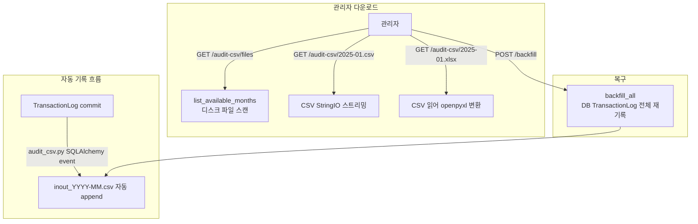

# 📦 admin_audit_csv.py — 외부 심사 대응 입출고 월별 CSV 다운로드

> [!summary] 역할
> 외부 심사(감사)에 제출하기 위한 **월별 입출고 CSV 파일** 을 관리자가 다운로드하는 라우터.  
> 파일 자체는 `app.services.audit_csv` 가 자동으로 디스크에 작성하며, 이 라우터는 그 파일을 읽어 내보낸다.  
> CSV 원본 / XLSX 변환 / 목록 조회 / 수동 백필 4종의 endpoint 를 제공한다.

#layer/backend #topic/router #topic/admin-audit

---

## 1. 역할

- 디스크의 `inout_YYYY-MM.csv` 파일 목록 조회
- 특정 월 CSV 원본 스트리밍 다운로드
- 특정 월 XLSX 변환 다운로드 (openpyxl 사용)
- 수동 백필: DB 기준으로 월별 CSV 전체 재작성

## 2. 원본 위치

```
erp/backend/app/routers/admin_audit_csv.py
```

서비스 연계:
```
erp/backend/app/services/audit_csv.py  — 실제 파일 생성 로직
```

## 3. import

| 모듈 | 용도 |
|------|------|
| `app.services.audit_csv as svc` | list_available_months, get_csv_dir, backfill_all, CSV_HEADERS |
| `app.services.export_helpers.csv_streaming_response` | CSV 스트리밍 응답 |
| `app.utils.excel.apply_header, auto_width, make_xlsx_response` | XLSX 생성 |
| `openpyxl` | XLSX 워크북 |
| `re` | 월 형식 검증 (`YYYY-MM`) |

## 4. export (endpoint 목록)

| Method | Path | 설명 |
|--------|------|------|
| GET | `/admin/audit-csv/files` | 사용 가능한 월별 CSV 목록 |
| GET | `/admin/audit-csv/{month}.csv` | 특정 월 CSV 다운로드 |
| GET | `/admin/audit-csv/{month}.xlsx` | 특정 월 XLSX 다운로드 |
| POST | `/admin/audit-csv/backfill` | 수동 백필 (DB 전체 재기록) |

## 5. 참조처

- 프론트엔드 관리자 화면 "입출고 심사 자료" 탭
- `audit_csv.py` 서비스가 거래 commit 시마다 자동 append
- `scripts/dev/backfill_audit_csv.py` — 동일 기능의 CLI 스크립트

## 6. 업무 흐름



## 7. 핵심 함수

### `download_csv` — 파일 검증 + 스트리밍

```python
@router.get("/audit-csv/{month}.csv")
def download_csv(month: str):
    _validate_month(month)   # YYYY-MM 형식 검증
    path = svc.get_csv_dir() / f"inout_{month}.csv"
    if not path.exists():
        raise HTTPException(status_code=404, detail="해당 월 CSV 파일이 존재하지 않습니다.")
    from io import StringIO
    buf = StringIO()
    with path.open("r", encoding="utf-8-sig") as f:
        buf.write(f.read())
    return csv_streaming_response(buf, f"inout_{month}.csv")
```

> [!note] utf-8-sig 인코딩
> BOM 포함 UTF-8 로 읽는다. Windows Excel 이 BOM 없이 열면 한글이 깨지기 때문.

### `download_xlsx` — CSV → XLSX 실시간 변환

```python
@router.get("/audit-csv/{month}.xlsx")
def download_xlsx(month: str):
    _validate_month(month)
    path = svc.get_csv_dir() / f"inout_{month}.csv"
    if not path.exists():
        raise HTTPException(status_code=404, detail="...")

    wb = Workbook()
    ws = wb.active
    ws.title = f"입출고 {month}"

    import csv as _csv
    with path.open("r", encoding="utf-8-sig", newline="") as f:
        reader = _csv.reader(f)
        rows = list(reader)

    if not rows:
        apply_header(ws, svc.CSV_HEADERS)
    else:
        headers, *data = rows
        apply_header(ws, headers if headers else svc.CSV_HEADERS)
        for row in data:
            ws.append(row)
    auto_width(ws)
    return make_xlsx_response(wb, f"inout_{month}.xlsx")
```

### `_validate_month` — 정규식 검증

```python
_MONTH_RE = re.compile(r"^\d{4}-(0[1-9]|1[0-2])$")

def _validate_month(month: str) -> str:
    if not _MONTH_RE.match(month):
        raise HTTPException(status_code=400, detail="month 는 YYYY-MM 형식이어야 합니다.")
    return month
```

### `trigger_backfill` — 수동 복구

```python
@router.post("/audit-csv/backfill", response_model=BackfillResult)
def trigger_backfill(overwrite: bool = True, db: Session = Depends(get_db)) -> BackfillResult:
    """수동 백필 — DB 기준으로 월별 CSV 전체 재작성."""
    result = svc.backfill_all(db, overwrite=overwrite)
    return BackfillResult(**result)
```

## 8. 위험 포인트

> [!warning] 이 CSV 는 TransactionLog 와 다른 범위
> `audit_csv.py` 서비스 docstring 에 명시:  
> PRODUCE / BACKFLUSH 은 포함되지 않는다 (자재 이동만 기록).  
> RECEIVE / SHIP / TRANSFER_* / ADJUST / SUPPLIER_RETURN / MARK_DEFECTIVE / DISASSEMBLE 포함.

> [!warning] backfill overwrite=True 기본값
> `POST /backfill` 은 기본적으로 기존 파일을 덮어쓴다.  
> 수동 편집한 CSV 가 있다면 덮어씌워진다.

> [!warning] 별도 인증 없음
> `admin_audit.py` 와 마찬가지로 이 라우터에도 PIN 인증 미적용.  
> 화면단 PIN 잠금 화면이 보호 역할이지만 API 직접 호출은 자유롭다.

## 9. 죽은 코드 의심

- 없음. 파일이 103줄로 간결.
- `BackfillResult.months` 필드는 반환되지만 프론트에서 표시하는지 불명확.

## 10. 수정 전 체크

- [ ] `audit_csv.CSV_HEADERS` 변경 시 기존 파일과 헤더가 달라질 수 있음 — backfill 로 재생성 필요
- [ ] `get_csv_dir()` 반환 경로가 실제 서버에 존재하는지 배포 시 확인
- [ ] XLSX 다운로드는 전체 CSV 를 메모리에 올리므로 월 데이터가 매우 크면 OOM 가능성 있음

## 11. 코드 발췌

```python
class AuditCsvFile(BaseModel):
    month: str
    file_name: str
    size_bytes: int
    row_count: int


class BackfillResult(BaseModel):
    total_rows: int
    months: List[str]


@router.get("/audit-csv/files", response_model=List[AuditCsvFile])
def list_files() -> List[AuditCsvFile]:
    return [AuditCsvFile(**item) for item in svc.list_available_months()]


@router.post("/audit-csv/backfill", response_model=BackfillResult)
def trigger_backfill(
    overwrite: bool = True,
    db: Session = Depends(get_db),
) -> BackfillResult:
    """수동 백필 — DB 기준으로 월별 CSV 전체 재작성."""
    result = svc.backfill_all(db, overwrite=overwrite)
    return BackfillResult(**result)
```

---

## 관련 노트

- [[_routers]] — 라우터 허브
- [[erp/backend/app/routers/admin_audit.py]] — AdminAuditLog 조회 (다른 테이블)
- [[erp/backend/app/services/audit_csv.py]] — 파일 자동 생성 서비스
- [[erp/backend/app/routers/inventory/transactions.py]] — TransactionLog source-of-truth

Up: [[_routers]]
