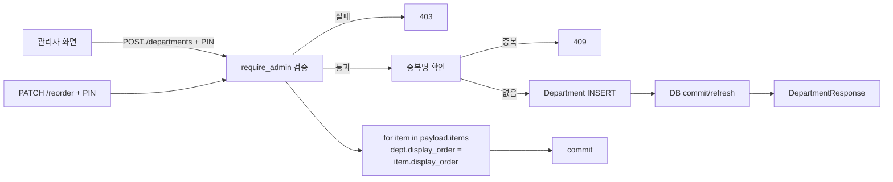

# 📦 departments.py — 부서 마스터 CRUD + 순서 재배치

> [!summary] 역할
> 부서 정보의 CRUD 와 표시 순서 재배치를 담당하는 라우터.  
> 모든 쓰기 작업(생성/수정/삭제/순서변경)은 **관리자 PIN** 이 필요하다.  
> `require_admin` 함수를 `settings.py` 에서 임포트해 공유한다.

#layer/backend #topic/router #topic/employees

---

## 1. 역할

- 부서 목록 조회 (is_active 필터)
- 생성 / 수정 / 삭제 — 모두 관리자 PIN 검증
- `PATCH /reorder`: 여러 부서의 display_order 를 한 번에 변경
- 삭제는 DB CASCADE 로 영구 삭제 (소프트 삭제 없음)

## 2. 원본 위치

```
erp/backend/app/routers/departments.py
```

## 3. import

| 모듈 | 용도 |
|------|------|
| `app.models.Department` | ORM 모델 |
| `app.routers.settings.require_admin` | 관리자 PIN 검증 |
| `app.schemas.DepartmentCreate, DepartmentUpdate, DepartmentDeleteRequest, DepartmentReorderPayload, DepartmentResponse` | 스키마 |

## 4. export (endpoint 목록)

| Method | Path | PIN 필요 | 설명 |
|--------|------|----------|------|
| GET | `/departments` | 없음 | 부서 목록 (is_active 필터) |
| POST | `/departments` | 필요 | 부서 생성 |
| PATCH | `/departments/reorder` | 필요 | 표시 순서 일괄 변경 |
| PUT | `/departments/{dept_id}` | 필요 | 부서 정보 수정 |
| DELETE | `/departments/{dept_id}` | 필요 | 부서 삭제 |

## 5. 참조처

- 프론트엔드 부서 관리 설정 화면
- `inventory/transfer.py` — `DepartmentEnum` 이 부서 라우팅 기준
- `employees.py` — `Employee.department` FK 관계

## 6. 업무 흐름



## 7. 핵심 함수

### `delete_department` — PIN 이중 수신 (body 우선)

```python
@router.delete("/{dept_id}", status_code=status.HTTP_204_NO_CONTENT)
def delete_department(
    dept_id: int,
    pin: Optional[str] = Query(None, description="deprecated — body 사용 권장"),
    body: Optional[DepartmentDeleteRequest] = Body(None),
    db: Session = Depends(get_db),
):
    """PIN 은 request body 로 전달하면 access log 에 남지 않는다.
    body 없으면 query string pin 으로 폴백."""
    effective_pin = (body.pin if body and body.pin else None) or pin
    if not effective_pin:
        raise http_error(400, ErrorCode.BAD_REQUEST, "관리자 PIN 이 필요합니다.")
    require_admin(db, effective_pin)
    ...
    db.delete(dept)
    db.commit()
```

> [!tip] body 우선 이유
> Query string 에 PIN 을 넣으면 웹 서버 access log 에 PIN 이 그대로 기록된다.  
> Body 로 전달 시 access log 에 남지 않는다.

### `reorder_departments`

```python
@router.patch("/reorder")
def reorder_departments(payload: DepartmentReorderPayload, db: Session = Depends(get_db)):
    require_admin(db, payload.pin)
    for item in payload.items:
        dept = db.query(Department).filter(Department.id == item.id).first()
        if dept:
            dept.display_order = item.display_order
    db.commit()
    return {"ok": True}
```

## 8. 위험 포인트

> [!danger] 부서 삭제 시 CASCADE
> `db.delete(dept)` 로 직접 삭제한다.  
> `Department` 에 연결된 `Employee.department` 등이 CASCADE 설정에 따라 함께 삭제될 수 있다.  
> 삭제 전에 해당 부서 직원이 있는지 확인 로직이 없다.

> [!warning] `require_admin` 은 settings.py 에서 임포트
> `from app.routers.settings import require_admin`  
> settings.py 가 변경되면 departments.py 에도 영향 있음.

## 9. 죽은 코드 의심

- `from fastapi import HTTPException` 임포트 사용 중 (일부 곳은 HTTPException 직접 사용, 일부는 http_error 사용). 불일치.

## 10. 수정 전 체크

- [ ] 부서 삭제 시 해당 부서 직원/재고 이동 이력 여부 확인 로직 필요한지 검토
- [ ] `PATCH /reorder` 는 없는 dept_id 를 조용히 무시함 — 클라이언트가 유효한 id 만 전달해야 함
- [ ] `color_hex` 필드가 있음 — 프론트 부서 카드 색상용, null 허용

## 11. 코드 발췌

```python
@router.post("", response_model=DepartmentResponse, status_code=status.HTTP_201_CREATED)
def create_department(payload: DepartmentCreate, db: Session = Depends(get_db)):
    require_admin(db, payload.pin)
    if db.query(Department).filter(Department.name == payload.name).first():
        raise HTTPException(status_code=409, detail="이미 존재하는 부서명입니다.")
    dept = Department(
        name=payload.name,
        display_order=payload.display_order,
        is_active=True,
        color_hex=payload.color_hex
    )
    db.add(dept)
    db.commit()
    db.refresh(dept)
    return dept

@router.put("/{dept_id}", response_model=DepartmentResponse)
def update_department(dept_id: int, payload: DepartmentUpdate, db: Session = Depends(get_db)):
    require_admin(db, payload.pin)
    dept = db.query(Department).filter(Department.id == dept_id).first()
    if not dept:
        raise HTTPException(status_code=404, detail="부서를 찾을 수 없습니다.")
    if payload.name is not None:
        if db.query(Department).filter(
            Department.name == payload.name, Department.id != dept_id
        ).first():
            raise HTTPException(status_code=409, detail="이미 존재하는 부서명입니다.")
        dept.name = payload.name
    ...
    db.commit()
    db.refresh(dept)
    return dept
```

---

## 관련 노트

- [[_routers]] — 라우터 허브
- [[erp/backend/app/routers/settings.py]] — require_admin 정의
- [[erp/backend/app/routers/employees.py]] — 직원 부서 배정

Up: [[_routers]]
