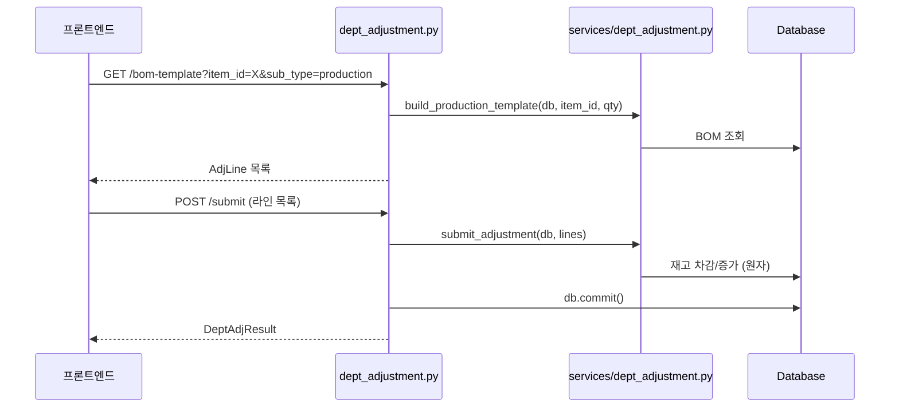

# 📦 dept_adjustment.py — 부서 재고 조정 (생산·분해·보정)

> [!summary] 역할
> 부서 단위 재고 조정을 원자적으로 처리하는 라우터.
> BOM 기반 초기 라인 생성(bom-template), 중간공정품 1단계 전개(expand-component), 배치 제출(submit) 3개 엔드포인트만 가진 단순하지만 중요한 파일이다.

## 1. 이 파일의 역할

현장에서 "생산을 완료했다", "제품을 분해해 부품을 회수했다", "수량을 잘못 기록해서 보정한다"는
세 가지 부서 재고 변경 시나리오를 처리합니다.
BOM 기반으로 초기 라인을 자동 생성해주고, 작업자가 실제 수량을 확인·수정 후 한 번에 제출합니다.

## 2. 실제 원본 위치

- **원본**: `erp/backend/app/routers/dept_adjustment.py` ([[erp/backend/app/routers/dept_adjustment.py]])
- vault 노트는 분석 지도일 뿐, 수정은 원본에서만.

## 3. import 로 가져오는 것

| 모듈 | 역할 |
|---|---|
| `app.models` | `DepartmentEnum`, `DeptAdjSubTypeEnum`, `Item` |
| `app.routers._errors` | `ErrorCode`, `http_error` |
| `app.services.dept_adjustment` | `svc` — `build_production_template`, `build_disassembly_template`, `expand_component`, `submit_adjustment`, `AdjLine` |
| `pydantic.BaseModel` | 로컬 스키마 5종 인라인 정의 |

> [!info] 로컬 스키마
> `AdjLineResponse`, `BomTemplateResponse`, `ExpandComponentRequest`, `AdjLineInput`, `DeptAdjSubmitRequest`, `DeptAdjResult` 모두 이 파일에서 인라인 정의. `app.schemas` 에 없음.

## 4. export / 외부에 제공하는 것

- **prefix**: `/api/dept-adjustment`

| 메서드 | 경로 | 설명 |
|---|---|---|
| `GET` | `/api/dept-adjustment/bom-template` | BOM 기반 초기 조정 라인 자동 생성 |
| `POST` | `/api/dept-adjustment/expand-component` | 중간공정품 선택 시 1단계 하위 부품 전개 |
| `POST` | `/api/dept-adjustment/submit` | 조정 라인 배치 원자 처리 (즉시 실행) |

## 5. 이 파일을 참조하는 곳

- `erp/backend/app/main.py` — `app.include_router(dept_adjustment.router, prefix="/api/dept-adjustment", tags=["Dept Adjustment"])`
- 프론트엔드 생산 배치 화면, 분해·회수 화면

## 6. 실제 업무 흐름에서 언제 쓰이는지

- [[시나리오_생산배치]]:
  1. `GET /bom-template?item_id=...&sub_type=production` → 라인 목록 수신
  2. 작업자가 수량 확인·수정
  3. `POST /submit` → 부품 차감 + 완제품 입고 원자 처리
- [[시나리오_분해반품]]:
  1. `GET /bom-template?sub_type=disassembly` → 분해 라인 수신
  2. 중간공정품 있으면 `POST /expand-component` → 하위 부품 전개
  3. `POST /submit` → 완제품 차감 + 부품 반환

## 7. 핵심 함수 / 상수 / 매핑

| 함수 | 설명 |
|---|---|
| `get_bom_template(item_id, sub_type, quantity, db)` | production/disassembly 분기 → `svc.build_*_template` 호출 |
| `expand_component(payload, db)` | `_to_dept_enum` 변환 후 `svc.expand_component` 위임 |
| `submit_adjustment(payload, db)` | `DeptAdjSubTypeEnum` 변환 + `AdjLine` 목록 조립 → `svc.submit_adjustment` 원자 처리 |
| `_to_dept_enum(value)` | 문자열 → `DepartmentEnum` 변환. 실패 시 422 |
| `_line_to_response(ln)` | `svc.AdjLine` → `AdjLineResponse` DTO 변환 |

## 8. ⚠️ 위험 포인트

> [!warning] 수정 시 깨지기 쉬운 지점
> - `submit_adjustment`에서 `db.commit()`을 직접 호출 — `commit_and_refresh` 헬퍼가 아님. 서비스 레이어가 이미 flush를 끝냈다고 가정하는 패턴이므로 서비스 수정 시 주의.
> - `except Exception as exc` 블록에서 `logger.exception`으로 풀스택을 기록하고 500 반환. 이 블록이 너무 넓어 예상치 못한 에러를 삼킬 수 있음.
> - `sub_type`이 `production` / `disassembly` 만 허용 (`/bom-template`). `correction`은 BOM 템플릿 없이 직접 라인을 구성해야 함 — UI에서 제한 필요.
> - 로컬 스키마 `AdjLineInput.direction`이 `"in" | "out" | "defective" | "scrap"` 4종. 서비스가 다른 값을 기대하면 런타임 오류.

[[위험지대_지도]] — 직접 db.commit, 부서 enum 변환 실패

## 9. 죽은 코드 의심 / 삭제하면 안 되는 이유

- `expand_component` 엔드포인트: 중간공정품이 없는 단순 BOM이라면 호출되지 않지만, 복잡한 BOM 구조에서는 필수. 삭제 금지.
- `DeptAdjResult.transaction_ids`: 응답에 포함되어 감사 추적에 사용. 삭제 시 클라이언트에서 처리 결과를 확인할 수 없음.

## 10. 수정 전 체크리스트

- [ ] `verify_local.ps1` 통과 확인
- [ ] `services/dept_adjustment.py` 의 `AdjLine` 필드와 로컬 `AdjLineInput` 필드 일치 확인
- [ ] `direction` 값 목록 변경 시 서비스·DB 모델과 동기화
- [ ] `db.commit()` 직접 호출 패턴 — 서비스 레이어 수정 시 이중 commit 없는지 확인
- [ ] production/disassembly 외 새 sub_type 추가 시 bom-template 분기 추가 필요

## 11. 핵심 코드 발췌

> [!example] submit_adjustment 원자 처리 + 에러 계층 처리 (약 30줄)
> ```python
> @router.post("/submit", response_model=DeptAdjResult, status_code=201)
> def submit_adjustment(payload: DeptAdjSubmitRequest, db: Session = Depends(get_db)):
>     sub_type_enum = DeptAdjSubTypeEnum(payload.sub_type)
>
>     adj_lines: list[svc.AdjLine] = []
>     for ln in payload.lines:
>         try:
>             dept_enum = _to_dept_enum(ln.department)
>         except ValueError as exc:
>             raise http_error(422, ErrorCode.UNPROCESSABLE, str(exc))
>         adj_lines.append(svc.AdjLine(
>             item_id=ln.item_id,
>             direction=ln.direction,
>             quantity=ln.quantity,
>             department=dept_enum,
>             reason=ln.reason,
>             bom_expected=ln.bom_expected,
>         ))
>
>     try:
>         log_ids = svc.submit_adjustment(
>             db, sub_type_enum, adj_lines,
>             operator_name=payload.operator_name,
>             reference_no=payload.reference_no,
>             notes=payload.notes,
>         )
>     except ValueError as exc:
>         db.rollback()
>         raise http_error(422, ErrorCode.UNPROCESSABLE, str(exc))
>     except Exception as exc:
>         logger.exception("부서 조정 처리 중 예기치 못한 오류")
>         db.rollback()
>         raise http_error(500, ErrorCode.INTERNAL, f"처리 중 오류: {exc}")
>
>     db.commit()
>     sub_label = {"production": "생산/조립", "disassembly": "분해/회수", "correction": "수량 보정"}
>     return DeptAdjResult(success=True, message=f"{sub_label.get(payload.sub_type)} 완료 ({len(log_ids)}건)",
>                         processed_count=len(log_ids), transaction_ids=log_ids)
> ```

`svc.submit_adjustment`가 트랜잭션 내 모든 재고 변경을 수행하고, 성공 시 `db.commit()`으로 확정한다.



## 관련 노트

- [[처음_읽는_사람]], [[ERP_MOC]], [[용어사전]]
- [[erp/backend/app/services/dept_adjustment.py]]
- [[erp/backend/app/routers/production.py]]
- [[erp/backend/app/models.py]]

Up: [[_routers]]
