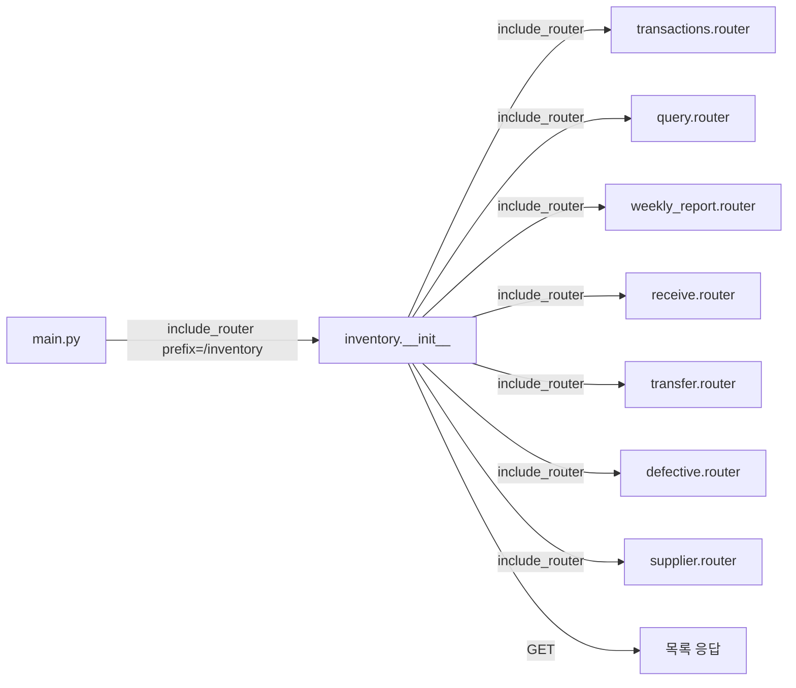

# 📦 __init__.py — inventory 라우터 패키지 진입점

> [!summary] 역할
> `inventory` 패키지를 FastAPI 라우터로 노출하는 진입점.  
> Phase 4 에서 807줄짜리 단일 파일을 책임 단위로 분할한 결과물이다.  
> **핵심**: `GET ""` (전체 목록) 엔드포인트가 이 파일에 직접 정의된 이유는 FastAPI 가 빈 prefix + 빈 path 조합으로 `include_router` 를 거부하기 때문이다.

#layer/backend #topic/router #topic/inventory

---

## 1. 역할

- 서브 라우터 7개를 올바른 순서로 include
- `GET /inventory` (빈 path) 목록 조회를 직접 소유
- `from app.routers import inventory` + `app.include_router(inventory.router, prefix="/inventory")` 호환 인터페이스 제공

## 2. 원본 위치

```
erp/backend/app/routers/inventory/__init__.py
```

- Layer: backend / router
- Phase 4 분할 전 원본: `erp/backend/app/routers/inventory.py` (807줄)

## 3. import

| 모듈 | 용도 |
|------|------|
| `fastapi.APIRouter, Depends, Query` | 라우터·의존성 |
| `sqlalchemy.orm.Session` | DB 세션 |
| `app.database.get_db` | DB 세션 DI |
| `app.models.Inventory, Item` | ORM 모델 |
| `app.schemas.InventoryResponse` | 응답 스키마 |
| `._shared.to_response_bulk` | N+1 제거 bulk 응답 조립 |
| 서브 모듈 7개 | defective, query, receive, supplier, transactions, transfer, weekly_report |

## 4. export (endpoint 목록)

| Method | Path | 설명 |
|--------|------|------|
| GET | `/inventory` | 전체 재고 목록 (process_type_code 필터, skip/limit) |

> [!note] 나머지 endpoint 는 서브 모듈이 소유. include 순서가 중요하다.

## 5. 참조처

- `erp/backend/app/main.py` → `app.include_router(inventory.router, prefix="/inventory")`
- 프론트엔드: `frontend/src/api/inventory.ts` (GET /inventory)

## 6. 업무 흐름



> [!warning] 등록 순서 주의
> `/transactions/*`, `/summary`, `/locations/...` 같은 **정적 경로**를 동적 catch-all(`""`) 보다 먼저 등록해야 한다.  
> `transactions.router` → `query.router` 가 먼저, `GET ""` 는 마지막.

## 7. 핵심 함수

### `list_inventory`

```python
@router.get("", response_model=List[InventoryResponse])
def list_inventory(
    process_type_code: Optional[str] = Query(None, max_length=2),
    skip: int = Query(0, ge=0),
    limit: int = Query(100, ge=1, le=2000),
    db: Session = Depends(get_db),
):
    q = db.query(Inventory).join(Item, Inventory.item_id == Item.item_id)
    if process_type_code:
        q = q.filter(Item.process_type_code == process_type_code)

    rows = q.order_by(Item.item_code).offset(skip).limit(limit).all()
    return to_response_bulk(db, rows)
```

- `to_response_bulk` 호출로 N+1 없이 bulk 응답 조립
- 정렬: `item_code` asc
- 최대 2000건

## 8. 위험 포인트

> [!danger] 라우터 등록 순서 오류
> `GET ""` 를 `include_router(transactions.router)` 보다 **먼저** 두면 `/transactions` 경로가 item_id UUID 로 해석되어 404 발생.  
> 현재 코드는 올바른 순서이지만, 서브 모듈 추가 시 순서를 반드시 확인하라.

> [!warning] `weekly_report` 미문서화
> 서브 모듈 import 목록에 `weekly_report` 가 있으나 docstring 에는 누락되어 있다. 실수로 제거하지 말 것.

## 9. 죽은 코드 의심

- 없음 (진입점 파일이라 최소한의 코드만 있음)

## 10. 수정 전 체크

- [ ] 새 서브 모듈 추가 시: `include_router` 순서 확인 (정적 경로 먼저)
- [ ] `GET ""` 경로 변경 불가 — `main.py` prefix 와 맞물림
- [ ] `__all__ = ["router"]` 유지 — 외부 import 규약

## 11. 코드 발췌

```python
# 정적 경로를 동적 catch-all("") 보다 먼저 등록
router.include_router(transactions.router)
router.include_router(query.router)
router.include_router(weekly_report.router)
router.include_router(receive.router)
router.include_router(transfer.router)
router.include_router(defective.router)
router.include_router(supplier.router)

@router.get("", response_model=List[InventoryResponse])
def list_inventory(
    process_type_code: Optional[str] = Query(None, max_length=2),
    skip: int = Query(0, ge=0),
    limit: int = Query(100, ge=1, le=2000),
    db: Session = Depends(get_db),
):
    q = db.query(Inventory).join(Item, Inventory.item_id == Item.item_id)
    if process_type_code:
        q = q.filter(Item.process_type_code == process_type_code)
    rows = q.order_by(Item.item_code).offset(skip).limit(limit).all()
    return to_response_bulk(db, rows)
```

---

## 관련 노트

- [[_inventory]] — inventory 패키지 허브
- [[_shared.py]] — to_response_bulk 구현
- [[transactions.py]] — 가장 큰 서브 모듈 (7 endpoints)
- [[query.py]] — /summary, /locations

Up: [[_inventory]]
