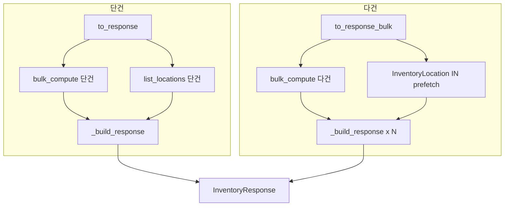

# 📦 _shared.py — inventory 패키지 공용 헬퍼

> [!summary] 역할
> inventory 서브 모듈 전체가 공유하는 헬퍼 모음.  
> - `to_response` / `to_response_bulk`: ORM Inventory → InventoryResponse 변환 (stock_math 통일 계산 + locations 포함)  
> - `list_locations`: 특정 품목의 부서×상태 분포 조회  
> - `PROCESS_TYPE_LABELS` / `PROCESS_TYPE_ORDER`: 18개 공정코드 단일 기준 라벨 및 정렬 순서

#layer/backend #topic/router #topic/inventory

---

## 1. 역할

- 단건(`to_response`) 및 다건(`to_response_bulk`) 재고 응답 조립의 **단일 출처**
- `stock_math.bulk_compute` 를 통해 warehouse/production/defective/pending/available 5가지 수치를 일관되게 계산
- 다건 조회 시 `InventoryLocation` IN(...) prefetch 로 N+1 쿼리 제거
- 18개 공정코드 라벨·순서를 `/summary` 와 기타 코드가 공유

## 2. 원본 위치

```
erp/backend/app/routers/inventory/_shared.py
```

## 3. import

| 모듈 | 용도 |
|------|------|
| `app.models.Inventory, InventoryLocation` | ORM 모델 |
| `app.schemas.InventoryLocationResponse, InventoryResponse` | 응답 스키마 |
| `app.services.stock_math` | StockFigures 계산 |
| `decimal.Decimal` | 수량 연산 |

## 4. export (공개 심볼)

| 심볼 | 타입 | 설명 |
|------|------|------|
| `to_response` | 함수 | 단건 응답 조립 |
| `to_response_bulk` | 함수 | 다건 응답 조립 (N+1 없음) |
| `list_locations` | 함수 | item_id 의 위치 분포 조회 |
| `PROCESS_TYPE_LABELS` | dict | 18개 공정코드 → 한글 라벨 |
| `PROCESS_TYPE_ORDER` | list | /summary 정렬 순서 |

## 5. 참조처

- `inventory/__init__.py` → `to_response_bulk`
- `inventory/receive.py`, `transfer.py`, `defective.py`, `supplier.py` → `to_response`
- `inventory/query.py` → `PROCESS_TYPE_LABELS`, `PROCESS_TYPE_ORDER`

## 6. 업무 흐름



## 7. 핵심 함수

### `to_response_bulk` — N+1 제거 핵심

```python
def to_response_bulk(db: Session, invs: List[Inventory]) -> List[InventoryResponse]:
    if not invs:
        return []
    item_ids = [inv.item_id for inv in invs]
    figures_map = stock_math.bulk_compute(db, item_ids)

    loc_rows = (
        db.query(InventoryLocation)
        .filter(InventoryLocation.item_id.in_(item_ids), InventoryLocation.quantity > 0)
        .all()
    )
    locations_by_item: dict = {}
    for row in loc_rows:
        locations_by_item.setdefault(row.item_id, []).append(
            InventoryLocationResponse(
                department=row.department,
                status=row.status,
                quantity=row.quantity or Decimal("0"),
            )
        )
    return [
        _build_response(
            inv,
            figures_map.get(inv.item_id) or stock_math.StockFigures(),
            locations_by_item.get(inv.item_id, []),
        )
        for inv in invs
    ]
```

- `bulk_compute` : 단 2쿼리로 N개 품목의 재고 수치 계산
- `InventoryLocation IN(...)` : 단 1쿼리로 모든 위치 prefetch → O(1) 쿼리

### `PROCESS_TYPE_LABELS` — 18개 공정코드

```python
PROCESS_TYPE_LABELS: dict[str, str] = {
    "TR": "튜브 원자재",  "TA": "튜브 중간공정",  "TF": "튜브 공정완료",
    "HR": "고압 원자재",  "HA": "고압 중간공정",  "HF": "고압 공정완료",
    "VR": "진공 원자재",  "VA": "진공 중간공정",  "VF": "진공 공정완료",
    "NR": "튜닝 원자재",  "NA": "튜닝 중간공정",  "NF": "튜닝 공정완료",
    "AR": "조립 원자재",  "AA": "조립 중간공정",  "AF": "조립 공정완료",
    "PR": "출하 원자재",  "PA": "출하 중간공정",  "PF": "출하 공정완료",
}
```

부서 prefix(T/H/V/N/A/P) × 단계 suffix(R/A/F) = 18개.

## 8. 위험 포인트

> [!warning] `list_locations` vs `to_response_bulk` 의 필터 차이
> - `list_locations` (단건): `quantity > 0` 조건 **있음** → 0건 위치는 제외
> - `query.py::get_item_locations` (상세 조회): 0인 행도 포함
> 목적이 다르므로 혼용하지 말 것.

> [!danger] PROCESS_TYPE_LABELS 변경 시
> `query.py::get_inventory_summary` 의 라벨과 `PROCESS_TYPE_ORDER` 도 동시에 갱신해야 한다.  
> 두 딕셔너리가 분리되어 있어 누락 시 KeyError 발생.

## 9. 죽은 코드 의심

- `_build_response` 는 모듈 내부 전용(`_` prefix). 외부에서 직접 호출하지 말 것.

## 10. 수정 전 체크

- [ ] `PROCESS_TYPE_LABELS` 키와 `PROCESS_TYPE_ORDER` 항목이 1:1 대응인지 확인
- [ ] `to_response` 변경 시 단건/다건 경로가 동일한 계산 결과를 내는지 검증
- [ ] `stock_math.StockFigures` 필드 추가 시 `_build_response` 동기화

## 11. 코드 발췌

```python
def _build_response(
    inv: Inventory,
    fig: stock_math.StockFigures,
    locations: List[InventoryLocationResponse],
) -> InventoryResponse:
    return InventoryResponse(
        inventory_id=inv.inventory_id,
        item_id=inv.item_id,
        quantity=fig.total,
        warehouse_qty=fig.warehouse_qty,
        production_total=fig.production_total,
        defective_total=fig.defective_total,
        pending_quantity=fig.pending,
        available_quantity=fig.available,
        last_reserver_name=inv.last_reserver_name,
        location=inv.location,
        updated_at=inv.updated_at,
        locations=locations,
    )

def to_response(db: Session, inv: Inventory) -> InventoryResponse:
    """단건 응답 조립. bulk_compute([id]) 로 list 경로와 동일한 코드 경로 사용."""
    figures_map = stock_math.bulk_compute(db, [inv.item_id])
    fig = figures_map.get(inv.item_id) or stock_math.StockFigures()
    return _build_response(inv, fig, list_locations(db, inv.item_id))
```

---

## 관련 노트

- [[_inventory]] — inventory 패키지 허브
- [[__init__.py]] — to_response_bulk 사용처
- [[query.py]] — PROCESS_TYPE_LABELS / ORDER 사용처
- [[erp/backend/app/services/stock_math.py]] — bulk_compute 구현

Up: [[_inventory]]
