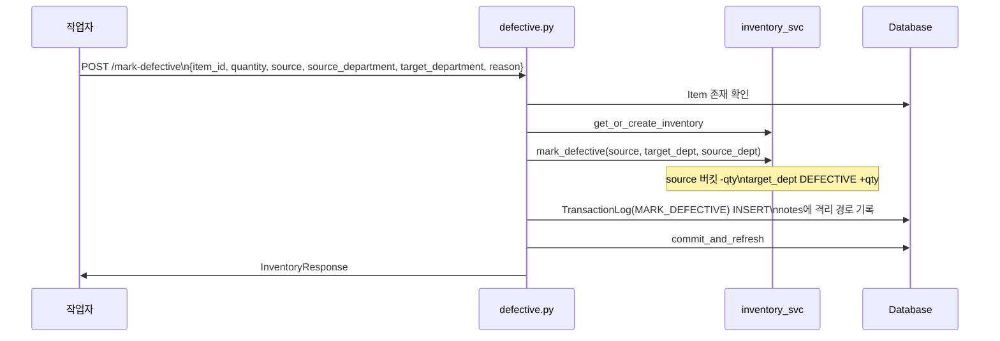

# 📦 defective.py — 불량 등록 (생산/창고 → 불량 격리)

> [!summary] 역할
> `POST /inventory/mark-defective` 단일 엔드포인트.  
> 생산 버킷(또는 창고)의 수량 일부를 불량(DEFECTIVE) 버킷으로 격리한다.  
> source(창고/부서)를 지정할 수 있으며, 격리 부서(`target_department`)는 필수다.

#layer/backend #topic/router #topic/inventory

---

## 1. 역할

- 재고를 생산 또는 창고 버킷에서 DEFECTIVE 버킷으로 이동
- 불량 원인·출처 부서를 `notes` 에 자동 기록
- `TransactionLog` 에 MARK_DEFECTIVE 이력 남김

## 2. 원본 위치

```
erp/backend/app/routers/inventory/defective.py
```

## 3. import

| 모듈 | 용도 |
|------|------|
| `app.services.inventory.mark_defective` | 실제 버킷 이동 로직 |
| `app.schemas.MarkDefectiveRequest` | 요청 스키마 |
| `app.models.TransactionTypeEnum.MARK_DEFECTIVE` | 거래 타입 |
| `._shared.to_response` | 응답 조립 |

## 4. export (endpoint 목록)

| Method | Path | Status | 설명 |
|--------|------|--------|------|
| POST | `/inventory/mark-defective` | 200 | 불량 등록 및 격리 |

## 5. 참조처

- 프론트엔드 불량 처리 폼
- `transactions.py::META_CORRECTABLE` 에 MARK_DEFECTIVE 포함 (메타 수정 허용)

## 6. 업무 흐름



## 7. 핵심 함수

### `mark_defective`

```python
@router.post("/mark-defective", response_model=InventoryResponse)
def mark_defective(payload: MarkDefectiveRequest, db: Session = Depends(get_db)):
    item = db.query(Item).filter(Item.item_id == payload.item_id).first()
    if not item:
        raise http_error(404, ErrorCode.NOT_FOUND, "품목을 찾을 수 없습니다.")
    inventory = inventory_svc.get_or_create_inventory(db, payload.item_id)
    qty_before = inventory.quantity or Decimal("0")
    try:
        inventory_svc.mark_defective(
            db, payload.item_id, payload.quantity,
            source=payload.source,
            target_dept=payload.target_department,
            source_dept=payload.source_department,
        )
    except ValueError as exc:
        raise http_error(422, ErrorCode.UNPROCESSABLE, str(exc))

    note = (
        f"불량 등록 [{payload.source}"
        + (f"/{payload.source_department.value}" if payload.source_department else "")
        + f"] → {payload.target_department.value} 격리 ({payload.quantity})"
        + (f" — {payload.reason}" if payload.reason else "")
    )
    db.add(TransactionLog(
        item_id=payload.item_id,
        transaction_type=TransactionTypeEnum.MARK_DEFECTIVE,
        quantity_change=Decimal("0"),   # 총량 불변
        quantity_before=qty_before,
        quantity_after=inventory.quantity,
        reference_no=None,
        produced_by=payload.operator,
        notes=note,
    ))
    commit_and_refresh(db, inventory)
    return to_response(db, inventory)
```

> [!note] notes 자동 생성
> `[source/source_dept] → target_dept 격리 (qty) — reason` 형태로 자동 구성.  
> `reason` 은 옵션이라 없으면 생략된다.

## 8. 위험 포인트

> [!danger] source 파라미터 설계
> `source` 는 문자열(예: "창고", "생산") 이고, `source_department` 는 DepartmentEnum.  
> 서비스 레이어 `mark_defective` 가 이 조합으로 어느 버킷에서 뺄지 결정한다.  
> `source` 값이 서비스와 프론트 간에 불일치하면 잘못된 버킷에서 차감될 수 있다.

> [!warning] produced_by 필드
> 다른 엔드포인트는 `produced_by=payload.produced_by` 를 쓰지만,  
> 이 엔드포인트는 `produced_by=payload.operator` 를 사용한다.  
> `MarkDefectiveRequest` 스키마의 필드명이 `operator` 임에 주의.

## 9. 죽은 코드 의심

- `from fastapi import HTTPException` 임포트 있으나 미사용. 정리 가능.
- `reference_no=None` 하드코딩 — payload 에 reference_no 필드가 없다.

## 10. 수정 전 체크

- [ ] `MarkDefectiveRequest.source` 가 가질 수 있는 값을 `app/schemas.py` 에서 확인
- [ ] `mark_defective` 서비스가 source + source_department 조합을 어떻게 해석하는지 확인
- [ ] 불량 격리 후 공급업체 반품(`/return-to-supplier`)까지 이어지는 흐름인지 확인

## 11. 코드 발췌

```python
note = (
    f"불량 등록 [{payload.source}"
    + (f"/{payload.source_department.value}" if payload.source_department else "")
    + f"] → {payload.target_department.value} 격리 ({payload.quantity})"
    + (f" — {payload.reason}" if payload.reason else "")
)
db.add(
    TransactionLog(
        item_id=payload.item_id,
        transaction_type=TransactionTypeEnum.MARK_DEFECTIVE,
        quantity_change=Decimal("0"),
        quantity_before=qty_before,
        quantity_after=inventory.quantity,
        reference_no=None,
        produced_by=payload.operator,
        notes=note,
    )
)
commit_and_refresh(db, inventory)
return to_response(db, inventory)
```

---

## 관련 노트

- [[_inventory]] — inventory 패키지 허브
- [[supplier.py]] — 불량 후 공급업체 반품 흐름
- [[transfer.py]] — 같은 버킷 이동 패턴
- [[erp/backend/app/services/inventory.py]] — mark_defective 구현

Up: [[_inventory]]
