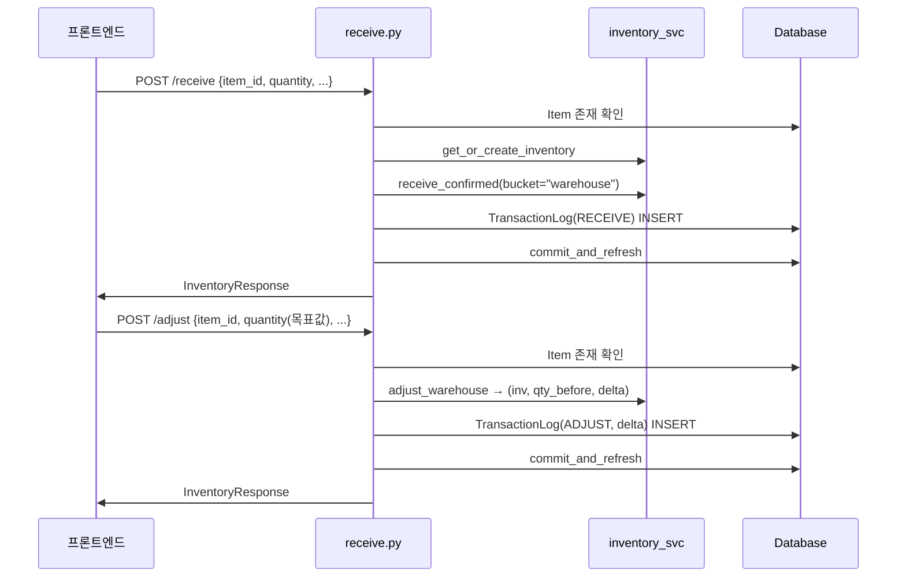

# 📦 receive.py — 재고 수취·조정 (입고 / 직접 조정)

> [!summary] 역할
> 원자재 입고(`POST /receive`) 와 창고 재고 직접 조정(`POST /adjust`) 두 엔드포인트.  
> 두 경우 모두 `TransactionLog` 에 이력을 남기고, `commit_and_refresh` 로 원자적으로 완료한다.

#layer/backend #topic/router #topic/inventory

---

## 1. 역할

- `POST /inventory/receive`: 공급업체에서 원자재 입고 → warehouse 버킷 증가
- `POST /inventory/adjust`: 창고 수량을 절대값으로 직접 설정 → delta 를 ADJUST 거래로 기록

## 2. 원본 위치

```
erp/backend/app/routers/inventory/receive.py
```

## 3. import

| 모듈 | 용도 |
|------|------|
| `app.services.inventory` | get_or_create_inventory, receive_confirmed, adjust_warehouse |
| `app.services._tx.commit_and_refresh` | 원자적 commit + refresh |
| `app.models.TransactionLog, TransactionTypeEnum` | 이력 기록 |
| `app.schemas.InventoryReceive, InventoryAdjust` | 요청 스키마 |
| `._shared.to_response` | 응답 조립 |
| `app.routers._errors.ErrorCode, http_error` | 표준 에러 |

## 4. export (endpoint 목록)

| Method | Path | Status | 설명 |
|--------|------|--------|------|
| POST | `/inventory/receive` | 201 | 원자재 입고 (warehouse 버킷 증가) |
| POST | `/inventory/adjust` | 200 | 창고 수량 직접 조정 |

## 5. 참조처

- 프론트엔드 입고 폼: `POST /inventory/receive`
- 관리자 재고 조정 폼: `POST /inventory/adjust`

## 6. 업무 흐름



## 7. 핵심 함수

### `receive_inventory`

```python
@router.post("/receive", response_model=InventoryResponse, status_code=status.HTTP_201_CREATED)
def receive_inventory(payload: InventoryReceive, db: Session = Depends(get_db)):
    item = db.query(Item).filter(Item.item_id == payload.item_id).first()
    if not item:
        raise http_error(404, ErrorCode.NOT_FOUND, "품목을 찾을 수 없습니다.")

    inventory = inventory_svc.get_or_create_inventory(db, payload.item_id)
    qty_before = inventory.quantity or Decimal("0")
    inventory_svc.receive_confirmed(db, payload.item_id, payload.quantity, bucket="warehouse")
    if payload.location:
        inventory.location = payload.location

    db.add(TransactionLog(
        item_id=payload.item_id,
        transaction_type=TransactionTypeEnum.RECEIVE,
        quantity_change=payload.quantity,
        quantity_before=qty_before,
        quantity_after=inventory.quantity,
        reference_no=payload.reference_no,
        produced_by=payload.produced_by,
        notes=payload.notes,
    ))
    commit_and_refresh(db, inventory)
    return to_response(db, inventory)
```

### `adjust_inventory`

```python
@router.post("/adjust", response_model=InventoryResponse, status_code=status.HTTP_200_OK)
def adjust_inventory(payload: InventoryAdjust, db: Session = Depends(get_db)):
    """payload.quantity 는 조정 후 창고 수량(절대값).
    production / defective 는 건드리지 않음."""
    ...
    inventory, qty_before, delta = inventory_svc.adjust_warehouse(
        db, payload.item_id, payload.quantity, location=payload.location
    )
    db.add(TransactionLog(
        transaction_type=TransactionTypeEnum.ADJUST,
        quantity_change=delta,   # 절대값이 아닌 delta 기록
        ...
    ))
```

> [!important] adjust 의 quantity 의미
> `payload.quantity` = 조정 **후** 창고 수량 (절대값).  
> `TransactionLog.quantity_change` = 서비스가 계산한 delta (이전 - 이후).  
> 헷갈리기 쉬운 설계 — 프론트와 항상 같은 이해 필요.

## 8. 위험 포인트

> [!danger] adjust 는 production/defective 를 건드리지 않는다
> `adjust_warehouse` 는 warehouse_qty 만 변경한다.  
> `Inventory.quantity` 불변식(= warehouse + Σ locations)이 깨질 수 있는 경우는  
> `integrity_svc.check_inventory_consistency` 로 감지 가능.

> [!warning] `receive_confirmed` bucket 파라미터
> 현재 `bucket="warehouse"` 고정. 부서 직접 입고 기능 구현 시 이 파라미터를 바꿔야 함.

## 9. 죽은 코드 의심

- `from fastapi import HTTPException` 임포트가 있으나 실제로 사용하지 않음 (모두 `http_error` 사용). 무해하지만 정리 가능.

## 10. 수정 전 체크

- [ ] `receive_confirmed` 와 `adjust_warehouse` 는 서비스 레이어에서 DB를 바꾼다 — router 에서 중복 쓰기 금지
- [ ] `qty_before` 를 `receive_confirmed` 호출 **전에** 캡처하는 것이 올바름 (현재 코드 확인됨)
- [ ] `adjust` 는 payload.quantity 가 목표 절대값임을 문서화 (스키마 주석 확인)

## 11. 코드 발췌

```python
# receive_inventory 핵심 흐름
inventory = inventory_svc.get_or_create_inventory(db, payload.item_id)
qty_before = inventory.quantity or Decimal("0")
inventory_svc.receive_confirmed(db, payload.item_id, payload.quantity, bucket="warehouse")
if payload.location:
    inventory.location = payload.location

db.add(TransactionLog(
    item_id=payload.item_id,
    transaction_type=TransactionTypeEnum.RECEIVE,
    quantity_change=payload.quantity,
    quantity_before=qty_before,
    quantity_after=inventory.quantity,
    reference_no=payload.reference_no,
    produced_by=payload.produced_by,
    notes=payload.notes,
))
commit_and_refresh(db, inventory)
return to_response(db, inventory)
```

---

## 관련 노트

- [[_inventory]] — inventory 패키지 허브
- [[_shared.py]] — to_response
- [[transfer.py]] — 부서 이동 (같은 패턴)
- [[erp/backend/app/services/inventory.py]] — receive_confirmed / adjust_warehouse 구현

Up: [[_inventory]]
