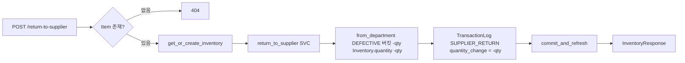

# 📦 supplier.py — 공급업체 반품 (불량품 반출)

> [!summary] 역할
> `POST /inventory/return-to-supplier` 단일 엔드포인트.  
> 불량 격리된 재고를 공급업체로 반품하는 최종 단계.  
> DEFECTIVE 버킷에서 수량을 차감하고 `quantity_change=-quantity` 로 총량도 감소한다.

#layer/backend #topic/router #topic/inventory

---

## 1. 역할

- 불량 버킷(DEFECTIVE)의 재고를 공급업체로 반품 → 재고 총량 감소
- 다른 이동 엔드포인트와 달리 `quantity_change` 가 음수 (실제 감소)
- `TransactionLog` 에 SUPPLIER_RETURN 이력 기록

## 2. 원본 위치

```
erp/backend/app/routers/inventory/supplier.py
```

## 3. import

| 모듈 | 용도 |
|------|------|
| `app.services.inventory.return_to_supplier` | 반품 버킷 차감 로직 |
| `app.schemas.SupplierReturnRequest` | 요청 스키마 |
| `app.models.TransactionTypeEnum.SUPPLIER_RETURN` | 거래 타입 |
| `._shared.to_response` | 응답 조립 |

## 4. export (endpoint 목록)

| Method | Path | Status | 설명 |
|--------|------|--------|------|
| POST | `/inventory/return-to-supplier` | 200 | 불량품 공급업체 반품 |

## 5. 참조처

- 프론트엔드 공급업체 반품 폼
- `transactions.py::META_CORRECTABLE` 에 SUPPLIER_RETURN 포함

## 6. 업무 흐름



## 7. 핵심 함수

### `return_to_supplier`

```python
@router.post("/return-to-supplier", response_model=InventoryResponse)
def return_to_supplier(payload: SupplierReturnRequest, db: Session = Depends(get_db)):
    item = db.query(Item).filter(Item.item_id == payload.item_id).first()
    if not item:
        raise http_error(404, ErrorCode.NOT_FOUND, "품목을 찾을 수 없습니다.")
    inventory = inventory_svc.get_or_create_inventory(db, payload.item_id)
    qty_before = inventory.quantity or Decimal("0")
    try:
        inventory_svc.return_to_supplier(
            db, payload.item_id, payload.quantity, payload.from_department
        )
    except ValueError as exc:
        raise http_error(422, ErrorCode.UNPROCESSABLE, str(exc))

    db.add(TransactionLog(
        item_id=payload.item_id,
        transaction_type=TransactionTypeEnum.SUPPLIER_RETURN,
        quantity_change=-payload.quantity,    # 음수! 총량 감소
        quantity_before=qty_before,
        quantity_after=inventory.quantity,
        reference_no=payload.reference_no,
        produced_by=payload.operator,
        notes=payload.notes or
              f"공급업체 반품 ({payload.from_department.value} 불량 {payload.quantity})",
    ))
    commit_and_refresh(db, inventory)
    return to_response(db, inventory)
```

> [!important] quantity_change 가 음수
> 이동(transfer) 계열 엔드포인트는 `quantity_change=0` 이지만,  
> 반품은 재고 총량을 실제로 줄이므로 `quantity_change=-payload.quantity`.  
> 히스토리 화면에서 빨간색으로 표시되어야 하는 이유.

## 8. 위험 포인트

> [!danger] from_department 는 DEFECTIVE 버킷 출처
> `from_department` 는 불량이 격리된 부서다.  
> 창고 불량인 경우 어떤 DepartmentEnum 값을 전달해야 하는지  
> 서비스 레이어 `return_to_supplier` 의 처리 방식 확인 필요.

> [!warning] 반품 전에 mark-defective 가 선행되어야 함
> 반품 대상은 DEFECTIVE 버킷에 있어야 한다.  
> 그 전에 `/mark-defective` 호출 없이 바로 반품하면 서비스가 ValueError 를 raise 할 수 있다.

## 9. 죽은 코드 의심

- `from fastapi import HTTPException` 임포트 있으나 미사용. 정리 가능.

## 10. 수정 전 체크

- [ ] `SupplierReturnRequest.from_department` 가 DEFECTIVE 버킷이 있는 부서인지 서비스 레이어에서 검증하는지 확인
- [ ] 반품 후 재고가 음수가 되지 않는지 서비스 레이어 방어 코드 확인
- [ ] `produced_by=payload.operator` — 다른 엔드포인트와 다른 필드명 (`operator` vs `produced_by`)

## 11. 코드 발췌

```python
db.add(
    TransactionLog(
        item_id=payload.item_id,
        transaction_type=TransactionTypeEnum.SUPPLIER_RETURN,
        quantity_change=-payload.quantity,
        quantity_before=qty_before,
        quantity_after=inventory.quantity,
        reference_no=payload.reference_no,
        produced_by=payload.operator,
        notes=payload.notes or
              f"공급업체 반품 ({payload.from_department.value} 불량 {payload.quantity})",
    )
)
commit_and_refresh(db, inventory)
return to_response(db, inventory)
```

---

## 관련 노트

- [[_inventory]] — inventory 패키지 허브
- [[defective.py]] — 반품 전 선행 단계 (불량 격리)
- [[receive.py]] — 입고 (반품의 반대 흐름)
- [[erp/backend/app/services/inventory.py]] — return_to_supplier 구현

Up: [[_inventory]]
