# 📦 transactions.py — 거래 이력 조회·수출·수정 (7 endpoints)

> [!summary] 역할
> inventory 패키지에서 가장 큰 파일 (940줄).  
> 거래 이력(`TransactionLog`) 의 조회·집계·CSV/XLSX 수출, 그리고 메타데이터 수정과 수량 보정까지 처리한다.  
> 복잡한 멀티-필터 로직, operation-aware 필터, PIN 인증 수정이 모두 이 파일에 있다.

#layer/backend #topic/router #topic/inventory

---

## 1. 역할

- 거래 이력 목록 조회 (다중 필터: 날짜/품목/부서/모델/공정단계/거래유형)
- KPI 집계 (`/transactions/summary`)
- CSV / XLSX 수출 (날짜 범위 필수, 50,000행 상한)
- 메타 수정 (`/meta-edit`): notes/reference_no/produced_by 변경, PIN 인증 + 감사 기록
- 수량 보정 (`/quantity-correction`): RECEIVE/SHIP 만 허용, 차액 ADJUST 거래 생성
- 수정 이력 조회 (`/edits`)

## 2. 원본 위치

```
erp/backend/app/routers/inventory/transactions.py
```

## 3. import

| 모듈 | 용도 |
|------|------|
| `app.models.TransactionLog, TransactionEditLog, IoBatch` | 주요 ORM |
| `app.services.audit` | 감사 기록 |
| `app.services.pin_auth.verify_pin` | PIN 검증 |
| `app.services.export_helpers.csv_streaming_response` | CSV 스트리밍 |
| `app.services.inventory.adjust_warehouse` | 수량 보정 시 재고 동기화 |
| `pydantic.BaseModel` | TransactionSummaryResponse (로컬 정의) |
| `openpyxl` | XLSX 생성 (xlsx endpoint 내부 지연 import) |

## 4. export (endpoint 목록)

| Method | Path | 설명 |
|--------|------|------|
| GET | `/inventory/transactions` | 거래 이력 목록 (다중 필터) |
| GET | `/inventory/transactions/summary` | KPI 집계 카운트 |
| GET | `/inventory/transactions/export.csv` | CSV 다운로드 |
| GET | `/inventory/transactions/export.xlsx` | XLSX 다운로드 |
| POST | `/inventory/transactions/{log_id}/meta-edit` | 메타데이터 수정 (PIN 필요) |
| GET | `/inventory/transactions/{log_id}/edits` | 수정 이력 조회 |
| POST | `/inventory/transactions/{log_id}/quantity-correction` | 수량 보정 (PIN 필요) |

## 5. 참조처

- 프론트엔드 입출고 이력 화면: `historyShared.ts`, `historyBatchInterpreter.ts`
- `admin_audit_csv.py` 와 다른 개념 — 이쪽은 실시간 TransactionLog 조회

## 6. 업무 흐름

```mermaid
flowchart TD
    subgraph 조회 흐름
        A[GET /transactions] --> B[Item + TransactionLog join]
        B --> C[IoBatch outerjoin\nrequester_name 검색용]
        C --> D[다중 필터 적용\n_operation_filter / _department_filter / _model_filter]
        D --> E[edit_count 서브쿼리]
        E --> F[TransactionLogResponse 반환]
    end

    subgraph 수정 흐름
        G[POST /meta-edit] --> H[_verify_editor PIN 검증]
        H --> I[META_CORRECTABLE 타입 확인]
        I --> J[before 스냅샷 저장]
        J --> K[notes/reference_no/produced_by 변경]
        K --> L[TransactionEditLog INSERT]
        L --> M[audit.record]

        N[POST /quantity-correction] --> H
        H --> O[QUANTITY_CORRECTABLE 확인]
        O --> P[delta 계산 + 재고 검증]
        P --> Q[adjust_warehouse 서비스]
        Q --> R[보정 ADJUST TransactionLog]
        R --> L
    end
```



## 7. 핵심 함수

### `_operation_filter` — operation-aware 필터 (핵심 복잡도)

```python
def _operation_filter(transaction_types: Optional[str]):
    """화면 표시 구분 기준 operation-aware 필터.
    sub_type 이 결정적이면 IoBatch.sub_type 으로, 아니면 TransactionLog.transaction_type 으로 매칭.
    """
    clauses = []
    for raw in transaction_types.split(","):
        code = raw.strip()
        label = _TX_OP.get(code)
        if label is None:
            continue

        sub_set = [s for s, lbl in _SUBTYPE_OP.items() if lbl == label]
        tx_set = [t for t, lbl in _TX_OP.items() if lbl == label]

        parts = []
        if sub_set:
            parts.append(IoBatch.sub_type.in_(sub_set))
        if tx_set:
            parts.append(and_(
                TransactionLog.transaction_type.in_([...]),
                or_(IoBatch.batch_id.is_(None), IoBatch.sub_type.notin_(...)),
            ))
        if parts:
            clauses.append(or_(*parts))
    return or_(*clauses) if clauses else None
```

> [!tip] 왜 이렇게 복잡한가?
> 같은 화면 라벨(예: "재작업")이 여러 transaction_type 에 걸쳐 있을 수 있다.  
> `IoBatch.sub_type` 이 있으면 그것이 우선(재작업 묶음 내 BACKFLUSH 도 DISASSEMBLE 로 표시).  
> 없으면 `transaction_type` 으로 폴백.

### `quantity_correct_transaction` — 수량 보정

```python
@router.post("/transactions/{log_id}/quantity-correction", ...)
def quantity_correct_transaction(log_id, payload, request, db):
    # RECEIVE/SHIP 만 허용
    # delta = new_qty - log.quantity_change
    # 재고 검증: new_warehouse >= 0 and >= pending_quantity
    # adjust_warehouse 로 재고 절대값 설정
    # 보정 ADJUST TransactionLog 생성 (원본은 보존)
    # TransactionEditLog 에 correction_log_id 연결
    # 동일 거래 중복 보정 차단
```

> [!important] 원본 log 는 보존
> `quantity-correction` 은 원본 TransactionLog 를 수정하지 않는다.  
> 차액을 ADJUST 거래로 만들고 TransactionEditLog 의 `correction_log_id` 로 연결한다.

### 모듈 상수 정리

| 상수 | 값 | 의미 |
|------|----|------|
| `EXPORT_MAX_ROWS` | 50,000 | 수출 최대 행 수 |
| `META_CORRECTABLE` | RECEIVE/SHIP/ADJUST/TRANSFER_*/MARK_DEFECTIVE/SUPPLIER_RETURN | 메타 수정 허용 타입 |
| `QUANTITY_CORRECTABLE` | RECEIVE/SHIP 만 | 수량 보정 허용 타입 |

## 8. 위험 포인트

> [!danger] _operation_filter 와 프론트 historyBatchInterpreter.ts 동기화 필수
> `_SUBTYPE_OP` 와 `_TX_OP` 딕셔너리는 프론트 `historyBatchInterpreter.ts:120-150` 와 **동일해야** 한다.  
> 한쪽만 바꾸면 필터 결과가 화면 표시와 불일치한다.  
> 주석에 "단일 출처" 경고가 명시되어 있다.

> [!danger] PIN 인증은 실제 보안 인증이 아님
> `_verify_editor` 의 PIN 검증은 **작업자 식별용** 이다.  
> JWT/세션 기반 인증이 없으므로 PIN만으로 신원을 보장할 수 없다.

> [!warning] EXPORT_MAX_ROWS 초과 시 422
> 50,000건 초과 시 `_enforce_export_limit` 가 422 를 raise 한다.  
> 대량 데이터가 필요한 경우 기간을 나눠 여러 번 요청해야 한다.

> [!warning] quantity-correction 중복 차단
> 동일 거래에 이미 보정 이력이 있으면 추가 보정 불가 (정책 미확정).  
> `TransactionEditLog.correction_log_id IS NOT NULL` 로 감지.

## 9. 죽은 코드 의심

- `_TX_ROW_COLOR` 딕셔너리는 XLSX 색상 매핑용이나, CSV endpoint 에서는 미사용. XLSX 전용.
- `from datetime import UTC` 임포트 있으나 직접 사용처가 보이지 않음 (서비스 호출 측에서만 사용).

## 10. 수정 전 체크

- [ ] `_SUBTYPE_OP` / `_TX_OP` 변경 시 프론트 `historyBatchInterpreter.ts` 동시 변경
- [ ] `META_CORRECTABLE` 에 새 타입 추가 시 의도된 것인지 확인 (복합 거래는 금지)
- [ ] `QUANTITY_CORRECTABLE` 은 현재 RECEIVE/SHIP 만 — ADJUST 추가는 정책 결정 후
- [ ] 수출 endpoint 는 IoBatch outerjoin 없음 (TODO 주석 있음) — requester_name 검색 불일치 주의

## 11. 코드 발췌

```python
# meta-edit — PIN 검증 후 감사 기록
editor = _verify_editor(db, payload.edited_by_employee_id, payload.edited_by_pin)
before = _log_snapshot(log)

if payload.notes is not None:
    log.notes = payload.notes
if payload.reference_no is not None:
    log.reference_no = payload.reference_no or None
if payload.produced_by is not None:
    log.produced_by = payload.produced_by or None

after = _log_snapshot(log)

edit_log = TransactionEditLog(
    original_log_id=log.log_id,
    edited_by_employee_id=editor.employee_id,
    edited_by_name=editor.name,
    reason=payload.reason,
    before_payload=json.dumps(before, ensure_ascii=False),
    after_payload=json.dumps(after, ensure_ascii=False),
    correction_log_id=None,
)
db.add(edit_log)

audit.record(
    db, request=request,
    action="transaction.meta_edit",
    target_type="transaction_log",
    target_id=str(log.log_id),
    payload_summary=f"{editor.name}: {payload.reason}",
)
commit_only(db)
```

---

## 관련 노트

- [[_inventory]] — inventory 패키지 허브
- [[__init__.py]] — transactions.router 가 가장 먼저 include 됨
- [[erp/backend/app/routers/admin_audit.py]] — 감사 로그 조회
- [[erp/backend/app/services/pin_auth.py]] — verify_pin 구현

Up: [[_inventory]]
