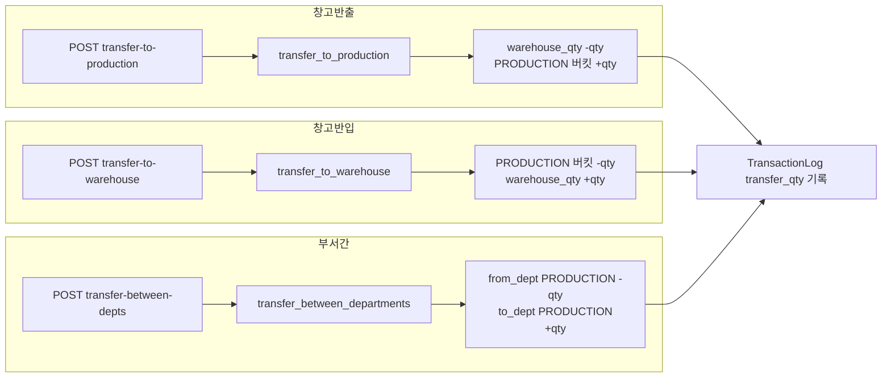

# 📦 transfer.py — 재고 부서 이동 (창고↔부서 / 부서간)

> [!summary] 역할
> 재고 버킷을 이동하는 3개 엔드포인트.  
> - 창고 → 부서 생산 버킷 (`/transfer-to-production`)  
> - 부서 생산 버킷 → 창고 (`/transfer-to-warehouse`)  
> - 부서 간 직접 이동 (`/transfer-between-depts`)  
> 모든 이동은 `inventory_svc` 서비스가 버킷 계산을 담당하고, 라우터는 검증·이력 기록만 한다.

#layer/backend #topic/router #topic/inventory

---

## 1. 역할

- 3-bucket 모델(warehouse / production / defective)에서 버킷 간 수량을 이동
- `TransactionLog` 에 이동 이력 기록 (`quantity_change=0`, `transfer_qty` 별도 필드)
- 재고 전체량(quantity) 은 불변 — 버킷 간 재배분만 발생

## 2. 원본 위치

```
erp/backend/app/routers/inventory/transfer.py
```

## 3. import

| 모듈 | 용도 |
|------|------|
| `app.services.inventory` | transfer_to_production, transfer_to_warehouse, transfer_between_departments |
| `app.schemas.TransferRequest, DeptTransferRequest` | 요청 스키마 |
| `app.models.TransactionTypeEnum` | TRANSFER_TO_PROD / TRANSFER_TO_WH / TRANSFER_DEPT |
| `._shared.to_response` | 응답 조립 |

## 4. export (endpoint 목록)

| Method | Path | TransactionType | 설명 |
|--------|------|-----------------|------|
| POST | `/inventory/transfer-to-production` | TRANSFER_TO_PROD | 창고 → 부서 생산 |
| POST | `/inventory/transfer-to-warehouse` | TRANSFER_TO_WH | 부서 생산 → 창고 |
| POST | `/inventory/transfer-between-depts` | TRANSFER_DEPT | 부서 간 이동 |

## 5. 참조처

- 프론트엔드 창고 반출/반입 UI
- 부서간 이동 화면

## 6. 업무 흐름



## 7. 핵심 함수

### 3개 endpoint 의 공통 패턴

```python
@router.post("/transfer-to-production", response_model=InventoryResponse)
def transfer_to_production(payload: TransferRequest, db: Session = Depends(get_db)):
    item = db.query(Item).filter(Item.item_id == payload.item_id).first()
    if not item:
        raise http_error(404, ErrorCode.NOT_FOUND, "품목을 찾을 수 없습니다.")
    inventory = inventory_svc.get_or_create_inventory(db, payload.item_id)
    qty_before = inventory.quantity or Decimal("0")
    try:
        inventory_svc.transfer_to_production(
            db, payload.item_id, payload.quantity, payload.department
        )
    except ValueError as exc:
        raise http_error(422, ErrorCode.UNPROCESSABLE, str(exc))

    db.add(TransactionLog(
        item_id=payload.item_id,
        transaction_type=TransactionTypeEnum.TRANSFER_TO_PROD,
        quantity_change=Decimal("0"),   # 총량 불변
        quantity_before=qty_before,
        quantity_after=inventory.quantity,
        transfer_qty=payload.quantity,  # 이동 수량은 별도 컬럼
        ...
    ))
    commit_and_refresh(db, inventory)
    return to_response(db, inventory)
```

> [!important] quantity_change = 0
> 이동은 총 재고량을 바꾸지 않으므로 `quantity_change=Decimal("0")`.  
> 실제 이동량은 `transfer_qty` 필드에 저장된다.

### `transfer-between-depts` 의 payload 차이

```python
# DeptTransferRequest 는 from_department, to_department 두 부서를 받음
inventory_svc.transfer_between_departments(
    db, payload.item_id, payload.quantity,
    payload.from_department, payload.to_department,
)
```

## 8. 위험 포인트

> [!danger] 재고 부족 시 ValueError
> 서비스 레이어에서 수량 부족 시 `ValueError` 를 raise.  
> 라우터는 이를 잡아 422 로 변환한다.  
> 서비스 구현 변경 시 예외 타입을 맞춰야 한다.

> [!warning] quantity_change vs transfer_qty 혼동 주의
> `/transactions` 조회 시 이동 거래의 `quantity_change` 는 0.  
> 실제 이동량은 `transfer_qty` 컬럼 참조.  
> 프론트 히스토리 화면 표시 로직 확인 필요.

## 9. 죽은 코드 의심

- `from fastapi import HTTPException` 임포트 있으나 미사용 (`http_error` 사용). 정리 가능.

## 10. 수정 전 체크

- [ ] `transfer_to_production` / `transfer_to_warehouse` 가 서비스 레이어에서 `InventoryLocation` 레코드를 어떻게 갱신하는지 확인 (`erp/backend/app/services/inventory.py`)
- [ ] `DeptTransferRequest` 에 `from_department == to_department` 방어 로직이 없음 (서비스 레이어 확인)
- [ ] `notes` 기본값이 f-string으로 자동 생성됨 — 한글 문자열 인코딩 이슈 없는지 확인

## 11. 코드 발췌

```python
@router.post("/transfer-between-depts", response_model=InventoryResponse)
def transfer_between_depts(payload: DeptTransferRequest, db: Session = Depends(get_db)):
    item = db.query(Item).filter(Item.item_id == payload.item_id).first()
    if not item:
        raise http_error(404, ErrorCode.NOT_FOUND, "품목을 찾을 수 없습니다.")
    inventory = inventory_svc.get_or_create_inventory(db, payload.item_id)
    qty_before = inventory.quantity or Decimal("0")
    try:
        inventory_svc.transfer_between_departments(
            db, payload.item_id, payload.quantity,
            payload.from_department, payload.to_department,
        )
    except ValueError as exc:
        raise http_error(422, ErrorCode.UNPROCESSABLE, str(exc))

    db.add(TransactionLog(
        item_id=payload.item_id,
        transaction_type=TransactionTypeEnum.TRANSFER_DEPT,
        quantity_change=Decimal("0"),
        quantity_before=qty_before,
        quantity_after=inventory.quantity,
        transfer_qty=payload.quantity,
        reference_no=payload.reference_no,
        produced_by=payload.produced_by,
        notes=payload.notes or
              f"{payload.from_department.value} → {payload.to_department.value} 이동 ({payload.quantity})",
    ))
    commit_and_refresh(db, inventory)
    return to_response(db, inventory)
```

---

## 관련 노트

- [[_inventory]] — inventory 패키지 허브
- [[receive.py]] — 같은 패턴 (입고/조정)
- [[defective.py]] — 불량 처리 (PRODUCTION → DEFECTIVE 버킷)
- [[erp/backend/app/services/inventory.py]] — 버킷 이동 로직

Up: [[_inventory]]
