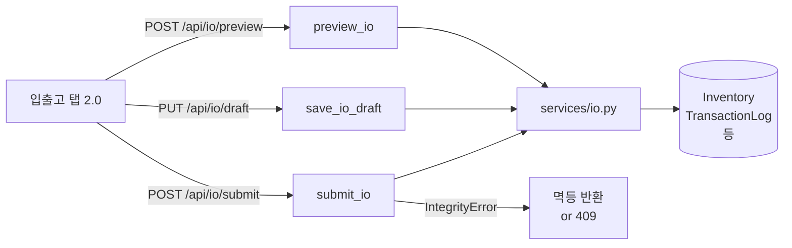

# 📦 io.py — 입출고 탭 2.0 API (미리보기·초안·제출)

> [!summary] 역할
> 입출고 작업을 미리보기(preview) → 초안 저장(draft) → 제출(submit) 3단계로 처리하는 라우터.
> `stock_requests.py`의 결재 흐름과 달리, 이 파일은 직접 처리 방식으로 재고를 즉시 변경한다.

## 1. 이 파일의 역할

현장에서 입고·출고·이동을 수행할 때 "먼저 미리보기로 영향을 확인하고, 초안으로 저장한 뒤, 최종 제출"하는 워크플로우를 제공합니다.
`stock_requests.py`가 결재 기반이라면, `io.py`는 즉시 실행 기반입니다.
멱등성 보호를 위해 `client_request_id`로 중복 제출을 방지합니다.

## 2. 실제 원본 위치

- **원본**: `erp/backend/app/routers/io.py` ([[erp/backend/app/routers/io.py]])
- vault 노트는 분석 지도일 뿐, 수정은 원본에서만.

## 3. import 로 가져오는 것

| 모듈 | 역할 |
|---|---|
| `app.schemas` | `IoBatchResponse`, `IoDraftUpsert`, `IoPreviewRequest`, `IoPreviewResponse`, `IoSubmitRequest`, `IoSubmitResponse` |
| `app.services.io` | `io_svc` — `preview`, `save_draft`, `get_draft`, `list_drafts`, `delete_draft`, `submit`, `submit_existing_draft`, `get_batch`, `find_by_client_request_id`, `build_idempotent_response` |
| `app.services._tx` | `commit_only` |
| `sqlalchemy.exc.IntegrityError` | `client_request_id` 중복 멱등성 처리 |

## 4. export / 외부에 제공하는 것

- **prefix**: `/api/io`

| 메서드 | 경로 | 설명 |
|---|---|---|
| `POST` | `/api/io/preview` | 제출 전 영향 미리보기 (재고 변화 시뮬레이션) |
| `PUT` | `/api/io/draft` | 초안 upsert (장바구니 저장) |
| `GET` | `/api/io/draft` | 단일 초안 조회 |
| `GET` | `/api/io/drafts` | 본인 초안 목록 |
| `DELETE` | `/api/io/draft/{batch_id}` | 초안 삭제 |
| `POST` | `/api/io/submit` | 새 입출고 즉시 제출 |
| `POST` | `/api/io/draft/{batch_id}/submit` | 기존 초안을 제출 |
| `GET` | `/api/io/{batch_id}` | 완료된 배치 단건 조회 |

## 5. 이 파일을 참조하는 곳

- `erp/backend/app/main.py` — `app.include_router(io.router, prefix="/api/io", tags=["Inventory IO"])`
- 프론트엔드 입출고 탭 화면 (2.0)

## 6. 실제 업무 흐름에서 언제 쓰이는지

- [[시나리오_재고입출고]]:
  1. `POST /api/io/preview` — 수량 변화 미리보기
  2. `PUT /api/io/draft` — 초안 저장 (다음 세션에 이어서 작업)
  3. `POST /api/io/submit` 또는 `POST /api/io/draft/{id}/submit` — 실재고 반영
- 창고 수기 입고/출고, 부서 간 이동 모두 이 라우터 사용

## 7. 핵심 함수 / 상수 / 매핑

| 함수 | 설명 |
|---|---|
| `preview_io(payload, db)` | `io_svc.preview` 위임. 재고 변경 없이 결과만 반환 |
| `save_io_draft(payload, db)` | `io_svc.save_draft` → `commit_only`. PermissionError/ValueError 분기 |
| `submit_io(payload, db)` | `io_svc.submit` 호출 → `commit_only`. IntegrityError 시 멱등 반환 또는 409 |
| `submit_io_draft(batch_id, requester_employee_id, db)` | 기존 초안 ID로 제출 |
| `get_io_batch(batch_id, db)` | 완료 배치 단건 조회 (이력 확인용) |

## 8. ⚠️ 위험 포인트

> [!warning] 수정 시 깨지기 쉬운 지점
> - `submit_io`의 `IntegrityError` 분기: `client_request_id` 포함 시 기존 배치 찾아 멱등 반환. `find_by_client_request_id`가 None이면 409. 이 분기가 `client_request_id` 없는 일반 unique 제약 위반도 처리해야 함 — 조건 순서 중요.
> - `commit_only` 호출 위치: `submit_io`에서는 `io_svc.submit` 성공 후 `commit_only`가 같은 try 블록 안에 있음. 서비스 내부에서 예외 발생 후 commit이 실행되지 않도록 주의.
> - `/draft`와 `/draft/{batch_id}/submit` 경로: `/draft/{batch_id}/submit`이 먼저 등록되어야 `/{batch_id}`와 혼동 없음. 현재 소스 순서가 올바름 — 재정렬 시 주의.
> - `io.py`는 결재 없이 즉시 재고를 변경함. 권한 검사는 `io_svc` 내부에 의존하므로 서비스 레이어 권한 로직을 파악해야 함.

[[위험지대_지도]] — 즉시 재고 변경, 멱등성 처리

## 9. 죽은 코드 의심 / 삭제하면 안 되는 이유

- `preview_io`: 실제로 DB를 변경하지 않으므로 "사용 안 해도 된다"고 생각할 수 있지만, UI에서 제출 전 확인 화면에 필수.
- `get_io_batch`: 완료 이후 이력 조회용. 프론트에서 제출 완료 후 결과 페이지 표시에 사용할 수 있음.

## 10. 수정 전 체크리스트

- [ ] `verify_local.ps1` 통과 확인
- [ ] `services/io.py` 의 `preview`, `submit` 로직과 스키마(`IoSubmitRequest`) 일치 확인
- [ ] `client_request_id` 멱등성 처리 — 네트워크 재시도 시나리오 테스트
- [ ] 초안 삭제(`DELETE /draft/{batch_id}`) 시 이미 제출된 배치 삭제 시도 방어 확인
- [ ] `stock_requests.py` 와 중복 기능 범위 명확히 파악 (결재 필요 vs 즉시 처리)

## 11. 핵심 코드 발췌

> [!example] submit 멱등성 처리 + IntegrityError 분기 (약 28줄)
> ```python
> @router.post("/submit", response_model=IoSubmitResponse, status_code=status.HTTP_201_CREATED)
> def submit_io(payload: IoSubmitRequest, db: Session = Depends(get_db)):
>     try:
>         result = io_svc.submit(db, payload)
>         commit_only(db)
>         return result
>     except PermissionError as exc:
>         db.rollback()
>         raise http_error(403, ErrorCode.FORBIDDEN, str(exc))
>     except ValueError as exc:
>         db.rollback()
>         raise http_error(422, ErrorCode.UNPROCESSABLE, str(exc))
>     except IntegrityError as exc:
>         db.rollback()
>         # client_request_id 중복 → 기존 batch 멱등 반환 (더블클릭/네트워크 retry 보호)
>         if payload.client_request_id and "client_request_id" in str(exc).lower():
>             existing = io_svc.find_by_client_request_id(db, payload.client_request_id)
>             if existing is not None:
>                 return io_svc.build_idempotent_response(existing)
>             raise http_error(
>                 409, ErrorCode.CONFLICT,
>                 "이미 처리된 요청입니다. 새 작업으로 다시 시도해 주세요.",
>             )
>         raise http_error(
>             409, ErrorCode.CONFLICT,
>             f"제출에 일시적 충돌이 발생했습니다. 잠시 후 다시 시도해 주세요. ({exc.__class__.__name__})",
>         )
> ```

`client_request_id`로 동일 요청 재제출을 감지하고 기존 결과를 그대로 반환한다.
`IntegrityError` 발생 즉시 `db.rollback()`을 호출해 세션을 안전한 상태로 복원한다.



## 관련 노트

- [[처음_읽는_사람]], [[ERP_MOC]], [[용어사전]]
- [[erp/backend/app/services/io.py]]
- [[erp/backend/app/routers/stock_requests.py]]
- [[erp/backend/app/models.py]]

Up: [[_routers]]
