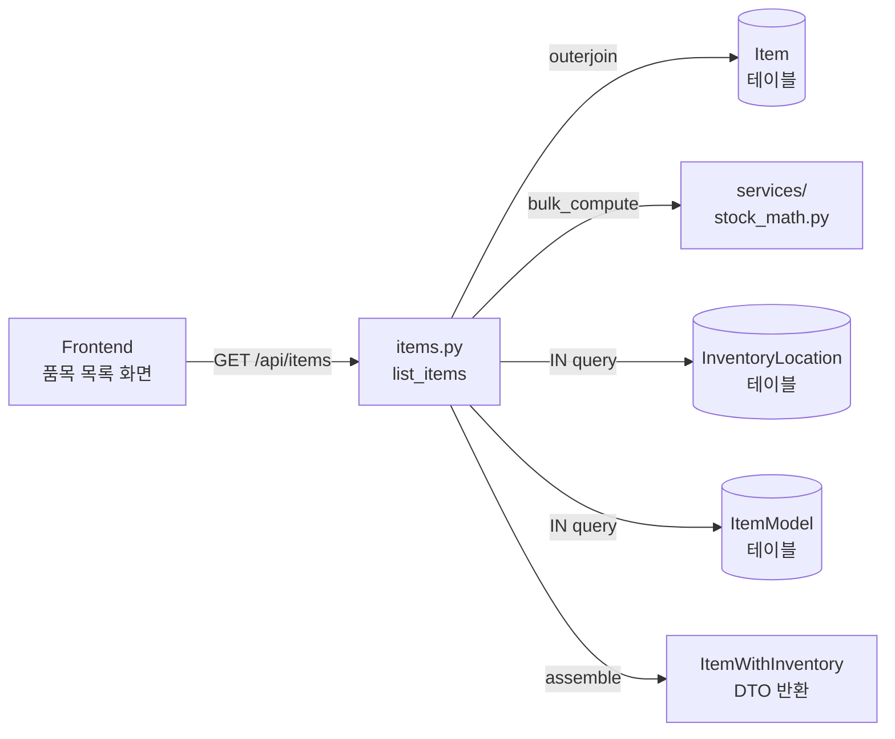

# 📦 items.py — 품목 마스터 CRUD + 재고 통합 조회

> [!summary] 역할
> 품목(Item)의 생성·조회·수정, CSV/XLSX 내보내기, BOM 완료 상태 관리를 담당하는 라우터.
> 조회 시 재고 수치(창고·예약·가용)를 함께 반환해 프론트가 별도 재고 API를 호출할 필요가 없다.

## 1. 이 파일의 역할

품목 마스터(Item 테이블)에 대한 CRUD + 검색 기능 전체를 제공합니다.
단순 품목 정보뿐 아니라 재고 현황(`ItemWithInventory`)을 한 번에 반환하는 게 핵심 특징입니다.
N+1 문제를 막기 위해 `stock_math.bulk_compute`로 재고 수치를 한 번에 계산합니다.

## 2. 실제 원본 위치

- **원본**: `erp/backend/app/routers/items.py` ([[erp/backend/app/routers/items.py]])
- vault 노트는 분석 지도일 뿐, 수정은 원본에서만.

## 3. import 로 가져오는 것

| 모듈 | 역할 |
|---|---|
| `app.models` | `Item`, `Inventory`, `InventoryLocation`, `ItemModel`, `ProductSymbol`, `LocationStatusEnum` |
| `app.schemas` | `ItemCreate`, `ItemUpdate`, `ItemWithInventory`, `ItemResponse`, `BomCompletionUpdate` 등 |
| `app.utils.item_code` | `make_item_code`, `next_serial_no`, `slots_to_model_symbol` — 4파트 코드 생성 |
| `app.services.audit` | 변경 이력 기록 |
| `app.services.stock_math` | `bulk_compute`, `compute_for`, `StockFigures` — 재고 수치 계산 |
| `app.services.inventory` | `inventory_svc` — 재고 직접 조작 (이 파일에서는 참조만) |
| `app.services._tx` | `commit_and_refresh` — 트랜잭션 커밋 헬퍼 |
| `app.services.export_helpers` | `csv_streaming_response` — CSV 스트리밍 응답 |
| `openpyxl` | XLSX 내보내기 (lazy import, `/export.xlsx` 에서만) |

## 4. export / 외부에 제공하는 것

- **prefix**: `/api/items`

| 메서드 | 경로 | 설명 |
|---|---|---|
| `POST` | `/api/items` | 품목 신규 생성 (item_code 자동 생성 포함) |
| `GET` | `/api/items` | 품목 목록 조회 (다중 필터 + 페이징) |
| `GET` | `/api/items/export.csv` | 전체 품목 CSV 내보내기 |
| `GET` | `/api/items/export.xlsx` | 전체 품목 XLSX 내보내기 (부서별 색상) |
| `GET` | `/api/items/{item_id}` | 품목 단건 상세 조회 |
| `PUT` | `/api/items/{item_id}` | 품목 수정 |
| `PATCH` | `/api/items/{item_id}/bom-completion` | BOM 완료 상태 토글 |

## 5. 이 파일을 참조하는 곳

- `erp/backend/app/main.py` — `app.include_router(items.router, prefix="/api/items", tags=["Items"])`
- 프론트엔드 `frontend/lib/api/items.ts` (또는 유사 경로)가 모든 엔드포인트 호출
- BOM 완료 버튼 클릭 시 `PATCH /bom-completion` 호출

## 6. 실제 업무 흐름에서 언제 쓰이는지

- [[시나리오_품목등록]]: 새 부품·완제품 등록 → `POST /api/items`
- [[시나리오_재고입출고]]: 입출고 전 품목 목록 조회로 품목 선택
- [[시나리오_생산배치]]: 생산 대상 품목 검색, BOM 완료 여부 확인
- XLSX 내보내기는 재고 현황 보고서로 활용

## 7. 핵심 함수 / 상수 / 매핑

| 함수/상수 | 설명 |
|---|---|
| `_build_item_query(db)` | Item + Inventory outerjoin 기본 쿼리 반환 |
| `_to_item_with_inventory(...)` | Item + Inventory → `ItemWithInventory` DTO 조립. bulk prefetch 지원 |
| `create_item(payload, request, db)` | item_code 자동 계산 + Inventory 초기 행 생성 |
| `list_items(...)` | 필터 7종 + bulk prefetch(N+1 제거) |
| `export_items_xlsx(...)` | openpyxl로 부서별 행 색상 + 안전재고 미만 빨간 글씨 |
| `update_bom_completion(...)` | `bom_completed_at` 타임스탬프 set/clear |
| `_PROCESS_PREFIX_ROW_COLOR` | 공정 prefix → XLSX 행 색상 매핑 dict |

## 8. ⚠️ 위험 포인트

> [!warning] 수정 시 깨지기 쉬운 지점
> - `_to_item_with_inventory`의 figures/locations/model_slots 파라미터: `None` 이면 단건 쿼리, 값이 있으면 bulk prefetch. 둘을 혼동하면 N+1 또는 데이터 불일치.
> - `export.xlsx`/`export.csv` 경로가 `/{item_id}` 보다 먼저 선언되어야 라우트 매칭이 올바름. 경로 순서 바꾸면 "xlsx"를 item_id로 파싱해 404.
> - `next_serial_no` + `make_item_code` 는 DB에 중복 없음을 가정. 동시 요청 시 race condition 가능성 있음.
> - `sort_order` 를 누락하면 SQLite가 NULL을 맨 앞 정렬해 순서가 뒤집힘.

[[위험지대_지도]] — 품목 코드 자동 생성, N+1 재고 쿼리 영역

## 9. 죽은 코드 의심 / 삭제하면 안 되는 이유

- `_row_color_for` 함수: XLSX export 에서만 사용. CSV 경로에서 쓰지 않아 보이지만 xlsx 유지에 필수.
- `legacy_file_type`, `legacy_part`, `legacy_item_type` 필드: 구 시스템 마이그레이션 데이터. 현재 UI에서 쓰는지 불분명하지만 삭제 시 기존 데이터 조회 불가 — 유지 필요.
- `ProductSymbol` import: `items.py` 에서 직접 쿼리하지 않지만 `item_code` 생성 유틸(`utils/item_code.py`)이 내부에서 참조함.

## 10. 수정 전 체크리스트

- [ ] `verify_local.ps1` 통과 확인
- [ ] `tests/` 의 items 관련 테스트(`test_items.py`) 확인
- [ ] 프론트엔드 `lib/api/items.ts` 호출처 확인 (응답 shape 변경 시 필수)
- [ ] `_to_item_with_inventory` 수정 시 bulk prefetch 경로와 단건 경로 양쪽 검증
- [ ] XLSX export 수정 시 `openpyxl` lazy import 유지 (서버 시작 속도 보호)

## 11. 핵심 코드 발췌

> [!example] bulk prefetch로 N+1 제거하는 list_items 핵심 (약 30줄)
> ```python
> rows = query.order_by(Item.sort_order, Item.item_code).offset(skip).limit(limit).all()
> if not rows:
>     return []
>
> # bulk prefetch — N+1 제거. 기존에는 item 1건당 4 쿼리씩 나갔음.
> item_ids = [it.item_id for it, _ in rows]
> figures_map = stock_math.bulk_compute(db, item_ids)
>
> loc_rows = (
>     db.query(InventoryLocation)
>     .filter(InventoryLocation.item_id.in_(item_ids), InventoryLocation.quantity > 0)
>     .all()
> )
> locations_by_item: dict = {}
> for row in loc_rows:
>     locations_by_item.setdefault(row.item_id, []).append(
>         InventoryLocationResponse(
>             department=row.department,
>             status=row.status,
>             quantity=row.quantity or _D("0"),
>         )
>     )
>
> model_rows = db.query(ItemModel).filter(ItemModel.item_id.in_(item_ids)).all()
> slots_by_item: dict = {}
> for row in model_rows:
>     slots_by_item.setdefault(row.item_id, []).append(row.slot)
>
> return [
>     _to_item_with_inventory(
>         db, item, inv,
>         figures=figures_map.get(item.item_id),
>         locations=locations_by_item.get(item.item_id, []),
>         model_slots=slots_by_item.get(item.item_id, []),
>     )
>     for item, inv in rows
> ]
> ```

`stock_math.bulk_compute` 한 번 + InventoryLocation IN 1번 + ItemModel IN 1번으로 목록 전체 처리.
`item_ids` 범위 안에서만 쿼리하므로 100건 조회도 DB 왕복 3회로 끝난다.



## 관련 노트

- [[처음_읽는_사람]], [[ERP_MOC]], [[용어사전]]
- [[erp/backend/app/services/stock_math.py]]
- [[erp/backend/app/services/audit.py]]
- [[erp/backend/app/models.py]]
- [[erp/backend/app/utils/item_code.py]]

Up: [[_routers]]
