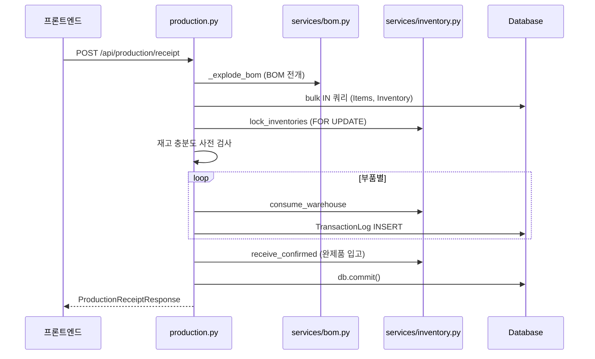

# 📦 production.py — 생산 입고 처리 (BOM Backflush + 생산 가능 수량)

> [!summary] 역할
> 완제품 생산 입고를 처리하면서 BOM을 전개해 부품 재고를 자동으로 차감(Backflush)하는 라우터.
> 사전 가능 여부 확인(`bom-check`)과 전체 생산 가능 수량 조회(`capacity`)도 제공한다.

## 1. 이 파일의 역할

"NF 완제품 1개를 생산 완료했다"고 입력하면, 자동으로 BOM을 분석해 필요한 부품(원자재, 중간공정품)을 창고에서 차감합니다.
이것을 **Backflush**(역방향 소비)라고 합니다.
생산 전에 `bom-check`로 재고가 충분한지 확인하고, `capacity`로 지금 만들 수 있는 최대 수량도 계산할 수 있습니다.

## 2. 실제 원본 위치

- **원본**: `erp/backend/app/routers/production.py` ([[erp/backend/app/routers/production.py]])
- vault 노트는 분석 지도일 뿐, 수정은 원본에서만.

## 3. import 로 가져오는 것

| 모듈 | 역할 |
|---|---|
| `app.models` | `BOM`, `Item`, `Inventory`, `ProcessType`, `TransactionLog`, `TransactionTypeEnum` |
| `app.schemas` | `ProductionReceiptRequest`, `ProductionReceiptResponse`, `BackflushDetail`, `BomCheckResponse`, `CapacityResponse` |
| `app.services.inventory` | `inventory_svc` — `lock_inventories`, `consume_warehouse`, `receive_confirmed`, `get_or_create_inventory`, `dept_for_process_type` |
| `app.services.stock_math` | `bulk_compute`, `StockFigures` |
| `app.services.bom` | `BomCache`, `build_bom_cache`, `explode_bom`, `merge_requirements` |

## 4. export / 외부에 제공하는 것

- **prefix**: `/api/production`

| 메서드 | 경로 | 설명 |
|---|---|---|
| `POST` | `/api/production/receipt` | 생산 입고 처리 (BOM Backflush 원자 실행) |
| `GET` | `/api/production/bom-check/{item_id}` | 생산 가능 여부 사전 확인 (재고 충분도) |
| `GET` | `/api/production/capacity` | 전체 생산 가능 수량 (즉시/최대) |
| `GET` | `/api/production/possible` | capacity의 별칭 (alias) |

## 5. 이 파일을 참조하는 곳

- `erp/backend/app/main.py` — `app.include_router(production.router, prefix="/api/production", tags=["Production"])`
- 프론트엔드 생산 입고 화면, 대시보드 생산 가능 수량 위젯

## 6. 실제 업무 흐름에서 언제 쓰이는지

- [[시나리오_생산배치]]:
  1. `GET /bom-check/{item_id}` — 부품 재고 충분 여부 확인
  2. `POST /receipt` — 생산 완료 입력 → 부품 자동 차감 + 완제품 입고
- 대시보드: `GET /capacity` → 즉시 생산 가능 수량 표시

## 7. 핵심 함수 / 상수 / 매핑

| 함수 | 설명 |
|---|---|
| `production_receipt(payload, db)` | BOM 전개 → 재고 사전 검사 → `lock_inventories` FOR UPDATE → `consume_warehouse` 반복 → `receive_confirmed` 완제품 입고 → `TransactionLog` 기록 |
| `check_production_feasibility(item_id, quantity, db)` | `_explode_bom` + `bulk_compute` → 부품별 가용수량 vs 필요량 비교 |
| `get_production_capacity(db)` | BOM 최상위 완제품 탐색 → `_buildable` 재귀로 즉시/최대 수량 계산 |
| `_explode_bom(db, parent_item_id, ...)` | `services/bom.py`의 `explode_bom` wrapper (하위 호환) |
| `_buildable(item_id, ...)` | `get_production_capacity` 내부 중첩 함수. 재귀 메모이제이션으로 생산 가능 수량 계산 |

## 8. ⚠️ 위험 포인트

> [!warning] 수정 시 깨지기 쉬운 지점
> - `lock_inventories(db, comp_ids)` — PostgreSQL에서는 `FOR UPDATE` 잠금. 잠금 순서가 일정해야 교착(deadlock) 방지. 다른 엔드포인트와 충돌 가능성 있음.
> - `consume_warehouse` 실패(ValueError) 시 `db.rollback()` 후 422 반환. 이미 성공한 부품의 차감이 롤백되어야 하므로 트랜잭션 경계가 명확해야 함.
> - `_buildable` 함수에서 `immediate_mode`: `stage_order < 60` 이면 자식 전개 안 함. `ProcessType.stage_order` 값이 바뀌면 생산 가능 수량 계산 결과가 달라짐.
> - `db.commit()`이 라우터에 직접 있음 (서비스 레이어가 아님). 예외 발생 경로에서 commit 이전에 raise 되면 안 전히 롤백됨 — 예외 추가 시 주의.
> - `/possible`은 `/capacity`의 alias. 두 경로가 같은 함수를 가리키지만 OpenAPI 문서에 둘 다 노출됨 — 혼란 가능성.

[[위험지대_지도]] — Backflush 원자성, FOR UPDATE 교착, stage_order 의존

## 9. 죽은 코드 의심 / 삭제하면 안 되는 이유

- `_explode_bom` wrapper 함수: 실제 로직은 `services/bom.py`로 이전됨. 하위 호환을 위해 유지 중. 직접 삭제하면 내부 `production_receipt`에서 참조하는 코드가 깨질 수 있음.
- `merge_requirements` import: `production_receipt`에서 `merged` dict를 직접 만들어 사용 중이어서 import는 있지만 호출이 없어 보임 — 실제 사용처 재확인 필요.

## 10. 수정 전 체크리스트

- [ ] `verify_local.ps1` 통과 확인
- [ ] Backflush 트랜잭션 경계: 모든 예외 경로에서 `db.rollback()` 확인
- [ ] `lock_inventories` 잠금 순서와 다른 라우터의 잠금 순서 충돌 없는지 확인
- [ ] `_buildable`의 `stage_order < 60` 경계값 — `ProcessType` 데이터와 일치 여부
- [ ] `merge_requirements` import 실제 사용 여부 확인 (미사용 시 삭제)

## 11. 핵심 코드 발췌

> [!example] Backflush 재고 검사 + 원자 처리 핵심 (약 35줄)
> ```python
> # 5.4-E: bulk 사전 로드 — Items / Inventory 각 1회 IN 쿼리.
> comp_ids = list(merged.keys())
> items_map = {i.item_id: i for i in db.query(Item).filter(Item.item_id.in_(comp_ids)).all()}
> # 다품목 동시 backflush TOCTOU 방지 — 한 번에 FOR UPDATE 잠금
> invs_map = inventory_svc.lock_inventories(db, comp_ids)
>
> shortage_errors = []
> for comp_item_id, required_qty in merged.items():
>     inv = invs_map.get(comp_item_id)
>     current_avail = (
>         (inv.warehouse_qty or Decimal("0")) - (inv.pending_quantity or Decimal("0"))
>         if inv else Decimal("0")
>     )
>     if current_avail < required_qty:
>         comp_item = items_map.get(comp_item_id)
>         shortage_errors.append(
>             f"[{comp_item.item_code}] {comp_item.item_name}: "
>             f"필요 {required_qty}, 가용 {current_avail}, "
>             f"부족 {required_qty - current_avail}"
>         )
>
> if shortage_errors:
>     raise http_error(422, ErrorCode.STOCK_SHORTAGE,
>                      "재고 부족으로 생산 입고를 진행할 수 없습니다.",
>                      shortages=shortage_errors)
>
> # 이하: 실제 차감 + TransactionLog 기록
> for comp_item_id, required_qty in merged.items():
>     inv, qty_before = inventory_svc.consume_warehouse(db, comp_item_id, required_qty)
>     log = TransactionLog(
>         item_id=comp_item_id,
>         transaction_type=TransactionTypeEnum.BACKFLUSH,
>         quantity_change=-required_qty,
>         ...
>     )
>     db.add(log)
>     db.flush()
> ```

`lock_inventories`로 모든 부품을 한 번에 잠근 뒤, 재고 검사 → 차감 → 로그 기록 순서로 처리한다.
검사를 먼저 모두 통과해야 실제 변경이 시작된다.



## 관련 노트

- [[처음_읽는_사람]], [[ERP_MOC]], [[용어사전]]
- [[erp/backend/app/services/bom.py]]
- [[erp/backend/app/services/inventory.py]]
- [[erp/backend/app/services/stock_math.py]]
- [[erp/backend/app/models.py]]

Up: [[_routers]]
