# 📦 settings.py — 시스템 설정·관리자 PIN·무결성 점검·DB 초기화

> [!summary] 역할
> 시스템 운영 전반을 관리하는 위험 지대 라우터.  
> - 관리자 PIN 검증 및 변경  
> - `require_admin` 함수: 다른 라우터(departments, employees)에서 임포트해 공유  
> - 재고 불변식 점검(check) 및 복구(repair)  
> - DB 안전 초기화(reset) — 품목·재고 데이터 삭제 후 시드 재적재

#layer/backend #topic/router #topic/settings

---

## 1. 역할

- 관리자 PIN: 검증 / 변경 (SystemSetting 테이블 저장, bcrypt-like 해시)
- `require_admin(db, pin)`: 전역 공유 함수 — 다른 라우터에서 호출
- 재고 불변식 점검: `GET|POST /settings/integrity/inventory`
- 재고 복구: `POST /settings/integrity/repair` (dry_run 기본 true)
- DB 초기화: `POST /settings/reset` — **운영 주의**

## 2. 원본 위치

```
erp/backend/app/routers/settings.py
```

## 3. import

| 모듈 | 용도 |
|------|------|
| `app.models.SystemSetting` | 관리자 PIN 저장 테이블 |
| `app.services.integrity` | check_inventory_consistency, repair_inventory_totals |
| `app.services.audit` | 감사 기록 (PIN 변경, repair, reset) |
| `app.services.pin_auth.hash_pin` | PIN 해싱 |
| `app.services._tx.commit_and_refresh, commit_only` | DB 커밋 |
| `app.services.seed_cleanup.run_cleanup_import` | reset 시 시드 재적재 |

## 4. export (endpoint 목록)

| Method | Path | PIN 필요 | 설명 |
|--------|------|----------|------|
| POST | `/settings/verify-pin` | 자신 PIN | 관리자 PIN 검증 |
| PUT | `/settings/admin-pin` | 현재+새 PIN | 관리자 PIN 변경 |
| GET | `/settings/integrity/inventory` | 관리자 PIN | 재고 불변식 점검 (deprecated, body 우선) |
| POST | `/settings/integrity/inventory` | 관리자 PIN | 재고 불변식 점검 (신규 기준) |
| POST | `/settings/integrity/repair` | 관리자 PIN | 재고 복구 (dry_run=true 기본) |
| POST | `/settings/reset` | 관리자 PIN | DB 초기화 + 시드 재적재 |

**공개 함수 (다른 라우터 임포트용)**

| 함수 | 설명 |
|------|------|
| `require_admin(db, pin)` | 관리자 PIN 불일치 시 403 |

## 5. 참조처

- `departments.py` → `from app.routers.settings import require_admin`
- `employees.py` → `from app.routers.settings import require_admin`
- 프론트엔드 설정 화면 (PIN 관리, 무결성 점검)

## 6. 업무 흐름

```mermaid
flowchart TD
    subgraph PIN 관리
        A[POST /verify-pin] --> B[ensure_admin_pin\nDB에 없으면 0000 생성]
        B --> C[_matches_admin_pin]
        C -->|평문 발견| D[lazy migration: 즉시 해시화]
        C -->|해시 일치| OK[200 OK]
        C -->|불일치| ERR[403]
    end

    subgraph 무결성
        E[POST /integrity/inventory] --> F[require_admin]
        F --> G[integrity_svc.check_inventory_consistency]
        G --> H[미스매치 목록 반환]

        I[POST /integrity/repair dry_run=true] --> F
        F --> J[repair_inventory_totals]
        J -->|dry_run=false| K[audit.record + commit]
    end

    subgraph 초기화
        L[POST /reset] --> M[require_admin]
        M --> N[audit.record BEFORE commit\n초기화 후 audit도 지워질 수 있으므로]
        N --> O[Item/Inventory/InventoryLocation 전체 삭제]
        O --> P[run_cleanup_import 시드]
    end
```



## 7. 핵심 함수

### `require_admin` — 전역 공유

```python
def require_admin(db: Session, pin: str) -> None:
    """관리자 PIN 검증. 일치하지 않으면 403."""
    setting = ensure_admin_pin(db)
    if not _matches_admin_pin(db, setting, pin):
        raise http_error(403, ErrorCode.BAD_REQUEST, "관리자 비밀번호가 올바르지 않습니다.")
```

### `_matches_admin_pin` — lazy migration

```python
def _matches_admin_pin(db: Session, setting: SystemSetting, input_pin: str) -> bool:
    """PIN 비교. 평문 발견 시 자동 해시화(lazy migration)."""
    stored = setting.setting_value
    if _is_hashed(stored):         # 64자 hex → 해시 비교
        return stored == hash_pin(input_pin)
    # 평문 → 비교 후 일치하면 즉시 해시화 (레거시 DB 마이그레이션)
    if stored == input_pin:
        setting.setting_value = hash_pin(input_pin)
        setting.updated_at = datetime.now(UTC).replace(tzinfo=None)
        commit_only(db)
        return True
    return False
```

> [!important] lazy migration 설명
> DB 에 평문 PIN 이 저장되어 있으면(구버전 DB), 첫 번째 올바른 로그인 시 자동으로 해시화한다.  
> 개발자가 DB 를 직접 마이그레이션하지 않아도 된다.

### `reset_database` — 위험 작업

```python
@router.post("/reset", response_model=MessageResponse)
def reset_database(payload: ResetRequest, request: Request, db: Session = Depends(get_db)):
    # reset 직전에 audit 1건 기록 (reset 자체는 시드 재적재로 audit_logs 도 비울 수 있어 사후 기록 무의미)
    audit.record(db, ..., action="settings.reset_db", ...)
    commit_only(db)
    # 품목·재고 데이터 초기화 (Employee/ProcessType 등은 유지)
    db.query(_Loc).delete(synchronize_session=False)
    db.query(_Inv).delete(synchronize_session=False)
    db.query(_Item).delete(synchronize_session=False)
    db.commit()
    result = run_cleanup_import(db)
    return MessageResponse(message=f"...rows={result['rows']}...")
```

## 8. 위험 포인트

> [!danger] POST /settings/reset — 되돌릴 수 없음
> Item / Inventory / InventoryLocation 전체를 삭제한다.  
> Employee, ProcessType, Department 등 참조 데이터는 유지된다.  
> audit 기록도 reset 으로 지워질 수 있으므로 **reset 전 audit 기록** 이 먼저 commit 된다.

> [!danger] dry_run 기본값
> `POST /integrity/repair` 의 `dry_run` 기본값은 **True**.  
> 실제 복구를 하려면 `"dry_run": false` 를 명시해야 한다.  
> 기본값을 모르고 호출하면 아무것도 변경되지 않는다.

> [!warning] `require_admin` 은 공유 함수
> departments.py, employees.py 가 이 함수를 임포트한다.  
> 함수 시그니처나 예외 타입 변경 시 세 파일 모두 영향 받음.

## 9. 죽은 코드 의심

- `GET /settings/integrity/inventory` 는 `Deprecated compatibility endpoint` 주석이 달려 있음.  
  신규 코드는 `POST` 엔드포인트를 사용해야 한다.
- `_require_admin = require_admin` 내부 alias — 코드 내 일부가 여전히 `_require_admin` 을 호출.

## 10. 수정 전 체크

- [ ] `require_admin` 변경 시 departments.py, employees.py 테스트
- [ ] `repair` 호출 전 반드시 `dry_run=true` 로 먼저 점검 후 false 로 적용
- [ ] `reset` 은 절대 자동화/스크립트에서 호출 금지
- [ ] `ADMIN_PIN_KEY = "admin_pin"` 상수 변경 시 DB 의 `SystemSetting.setting_key` 도 마이그레이션 필요

## 11. 코드 발췌

```python
ADMIN_PIN_KEY = "admin_pin"
DEFAULT_ADMIN_PIN = "0000"

def ensure_admin_pin(db: Session) -> SystemSetting:
    setting = db.query(SystemSetting).filter(
        SystemSetting.setting_key == ADMIN_PIN_KEY
    ).first()
    if setting:
        return setting
    # DB 에 없으면 기본 PIN(0000) 으로 자동 생성
    setting = SystemSetting(
        setting_key=ADMIN_PIN_KEY,
        setting_value=hash_pin(DEFAULT_ADMIN_PIN)
    )
    db.add(setting)
    commit_and_refresh(db, setting)
    return setting

def _is_hashed(value: str) -> bool:
    return len(value) == 64 and all(c in "0123456789abcdef" for c in value)
```

---

## 관련 노트

- [[_routers]] — 라우터 허브
- [[erp/backend/app/routers/departments.py]] — require_admin 사용
- [[erp/backend/app/routers/employees.py]] — require_admin 사용
- [[erp/backend/app/services/integrity.py]] — 무결성 점검 로직

Up: [[_routers]]
