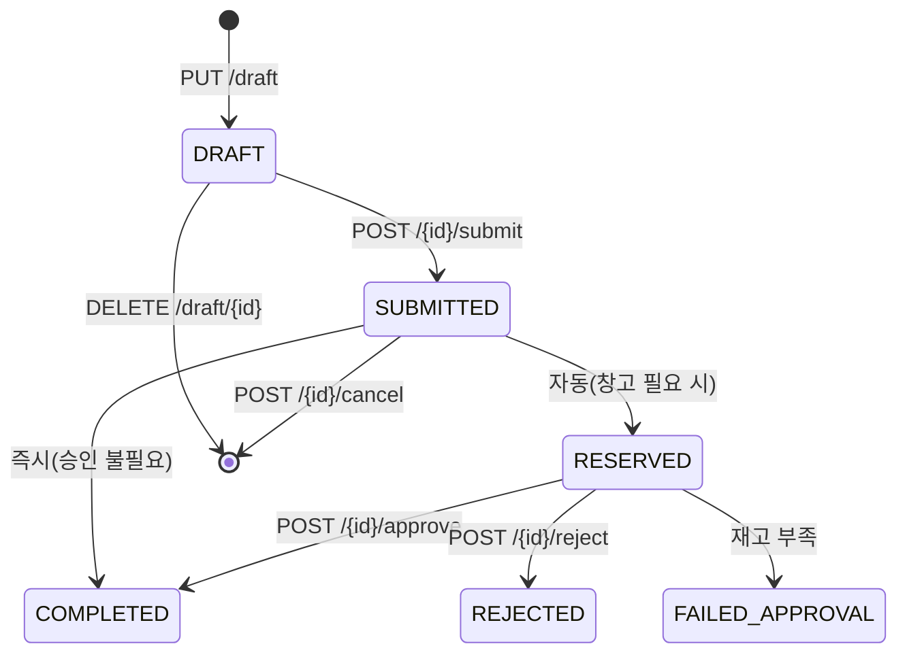

# 📦 stock_requests.py — 작업자 결재 요청 / 창고·부서 승인 흐름 (18 엔드포인트)

> [!summary] 역할
> 작업자가 입출고·이동 요청을 생성하고, 창고 담당자 또는 부서 결재자가 승인·반려하는
> 결재 흐름 전체를 담당하는 라우터. 장바구니(DRAFT) 저장 → 제출(SUBMITTED) → 승인(COMPLETED) 3단계 상태 전환이 핵심.

## 1. 이 파일의 역할

현장 작업자가 재고를 요청할 때 "즉시 처리"가 아니라 "결재를 거쳐 처리"하도록 하는 시스템입니다.
예를 들어 창고에서 부품을 가져가려면 → 요청 생성 → 창고 담당자 승인 → 실재고 이동 순서로 처리됩니다.
DRAFT(장바구니), SUBMITTED/RESERVED(대기), COMPLETED(완료), REJECTED(반려), FAILED_APPROVAL(승인 실패) 상태가 있습니다.

## 2. 실제 원본 위치

- **원본**: `erp/backend/app/routers/stock_requests.py` ([[erp/backend/app/routers/stock_requests.py]])
- vault 노트는 분석 지도일 뿐, 수정은 원본에서만.

## 3. import 로 가져오는 것

| 모듈 | 역할 |
|---|---|
| `app.models` | `StockRequest`, `StockRequestLine`, `StockRequestStatusEnum`, `StockRequestTypeEnum`, `Employee` |
| `app.schemas` | `StockRequestCreate`, `StockRequestResponse`, `StockRequestDraftUpsert`, `StockRequestSubmitPayload`, `StockRequestActionRequest`, `ReservationLineResponse` |
| `app.services.stock_requests` | 핵심 비즈니스 로직 전부 (`create_request`, `approve_request`, `reject_request` 등) |
| `app.services._tx` | `commit_and_refresh`, `commit_only` |
| `app.database` | `get_db`, `_is_sqlite` — PostgreSQL FOR UPDATE 잠금 여부 판단 |
| `sqlalchemy.exc.IntegrityError` | 멱등성 처리 (중복 요청 코드/client_request_id) |

## 4. export / 외부에 제공하는 것

- **prefix**: `/api/stock-requests`

| 메서드 | 경로 | 설명 |
|---|---|---|
| `POST` | `/api/stock-requests` | 요청 생성 (즉시 제출) |
| `GET` | `/api/stock-requests` | 요청 목록 (직원별·상태별 필터, DRAFT 제외) |
| `GET` | `/api/stock-requests/warehouse-queue` | 창고 승인 대기 목록 |
| `GET` | `/api/stock-requests/warehouse-queue/count` | 창고 대기 건수 |
| `GET` | `/api/stock-requests/department-queue` | 부서 결재 대기 목록 (본인 부서만) |
| `GET` | `/api/stock-requests/department-queue/count` | 부서 대기 건수 |
| `GET` | `/api/stock-requests/reservations` | 품목별 점유(예약) 라인 목록 |
| `PUT` | `/api/stock-requests/draft` | 장바구니 생성·갱신 (upsert) |
| `GET` | `/api/stock-requests/draft` | 단일 장바구니 조회 |
| `GET` | `/api/stock-requests/drafts` | 본인 장바구니 목록 |
| `DELETE` | `/api/stock-requests/draft/{request_id}` | 장바구니 삭제 |
| `GET` | `/api/stock-requests/{request_id}` | 단건 조회 |
| `POST` | `/api/stock-requests/{request_id}/approve` | 창고 승인 |
| `POST` | `/api/stock-requests/{request_id}/reject` | 창고 반려 |
| `POST` | `/api/stock-requests/{request_id}/department-approve` | 부서 결재 승인 |
| `POST` | `/api/stock-requests/{request_id}/department-reject` | 부서 결재 반려 |
| `POST` | `/api/stock-requests/{request_id}/cancel` | 취소 |
| `POST` | `/api/stock-requests/{request_id}/submit` | DRAFT → SUBMITTED 상태 전환 |

> [!info] 라우트 매칭 순서 주의
> `/draft`, `/drafts`, `/draft/{id}` 는 반드시 `/{request_id}` 보다 먼저 선언되어야 한다. 소스 상단 주석에도 명시됨.

## 5. 이 파일을 참조하는 곳

- `erp/backend/app/main.py` — `app.include_router(stock_requests.router, prefix="/api/stock-requests", tags=["Stock Requests"])`
- 프론트엔드 입출고 화면(요청 생성), 창고 담당자 승인 화면, 부서 결재 화면

## 6. 실제 업무 흐름에서 언제 쓰이는지

- [[시나리오_재고입출고]]: 작업자 → `PUT /draft` 장바구니 저장 → `POST /{id}/submit` 제출 → 창고 담당자 `POST /{id}/approve`
- 부서 내부 이동: `StockRequestTypeEnum.DEPT_INTERNAL` → `requires_warehouse_approval=False` → 부서 큐에서 처리
- 불량 처리: `MARK_DEFECTIVE_WH` / `MARK_DEFECTIVE_PROD` 타입

## 7. 핵심 함수 / 상수 / 매핑

| 함수 | 설명 |
|---|---|
| `create_stock_request(payload, db)` | `svc.create_request` 호출. `client_request_id` 중복 시 멱등 반환. request_code 충돌 시 1회 재시도. |
| `_load_request_for_action(db, request_id)` | PostgreSQL에서 `FOR UPDATE` 행 잠금. 동시 승인 경합 방지 |
| `_load_actor(db, employee_id)` | 직원 존재·활성 여부 확인. 재사용 헬퍼 |
| `approve_stock_request(...)` | `svc.approve_request` 호출. `FailedApprovalError` 시 별도 tx로 `mark_failed_approval` |
| `department_approve_stock_request(...)` | 부서 결재 승인. `department_role in (primary/deputy)` 또는 admin 필요 |
| `upsert_stock_request_draft(...)` | `svc.upsert_draft_request` 위임. 직원당 타입별 1개 DRAFT 유지 |
| `submit_stock_request_draft(...)` | DRAFT → SUBMITTED. request_code 충돌 시 1회 재시도 |

## 8. ⚠️ 위험 포인트

> [!warning] 수정 시 깨지기 쉬운 지점
> - `_load_request_for_action`의 `FOR UPDATE`: SQLite에서는 skip됨 (`_is_sqlite` 분기). PostgreSQL 배포 시 잠금 동작이 달라져서 동시성 버그가 SQLite 테스트에서 안 잡힐 수 있음.
> - `approve_stock_request`의 `FailedApprovalError` 처리: `db.rollback()` 후 `_load_request_for_action` 재호출 → `mark_failed_approval` 별도 commit. 이 패턴에서 두 번째 잠금 획득 실패 가능성 있음.
> - DRAFT 목록 엔드포인트(`/drafts`)와 단건 조회(`/draft`)는 경로가 유사해 순서 오류 시 라우팅 문제 발생.
> - `list_stock_requests`에서 status 미지정 시 DRAFT 자동 제외 — 장바구니가 "내 요청" 목록에 섞이지 않도록. 필터 로직 변경 시 UX에 영향.

[[위험지대_지도]] — 결재 흐름 상태 전환, PostgreSQL 행 잠금

## 9. 죽은 코드 의심 / 삭제하면 안 되는 이유

- `list_item_reservations`: `InventoryDetailPanel` 전용. 다른 화면에서 사용하지 않아 보이지만 재고 점유 현황 표시에 필수.
- `count_warehouse_queue`, `count_department_queue`: 건수만 반환하는 경량 엔드포인트. 알림 배지 갱신용이므로 삭제 금지.

## 10. 수정 전 체크리스트

- [ ] `verify_local.ps1` 통과 확인
- [ ] `services/stock_requests.py` 의 상태 전환 정책 확인 후 라우터 수정
- [ ] 승인/반려 엔드포인트 수정 시 `FailedApprovalError` 처리 경로 양쪽 테스트
- [ ] DRAFT 관련 경로 순서(`/draft` vs `/{request_id}`) 유지 확인
- [ ] PostgreSQL/SQLite 양쪽에서 `FOR UPDATE` 동작 차이 고려

## 11. 핵심 코드 발췌

> [!example] 창고 승인 처리 + FailedApprovalError 안전 롤백 (약 25줄)
> ```python
> @router.post("/{request_id}/approve", response_model=StockRequestResponse)
> def approve_stock_request(request_id, payload, db):
>     request = _load_request_for_action(db, request_id)  # FOR UPDATE 행 잠금
>     approver = _load_actor(db, payload.actor_employee_id)
>
>     try:
>         svc.approve_request(db, request, approver=approver, pin=payload.pin)
>     except PermissionError as exc:
>         db.rollback()
>         raise http_error(403, ErrorCode.FORBIDDEN, str(exc))
>     except svc.FailedApprovalError as exc:
>         # 재고 부족 등 검증 실패 — 원본 tx rollback 후 별도 tx 로 상태만 기록
>         db.rollback()
>         request = _load_request_for_action(db, request_id)
>         approver = _load_actor(db, payload.actor_employee_id)
>         svc.mark_failed_approval(db, request, approver=approver, reason=str(exc))
>         commit_and_refresh(db, request)
>         raise http_error(409, ErrorCode.CONFLICT, f"승인 실패: {exc}")
>     except ValueError as exc:
>         db.rollback()
>         raise http_error(422, ErrorCode.UNPROCESSABLE, str(exc))
>
>     commit_and_refresh(db, request)
>     return request
>
> def _load_request_for_action(db, request_id):
>     q = db.query(StockRequest).filter(StockRequest.request_id == request_id)
>     if not _is_sqlite:
>         q = q.with_for_update()  # PostgreSQL 전용 행 잠금
>     request = q.first()
>     if request is None:
>         raise http_error(404, ErrorCode.NOT_FOUND, "요청을 찾을 수 없습니다.")
>     return request
> ```

`FailedApprovalError` 발생 시 원본 트랜잭션을 롤백하고 별도 트랜잭션으로 실패 상태만 기록하는 패턴.
`_is_sqlite` 분기로 PostgreSQL에서만 `FOR UPDATE`가 동작한다.



## 관련 노트

- [[처음_읽는_사람]], [[ERP_MOC]], [[용어사전]]
- [[erp/backend/app/services/stock_requests.py]]
- [[erp/backend/app/routers/io.py]]
- [[erp/backend/app/models.py]]

Up: [[_routers]]
