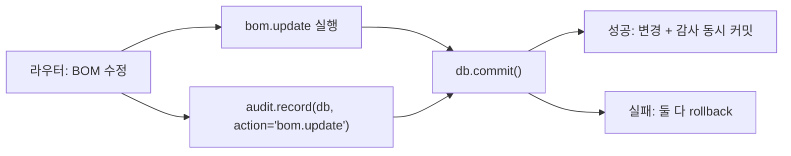

type: code-note
status: active
updated: 2026-05-21
project: DEXCOWIN MES
---

# 🔐 audit.py — 마스터 변경 감사 로그

> [!summary]
> 품목·직원·BOM·설정·코드 등 **마스터/설정 변경**만 `AdminAuditLog` 에 기록하는 헬퍼. 재고 변동은 `TransactionLog` 가 별도로 담당하므로 이 모듈에서 다루지 않는다. `db.add` 만 수행하고 commit 은 호출자(라우터) 가 책임진다.

---

## 1. 한 문장 목적

관리자가 마스터 데이터를 변경할 때 누가, 언제, 무엇을 바꿨는지 원자적으로 기록한다.

---

## 2. 파일 위치 & 임포트 경로

```
erp/backend/app/services/audit.py
from app.services import audit
```

---

## 3. API 전체

```python
def record(
    db: Session,
    *,
    action: str,            # "bom.update", "item.delete" 등 도메인.동작 형식
    target_type: str,       # "bom", "item", "employee", "settings", "codes"
    target_id: Optional[str] = None,        # 대상 오브젝트 ID (문자열)
    payload_summary: Optional[str] = None,  # "qty 3 → 5" 같은 변경 요약
    request: Optional[Request] = None,      # FastAPI Request (X-Request-Id 추출)
    actor_pin_role: str = "admin",          # 작업자 역할 구분
) -> AdminAuditLog:
    """AdminAuditLog row 를 db.add. commit 은 호출자 책임."""
```

---

## 4. 사용 패턴

```python
# 라우터 안에서 사용 예시
from app.services import audit

audit.record(
    db,
    request=request,
    action="bom.update",
    target_type="bom",
    target_id=str(bom_id),
    payload_summary=f"qty {old} → {new}",
)
db.commit()  # audit + 실제 변경이 한 트랜잭션으로 묶임
```

---

## 5. 원자성 보장



> [!note]
> `audit.record` 는 `db.add` 만 하고 즉시 반환한다. 라우터의 `db.commit()` 과 한 트랜잭션이므로 실패 시 감사 기록도 같이 롤백되어 잘못된 기록을 남기지 않는다.

---

## 6. AdminAuditLog 컬럼

| 컬럼 | 설명 |
|------|------|
| `audit_id` | UUID PK |
| `actor_pin_role` | 작업자 역할 (기본 "admin") |
| `action` | `"bom.update"`, `"item.create"` 등 |
| `target_type` | `"bom"`, `"item"`, `"employee"` 등 |
| `target_id` | 대상 오브젝트 ID (문자열) |
| `payload_summary` | 변경 내용 요약 |
| `request_id` | X-Request-Id (미들웨어가 발급) |
| `created_at` | 기록 시각 |

---

## 7. 재고 감사와의 분리

| 감사 종류 | 테이블 | 담당 모듈 |
|-----------|--------|----------|
| 마스터/설정 변경 | `admin_audit_logs` | `services/audit.py` |
| 재고 변동 | `transaction_logs` | `services/inventory.py` 경유 |
| CSV 미러 | `data/audit_csv/` | `services/audit_csv.py` |

---

## 8. 의존 관계

```
audit.py
  ← models (AdminAuditLog)
  ← fastapi (Request — X-Request-Id 추출)
  호출자: 모든 마스터 변경 라우터 (bom, items, employees, codes, settings)
```

---

## 9. 관련 노트 링크

- [[audit_csv.py]] — TransactionLog 의 CSV 미러
- [[models.py]] — AdminAuditLog ORM 정의
- [[main.py]] — X-Request-Id 미들웨어
