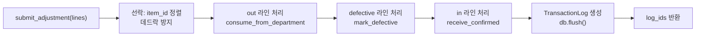

type: code-note
status: active
updated: 2026-05-21
project: DEXCOWIN MES
---

# 🔧 dept_adjustment.py — 부서 재고 조정 & 불량 처리

> [!summary]
> 부서 PRODUCTION 재고끼리만 움직이는 생산·조립·분해·수량 보정 서비스. 창고 승인 불필요, 부서 정/부 결재 후 즉시 처리. 처리 순서는 **out → defective → in** (소비 먼저, 입고 마지막) 으로 고정된다.

---

## 1. 한 문장 목적

생산(PRODUCE), 분해(DISASSEMBLE), 수량 보정(CORRECTION) 등 부서 내부 재고 조정을 원자적으로 처리하며 TransactionLog 를 남긴다.

---

## 2. 파일 위치 & 임포트 경로

```
erp/backend/app/services/dept_adjustment.py
from app.services import dept_adjustment as dept_adj_svc
```

---

## 3. sub_type 분류

| DeptAdjSubTypeEnum | 설명 | out 라인 | in 라인 |
|---|---|---|---|
| `production` | 생산/조립 | 구성품 차감 | 결과품 적재 |
| `disassembly` | 분해/회수 | 완성품 차감 | 구성품 적재 |
| `correction` | 수량 보정 | 과잉 분 차감 | 부족 분 적재 |

---

## 4. 결재 라우팅 (⚠️ 위험지대 3번)

> [!danger] 위험지대 3번 — 부서 결재 라우팅
> `dept_adjustment` 는 **창고 승인 없음** 원칙이지만, `io.py` 의 `_submit_dept_only_approval` 경로를 통해 부서 정/부 결재가 붙는 경우가 있다.
> - manual / adjust_in / adjust_out origin 라인 → `MANUAL_ADJUSTMENT` StockRequest → 부서 결재
> - 결재자가 부서 정/부 또는 admin 이면 자가승인 → 즉시 실행

---

## 5. 처리 순서



---

## 6. TransactionType 매핑

```python
_TRANSACTION_TYPE_MAP = {
    ("out", "production"):  TransactionTypeEnum.BACKFLUSH,
    ("out", "disassembly"): TransactionTypeEnum.DISASSEMBLE,
    ("out", "correction"):  TransactionTypeEnum.ADJUST,
    ("in",  "production"):  TransactionTypeEnum.PRODUCE,
    ("in",  "disassembly"): TransactionTypeEnum.RECEIVE,
    ("in",  "correction"):  TransactionTypeEnum.ADJUST,
    ("defective", "*"):     TransactionTypeEnum.MARK_DEFECTIVE,
}
```

---

## 7. 핵심 코드 발췌

```python
def submit_adjustment(db, sub_type, lines, *, operator_name=None, ...):
    """out → defective → in 순서 보장 (소비 먼저)."""
    if not _is_sqlite:
        inventory_svc.lock_inventories(db, sorted({ln.item_id for ln in lines}))

    ordered = (
        [ln for ln in lines if ln.direction == "out"]
        + [ln for ln in lines if ln.direction == "defective"]
        + [ln for ln in lines if ln.direction == "in"]
    )
    for ln in ordered:
        if ln.direction == "out":
            inv = inventory_svc.consume_from_department(db, ln.item_id, qty, dept)
        elif ln.direction == "in":
            inv = inventory_svc.receive_confirmed(db, ln.item_id, qty,
                                                   bucket="production", dept=dept)
        elif ln.direction == "defective":
            inv = inventory_svc.mark_defective(db, ln.item_id, qty,
                                                source="production",
                                                source_dept=dept, target_dept=dept)
        # TransactionLog 생성
        db.add(TransactionLog(...))
        db.flush()
```

---

## 8. BOM 템플릿 빌더

| 함수 | 목적 |
|------|------|
| `build_production_template(db, item_id, qty)` | 생산: BOM 구성품 out + 결과품 in 라인 |
| `build_disassembly_template(db, item_id, qty)` | 분해: 완성품 out + BOM 구성품 in 라인 |
| `expand_component(db, item_id, qty, dept, dir)` | 중간공정품 1단계 선택 전개 |

```python
def build_production_template(db, item_id, qty, *, base_dept=None):
    """생산 초기 라인 세트:
    BOM 직계 구성품 → direction="out"
    결과품 → direction="in" (마지막 라인)
    """
```

---

## 9. AdjLine 데이터 구조

```python
@dataclass
class AdjLine:
    item_id: uuid.UUID
    direction: Literal["in", "out", "defective"]
    quantity: Decimal
    department: DepartmentEnum
    reason: Optional[str]
    bom_expected: Optional[Decimal]   # BOM 기대값 (차이 분석용)
    has_children: bool
    item_name: str
    item_code: Optional[str]
    process_type_code: Optional[str]
    unit: str
```

---

## 10. 의존 관계

```
dept_adjustment.py
  ← models (BOM, TransactionLog, DeptAdjSubTypeEnum, ...)
  ← services/inventory (consume_from_department, receive_confirmed, mark_defective, lock_inventories)
  호출자: dept_adjustment 라우터
```

---

## 11. 관련 노트 링크

- [[inventory.py]] — 실제 재고 변경 함수
- [[bom.py]] — BOM 전개 (direct_children 사용)
- [[models.py]] — DeptAdjSubTypeEnum, TransactionTypeEnum
