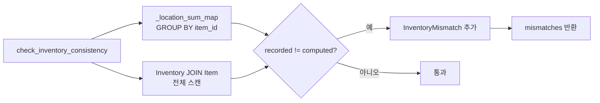

type: code-note
status: active
updated: 2026-05-21
project: DEXCOWIN MES
---

# 🔍 integrity.py — 재고 불변식 점검·복구

> [!summary]
> `Inventory.quantity == warehouse_qty + Σ InventoryLocation.quantity` 불변식이 깨진 행을 탐지하고 선택적으로 복구하는 도구. 정상 운영 중에는 `inventory._sync_total` 이 불변식을 유지하지만, 과거 버그나 외부 스크립트로 어긋난 데이터를 복구할 때 사용한다.

---

## 1. 한 문장 목적

전체 Inventory 행을 스캔해 불변식 위반을 찾고, `dry_run=False` 옵션으로 실제 수정까지 수행한다.

---

## 2. 파일 위치 & 임포트 경로

```
erp/backend/app/services/integrity.py
from app.services import integrity as integrity_svc
```

---

## 3. 핵심 함수

| 함수 | 설명 | DB 쓰기 |
|------|------|---------|
| `check_inventory_consistency(db)` | 불일치 행 목록 반환 | 없음 |
| `repair_inventory_totals(db, dry_run=True)` | 불일치 행 재계산·수정 | dry_run=False 일 때만 |

---

## 4. 탐지 로직

```python
def check_inventory_consistency(db) -> list[InventoryMismatch]:
    loc_sums = _location_sum_map(db)   # 한 번에 GROUP BY

    rows = db.query(Inventory, Item).outerjoin(Item, ...).all()
    for inv, item in rows:
        computed = inv.warehouse_qty + loc_sums.get(inv.item_id, 0)
        if inv.quantity != computed:
            mismatches.append(InventoryMismatch(
                recorded_total=inv.quantity,
                computed_total=computed,
                delta=inv.quantity - computed,   # 양수=과다, 음수=과소
                ...
            ))
```



---

## 5. 복구 로직

```python
def repair_inventory_totals(db, *, dry_run=True) -> RepairReport:
    for inv in db.query(Inventory).all():
        computed = inv.warehouse_qty + loc_sums.get(inv.item_id, 0)
        if inv.quantity != computed:
            mismatched += 1
            if not dry_run:
                inv.quantity = computed   # 덮어쓰기
                repaired += 1
    if not dry_run and repaired:
        db.commit()   # 이 함수 내부에서만 commit
    return RepairReport(checked, mismatched, repaired, dry_run, samples)
```

> [!warning]
> `repair_inventory_totals` 는 내부에서 직접 `db.commit()` 을 호출하는 유일한 서비스 함수다. 라우터의 트랜잭션 밖에서 독립적으로 실행된다.

---

## 6. 반환 데이터 구조

```python
@dataclass
class InventoryMismatch:
    item_id: uuid.UUID
    item_code: Optional[str]
    item_name: Optional[str]
    recorded_total: Decimal   # DB의 Inventory.quantity
    computed_total: Decimal   # warehouse + loc_sum
    warehouse_qty: Decimal
    location_sum: Decimal
    pending_quantity: Decimal

    @property
    def delta(self) -> Decimal:
        return self.recorded_total - self.computed_total
        # 양수 = quantity 가 과다 / 음수 = quantity 가 과소

@dataclass
class RepairReport:
    checked: int      # 전체 Inventory 행 수
    mismatched: int   # 불일치 행 수
    repaired: int     # 실제 수정된 행 수 (dry_run=True 면 항상 0)
    dry_run: bool
    samples: list[dict]   # 불일치 샘플 최대 20개
```

---

## 7. 운영 사용 흐름

1. `GET /api/settings/inventory/check` → `check_inventory_consistency` 호출 → 불일치 목록 확인
2. `/health/detailed` 에서도 `check_inventory_consistency` 를 호출해 `inventory_mismatch_count` 를 노출한다
3. 불일치 발견 시 `POST /api/settings/inventory/repair?dry_run=true` 로 사전 확인 후 `dry_run=false` 로 실제 복구

---

## 8. 의존 관계

```
integrity.py
  ← models (Inventory, InventoryLocation, Item)
  호출자: main.py (/health/detailed), settings 라우터 (/inventory/check, /repair)
```

---

## 9. 주의 사항

> [!note]
> `_location_sum_map` 은 GROUP BY 로 전체 item 의 location 합을 한 번에 읽는다. 이 함수 호출 후 즉시 Inventory 목록을 스캔하므로, 중간에 다른 트랜잭션이 재고를 바꾸면 결과가 inconsistent 할 수 있다. 복구는 점검 직후 시스템 유휴 시간에 실행하는 것이 안전하다.

---

## 10. 관련 노트 링크

- [[inventory.py]] — `_sync_total` 불변식 유지자
- [[main.py]] — `/health/detailed` 에서 호출
- [[models.py]] — Inventory, InventoryLocation ORM 정의
