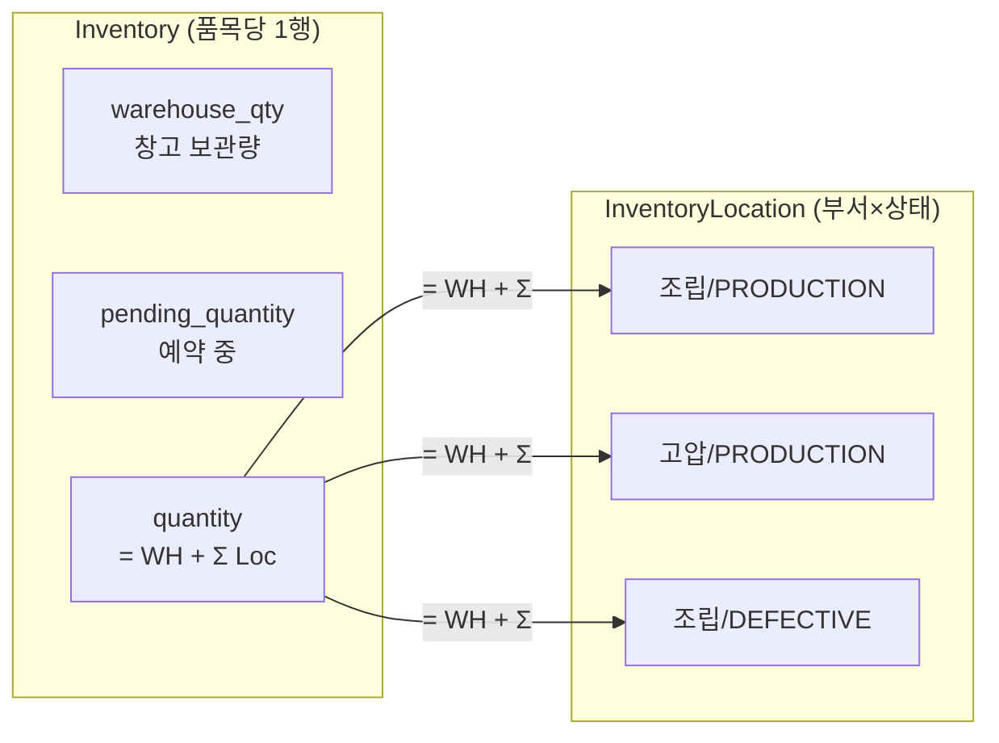

type: code-note
status: active
updated: 2026-05-21
project: DEXCOWIN MES
---

# 🏭 inventory.py — 3-Bucket 재고 핵심 서비스

> [!summary]
> 모든 재고 변경의 **유일한 진입점**. 창고(warehouse) · 생산(production) · 불량(defective) 3개 버킷을 관리하며, `_sync_total` 이 매 변경마다 `Inventory.quantity` 불변식을 자동 유지한다.

---

## 1. 한 문장 목적

재고를 건드리는 모든 경로(입고·출고·이동·불량·예약)가 이 모듈의 함수를 통하도록 강제해, 3-bucket 불변식을 단일 지점에서 보장한다.

---

## 2. 파일 위치 & 임포트 경로

```
erp/backend/app/services/inventory.py
from app.services import inventory as inventory_svc
```

---

## 3. 3-Bucket 불변식 (⚠️ 위험지대 1번)

> [!danger] 위험지대 1번 — 불변식 파괴 절대 금지
> ```
> Inventory.quantity == warehouse_qty + Σ InventoryLocation.quantity
> ```
> 이 등식이 깨지면 UI 재고와 실재고가 달라진다. `warehouse_qty` 나 `InventoryLocation.quantity` 를 서비스 함수 밖에서 직접 수정하면 안 된다.



---

## 4. 주요 함수 목록

| 함수 | 역할 | 총량 변동 |
|------|------|----------|
| `receive_confirmed` | 입고 (창고 or 부서 PRODUCTION) | +qty |
| `consume_pending` | 배치 OUT confirm (warehouse) | −qty |
| `consume_warehouse` | 창고 직접 차감 (backflush) | −qty |
| `consume_from_department` | 부서 PRODUCTION 차감 | −qty |
| `transfer_to_production` | 창고→부서 이동 | 0 |
| `transfer_to_warehouse` | 부서→창고 복귀 | 0 |
| `transfer_between_departments` | 부서간 이동 | 0 |
| `mark_defective` | 불량 등록 (위치 이동) | 0 |
| `return_to_supplier` | 공급업체 반품 | −qty |
| `reserve` | 창고 예약 (pending↑) | 0 |
| `release` | 예약 해제 (pending↓) | 0 |
| `adjust_warehouse` | 창고 절대값 조정 | ±delta |
| `lock_inventories` | 다품목 일괄 선락 | — |

---

## 5. 핵심 코드 발췌

```python
def _sync_total(db: Session, inv: Inventory) -> None:
    """Inventory.quantity = warehouse_qty + Σ InventoryLocation.quantity.

    이미 잠긴 Inventory 객체를 직접 받아 재조회 없이 갱신한다.
    autoflush=False 이므로 SUM 쿼리 전에 명시적으로 flush 한다.
    """
    db.flush()
    loc_sum = (
        db.query(func.coalesce(func.sum(InventoryLocation.quantity), 0))
        .filter(InventoryLocation.item_id == inv.item_id)
        .scalar()
    ) or 0
    inv.quantity = (inv.warehouse_qty or Decimal("0")) + Decimal(str(loc_sum))


def reserve(db, item_id, qty, *, employee=None, employee_name=None):
    """원자적 조건부 UPDATE — check-then-act 경쟁 없음."""
    result = db.execute(
        sa_update(Inventory)
        .where(
            Inventory.item_id == item_id,
            Inventory.warehouse_qty - Inventory.pending_quantity >= qty,
        )
        .values(pending_quantity=Inventory.pending_quantity + qty)
        .execution_options(synchronize_session=False)
    )
    if result.rowcount == 0:
        raise ValueError("창고 가용 재고 부족 ...")
```

---

## 6. 락 전략

> [!info] PostgreSQL vs SQLite
> - PostgreSQL: `with_for_update()` → 행 수준 잠금. 같은 item_id 트랜잭션이 동시에 오면 하나가 대기.
> - SQLite: `_is_sqlite=True` 이면 `with_for_update()` 생략. WAL + BEGIN IMMEDIATE 가 직렬화 보장.
> - 다품목: `lock_inventories()` 가 **item_id 정렬** 순서로 일괄 선락 → 데드락 방지.

---

## 7. 가용 재고 공식

```
available          = warehouse_qty + production_total − pending_quantity
warehouse_available = warehouse_qty − pending_quantity   ← BOM 검사용
```

`available()` 함수는 `db` 인자를 주면 production_total 을 실시간 계산, 없으면 창고만으로 안전하게 반환한다.

---

## 8. PROCESS_TYPE_TO_DEPT 매핑

```python
# 18개 공정코드 중 A/F 시리즈만 부서 매핑
# R 시리즈(원자재) → None (warehouse fallback)
PROCESS_TYPE_TO_DEPT = {
    "TA": DepartmentEnum.TUBE,   "TF": DepartmentEnum.TUBE,
    "HA": DepartmentEnum.HIGH_VOLTAGE, "HF": DepartmentEnum.HIGH_VOLTAGE,
    "VA": DepartmentEnum.VACUUM,  "VF": DepartmentEnum.VACUUM,
    "NA": DepartmentEnum.TUNING,  "NF": DepartmentEnum.TUNING,
    "AA": DepartmentEnum.ASSEMBLY,"AF": DepartmentEnum.ASSEMBLY,
    "PA": DepartmentEnum.SHIPPING,"PF": DepartmentEnum.SHIPPING,
}
```

---

## 9. 의존 관계

```
inventory.py
  ← models (Inventory, InventoryLocation, DepartmentEnum, LocationStatusEnum)
  ← database (_is_sqlite)
  호출자: stock_requests.py / io.py / dept_adjustment.py
  점검자: integrity.py
```

---

## 10. 주의 사항 / 알려진 위험

> [!warning]
> 1. `autoflush=False` — `_sync_total` 내부에 flush 가 있지만, 외부에서 `warehouse_qty` 를 바꾼 뒤 flush 없이 `_sync_total` 을 부르면 틀린 합을 읽는다.
> 2. `consume_pending` 은 `warehouse_qty` 와 `pending_quantity` 를 **동시에** 차감 — 둘 중 하나만 차감하면 불변식 파괴.
> 3. `return_to_supplier` 는 DEFECTIVE 버킷을 줄이고 `_sync_total` 호출 → 총량 감소(불량 재고가 외부로 나가는 유일한 경로).

---

## 11. 관련 노트 링크

- [[models.py]] — Inventory, InventoryLocation ORM 정의
- [[integrity.py]] — 불변식 점검·복구
- [[stock_math.py]] — StockFigures 계산 공식
- [[stock_requests.py]] — 배치 상태머신 (approve 시 inventory 함수 호출)
