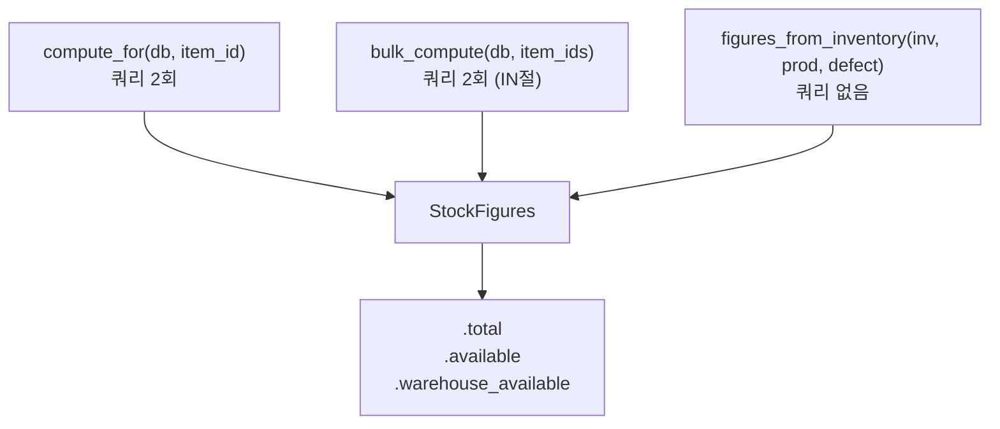

type: code-note
status: active
updated: 2026-05-21
project: DEXCOWIN MES
---

# 📐 stock_math.py — 재고 계산 공식 단일 소스

> [!summary]
> 여러 라우터가 각자 `wh + prod - pending` 식을 직접 계산하던 것을 여기로 통합했다. `StockFigures` dataclass 와 `compute_for` / `bulk_compute` 함수가 UI에 노출되는 모든 재고 수치의 단일 진실(source of truth)이다.

---

## 1. 한 문장 목적

재고 수치 계산 로직을 한 곳에 모아 수식 불일치를 방지한다.

---

## 2. 파일 위치 & 임포트 경로

```
erp/backend/app/services/stock_math.py
from app.services import stock_math as stock_math_svc
from app.services.stock_math import StockFigures, compute_for, bulk_compute
```

---

## 3. 용어 정의

| 용어 | 정의 |
|------|------|
| `warehouse_qty` | 창고 재고 (Inventory.warehouse_qty) |
| `production_total` | 모든 부서 PRODUCTION 버킷 합계 |
| `defective_total` | 모든 부서 DEFECTIVE 버킷 합계 |
| `pending` | 배치 OUT 예약 중 (warehouse 대비) |
| `total` | warehouse + production + defective — Inventory.quantity 와 일치해야 함 |
| `available` | warehouse + production − pending — UI 노출 가용 재고 |
| `warehouse_available` | warehouse − pending — BOM feasibility / 창고 출고 검사용 |

---

## 4. StockFigures 공식

```python
@dataclass(frozen=True)
class StockFigures:
    warehouse_qty: Decimal = _D0
    production_total: Decimal = _D0
    defective_total: Decimal = _D0
    pending: Decimal = _D0

    @property
    def total(self) -> Decimal:
        """wh + prod + defect. Inventory.quantity 불변식과 일치해야 함."""
        return self.warehouse_qty + self.production_total + self.defective_total

    @property
    def available(self) -> Decimal:
        """UI 에 노출되는 가용 재고: warehouse + production - pending. 불량 제외."""
        return self.warehouse_qty + self.production_total - self.pending

    @property
    def warehouse_available(self) -> Decimal:
        """창고 소비 가능분: warehouse - pending. BOM backflush / 창고 출고 검사용."""
        return self.warehouse_qty - self.pending
```

---

## 5. 주요 함수



| 함수 | 쿼리 수 | 용도 |
|------|---------|------|
| `compute_for` | 2 | 단건 품목 재고 계산 |
| `bulk_compute` | 2 (IN절) | 목록 페이지 N개 품목 일괄 계산 |
| `figures_from_inventory` | 0 | 이미 조회된 Inventory 로 포장만 |

---

## 6. bulk_compute 내부 흐름

```python
def bulk_compute(db, item_ids):
    # 1) Inventory IN 쿼리 → {item_id: Inventory}
    invs = {inv.item_id: inv for inv in db.query(Inventory)
            .filter(Inventory.item_id.in_(ids)).all()}

    # 2) InventoryLocation GROUP BY item_id, status
    agg_rows = db.query(InventoryLocation.item_id, InventoryLocation.status,
                        func.coalesce(func.sum(...), 0))
               .group_by(item_id, status).all()

    # prod_by_id / defect_by_id 에 분류 후 StockFigures 조립
```

N개 품목을 처리하더라도 쿼리는 항상 2회만 나간다.

---

## 7. 의존 관계

```
stock_math.py
  ← models (Inventory, InventoryLocation, LocationStatusEnum)
  호출자: 라우터(items, inventory 목록), capacity 검사
```

---

## 8. 주의 사항

> [!warning]
> `available` 은 불량을 제외한다. 불량까지 포함한 총량을 원하면 `.total` 을 사용한다.
> BOM feasibility 검사(생산/창고 출고 가능 여부)는 반드시 `warehouse_available` 을 사용해야 한다.

---

## 9. 관련 노트 링크

- [[inventory.py]] — 실제 재고 변경 함수
- [[models.py]] — Inventory, InventoryLocation ORM 정의
