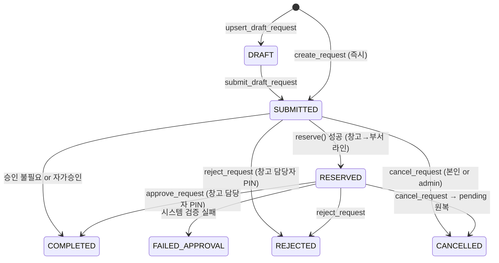

type: code-note
status: active
updated: 2026-05-21
project: DEXCOWIN MES
---

# 📋 stock_requests.py — 배치 상태머신 & 결재 흐름

> [!summary]
> 작업자가 재고 이동을 **요청**하고 창고/부서 담당자가 **승인**하면 실재고가 반영되는 2단계 결재 흐름의 핵심. DRAFT → SUBMITTED → RESERVED → COMPLETED 상태 전이를 관리하며, 창고가 관여하는 모든 작업은 PIN 검증된 승인자 없이 재고를 건드리지 않는다.

---

## 1. 한 문장 목적

창고 재고가 움직이는 작업은 창고 담당자(또는 부서 정/부), PIN 검증 후에만 실재고 반영하는 결재 상태머신을 구현한다.

---

## 2. 파일 위치 & 임포트 경로

```
erp/backend/app/services/stock_requests.py
from app.services import stock_requests as stock_request_svc
```

---

## 3. 상태 전이도



---

## 4. 요청 유형 & 허용 bucket 조합

| request_type | from_bucket | to_bucket | 부서 필수 |
|---|---|---|---|
| RAW_RECEIVE | NONE | WAREHOUSE | — |
| RAW_SHIP | WAREHOUSE | NONE | — |
| WAREHOUSE_TO_DEPT | WAREHOUSE | PRODUCTION | to_dept |
| DEPT_TO_WAREHOUSE | PRODUCTION | WAREHOUSE | from_dept |
| DEPT_INTERNAL | PRODUCTION | PRODUCTION | 양쪽 |
| MARK_DEFECTIVE_WH | WAREHOUSE | DEFECTIVE | to_dept |
| MARK_DEFECTIVE_PROD | PRODUCTION | DEFECTIVE | 양쪽 |
| SUPPLIER_RETURN | DEFECTIVE | NONE | from_dept |
| PACKAGE_OUT | WAREHOUSE | NONE | — |
| MANUAL_ADJUSTMENT | 자유 | 자유 | 부서 결재만 |

---

## 5. 핵심 코드 발췌

```python
def _finalize_submission(db, *, request, requester, now):
    """제출 시점 분기:
    - 승인 불필요 or 자가승인 → _execute_all_lines + COMPLETED
    - WAREHOUSE from 라인 있음 → reserve() + RESERVED
    - 나머지 → SUBMITTED
    """
    warehouse_ok = (not request.requires_warehouse_approval) or is_admin or \
                   requester_role in ("primary", "deputy")
    dept_ok = (not request.requires_department_approval) or is_admin or \
              requester_dept_role in ("primary", "deputy")
    if warehouse_ok and dept_ok:
        _execute_all_lines(db, request, lines, ...)
        request.status = StockRequestStatusEnum.COMPLETED
        return request
    # pending 예약이 필요한 라인 처리
    if pending_lines:
        for item_id, qty in agg.items():
            inventory_svc.reserve(db, item_id, qty, employee=requester)
        request.status = StockRequestStatusEnum.RESERVED
    else:
        request.status = StockRequestStatusEnum.SUBMITTED
```

```python
def approve_request(db, request, *, approver, pin):
    """창고 담당자 승인. PIN 검증 + 재고 이동 + TransactionLog 한 트랜잭션."""
    role = (approver.warehouse_role or "none").lower()
    if role not in ("primary", "deputy"):
        raise PermissionError("창고 담당자만 승인할 수 있습니다.")
    if not verify_pin(approver.pin_hash, pin):
        raise PermissionError("PIN이 일치하지 않습니다.")
    try:
        _execute_all_lines(db, request, list(request.lines), ..., is_approval=True)
    except ValueError as exc:
        raise FailedApprovalError(str(exc))
    request.status = StockRequestStatusEnum.COMPLETED
```

---

## 6. 승인 정책

> [!info] 승인이 필요한 조건
> `from_bucket == WAREHOUSE` 또는 `to_bucket == WAREHOUSE` 인 라인이 하나라도 있으면 → 창고 담당자 승인 필요
>
> `PRODUCTION ↔ PRODUCTION` (DEFECTIVE 포함) 라인만 있으면 → 즉시 실행

> [!info] 부서 결재 (MANUAL_ADJUSTMENT)
> `manual / adjust_in / adjust_out` origin 라인이 포함된 IO batch → `requires_department_approval=True`
> 부서 정/부(department_role) 또는 admin 이 PIN 승인 후 실재고 반영

---

## 7. request_code 형식

```
SR-YYYYMMDD-HHMMSS-XXXXXXXX
예: SR-20260521-143022-A3F8B2C1
```

8자리 랜덤 hex (32비트 엔트로피). unique constraint 충돌 시 라우터가 1회 retry.

---

## 8. 사용자 정의 예외

```python
class FailedApprovalError(Exception):
    """승인 시점 시스템 검증 실패. 라우터가 catch → 별도 트랜잭션으로 status 기록."""

class RequestNotFoundError(LookupError):
    """request_id 가 존재하지 않을 때."""
```

---

## 9. 의존 관계

```
stock_requests.py
  ← models (StockRequest, StockRequestLine, StockRequestStatusEnum, ...)
  ← services/inventory (reserve, release, execute_line)
  ← services/pin_auth (verify_pin)
  ← services/io (sync_batch_from_stock_request — 역방향 호출)
  호출자: io.py (_submit_approval), stock_requests 라우터
```

---

## 10. 주의 사항

> [!warning]
> 1. DRAFT 저장 중에는 `inventory_svc.*` 호출 절대 금지. DRAFT는 재고에 영향을 주지 않는다.
> 2. `FailedApprovalError` 발생 시 라우터가 rollback 후 별도 트랜잭션에서 `mark_failed_approval` 을 호출해 status 기록. pending 은 그 안에서 원복된다.
> 3. 부서간 이동(`DEPT_INTERNAL`) 잠금 순서: `from_dept` 와 `to_dept` 를 이름 정렬 후 선락 → 데드락 방지.

---

## 11. 관련 노트 링크

- [[inventory.py]] — reserve / release / execute 실행자
- [[io.py]] — IoBatch ↔ StockRequest 연결
- [[models.py]] — StockRequest, StockRequestLine ORM
