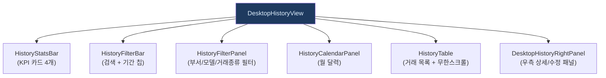
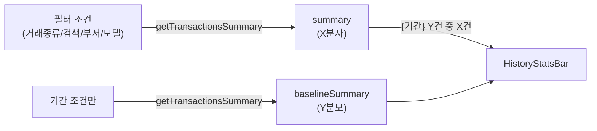
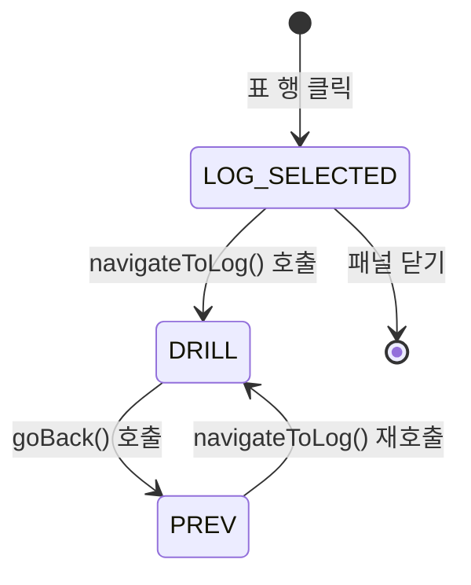

# DesktopHistoryView.tsx — 입출고 내역 탭

#layer/frontend #topic/component #topic/legacy

> [!summary] 한 줄 요약
> 입출고 내역 탭의 최상위 컴포넌트. 거래 목록(무한스크롤) + KPI 박스 + 달력 패널 + 필터 패널 + 우측 상세 패널로 구성된다. `productionApi.getTransactionsSummary` 로 KPI 를 별도 집계한다.

---

## 1. 위치 & 관계

| 항목 | 내용 |
|------|------|
| 원본 | `erp/frontend/app/legacy/_components/DesktopHistoryView.tsx` |
| 레이어 | frontend / component |
| `"use client"` | O |
| 소비자 | [[erp/frontend/app/legacy/_components/DesktopLegacyShell.tsx]] |



---

## 2. 핵심 상태

| 상태 | 타입 | 설명 |
|------|------|------|
| `logs` | `TransactionLog[]` | 거래 목록 (무한스크롤) |
| `selection` | `HistorySelection \| null` | 선택된 단건(`log`) 또는 배치(`batch`) |
| `selectionStack` | `HistorySelection[]` | 우측 패널 내 드릴 뒤로가기 스택 |
| `summary` | `TransactionSummary` | 현재 필터 기준 KPI (X분자) |
| `baselineSummary` | `TransactionSummary` | 기간만 적용한 전체 KPI (Y분모) |
| `batchCache` | `Map<string, IoBatch>` | 배치 상세 캐시 (HistoryTable 공유) |
| `filterPanelOpen` | `boolean` | 필터 패널 열림 상태 |
| `calendarOpen` | `boolean` | 달력 패널 열림 상태 |
| `calendarLogs` | `TransactionLog[]` | 달력용 해당 월 전체 거래 |

---

## 3. 이중 summary 패턴



- `summary`: 모든 필터 적용 → "현재 조건에 맞는 거래 수"
- `baselineSummary`: 기간 필터만 적용 → "이 기간 전체 거래 수" (베이스라인)

두 summary 모두 `AbortController` 로 취소 가능하며, 필터 변경 시 이전 요청을 취소한다.

---

## 4. 코드 발췌

```tsx
// KPI summary — 현재 필터 적용
useEffect(() => {
  const transactionTypes = opParam || undefined;
  const dateFrom = selectedDay ?? dateFilterToFrom(dateFilter);
  // ... 파라미터 빌딩

  const ctrl = new AbortController();
  void productionApi
    .getTransactionsSummary(params, { signal: ctrl.signal })
    .then((s) => {
      if (summaryKeyRef.current !== myKey) return; // stale 응답 무시
      setSummary(s);
    })
    .catch((err) => {
      if ((err as Error)?.name === "AbortError") return;
    });
  return () => ctrl.abort(); // 클린업
}, [dateFilter, selectedDay, debouncedSearch, deptParam, modelParam, opParam]);
```

---

## 5. 우측 패널 드릴 네비게이션



```typescript
// 드릴 — 현재 선택을 스택에 쌓고 새 항목으로 이동
function navigateToLog(log: TransactionLog) {
  setSelection((cur) => {
    if (cur && !(cur.kind === "log" && cur.log.log_id === log.log_id)) {
      setSelectionStack((s) => [...s, cur]);
      window.history.pushState({ historyDrill: true }, "");
    }
    return { kind: "log", log };
  });
}

// 뒤로가기 — 스택 pop
function goBack() {
  setSelectionStack((s) => {
    if (s.length === 0) return s;
    const prev = s[s.length - 1];
    setSelection(prev);
    return s.slice(0, -1);
  });
}
```

브라우저 뒤로가기 버튼도 `popstate` 이벤트로 같은 `goBack()` 을 호출한다.

---

## 6. 달력 패널

- 기본 접힘. 버튼 클릭 시 펼침.
- 펼쳐진 동안만 해당 달의 전체 거래를 fetch.
- 다른 필터(거래종류/부서/모델)와 무관하게 그 달 전체 표시.
- 날짜 셀 클릭 → `selectedDay` 설정 → 목록 필터에 반영.

```typescript
useEffect(() => {
  if (!calendarOpen) return;
  const ctrl = new AbortController();
  void api.getTransactions(
    { limit: 2000, skip: 0, dateFrom: ymd(firstDay), dateTo: ymd(lastDay) },
    { signal: ctrl.signal },
  ).then(setCalendarLogs);
  return () => ctrl.abort();
}, [calendarOpen, calendarYear, calendarMonth]);
```

---

## 7. 거래 수정/보정

우측 패널(`DesktopHistoryRightPanel`)에서 수정 후 콜백으로 목록을 갱신:

```typescript
// 메타데이터 수정 (notes/ref/담당자)
function handleLogUpdated(updated: TransactionLog) {
  setLogs((prev) => prev.map((l) => (l.log_id === updated.log_id ? updated : l)));
  setSelection({ kind: "log", log: updated });
}

// 수량 보정 (원본 archived + 보정 거래 신규 생성)
function handleLogCorrected(result: { original: TransactionLog; correction: TransactionLog }) {
  setLogs((prev) => {
    const without = prev.filter((l) => l.log_id !== result.original.log_id);
    return [result.correction, result.original, ...without];  // 보정 먼저
  });
}
```

---

## 8. 필터 검색 디바운스

```typescript
const SEARCH_DEBOUNCE_MS = 350;

useEffect(() => {
  const t = setTimeout(() => setDebouncedSearch(search.trim()), SEARCH_DEBOUNCE_MS);
  return () => clearTimeout(t);
}, [search]);
```

`debouncedSearch` 가 `useHistoryData` 훅과 `getTransactionsSummary` 에 동시 전달된다.

---

## 9. 관련 파일

- [[erp/frontend/app/legacy/_components/DesktopLegacyShell.tsx]] — 부모 컴포넌트
- [[erp/frontend/lib/api/production.ts]] — getTransactions, getTransactionsSummary
- [[erp/frontend/lib/api.ts]] — api.getTransactions, api.getModels
- `erp/frontend/app/legacy/_components/_history_sections/HistoryTable.tsx`
- `erp/frontend/app/legacy/_components/_history_sections/DesktopHistoryRightPanel.tsx`
- [[erp/backend/app/routers/inventory.py]] — transactions 엔드포인트

---

## 10. 주의 사항

> [!warning] stale 응답 방지
> `summaryKeyRef.current !== myKey` 체크로 이전 fetch 응답이 늦게 도착해도 무시한다.
> `AbortController` 만으로는 이미 응답된 요청을 막지 못하므로 ref 키 비교가 필요.

> [!info] `batchCache` 공유
> `HistoryTable` 의 lazy batch fetch 와 우측 패널의 배치 상세 표시가 같은 `Map` 을 공유하여 중복 fetch 를 방지한다.

---

## 11. 정책

- `main` 브랜치: 코드만 유지
- `vault-sync` 브랜치: 코드 + `vault/` 노트
- 코드와 노트가 다르면 실제 코드 우선
