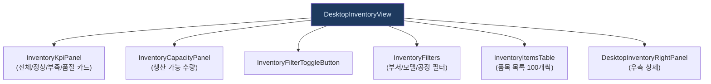
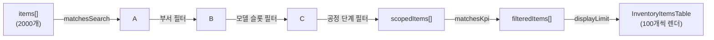

# DesktopInventoryView.tsx — 재고 대시보드 탭

#layer/frontend #topic/component #topic/legacy

> [!summary] 한 줄 요약
> 대시보드 탭의 최상위 컴포넌트. 재고 KPI 카드 + 생산 가능 수량 + 필터(부서/모델/공정) + 품목 테이블 + 우측 상세 패널로 구성된다. 안전재고 경고 수를 부모(`DesktopLegacyShell`)에 전달해 탭 배지를 갱신한다.

---

## 1. 위치 & 관계

| 항목 | 내용 |
|------|------|
| 원본 | `erp/frontend/app/legacy/_components/DesktopInventoryView.tsx` |
| 레이어 | frontend / component |
| `"use client"` | O |
| 소비자 | [[erp/frontend/app/legacy/_components/DesktopLegacyShell.tsx]] |



---

## 2. props

```typescript
{
  globalSearch: string;            // 탑바 전역 검색 (현재 "" 고정)
  onStatusChange: (msg) => void;   // 탑바 상태 메시지 갱신
  onGoToWarehouse: (item) => void; // 입출고 탭으로 품목 전달
  onGoToWarehouseTab?: () => void; // 입출고 탭으로 이동만 (품목 없음)
  onSummaryChange?: (s) => void;   // 탭 배지 경고 수 전달
  capacityData?: ProductionCapacity | null;
  onCapacityClick?: () => void;    // 생산 가능 모달 열기
}
```

---

## 3. 핵심 상태

| 상태 | 타입 | 설명 |
|------|------|------|
| `items` | `Item[]` | 전체 품목 목록 (2000개 한 번에 로드) |
| `selectedItem` | `Item \| null` | 우측 패널에 표시할 품목 |
| `itemLogs` | `TransactionLog[]` | 선택 품목 최근 거래 5건 |
| `selectedDepts` | `string[]` | 부서 필터 선택값 |
| `selectedModels` | `string[]` | 제품 모델 필터 선택값 |
| `selectedProcessSteps` | `string[]` | 공정 단계 필터 (R/A/F) |
| `kpi` | `KpiFilter` | KPI 카드 클릭 필터 (ALL/NORMAL/LOW/ZERO) |
| `localSearch` | `string` | 품목 검색어 (useDeferredValue) |
| `displayLimit` | `number` | 테이블 렌더 수 (100개씩 증가) |

---

## 4. 필터링 파이프라인



```typescript
const scopedItems = useMemo(
  () => items.filter((item) => {
    if (!matchesSearch(item, deferredLocalSearch)) return false;
    if (selectedDepts.length > 0) {
      const inDept = selectedDepts.some((d) =>
        d === "창고"
          ? (item.warehouse_qty ?? 0) > 0
          : item.department === d ||
            itemCodeDept(item.item_code) === d ||
            item.locations.some((loc) => loc.department === d),
      );
      if (!inDept) return false;
    }
    // 모델 슬롯 필터, 공정 단계 필터...
    return true;
  }),
  [items, deferredLocalSearch, selectedDepts, selectedSlots, showUnclassified, selectedProcessSteps],
);
const filteredItems = useMemo(() =>
  scopedItems.filter((item) => matchesKpi(item, kpi)),
  [scopedItems, kpi]
);
```

---

## 5. 코드 발췌 — KPI 카드 + 탭 배지 갱신

```tsx
// 훅에서 kpiCards, headerBadge, isFiltered, activeFilterCount 파생
const { isFiltered, activeFilterCount, kpiCards, headerBadge } = useDesktopInventoryDerivations({
  items, scopedItems, filteredItems, selectedDepts, selectedModels, selectedProcessSteps,
  deferredLocalSearch, displayItem, onSummaryChange,
});

// KPI 카드: 전체/정상/부족/품절
// KPI 클릭 시 해당 상태로 필터 적용 (ALL 클릭 시 모든 필터 초기화)
<InventoryKpiPanel
  cards={kpiCards}
  activeKey={kpi}
  onChange={(key) => {
    if (key === "ALL") resetAllFilters();
    else setKpi(key);
  }}
/>
```

`onSummaryChange?.({ low, zero })` 는 `useDesktopInventoryDerivations` 훅 내부에서 호출되며, 부모 `DesktopLegacyShell` 에 탭 배지 숫자를 전달한다.

---

## 6. 대시보드 → 입출고 탭 연결

```tsx
// 우측 패널의 "입출고" 버튼 클릭 시
<DesktopInventoryRightPanel
  onGoToWarehouse={onGoToWarehouse}  // 품목과 함께 입출고 탭으로
  ...
/>
// → DesktopLegacyShell.handleGoToWarehouse(item) 호출
// → setWarehousePreselected(item) + setActiveTab("warehouse")
```

---

## 7. useDeferredValue 적용

```typescript
const deferredLocalSearch = useDeferredValue(localSearch.trim().toLowerCase());
```

로컬 검색어를 `useDeferredValue` 로 지연시켜, 타이핑 중 테이블 재렌더가 UI 를 블록하지 않도록 한다. 2000개 품목 필터링이 있어 성능에 민감.

---

## 8. 품목 로드 훅

```typescript
// R7-HOOK2: useInventoryData 훅으로 분리
const { items, setItems, loading, error, loadItems } = useInventoryData({
  globalSearch, onStatusChange, onSelectedSync,
});

// onSelectedSync: items 갱신 시 selectedItem 을 최신값으로 동기화
const onSelectedSync = useCallback(
  (next: Item[]) =>
    setSelectedItem((current) =>
      current ? next.find((item) => item.item_id === current.item_id) ?? null : null,
    ),
  [],
);
```

---

## 9. 레이아웃 구조

```
DesktopInventoryView
├── 좌측 스크롤 컨테이너
│   ├── section.card (KPI + 생산가능 + 필터)
│   │   ├── InventoryKpiPanel
│   │   ├── InventoryCapacityPanel + InventoryFilterToggleButton
│   │   └── InventoryFilters (접이식)
│   └── section.card (품목 테이블)
│       ├── InventoryTableStickyHeader (검색 + 카운트)
│       └── InventoryItemsTable
└── DesktopInventoryRightPanel (우측 고정 패널)
```

---

## 10. 관련 파일

- [[erp/frontend/app/legacy/_components/DesktopLegacyShell.tsx]] — 부모 컴포넌트
- [[erp/frontend/lib/api.ts]] — api.getItems, api.getModels, api.getTransactions
- `erp/frontend/app/legacy/_components/_hooks/useInventoryData.ts`
- `erp/frontend/app/legacy/_components/_hooks/useDesktopInventoryDerivations.ts`
- `erp/frontend/app/legacy/_components/_inventory_sections/InventoryKpiPanel.tsx`
- [[erp/backend/app/routers/inventory.py]] — 품목/재고 엔드포인트

---

## 11. 정책

- `main` 브랜치: 코드만 유지
- `vault-sync` 브랜치: 코드 + `vault/` 노트
- 코드와 노트가 다르면 실제 코드 우선
