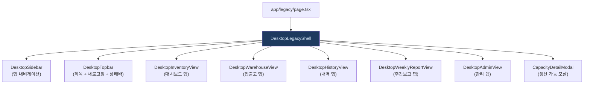
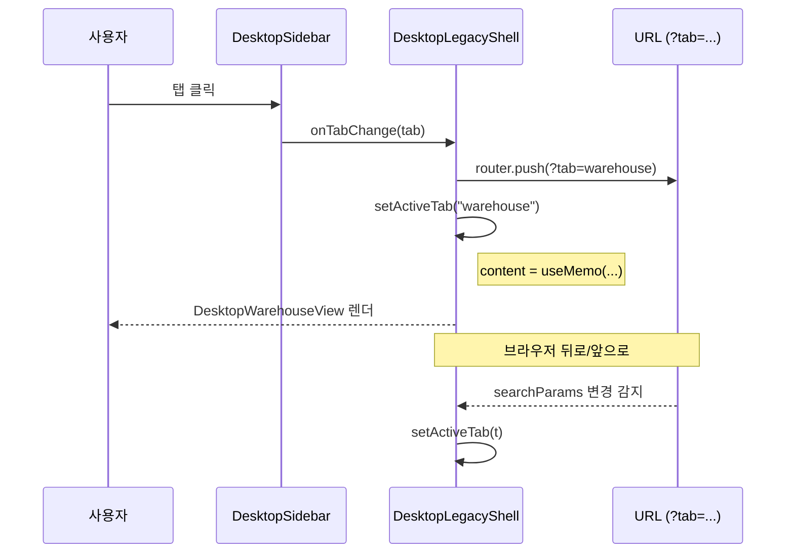

# DesktopLegacyShell.tsx — 데스크톱 메인 탭 진입점

#layer/frontend #topic/component #topic/legacy

> [!summary] 한 줄 요약
> 데스크톱 화면 전체를 감싸는 최상위 컴포넌트. 5개 탭(대시보드/입출고/내역/주간보고/관리)을 URL 파라미터(`?tab=`)와 동기화해 관리하고, 사이드바·탑바·탭별 뷰를 조합한다.

---

## 1. 위치 & 관계

| 항목 | 내용 |
|------|------|
| 원본 | `erp/frontend/app/legacy/_components/DesktopLegacyShell.tsx` |
| 레이어 | frontend / component |
| `"use client"` | O (클라이언트 컴포넌트) |
| 진입 경로 | `app/legacy/page.tsx` → `DesktopLegacyShell` |



---

## 2. 5개 탭 정의

```typescript
type DesktopTabId = "dashboard" | "warehouse" | "history" | "weekly" | "admin"

const TAB_META: Record<DesktopTabId, { title: string; icon: ElementType }> = {
  dashboard: { title: "대시보드",    icon: Boxes    },
  warehouse: { title: "입출고",      icon: Warehouse },
  history:   { title: "입출고 내역", icon: History   },
  weekly:    { title: "주간보고",    icon: BarChart2 },
  admin:     { title: "관리자",      icon: Settings2 },
};
```

---

## 3. 탭 전환 흐름



---

## 4. 핵심 상태

| 상태 | 타입 | 설명 |
|------|------|------|
| `activeTab` | `DesktopTabId` | 현재 활성 탭. URL `?tab=` 과 동기화 |
| `status` | `string` | 탑바 하단 상태 메시지 |
| `statusNonce` | `number` | 같은 메시지 재알림 트리거 |
| `refreshNonce` | `number` | 탭 재클릭 시 자식 컴포넌트 remount 트리거 |
| `weekMon` | `Date` | 주간보고 기준 주의 월요일 |
| `warehousePreselected` | `Item \| null` | 대시보드 → 입출고 탭 이동 시 전달할 품목 |
| `capacityData` | `ProductionCapacity \| null` | 생산 가능 수량 (폴링) |
| `stockWarnings` | `{low, zero} \| null` | 대시보드 탭 배지 숫자 |

---

## 5. 코드 발췌 — 핵심 로직

```tsx
// 탭 전환 + URL 동기화
function handleTabChange(tab: DesktopTabId) {
  if (tab === activeTab) {
    // 같은 탭 재클릭 → refreshNonce 증가로 자식 remount (admin 탭 제외)
    if (tab !== "admin") {
      setRefreshNonce((n) => n + 1);
    }
    return;
  }
  setActiveTab(tab);
  router.push(`?tab=${tab}`, { scroll: false });
}

// 브라우저 뒤로가기 대응
useEffect(() => {
  const t = searchParams.get("tab") as DesktopTabId | null;
  if (t && VALID_TABS.has(t) && t !== activeTab) {
    setActiveTab(t);
  }
}, [searchParams]);

// 생산 가능 수량 — 탭 전환 없이 window focus 마다 백그라운드 갱신
useEffect(() => {
  function handleFocus() { loadCapacity(); }
  window.addEventListener("focus", handleFocus);
  return () => window.removeEventListener("focus", handleFocus);
}, [loadCapacity]);

// 탭별 뷰 — key 로 remount 제어
const content = useMemo(() => {
  const key = activeTab === "admin" ? "admin" : `${activeTab}-${refreshNonce}`;
  // admin 탭은 key 고정 → 탭 재클릭해도 remount 안 함 (폼 입력 보호)
  if (activeTab === "dashboard") return <DesktopInventoryView key={key} ... />;
  if (activeTab === "warehouse") return <DesktopWarehouseView key={key} ... />;
  if (activeTab === "history")   return <DesktopHistoryView   key={key} />;
  if (activeTab === "weekly")    return <DesktopWeeklyReportView key={key} weekMon={weekMon} />;
  return <DesktopAdminView key={key} ... />;
}, [activeTab, refreshNonce, ...]);
```

---

## 6. 상태 메시지 자동 복원

```typescript
const handleStatusChange = useCallback((msg: string) => {
  setStatus(msg);
  setStatusNonce((n) => n + 1);

  // 에러/경고 키워드가 없으면 3초 후 기본 메시지로 복원
  const isSticky = /실패|못했습니다|오류|에러|부족|품절/.test(msg);
  if (!isSticky) {
    setTimeout(() => setStatus(DEFAULT_STATUS), 3000);
  }
}, []);
```

---

## 7. 대시보드 → 입출고 탭 연결

```typescript
// DesktopInventoryView 에서 품목 클릭 시 입출고 탭으로 이동
const handleGoToWarehouse = useCallback((item: Item) => {
  setWarehousePreselected(item);
  setActiveTab("warehouse");
}, []);

// DesktopWarehouseView 는 preselectedItem 을 받아 품목을 미리 선택
<DesktopWarehouseView preselectedItem={warehousePreselected} ... />
```

---

## 8. 생산 가능 수량 폴링

```typescript
// 초기 로드 + window focus 시 갱신
const loadCapacity = useCallback(() => {
  void api.getProductionCapacity().then(setCapacityData).catch(() => {});
}, []);

useEffect(() => { loadCapacity(); }, [loadCapacity]);

useEffect(() => {
  window.addEventListener("focus", handleFocus);
  return () => window.removeEventListener("focus", handleFocus);
}, [loadCapacity]);
```

`capacityData` 는 대시보드 탭의 `InventoryCapacityPanel` 에 전달되고,
클릭 시 `CapacityDetailModal` 팝업이 열린다.

---

## 9. 레이아웃 구조

```tsx
// 데스크톱만 표시 (lg:flex, hidden on mobile)
<div className="hidden h-screen overflow-hidden lg:flex">
  <div className="flex h-full w-full gap-3 px-3 py-3">
    <DesktopSidebar activeTab={activeTab} onTabChange={handleTabChange} alertCount={...} />
    <div className="min-w-0 flex-1 flex flex-col">
      <DesktopTopbar ... />
      <div className="mt-1 min-h-0 flex-1 overflow-hidden flex">
        {content}  {/* 탭별 뷰 */}
      </div>
    </div>
  </div>
</div>
```

> [!info] 모바일 화면
> `hidden lg:flex` 로 데스크톱 전용이다.
> 모바일은 별도 라우트(`app/m/`)에서 처리한다.

---

## 10. 관련 파일

- [[erp/frontend/app/legacy/_components/DesktopSidebar.tsx]] — 탭 사이드바
- [[erp/frontend/app/legacy/_components/DesktopWarehouseView.tsx]] — 입출고 탭
- [[erp/frontend/app/legacy/_components/DesktopHistoryView.tsx]] — 내역 탭
- [[erp/frontend/app/legacy/_components/DesktopInventoryView.tsx]] — 대시보드 탭
- [[erp/frontend/app/legacy/_components/DesktopAdminView.tsx]] — 관리 탭
- [[erp/frontend/lib/api.ts]] — api.getProductionCapacity()

---

## 11. 정책

- `main` 브랜치: 코드만 유지
- `vault-sync` 브랜치: 코드 + `vault/` 노트
- 코드와 노트가 다르면 실제 코드 우선
