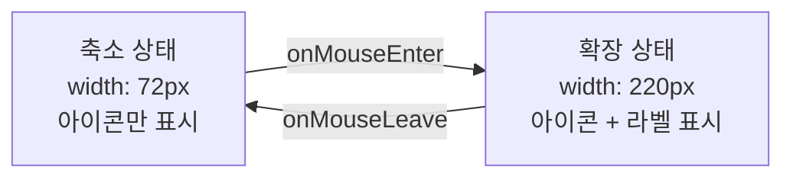
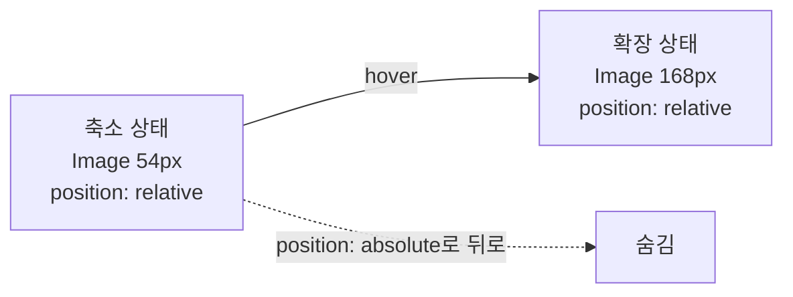
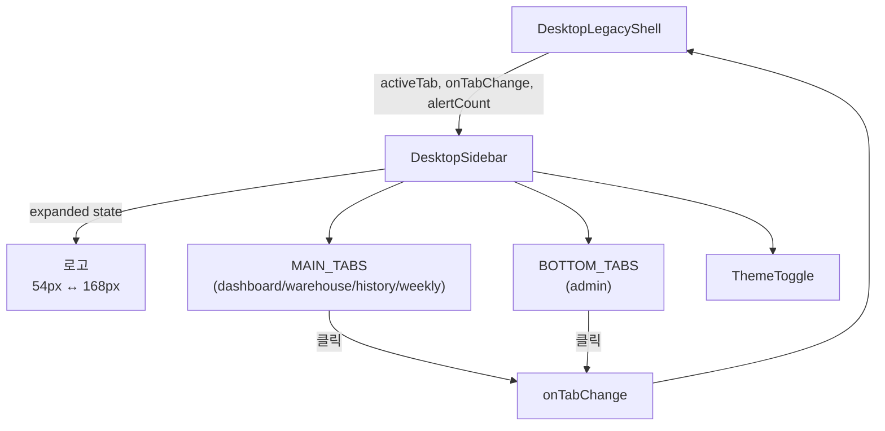

# DesktopSidebar.tsx — 데스크톱 사이드바

#layer/frontend #topic/component #topic/legacy

> [!summary] 한 줄 요약
> 마우스 hover 시 72px → 220px 로 부드럽게 확장되는 아이콘+텍스트 사이드바. 상단 4개 메인 탭과 하단 관리 탭으로 분리되어 있고, 탭 배지 카운트를 지원한다.

---

## 1. 위치 & 관계

| 항목 | 내용 |
|------|------|
| 원본 | `erp/frontend/app/legacy/_components/DesktopSidebar.tsx` |
| 레이어 | frontend / component |
| `"use client"` | O |
| 소비자 | [[erp/frontend/app/legacy/_components/DesktopLegacyShell.tsx]] |

---

## 2. 탭 구성

```typescript
export type DesktopTabId = "dashboard" | "warehouse" | "history" | "weekly" | "admin";

// 상단 메인 탭 4개
const MAIN_TABS: TabDef[] = [
  { id: "dashboard", label: "대시보드",    subtitle: "현황과 안전재고 확인", icon: Boxes    },
  { id: "warehouse", label: "입출고",      subtitle: "입고와 출고 작업 처리", icon: Warehouse },
  { id: "history",   label: "입출고 내역", subtitle: "입출고 이력 조회",      icon: History  },
  { id: "weekly",    label: "주간보고",    subtitle: "생산·재고 흐름",        icon: BarChart2 },
];

// 하단 고정 탭 1개
const BOTTOM_TABS: TabDef[] = [
  { id: "admin", label: "관리", subtitle: "마스터와 운영 설정", icon: Settings2 },
];
```

---

## 3. 확장/축소 애니메이션



```tsx
<div
  style={{
    width: expanded ? 220 : 72,
    transition: "width 180ms cubic-bezier(0.4, 0, 0.2, 1)",
  }}
  onMouseEnter={() => setExpanded(true)}
  onMouseLeave={() => setExpanded(false)}
>
```

---

## 4. 탭 버튼 상태 스타일

| 상태 | 아이콘 배경 | 레이블 색상 | 버튼 배경(expanded) |
|------|-----------|-----------|------------------|
| 활성(active) | `LEGACY_COLORS.blue` | `LEGACY_COLORS.blue` | 파란 그라디언트 |
| hover | `LEGACY_COLORS.s2` | `LEGACY_COLORS.text` | cyan 반투명 |
| 기본 | `LEGACY_COLORS.s2` | `LEGACY_COLORS.muted2` | transparent |

---

## 5. 코드 발췌

```tsx
export function DesktopSidebar({
  activeTab,
  onTabChange,
  alertCount,
}: {
  activeTab: DesktopTabId;
  onTabChange: (tab: DesktopTabId) => void;
  alertCount?: Partial<Record<DesktopTabId, number>>;
}) {
  const [expanded, setExpanded] = useState(false);
  const [hoveredTab, setHoveredTab] = useState<DesktopTabId | null>(null);

  return (
    <div
      className="shrink-0"
      style={{ width: expanded ? 220 : 72, transition: "width 180ms cubic-bezier(0.4, 0, 0.2, 1)" }}
      onMouseEnter={() => setExpanded(true)}
      onMouseLeave={() => setExpanded(false)}
    >
      <aside className="flex h-full w-full flex-col overflow-hidden rounded-[32px] border px-3 py-5"
        style={{ background: LEGACY_COLORS.s1, borderColor: LEGACY_COLORS.border }}
      >
        {/* 로고 */}
        <div style={{ height: expanded ? 68 : 44, transition: "height 180ms ease" }}>
          {/* 축소: 54px 로고 / 확장: 168px 로고 (opacity + transform 전환) */}
        </div>

        {/* 메인 탭 4개 */}
        <nav className="mt-5 space-y-1.5">
          {MAIN_TABS.map((tab) => (
            <TabButton key={tab.id} tab={tab} active={tab.id === activeTab}
              expanded={expanded} hovered={hoveredTab === tab.id}
              onTabChange={onTabChange} onHover={setHoveredTab} />
          ))}
        </nav>
# ... (이하 14줄 생략. 원본 참조)

```

---

## 6. `alertCount` prop

```typescript
// DesktopLegacyShell 에서 전달
<DesktopSidebar
  alertCount={{ dashboard: stockWarnings ? stockWarnings.zero + stockWarnings.low : 0 }}
/>
```

대시보드 탭 아이콘 우상단에 빨간 배지로 재고 경고 수를 표시한다.
현재는 `dashboard` 탭만 배지를 사용하고, 0 이면 표시하지 않는다.

---

## 7. `TabButton` 내부 컴포넌트

```tsx
function TabButton({ tab, active, expanded, hovered, onTabChange, onHover }) {
  const Icon = tab.icon;
  return (
    <button
      onClick={() => onTabChange(tab.id)}
      onMouseEnter={() => onHover(tab.id)}
      onMouseLeave={() => onHover(null)}
      className="group flex items-center rounded-[20px] hover:scale-[1.015]"
    >
      {/* 아이콘 박스 46x46, rounded-[16px] */}
      <div
        className="flex h-[46px] w-[46px] items-center justify-center rounded-[16px]"
        style={{ background: active ? LEGACY_COLORS.blue : LEGACY_COLORS.s2 }}
      >
        <Icon className="h-5 w-5" />
      </div>

      {/* 텍스트 영역 — expanded 시에만 visible */}
      <div style={{ opacity: expanded ? 1 : 0, width: expanded ? "auto" : 0 }}>
        <div className="text-base font-bold">{tab.label}</div>
        <div className="text-sm">{tab.subtitle}</div>
      </div>
    </button>
  );
}
```

---

## 8. 로고 전환 상세



두 `<Image>` 컴포넌트가 동시에 DOM 에 존재하며, `opacity`, `transform`, `position` 을 조합해 크로스페이드한다.

---

## 9. 전체 구조 다이어그램



---

## 10. 관련 파일

- [[erp/frontend/app/legacy/_components/DesktopLegacyShell.tsx]] — 부모 컴포넌트
- `erp/frontend/app/legacy/_components/ThemeToggle.tsx` — 하단 테마 토글
- `erp/frontend/lib/mes/color.ts` — `LEGACY_COLORS` 색상 상수

---

## 11. 정책

- `main` 브랜치: 코드만 유지
- `vault-sync` 브랜치: 코드 + `vault/` 노트
- 코드와 노트가 다르면 실제 코드 우선
