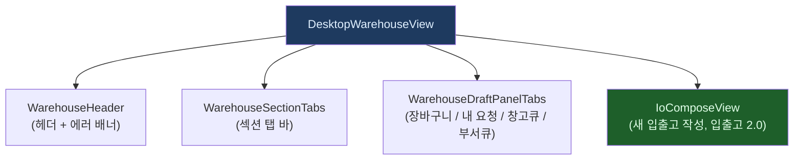
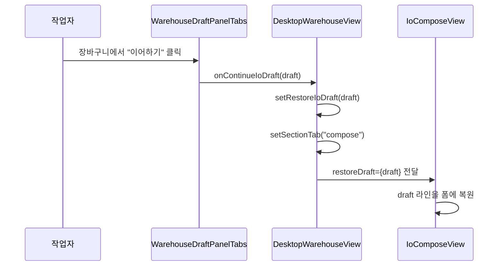

# DesktopWarehouseView.tsx — 입출고 탭 화면

#layer/frontend #topic/component #topic/legacy

> [!summary] 한 줄 요약
> 입출고 탭의 최상위 컴포넌트. 요청 작성(IoComposeView) + 4개 draft/queue 패널(WarehouseDraftPanelTabs)을 조합하고, 탭 배지 숫자(장바구니/창고큐/부서큐)를 집계한다.

---

## 1. 위치 & 관계

| 항목 | 내용 |
|------|------|
| 원본 | `erp/frontend/app/legacy/_components/DesktopWarehouseView.tsx` |
| 레이어 | frontend / component |
| `"use client"` | O |
| 소비자 | [[erp/frontend/app/legacy/_components/DesktopLegacyShell.tsx]] |



---

## 2. 5개 섹션 탭

| 섹션 ID | 이름 | 설명 |
|---------|------|------|
| `compose` | 요청 작성 | 새 입출고 작성 (IoComposeView, 입출고 2.0) |
| `cart` | 장바구니 | 저장된 draft 목록 (구형 + io 2.0 합산) |
| `my-requests` | 내 요청 | 본인이 제출한 요청 이력 |
| `warehouse-queue` | 창고 승인 | 창고 담당자 승인 대기 목록 |
| `dept-queue` | 부서 승인 | 부서장 승인 대기 목록 |

> [!note] 접근 권한
> - `warehouse-queue`: `warehouse_role === "primary" | "deputy"` 인 경우만 탭 표시
> - `dept-queue`: `isDepartmentApprover(operator)` 인 경우만 탭 표시

---

## 3. 탭 배지 카운트 집계

```typescript
// 장바구니 배지 — 구형 draft + io 2.0 draft 합산
useEffect(() => {
  if (!operatorEmployeeId) return;
  Promise.all([
    api.listStockRequestDrafts(operatorEmployeeId),  // 구형
    api.listDrafts(operatorEmployeeId),              // io 2.0
  ]).then(([legacyRows, ioRows]) => {
    const n = legacyRows.length + ioRows.length;
    setCartCount(n);
    cartCountCache.set(operatorEmployeeId, n);  // 세션 내 캐시
  });
}, [operatorEmployeeId, panelRefreshNonce]);

// 창고 큐 배지
useEffect(() => {
  if (!canSeeQueue) return;
  api.countWarehouseQueue().then(({ count }) => {
    setWarehouseQueueCount(count);
  });
}, [canSeeQueue, panelRefreshNonce]);

// 부서 큐 배지
useEffect(() => {
  if (!canSeeDeptQueue || !operatorEmployeeId) return;
  api.countDepartmentQueue(operatorEmployeeId).then(({ count }) => {
    setDeptQueueCount(count);
  });
}, [canSeeDeptQueue, operatorEmployeeId, panelRefreshNonce]);
```

---

## 4. 세션 메모리 캐시

탭 전환 시 remount 되어도 배지 숫자가 깜박이지 않도록 모듈 레벨 캐시를 사용한다:

```typescript
// 탭 전환 remount 사이 직전 카운트 보존
const cartCountCache = new Map<string, number>();
const warehouseQueueCountCache = { value: 0 };
const deptQueueCountCache = new Map<string, number>();
```

새로고침 시 휘발. 첫 진입은 항상 fresh fetch.

---

## 5. 코드 발췌 — 핵심 구조

```tsx
export function DesktopWarehouseView({ globalSearch, onStatusChange, preselectedItem, onSubmitSuccess }) {
  const { employees, items, productModels, loadFailure, setItems } = useWarehouseData(...);
  const operator = readCurrentOperator();

  const [sectionTab, setSectionTab] = useState<WarehouseSectionTab>("compose");
  const [cartCount, setCartCount] = useState(...);
  const [warehouseQueueCount, setWarehouseQueueCount] = useState(...);
  const [deptQueueCount, setDeptQueueCount] = useState(...);
  const [restoreIoDraft, setRestoreIoDraft] = useState<IoBatch | null>(null);

  // 접근 권한 체크
  const canSeeQueue = operator?.warehouse_role === "primary" || === "deputy";
  const canSeeDeptQueue = isDepartmentApprover(operator);

  // 접근 불가 시 안내 화면
  if (operator && !canEnterIO(operator)) {
    return <WarehouseAccessDenied department={operator.department ?? ""} />;
  }

  return (
    <div className="flex h-full min-h-0 flex-1 min-w-0 overflow-y-auto lg:pr-4">
      <div className="flex min-h-full w-full flex-col gap-3 ...">
        <WarehouseHeader loadFailure={loadFailure} />
        <WarehouseSectionTabs
          active={sectionTab} onChange={setSectionTab}
          showQueue={canSeeQueue} showDeptQueue={canSeeDeptQueue}
          cartCount={cartCount} queueCount={warehouseQueueCount}
          deptQueueCount={deptQueueCount}
        />

        {/* 장바구니 / 내 요청 / 큐 패널 */}
        <WarehouseDraftPanelTabs
          sectionTab={sectionTab}
          onContinueIoDraft={(draft) => {
            setRestoreIoDraft(draft);
# ... (이하 24줄 생략. 원본 참조)

```

---

## 6. draft 복원 흐름



---

## 7. `panelRefreshNonce` 패턴

`panelRefreshNonce` 를 1씩 증가시키면 여러 `useEffect` 의 의존성 배열이 동시에 트리거된다:
- 장바구니 카운트 재집계
- 창고 큐 카운트 재집계
- 부서 큐 카운트 재집계

`IoComposeView` 가 성공/상태 변경 시 `setPanelRefreshNonce((n) => n + 1)` 을 호출한다.

---

## 8. 권한 체크 함수

```typescript
// _warehouse_steps 에서 import
import { canEnterIO, isDepartmentApprover } from "./_warehouse_steps";

// canEnterIO: 입출고 화면 진입 가능 여부
// isDepartmentApprover: 부서 큐 탭 표시 여부
```

---

## 9. 관련 파일

- [[erp/frontend/app/legacy/_components/DesktopLegacyShell.tsx]] — 부모 컴포넌트
- [[erp/frontend/lib/api/io.ts]] — listDrafts, submit, getDraft
- [[erp/frontend/lib/api/stock-requests.ts]] — listStockRequestDrafts, countWarehouseQueue
- `erp/frontend/app/legacy/_components/_warehouse_v2/IoComposeView.tsx` — 입출고 2.0 작성 UI
- `erp/frontend/app/legacy/_components/_warehouse_sections/WarehouseDraftPanelTabs.tsx` — 패널 탭들
- [[erp/backend/app/routers/io.py]] — 입출고 2.0 백엔드

---

## 10. 주의 사항

> [!warning] `restoreIoDraft` 상태
> 장바구니에서 이어하기 후 `IoComposeView` 가 draft 를 복원하면 `restoreIoDraft` 를 `null` 로 리셋해야 한다. 그렇지 않으면 다음 compose 탭 진입 시에도 draft 가 복원된다.

> [!info] 구형 draft 호환
> `handleLegacyDraftContinue` 는 구형 `StockRequest` draft 를 복원하지 않는다.
> "새 입출고 화면에서 직접 복원되지 않습니다" 안내만 표시한다.

---

## 11. 정책

- `main` 브랜치: 코드만 유지
- `vault-sync` 브랜치: 코드 + `vault/` 노트
- 코드와 노트가 다르면 실제 코드 우선
