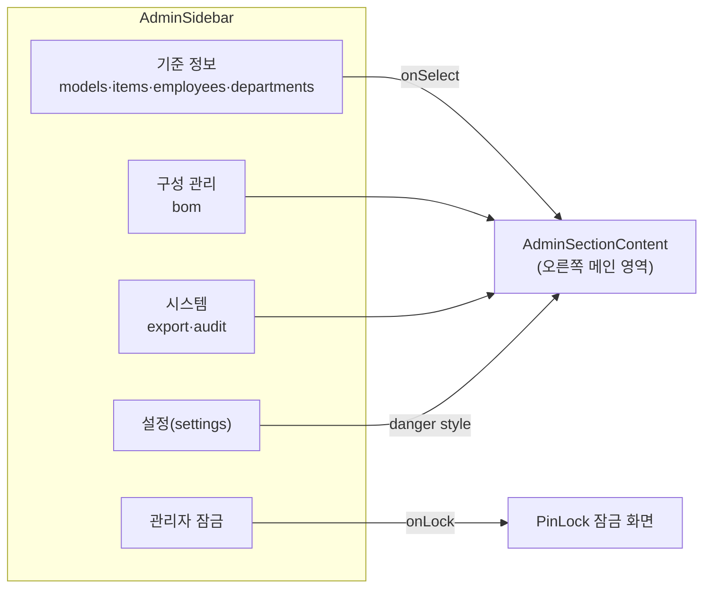

---
tags:
  - layer/frontend
  - topic/admin
aliases:
  - AdminSidebar
created: 2026-05-21
---
type: code-note
status: active
updated: 2026-05-21
project: DEXCOWIN MES
---

# AdminSidebar.tsx

> [!info] 한 줄 요약
> Admin 화면 좌측 내비게이션 패널. 섹션 목록·그룹 라벨·잠금 버튼을 렌더링하고, 선택된 `AdminSection` 을 부모로 올린다.

## 1. 파일 위치

```
erp/frontend/app/legacy/_components/_admin_sections/AdminSidebar.tsx
```

## 2. 책임 (단일 목적)

- `SECTIONS` 배열을 3개 그룹("기준 정보 / 구성 관리 / 시스템")으로 나눠 `SidebarButton` 목록 렌더링
- 현재 활성 섹션 하이라이트 (border-color + background color-mix)
- 하단 고정 영역: 설정(Settings) 버튼, 요약 패널 토글, 관리자 잠금

## 3. Props / 인터페이스

```ts
// erp/frontend/app/legacy/_components/_admin_sections/AdminSidebar.tsx (59-58)
interface Props {
  section: AdminSection;         // 현재 선택된 섹션 ID
  onSelect: (next: AdminSection) => void;
  onLock: () => void;            // 관리자 잠금 → DesktopAdminView 가 PinLock 복귀 처리
  showRightPanel?: boolean;      // 요약 패널 표시 여부
  onTogglePanel?: () => void;
}
```

`AdminSection` 타입은 `_admin_hooks/useAdminViewState` 에서 export 됨.

## 4. 주요 상수

| 상수 | 역할 |
|---|---|
| `SECTIONS` | 7개 섹션 메타(models/items/employees/departments/bom/export/audit) |
| `SETTINGS_ENTRY` | 하단 고정 설정 섹션 (danger 스타일) |
| `SECTION_GROUPS` | 그룹 타이틀과 섹션 ID 매핑 배열 |

```ts
// erp/frontend/app/legacy/_components/_admin_sections/AdminSidebar.tsx (28-49)
export const SECTIONS: SectionMeta[] = [
  { id: "models",      label: "모델 관리",    description: "제품 모델 등록 및 사용 현황",   icon: Layers },
  { id: "items",       label: "품목 관리",    description: "품목 기본 정보·재고·BOM 관리", icon: Box },
  { id: "employees",   label: "직원 관리",    description: "직원 활성·권한·PIN 관리",      icon: Users },
  { id: "departments", label: "부서 관리",    description: "부서 추가·색상·구성원 관리",   icon: Building2 },
  { id: "bom",         label: "BOM 관리",     description: "부모-자식 자재 구성 편집",      icon: Network },
  { id: "export",      label: "내보내기",     description: "엑셀 / CSV 데이터 내보내기",   icon: Download },
  { id: "audit",       label: "외부 제출용 로그", description: "심사 대비 월별 입출고 CSV", icon: FileArchive },
];

const SECTION_GROUPS: { title: string; ids: AdminSection[] }[] = [
  { title: "기준 정보",  ids: ["models", "items", "employees", "departments"] },
  { title: "구성 관리",  ids: ["bom"] },
  { title: "시스템",    ids: ["export", "audit"] },
];
```

## 5. 섹션 진입 흐름



## 6. 코드 발췌 (렌더 핵심)

```tsx
// erp/frontend/app/legacy/_components/_admin_sections/AdminSidebar.tsx (94-114)
<div className="flex min-h-0 flex-1 flex-col gap-4 overflow-y-auto pr-0.5">
  {SECTION_GROUPS.map((group) => (
    <div key={group.title} className="flex flex-col gap-1.5">
      <div className="px-1 text-[10px] font-black uppercase tracking-[0.22em]"
           style={{ color: LEGACY_COLORS.muted2 }}>
        {group.title}
      </div>
      <div className="flex flex-col gap-1.5">
        {SECTIONS.filter((e) => group.ids.includes(e.id)).map((entry) => (
          <SidebarButton
            key={entry.id}
            entry={entry}
            active={section === entry.id}
            onClick={() => onSelect(entry.id)}
          />
        ))}
      </div>
    </div>
  ))}
</div>
```

## 7. 의존 관계

| 방향 | 대상 |
|---|---|
| 가져옴 | `SidebarButton` (클릭 가능한 개별 메뉴 버튼) |
| 가져옴 | `LEGACY_COLORS` (`erp/lib/mes/color`) |
| 가져옴 | `AdminSection` 타입 (`_admin_hooks/useAdminViewState`) |
| 사용됨 | `DesktopAdminView` → props 전달 |

## 8. 상태 관리

이 컴포넌트 자체는 **무상태(stateless)**. 모든 상태는 부모 `DesktopAdminView` 가 `useAdminViewState()` 훅으로 관리한다.

## 9. 자주 하는 실수 / 주의

> [!warning] 섹션 추가 시 두 곳 수정 필요
> 새 섹션을 추가하려면 `SECTIONS` 배열과 `SECTION_GROUPS` 모두에 추가해야 한다.
> `SECTION_GROUPS` 에 없으면 렌더링되지 않는다.

## 10. 관련 파일

- `[[erp/frontend/app/legacy/_components/_admin_sections/AdminSectionContent.tsx]]`
- `[[erp/frontend/app/legacy/_components/_admin_hooks/useAdminViewState]]`
- `[[erp/frontend/app/legacy/_components/_admin_sections/SidebarButton.tsx]]`
- `[[erp/frontend/app/legacy/_components/DesktopAdminView.tsx]]`

## 11. 변경 이력 메모

| 날짜 | 변경 |
|---|---|
| 2026-05-21 | Vault 노트 최초 작성 |
