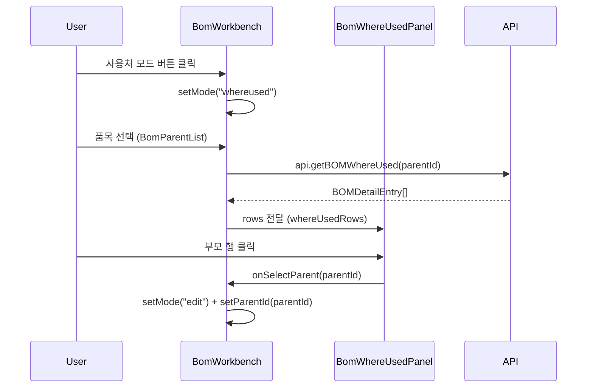

---
tags:
  - layer/frontend
  - topic/bom
aliases:
  - BomWhereUsedPanel
created: 2026-05-21
---
type: code-note
status: active
updated: 2026-05-21
project: DEXCOWIN MES
---

# BomWhereUsedPanel.tsx

> [!info] 한 줄 요약
> BOM 역참조(Where Used) 패널. 선택된 품목이 어느 부모의 자식으로 등장하는지 1단계 조회 결과를 표시한다.

## 1. 파일 위치

```
erp/frontend/app/legacy/_components/_admin_sections/_bom_workbench/BomWhereUsedPanel.tsx
```

## 2. 책임 (단일 목적)

- 선택된 품목 헤더 (배지 + 이름 + 사용처 수)
- 역참조 결과 목록 (부모 품목 코드·이름·사용 수량)
- 항목 클릭 시 편집 모드로 전환 + 해당 부모 선택 (`onSelectParent`)

## 3. Props 구조

```ts
// erp/frontend/app/legacy/_components/_admin_sections/_bom_workbench/BomWhereUsedPanel.tsx (15-19)
interface Props {
  selected: Item | null;
  rows: BOMDetailEntry[];        // 페이지가 부모 변경 시 미리 fetch (where-used)
  items: Item[];                 // 부모 Item 정보 조회용 (itemMap)
  onSelectParent: (parentId: string) => void;
}
```

`rows` 는 `BomWorkbench` 에서 `api.getBOMWhereUsed(parentId)` 로 미리 가져와 전달.

## 4. 역참조 흐름



## 5. 코드 발췌 (역참조 행 렌더)

```tsx
// erp/frontend/app/legacy/_components/_admin_sections/_bom_workbench/BomWhereUsedPanel.tsx (75-101)
rows.map((r) => {
  const parent = itemMap.get(r.parent_item_id);
  return (
    <button
      key={r.bom_id}
      type="button"
      onClick={() => onSelectParent(r.parent_item_id)}
      className="grid w-full items-center gap-3 px-3 py-2.5 text-left transition-colors hover:brightness-105"
      style={{
        gridTemplateColumns: "auto 1fr 120px",
        borderBottom: `1px solid ${LEGACY_COLORS.border}`,
      }}
      title="이 부모로 이동 (편집 모드)"
    >
      <BomBadge processTypeCode={parent?.process_type_code} />
      <div className="min-w-0">
        <TruncatedText className="truncate text-sm font-semibold">
          {r.parent_item_name}
        </TruncatedText>
        <TruncatedText className="truncate text-xs">
          {r.parent_item_code ?? "(코드 없음)"}
        </TruncatedText>
      </div>
      <div className="text-right text-sm font-semibold">
        ×{formatQty(r.quantity)} {r.unit || "EA"}
      </div>
    </button>
  );
})
```

## 6. 빈 상태 처리

| 상황 | 표시 내용 |
|---|---|
| `selected === null` | EmptyState: "좌측에서 품목을 선택하세요" |
| `rows.length === 0` | 텍스트: "이 품목을 자식으로 사용하는 BOM이 없습니다." |

## 7. 그리드 컬럼 구성

```
gridTemplateColumns: "auto 1fr 120px"
// BomBadge | 부모 이름·코드 | 사용 수량
```

## 8. 의존 관계

| 방향 | 대상 |
|---|---|
| 가져옴 | `BomBadge` (process_type_code 배지) |
| 가져옴 | `TruncatedText` (`erp/lib/ui`) |
| 가져옴 | `formatQty` (`erp/lib/mes/format`) |
| 사용됨 | `BomWorkbench` — `whereused` 모드에서 렌더 |

## 9. 주의 / 특이사항

> [!note] 1단계 역참조만 제공
> 이 패널은 선택된 품목의 직계 부모만 보여준다. 부모의 부모(2단계 이상) 추적은 해당 부모 클릭 후 재조회해야 한다.

## 10. 관련 파일

- `[[erp/frontend/app/legacy/_components/_admin_sections/_bom_workbench/BomWorkbench.tsx]]`
- `[[erp/backend/app/routers/bom.py]]` — `GET /bom/where-used/{item_id}` 엔드포인트
