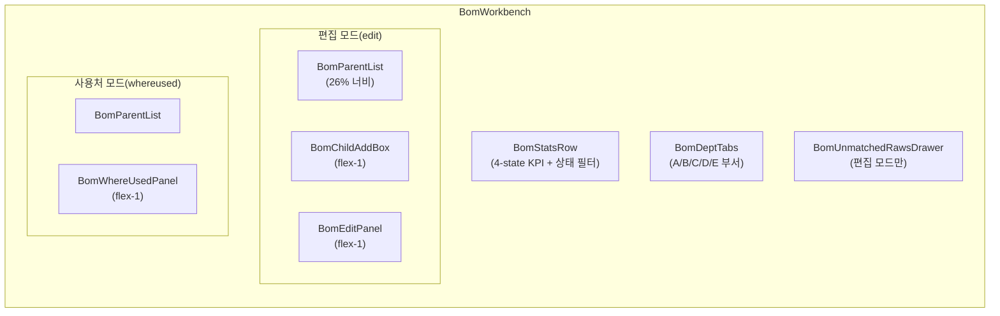

---
tags:
  - layer/frontend
  - topic/bom
aliases:
  - BomWorkbench
created: 2026-05-21
---
type: code-note
status: active
updated: 2026-05-21
project: DEXCOWIN MES
---

# BomWorkbench.tsx

> [!info] 한 줄 요약
> BOM 편집 전체를 오케스트레이션하는 최상위 컨테이너. 부서 탭·부모 목록·자식 추가 박스·현재 구성 패널·사용처 패널을 조합한다. `[[erp/backend/app/routers/bom.py]]` 와 직접 연결.

## 1. 파일 위치

```
erp/frontend/app/legacy/_components/_admin_sections/_bom_workbench/BomWorkbench.tsx
```

## 2. 책임 (단일 목적)

- 부서 탭(`DeptLetter`)별 부모 품목 필터링
- 부모 선택 시 BOM 행 + 역참조(WhereUsed) 동시 fetch
- 자식 추가 / 수량 변경 / 삭제 API 호출 및 낙관적 갱신 방지(서버 재동기화)
- BOM 완료 상태 toggle (`updateBomCompletion`)
- 완료된 BOM JSON+CSV 내보내기
- 4-state KPI 통계 (done / wip / todo)

## 3. Props 구조

```ts
// erp/frontend/app/legacy/_components/_admin_sections/_bom_workbench/BomWorkbench.tsx (20-27)
interface Props {
  items: Item[];
  allBomRows: BOMDetailEntry[];
  refreshAllBom: () => void;
  refreshItems: () => Promise<void>;
  onStatusChange: (msg: string) => void;
  onError: (msg: string) => void;
}
```

## 4. 화면 레이아웃 구조



## 5. 부서-품목 필터링 로직

```ts
// erp/frontend/app/legacy/_components/_admin_sections/_bom_workbench/BomWorkbench.tsx (61-67)
const parentCandidates = useMemo(
  () =>
    items.filter(
      (i) => i.process_type_code?.[0] === dept && stageOf(i.process_type_code) !== "R",
    ),
  [items, dept],
);
```

`process_type_code` 첫 글자가 부서 코드, `stageOf()` 결과가 `"R"` 인 원자재(`R` 스테이지)는 부모 후보에서 제외.

## 6. 서버 재동기화 패턴

```ts
// erp/frontend/app/legacy/_components/_admin_sections/_bom_workbench/BomWorkbench.tsx (152-163)
async function reloadBom() {
  if (!parentId) { setBomRows([]); return; }
  try {
    setBomRows(await api.getBOM(parentId));
  } catch {
    setBomRows([]);
  }
}
```

낙관적 갱신 없이 항상 서버 최신 상태로 `bomRows` 를 덮어쓴다. stale bom_id 문제 방지.

## 7. 코드 발췌 (자식 추가)

```ts
// erp/frontend/app/legacy/_components/_admin_sections/_bom_workbench/BomWorkbench.tsx (165-186)
async function handleAdd(childId: string, childName: string, qty: number): Promise<boolean> {
  if (!parent) return false;
  if (!Number.isFinite(qty) || qty <= 0) {
    onError("수량은 0보다 커야 합니다.");
    return false;
  }
  try {
    await api.createBOM({
      parent_item_id: parent.item_id,
      child_item_id: childId,
      quantity: qty,
      unit: "EA",
    });
    await reloadBom();
    refreshAllBom();
    onStatusChange(`"${childName}" 을(를) 추가했습니다.`);
    return true;
  } catch (err) {
    onError(err instanceof Error ? err.message : "추가 실패");
    return false;
  }
}
```

## 8. BOM 내보내기 스키마

내보내기 CSV 헤더 (backend build.py 와 동일):

```
parent_item_code, parent_item_name, parent_process_type,
child_item_code,  child_item_name,  child_process_type,
quantity, unit
```

JSON 도 동시 다운로드됨 (300ms 지연으로 브라우저 팝업 차단 우회).

## 9. 4-state KPI

| 상태 | 조건 |
|---|---|
| `done` | `bom_completed_at` 있음 |
| `wip` | 완료 아님 + 자식 1개 이상 |
| `todo` | 완료 아님 + 자식 없음 |

`BomStatsRow` 의 상태 클릭 → `statusFilter` 변경 → `BomParentList` 필터링 연동.

## 10. 의존 관계

| 방향 | 대상 |
|---|---|
| 가져옴 | `api.getBOM`, `api.createBOM`, `api.updateBOM`, `api.deleteBOM`, `api.getBOMWhereUsed`, `api.updateBomCompletion` |
| 가져옴 | `BomDeptTabs`, `BomParentList`, `BomChildAddBox`, `BomEditPanel`, `BomWhereUsedPanel`, `BomStatsRow`, `BomReviewModal`, `BomUnmatchedRawsDrawer` |
| 사용됨 | `AdminSectionContent` → `bom` 섹션에서 렌더 |

## 11. 관련 파일

- `[[erp/frontend/app/legacy/_components/_admin_sections/_bom_workbench/BomEditPanel.tsx]]`
- `[[erp/frontend/app/legacy/_components/_admin_sections/_bom_workbench/BomWhereUsedPanel.tsx]]`
- `[[erp/frontend/app/legacy/_components/_admin_sections/_bom_workbench/BomReviewModal.tsx]]`
- `[[erp/backend/app/routers/bom.py]]` — BOM CRUD + 완료 상태 API
