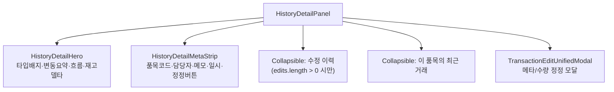

# HistoryDetailPanel.tsx

> [!summary] 역할
> **거래 상세 우측 패널.** 선택된 `TransactionLog` 한 건의 상세 정보(영웅 헤더·메타 스트립·수정 이력·최근 거래)를 표시하고, 메타 정보 정정 및 수량 정정 모달을 제공한다.

---

## 1. 위치

```
erp/frontend/app/legacy/_components/_history_sections/HistoryDetailPanel.tsx
```

**부모**: `DesktopHistoryView.tsx` (우측 패널 영역)

---

## 2. 역할 한 줄 요약

테이블에서 선택한 거래 로그의 상세를 3개 섹션으로 표시: 영웅 헤더(타입·변동·흐름·재고 델타), 메타 스트립(코드·담당자·메모·일시·정정 버튼), 수정 이력 + 이 품목 최근 거래.

---

## 3. Props

| prop | 타입 | 설명 |
|---|---|---|
| `selected` | `TransactionLog \| null` | 현재 선택된 거래 로그 |
| `itemRecentLogs` | `TransactionLog[]` | 같은 품목의 최근 거래 목록 |
| `onSelectLog` | `(log) => void` | 최근 거래에서 다른 항목 선택 |
| `onLogUpdated` | `(updated) => void` | 메타 정정 성공 후 콜백 |
| `onLogCorrected` | `({original, correction}) => void` | 수량 정정 성공 후 콜백 |

---

## 4. 구성 섹션



---

## 5. 상태 관리

| 상태 | 용도 |
|---|---|
| `editOpen` | 정정 모달 열림 여부 |
| `edits` | 수정 이력 목록 (`TransactionEditLog[]`) |
| `editsLoaded` | 수정 이력 로딩 완료 여부 |
| `flow` | IoBatch 흐름 로딩 상태 (`idle/loading/available/unavailable`) |

---

## 6. FlowState — 작업 흐름 표시

```typescript
type FlowState =
  | { status: "idle" }
  | { status: "loading" }
  | { status: "available"; batch: IoBatch }
  | { status: "unavailable" };
```

`selected.operation_batch_id`가 있으면 `ioApi.getBatch()`를 호출해서 "출발 → 도착" 흐름을 표시한다. 없거나 실패하면 흐름 줄 자체를 숨긴다.

---

## 7. 코드 발췌 — 영웅 헤더

```tsx
function HistoryDetailHero({ log, flow, editCount }) {
  const tcolor = transactionColor(log.transaction_type);
  const movement = getSingleLogMovement(log);
  const eps = flow.status === "available" ? getBatchFlowEndpoints(flow.batch) : null;

  return (
    <div className="rounded-[20px] border p-4 space-y-3" style={heroStyle}>
      {/* 타입 배지 + 변동요약 + 수정됨 배지 */}
      <div className="flex flex-wrap items-center gap-2">
        <FlowBadge type={log.transaction_type} label={getHistoryDisplayLabel(log)} color={tcolor} />
        <MovementSummaryCell summary={{ parts: [movement] }} />
        {editCount > 0 && (
          <span style={{ color: LEGACY_COLORS.yellow }}>
            <History className="h-3 w-3" /> 수정됨 {editCount}
          </span>
        )}
      </div>

      {/* 흐름: 출발 → 도착 */}
      {flow.status === "available" && eps && (
        <div className="flex items-center gap-2 text-xs">
          <span>{eps.from}</span>
          <ArrowRight className="h-3.5 w-3.5" />
          <span>{eps.to}</span>
          {workType && <span>({workType})</span>}
        </div>
      )}

      {/* 재고 영향: 처리 전 → 처리 후 */}
      {hasStockDelta && (
        <div className="flex items-center gap-2 text-xs">
          <span>처리 전 {qBefore}</span>
          <ArrowRight />
          <span style={{ color: tcolor }}>처리 후 {qAfter}</span>
        </div>
      )}
    </div>
  );
}
```

---

## 8. 정정 가능 거래 유형

```typescript
const META_CORRECTABLE = new Set([
  "RECEIVE", "SHIP", "ADJUST",
  "TRANSFER_TO_PROD", "TRANSFER_TO_WH", "TRANSFER_DEPT",
  "MARK_DEFECTIVE", "SUPPLIER_RETURN",
]);
```

`META_CORRECTABLE`에 속하는 거래 유형이면 정정 버튼이 표시된다. `QUANTITY_CORRECTABLE_TYPES`(수량 정정 가능 목록)는 `TransactionEditUnifiedModal`에서 관리.

---

## 9. UtcDatetime 표시

```tsx
// HistoryDetailMetaStrip 내부
<span style={{ color: LEGACY_COLORS.muted2 }}>
  {formatHistoryDateTimeLong(log.created_at)}
</span>
```

`formatHistoryDateTimeLong`은 UTC ISO 문자열을 KST 기준 "YYYY-MM-DD HH:mm:ss" 형식으로 변환한다. 단순 포맷 함수이며 `historyFormat.ts`에 정의됨.

---

## 10. Collapsible 섹션

```tsx
function Collapsible({ icon, title, count, defaultOpen = false, children }) {
  const [open, setOpen] = useState(defaultOpen);
  return (
    <div className="rounded-[20px] border" ...>
      <button onClick={() => setOpen((v) => !v)}>
        {title} ({count})
        <ChevronDown className={open ? "rotate-180" : ""} />
      </button>
      {open && <div className="px-4 pb-4">{children}</div>}
    </div>
  );
}
```

수정 이력과 최근 거래 목록은 모두 접을 수 있는 섹션으로 표시. 기본값은 닫힘(`defaultOpen=false`).

---

## 11. 연결 관계

- **부모**: `erp/frontend/app/legacy/_components/DesktopHistoryView.tsx`
- **자식**: `HistoryDetailEditHistory`, `HistoryDetailRecentLogs`, `TransactionEditUnifiedModal`
- **해석 함수**: `erp/frontend/app/legacy/_components/_history_sections/historyBatchInterpreter.ts` (`getBatchFlowEndpoints`, `getHistoryDisplayLabel` 등)
- **API**: `api.getTransactionEdits`, `ioApi.getBatch`

---

## 12. 참고 맥락

> [!note] 참고
> 거래 내역 테이블에서 항목을 클릭하면 오른쪽에 이 패널이 열린다.
>
> **"처리 전 → 처리 후"**: 이 거래로 재고가 얼마에서 얼마로 바뀌었는지 보여준다.
>
> **"흐름 (출발 → 도착)"**: 어느 위치(창고/부서)에서 어디로 이동했는지 보여준다. 입출고 2.0으로 처리된 경우에만 표시된다.
>
> **정정 버튼**: 잘못된 정보를 사후에 수정할 수 있다. 수량 정정은 별도의 정정 거래를 생성해서 원본 로그는 보존한다 (이력 보전 원칙).
