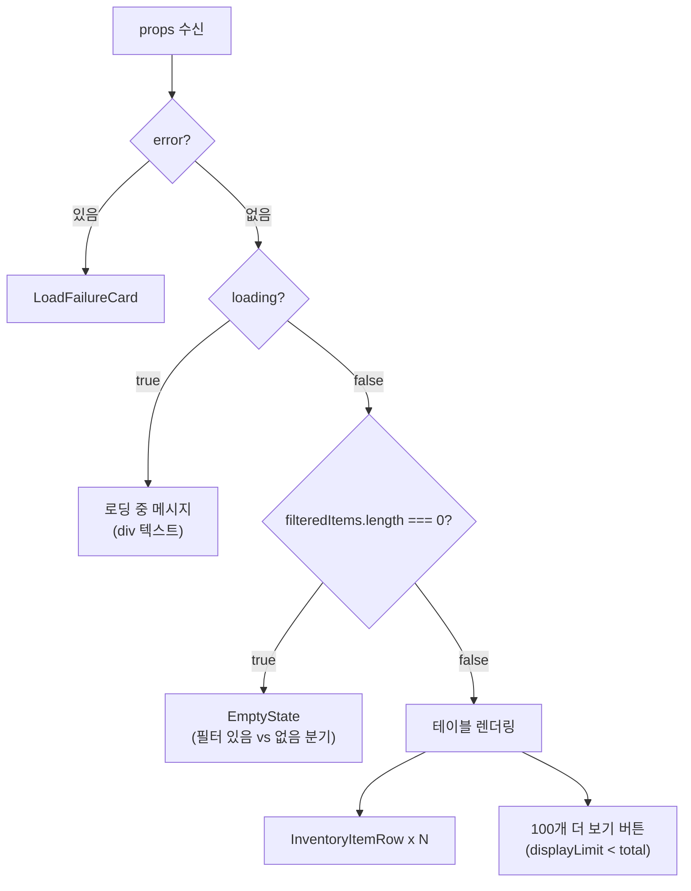

# InventoryItemsTable.tsx

> [!summary] 역할
> **재고 탭 품목 목록 테이블.** 필터링된 `Item[]`을 현재고·안전재고 기준 정렬 가능한 테이블로 렌더링한다. 100개씩 페이지네이션, 에러/로딩/빈 상태 처리 포함.

---

## 1. 위치

```
erp/frontend/app/legacy/_components/_inventory_sections/InventoryItemsTable.tsx
```

**부모**: `DesktopInventoryView.tsx`

---

## 2. 역할 한 줄 요약

`filteredItems`를 받아 정렬·페이지네이션·선택 상태를 관리하는 재고 품목 테이블. 실제 행 렌더링은 `InventoryItemRow`에 위임한다.

---

## 3. Props

| prop | 타입 | 설명 |
|---|---|---|
| `error` | `string \| null` | API 에러 메시지 |
| `loading` | `boolean` | 최초 로딩 중 |
| `filteredItems` | `Item[]` | 필터 적용된 품목 목록 |
| `displayLimit` | `number` | 현재 표시 개수 (100 단위) |
| `setDisplayLimit` | `(updater) => void` | 페이지네이션 업데이트 |
| `selectedItem` | `Item \| null` | 선택된 품목 (우측 패널 연동) |
| `onSelectItem` | `(item \| null) => void` | 품목 선택 콜백 |
| `activeFilterCount` | `number` | 활성 필터 수 (빈 상태 메시지 분기용) |
| `hasKpiFilter` | `boolean` | KPI 패널 필터 활성 여부 |
| `onRetry` | `() => void` | 에러 시 재시도 |
| `onResetAllFilters` | `() => void` | 필터 초기화 |
| `imageManifest` | `Record<string, string> \| undefined` | 품목 코드 → 이미지 파일명 매핑 |

---

## 4. 정렬 기능

```typescript
type SortCol = "quantity" | "min_stock";
type SortDir = "asc" | "desc";

function sortItems(items: Item[], col: SortCol | null, dir: SortDir): Item[] {
  if (!col) return items;
  return [...items].sort((a, b) => {
    const av = Number(a[col] ?? 0);
    const bv = Number(b[col] ?? 0);
    return dir === "asc" ? av - bv : bv - av;
  });
}
```

정렬 가능 컬럼 2개: `현재고(quantity)`, `안전재고(min_stock)`. 클릭 시 동일 컬럼이면 방향 반전, 다른 컬럼이면 `desc`로 초기화.

---

## 5. 렌더링 우선순위



---

## 6. 컬럼 구성

| 컬럼 | 너비 | 비고 |
|---|---|---|
| 상태 | 90px | 재고 상태 배지 |
| 이미지 | 60px | sm 이상만, `imageManifest` 사용 |
| 품목명 | minWidth 140px | - |
| 품목 코드 | 160px | sm 이상만 |
| 부서 | 160px | sm 이상만 |
| 현재고 | 160px | 정렬 가능, `aria-sort` |
| 안전재고 | 160px | 정렬 가능, sm 이상만 |

---

## 7. 코드 발췌 — 정렬 헤더

```tsx
<th scope="col"
  className="border-b ... cursor-pointer select-none hover:brightness-110"
  onClick={() => handleSort("quantity")}
  aria-sort={sortCol === "quantity" ? (sortDir === "asc" ? "ascending" : "descending") : "none"}>
  <span className="inline-flex items-center justify-center gap-1">
    현재고
    {sortCol === "quantity" ? (
      sortDir === "asc" ? <ChevronUp className="h-3.5 w-3.5" /> : <ChevronDown className="h-3.5 w-3.5" />
    ) : (
      <ChevronDown className="h-3.5 w-3.5 opacity-30" />  // 비활성 정렬 표시
    )}
  </span>
</th>
```

`aria-sort` 속성으로 스크린리더 접근성을 지원한다.

---

## 8. 페이지네이션

```tsx
{sortedItems.length > displayLimit && (
  <button onClick={() => setDisplayLimit((prev) => prev + PAGE_SIZE)}
    className="mt-4 w-full rounded-[24px] border py-4 ...">
    100개 더 보기 ({min(displayLimit + 100, total)} / {total})
  </button>
)}

{sortedItems.length > 0 && (
  <div className="mt-2 text-center text-xs">
    {min(displayLimit, total)} / {total}개 표시
  </div>
)}
```

`PAGE_SIZE = 100`. 초기 로드량은 부모가 `displayLimit` prop으로 전달.

---

## 9. 빈 상태 분기

| 조건 | variant | 설명 |
|---|---|---|
| 필터·KPI 필터 있음 | `"filtered-out"` | "필터 초기화" 버튼 포함 |
| 필터 없음 | `"no-search-result"` | PackageSearch 아이콘 |

---

## 10. 연결 관계

- **부모**: `erp/frontend/app/legacy/_components/DesktopInventoryView.tsx`
- **자식**: `erp/frontend/app/legacy/_components/_inventory_sections/InventoryItemRow.tsx`
- **타입**: `@/lib/api` (`Item`)
- **이미지**: `imageManifest`는 부모에서 서버사이드로 불러온 `Record<item_code, filename>`

---

## 11. 참고 맥락

> [!note] 참고
> 재고 탭에서 모든 품목을 보여주는 테이블이다. 구조는 단순하다:
>
> 1. 부모(`DesktopInventoryView`)가 전체 품목을 fetch하고 필터링해서 `filteredItems`로 전달
> 2. 이 컴포넌트는 그 목록을 정렬해서 100개씩 표시
> 3. 클릭하면 우측 패널(`InventoryDetailPanel`)에 상세 정보가 표시
>
> **정렬 버튼**: 현재고·안전재고 컬럼 헤더를 클릭하면 정렬된다. 한 번 더 클릭하면 반대 방향으로 정렬된다. 재고가 적은 품목을 빠르게 찾을 때 유용하다.
