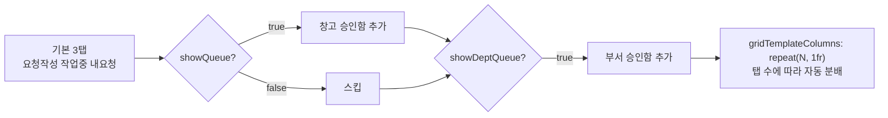

# WarehouseSectionTabs.tsx

> [!summary] 역할
> **창고 화면 상단 섹션 탭 컴포넌트.** "요청 작성·작업 중·내 요청·창고 승인함·부서 승인함" 5개 탭을 권한별로 조건부 표시하고, 각 탭의 미결 건수를 배지(badge)로 표시한다.

---

## 1. 위치

```
erp/frontend/app/legacy/_components/_warehouse_sections/WarehouseSectionTabs.tsx
```

**부모**: `DesktopWarehouseView.tsx`

---

## 2. 탭 구성

```typescript
export type WarehouseSectionTab = "compose" | "cart" | "mine" | "queue" | "dept-queue";
```

| 탭 ID | 레이블 | 색상 | 표시 조건 |
|---|---|---|---|
| `compose` | 요청 작성 | blue | 항상 |
| `cart` | 작업 중 | green | 항상 |
| `mine` | 내 요청 | purple | 항상 |
| `queue` | 창고 승인함 | yellow | `showQueue === true` |
| `dept-queue` | 부서 승인함 | purple | `showDeptQueue === true` |

---

## 3. Props

| prop | 타입 | 설명 |
|---|---|---|
| `active` | `WarehouseSectionTab` | 현재 활성 탭 |
| `onChange` | `(next) => void` | 탭 변경 콜백 |
| `showQueue` | `boolean` | 창고 승인함 탭 가시성 (창고 정/부) |
| `showDeptQueue` | `boolean` | 부서 승인함 탭 가시성 (부서 관리자) |
| `cartCount` | `number` | "작업 중" 미결 건수 배지 |
| `queueCount` | `number` | "창고 승인함" 미결 건수 배지 |
| `deptQueueCount` | `number` | "부서 승인함" 미결 건수 배지 |

---

## 4. 탭 동적 배치



---

## 5. 코드 발췌 — TabButton 색상 로직

```tsx
function TabButton({ label, badge, tone, active, onClick }) {
  const [hovered, setHovered] = useState(false);
  const bg = active ? tint(tone, 22) : hovered ? tint(tone, 16) : tint(tone, 8);
  const border = active || hovered ? tone : tint(tone, 35);

  return (
    <button role="tab" aria-selected={active}
      style={{ background: bg, borderColor: border }}>
      {/* 모바일: 진한 텍스트 */}
      <span className="lg:hidden"
        style={{ color: LEGACY_COLORS.text, fontWeight: active ? 900 : 700 }}>
        {label}
      </span>
      {/* 데스크탑: 브랜드 tone 컬러 */}
      <span className="hidden font-black lg:inline" style={{ color: tone }}>
        {label}
      </span>

      {/* 배지 */}
      {badge !== null && (
        <div className="absolute right-0.5 top-0.5 ..." style={{ background: tone }}>
          {badge}
        </div>
      )}
    </button>
  );
}
```

---

## 6. 반응형 레이아웃

| 화면 크기 | 폰트 크기 | 레이블 스타일 |
|---|---|---|
| 모바일 (`< lg`) | `text-xs` | 텍스트 컬러 (`LEGACY_COLORS.text`), 굵기만 활성/비활성 분리 |
| 데스크탑 (`>= lg`) | `text-[22px]` | 탭 고유 tone 컬러, `font-black` |

모바일에서는 WCAG AA 접근성 기준을 위해 배경색과 구별되는 진한 텍스트 색상을 사용한다.

---

## 7. 배지 표시 조건

```typescript
const badgeFor = (id: WarehouseSectionTab): number | null => {
  if (id === "cart"       && cartCount > 0)      return cartCount;
  if (id === "queue"      && queueCount > 0)     return queueCount;
  if (id === "dept-queue" && deptQueueCount > 0) return deptQueueCount;
  return null;
};
```

`compose`와 `mine` 탭은 배지 없음.

---

## 8. 연결 관계

- **부모**: `erp/frontend/app/legacy/_components/DesktopWarehouseView.tsx`
- **탭별 패널**:
  - `compose` → `IoComposeView`
  - `cart` → `DraftCartPanel`
  - `mine` → `MyRequestsPanel`
  - `queue` → `WarehouseQueuePanel`
  - `dept-queue` → `DepartmentQueuePanel`

---

## 9. 참고 맥락

> [!note] 참고
> 창고 화면 최상단에 있는 탭 바다. 권한에 따라 탭 수가 달라진다:
> - 일반 작업자: 3탭 (요청작성·작업중·내요청)
> - 창고 정/부: + 창고 승인함 (4탭)
> - 부서 관리자: + 부서 승인함 (5탭)
>
> "작업 중" 탭의 숫자 배지는 자동저장된 초안(draft) 수를 나타낸다.
