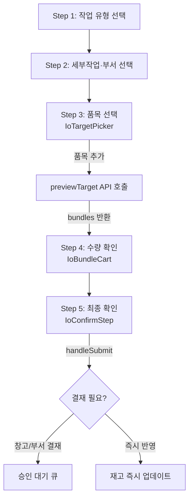

# IoComposeView.tsx

> [!summary] 역할
> **입출고 2.0 마법사의 최상위 진입점 컴포넌트.** Step 1~5의 전체 흐름을 조율하고, URL 히스토리 동기화·자동저장·BOM 정규화·제출 처리를 담당한다. `DesktopWarehouseView`에서 직접 렌더링된다.

---

## 1. 위치 및 파일 구조

```
erp/frontend/app/legacy/_components/_warehouse_v2/
└── IoComposeView.tsx          ← 이 파일 (마법사 루트)
    ├── IoWorkTypeStep.tsx      (Step 1 · Step 2)
    ├── IoTargetPicker.tsx      (Step 3)
    ├── IoBundleCart.tsx        (Step 4)
    ├── IoConfirmStep.tsx       (Step 5)
    ├── ioWorkType.ts           (유형 정의·헬퍼)
    ├── bomSync.ts              (BOM 비례 계산)
    └── useIoWorkState.ts       (마법사 상태 훅)
```

---

## 2. 역할 한 줄 요약

"작업 유형 선택(Step 1) → 세부 작업·부서(Step 2) → 품목 선택(Step 3) → 수량 확인(Step 4) → 최종 제출(Step 5)" 흐름을 단일 컴포넌트에서 관리하는 **5단계 Wizard 오케스트레이터**.

---

## 3. 주요 Props

| prop | 타입 | 설명 |
|---|---|---|
| `operator` | `OperatorLike \| null` | 현재 로그인한 작업자. `employee_id`·`department`·`warehouse_role` 포함 |
| `items` | `Item[]` | 전체 품목 목록 (Step 3 피커에 전달) |
| `preselectedItem` | `Item \| undefined` | 외부(재고 탭)에서 미리 선택된 품목. Step 3 자동 추가 |
| `restoreDraft` | `IoBatch \| undefined` | 작업 중 탭에서 이어하기 시 복원할 초안 |
| `defaultWorkType` | `IoWorkType` | 초기 작업 유형 기본값 |
| `onSubmitSuccess` | `() => void` | 제출 성공 후 부모에 알림 콜백 |
| `onStatusChange` | `(msg: string) => void` | 헤더 상태 바 메시지 업데이트 |

---

## 4. 핵심 흐름



---

## 5. 주요 상태 관리

| 상태/훅 | 소속 | 역할 |
|---|---|---|
| `useIoWorkState` | 내부 훅 | step·workType·subType·부서·bundles·canAdvance 관리 |
| `useIoPreview` | 내부 훅 | `previewTarget` API 비동기 호출 (bundles 생성) |
| `useIoDraft` | 내부 훅 | 초안 저장 API |
| `useIoSubmit` | 내부 훅 | 최종 제출 API (멱등 client_request_id 포함) |
| `useIoDraftRestore` | 내부 훅 | 복원 시 state 재구성 |
| `bomParents` | `Set<string>` | BOM 부모 item_id 집합. 마운트 시 1회 fetch |
| `autosaveTimerRef` | ref | 700ms 디바운스 자동저장 |

---

## 6. URL 히스토리 동기화

> [!info] 왜 URL에 step을 넣나?
> 브라우저 뒤로/앞으로 버튼이 마법사 단계 이동으로 작동하도록 `?step=N` 쿼리를 히스토리에 쌓는다.

- `state.step` 변경 → `router.push(...?step=N)`
- URL step 변경(뒤로/앞으로) → `state.goTo(target)` (도달 불가 step은 clamp)
- `pendingFinalStepRef`: Step 3→5 점프 시 중간 step=4를 먼저 URL에 쌓고, 완료 후 step=5로 자동 이동

---

## 7. 코드 발췌 — BOM 정규화 및 자동저장

```tsx
// Pydantic Decimal은 JSON에서 문자열로 직렬화 → number로 정규화
function normalizeBundles(bundles: IoBundle[]): IoBundle[] {
  return bundles.map((bundle) => ({
    ...bundle,
    quantity: Number(bundle.quantity),
    lines: bundle.lines.map((line) => ({
      ...line,
      quantity: Number(line.quantity),
      shortage: Number(line.shortage),
      bom_expected: line.bom_expected == null ? null : Number(line.bom_expected),
    })),
  }));
}

// 자동저장: bundles 변경 700ms 후 백그라운드 저장
useEffect(() => {
  if (!employeeId) return;
  if (state.bundles.length === 0) return;
  if (autosaveTimerRef.current) clearTimeout(autosaveTimerRef.current);
  autosaveTimerRef.current = setTimeout(async () => {
    try {
      const result = await saveDraft({ employeeId, workType: state.workType, ... });
      autosaveBatchIdRef.current = result.batch_id;
      onStatusChange(`자동 저장됨 · ${hh}:${mm}`);
    } catch {
      onStatusChange("자동 저장 실패 — 잠시 후 재시도");
    }
  }, 700);
}, [state.bundles, state.notes, ...]);
```

---

## 8. Step별 렌더링 조건

| Step | 렌더 조건 | 컴포넌트 |
|---|---|---|
| 1 | 항상 | `IoWorkTypeStep` |
| 2 | `step >= 2` | `IoSubTypeStep` |
| 3 | `step >= 3` | `IoTargetPicker` |
| 4 | `step >= 4` 또는 `step === 3 && bundles.length > 0` | `IoBundleCart` |
| 5 | `step >= 5` | `IoConfirmStep` |

> [!tip] Step 4가 Step 3 중에 나타나는 이유
> 품목을 선택하는 순간 카트(Step 4)가 함께 표시된다. 사용자가 연속 선택하면서 선택한 품목을 바로 확인할 수 있도록 한다.

---

## 9. 제출 시 Draft 충돌 방지

```tsx
async function handleSubmit() {
  // 자동저장 draft가 동일 line_id를 점유한 채로 submit하면 PK 충돌(IntegrityError)
  // → submit 전에 대기 중 autosave 취소 + 기존 draft 삭제
  if (autosaveTimerRef.current) {
    clearTimeout(autosaveTimerRef.current);
    autosaveTimerRef.current = null;
  }
  if (autosaveBatchIdRef.current) {
    await api.deleteDraft(staleId, employeeId);  // 실패해도 submit 진행
  }
  const response = await submit({ ... });
  ...
}
```

---

## 10. 연결 관계

- **부모**: `erp/frontend/app/legacy/_components/DesktopWarehouseView.tsx`
- **자식**: `IoWorkTypeStep`, `IoTargetPicker`, `IoBundleCart`, `IoConfirmStep`, `IoSubmitModals`
- **훅**: `useIoWorkState`, `useIoDraft`, `useIoPreview`, `useIoSubmit`, `useIoDraftRestore`
- **유틸**: `erp/frontend/app/legacy/_components/_warehouse_v2/bomSync.ts`
- **백엔드 API**: `POST /io/preview`, `POST /io/submit`, `POST /io/draft`, `DELETE /io/draft/{id}`

---

## 11. 참고 맥락

> [!note] 참고
> 이 파일은 "입출고 2.0 마법사의 사령탑"이다. 실제 UI는 각 Step 컴포넌트에 있고, 이 파일은 그들 사이의 흐름·상태·API 호출을 조율한다. 코드가 길어 보이지만 크게 세 덩어리다:
> 1. URL ↔ step 동기화 (useEffect 2개)
> 2. 품목 추가 / BOM 정규화 (addItem 함수)
> 3. 자동저장 / 제출 (handleSubmit)
>
> `useIoWorkState`가 핵심 상태를 들고 있으므로 그 훅을 먼저 읽으면 전체 구조가 보인다.
