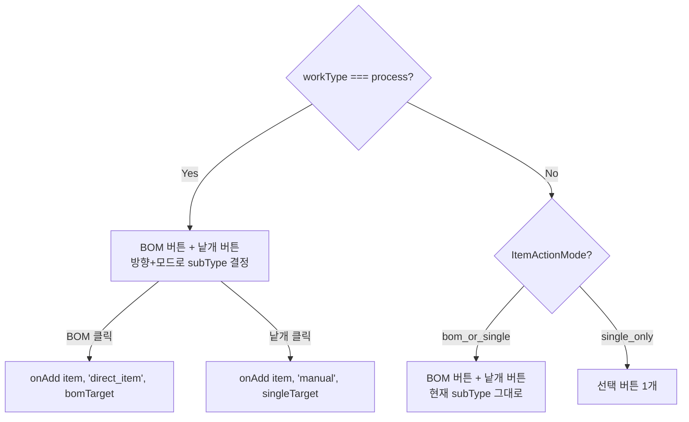

# IoTargetPicker.tsx

> [!summary] 역할
> **입출고 마법사 Step 3 — 품목 선택 테이블.** 부서·모델·단계·검색어 필터 + 페이지네이션으로 품목 목록을 보여주고, 각 품목에 "BOM 적용" 또는 "낱개/선택" 버튼을 제공한다.

---

## 1. 위치

```
erp/frontend/app/legacy/_components/_warehouse_v2/IoTargetPicker.tsx
```

**부모**: `IoComposeView.tsx` (Step 3 WizardStepCard 내부)

---

## 2. 역할 한 줄 요약

"어떤 품목을 입출고할 것인가?"를 검색·필터로 찾고 추가 버튼으로 카트에 담는 테이블. `process` 유형은 BOM/낱개 버튼 2개, 그 외는 단일 버튼.

---

## 3. Props

| prop | 타입 | 설명 |
|---|---|---|
| `workType` | `IoWorkType` | 현재 작업 유형 (process 여부 판단) |
| `subType` | `IoSubType` | 세부 작업 (ItemActionMode 결정) |
| `deptIoDirection` | `DeptIoDirection \| null` | process 유형의 방향(in/out) |
| `bundleSubType` | `IoSubType \| null` | 카트에 담긴 묶음의 subType (BOM/낱개 혼재 방지) |
| `bomParents` | `Set<string>` | BOM 상위 item_id 집합 (BOM 버튼 활성 조건) |
| `targetDepartment` | `string \| null` | Step 2에서 선택한 대상 부서 (정렬 우선순위) |
| `items` | `Item[]` | 전체 품목 목록 |
| `productModels` | `ProductModel[]` | 제품 모델 목록 (모델 필터용) |
| `bundles` | `IoBundle[]` | 현재 카트 묶음 (상태 표시용) |
| `onAddItem` | 함수 | 품목 추가 콜백 |
| `onAdvance` | `() => void` | "수량 조정 →" 버튼 클릭 |
| `busy` | `boolean` | API 호출 중 여부 |

---

## 4. 필터 4종

```tsx
const [dept, setDept] = useState("ALL");    // 부서 필터
const [model, setModel] = useState("전체"); // 모델 필터
const [stage, setStage] = useState("ALL");  // 단계 필터 (RAW/MID/DONE)
// search: 부모에서 관리, onSearchChange 콜백
```

| 필터 | 옵션 |
|---|---|
| 부서 | ALL + PROD_DEPTS + 창고 (창고는 warehouse_qty > 0 조건) |
| 모델 | 전체 / 공용 / 각 모델명 |
| 단계 | 전체 / 원자재(RAW) / 중간공정(MID) / 공정완료(DONE) |
| 검색 | 품목명·품목 코드 자유 텍스트 |

---

## 5. 정렬 우선순위

```tsx
// Step 2에서 선택한 targetDepartment를 맨 앞으로, 나머지는 PROD_DEPTS 순서 유지
const deptPriorityByLetter = useMemo(() => {
  const base = [...PROD_DEPTS];
  const ordered = targetDepartment && base.includes(targetDepartment)
    ? [targetDepartment, ...base.filter((d) => d !== targetDepartment)]
    : base;
  // process_type_code의 부서 문자(T/H/V/N/A/P) → 우선순위 인덱스
  ...
}, [targetDepartment]);
```

조립(A) 부서 내에서는 `operator.assigned_model_slots`와 매칭되는 담당 모델 품목이 추가 우선순위를 받는다.

---

## 6. BOM/낱개 버튼 로직



> [!warning] BOM/낱개 혼재 방지
> 한 작업 안에서 BOM 묶음과 낱개 묶음을 함께 담으면 백엔드가 거절한다. 한쪽이 카트에 있으면 반대쪽 버튼이 자동으로 비활성화된다 (`bundleSubType` 비교).

---

## 7. 코드 발췌 — 필터링 및 정렬

```tsx
const filteredItems = useMemo(() => {
  const selectedModelSlot = model === "전체" ? undefined :
    model === "공용" ? null :
    (productModels.find((m) => m.model_name === model)?.slot ?? undefined);

  const filtered = items.filter((item) =>
    matchesDept(item, dept) &&
    matchesModel(item, selectedModelSlot) &&
    matchesStage(item, stage) &&
    matchesSearch(item, keyword),
  );

  return filtered
    .map((item, idx) => {
      const letter = deptOf(item.process_type_code);
      const priority = letter ? deptPriorityByLetter.get(letter) ?? 999 : 999;
      // 조립(A) 안에서 담당 모델 매칭 시 추가 우선순위
      let assemblyRank = Number.POSITIVE_INFINITY;
      if (letter === "A" && assignedPriorityBySlot.size > 0) {
        for (const slot of item.model_slots ?? []) {
          const p = assignedPriorityBySlot.get(slot);
          if (p !== undefined && p < assemblyRank) assemblyRank = p;
        }
      }
      return { item, priority, assemblyRank, idx };
    })
    .sort((a, b) => a.priority - b.priority || a.assemblyRank - b.assemblyRank || a.idx - b.idx)
    .map((row) => row.item);
}, [items, dept, model, stage, keyword, productModels, deptPriorityByLetter, assignedPriorityBySlot]);
```

---

## 8. 스크롤 위치 보존

```tsx
const tableContainerRef = useRef<HTMLDivElement>(null);
const scrollPosRef = useRef(0);

// bundles 변경(품목 추가) 시 부모의 wrapper height 재계산으로 scrollTop이 clamp 되는 문제 방지
useEffect(() => {
  const el = tableContainerRef.current;
  if (!el || el.scrollTop === scrollPosRef.current) return;
  el.scrollTop = scrollPosRef.current;
}, [bundles]);
```

품목을 추가할 때마다 `IoComposeView`가 wrapper 높이를 재계산하면서 테이블 스크롤 위치가 맨 위로 튀는 문제를 `data-keep-scroll` 마커와 함께 방지한다.

---

## 9. 테이블 컬럼

| 컬럼 | 너비 | 내용 |
|---|---|---|
| 품목명 | 58% | 이름 (bold) |
| 품목 코드 | 14% | 코드 (sm 이상만) |
| 창고 | 7% | `warehouse_qty` (sm 이상만) |
| 부서 | 8% | `implied_qty` + Tooltip으로 부서별 내역 (sm 이상만) |
| 추가 | 13% | BOM/낱개/선택 버튼 |

---

## 10. 연결 관계

- **부모**: `erp/frontend/app/legacy/_components/_warehouse_v2/IoComposeView.tsx`
- **의존**: `erp/frontend/app/legacy/_components/_warehouse_v2/ioWorkType.ts` (`getItemActionMode`, `deptIoSubType`)
- **필터 상수**: `erp/frontend/app/legacy/_components/_warehouse_steps/_constants.ts`
- **부서 코드**: `erp/frontend/app/legacy/_components/_admin_sections/_bom_workbench/bomDept.ts`

---

## 11. 참고 맥락

> [!note] 참고
> 이 컴포넌트는 "창고에서 어떤 물건을 입출고할지 고르는 검색 화면"이다.
>
> **BOM 버튼 vs 낱개 버튼 차이:**
> - BOM 버튼: 선택한 품목과 그 하위 자재를 한 번에 묶음으로 추가 (예: 완성품 1개 입고 시 필요한 부품들도 자동 포함)
> - 낱개 버튼: 선택한 품목 하나만 추가
>
> 둘을 섞으면 안 되는 이유는 백엔드 정책상 한 작업 배치에서 BOM 확장 묶음과 수동 묶음을 함께 처리하면 결재 흐름이 달라지기 때문이다.
