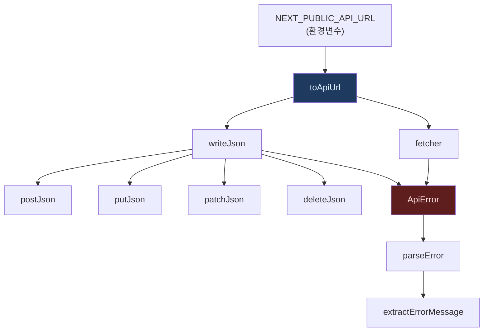
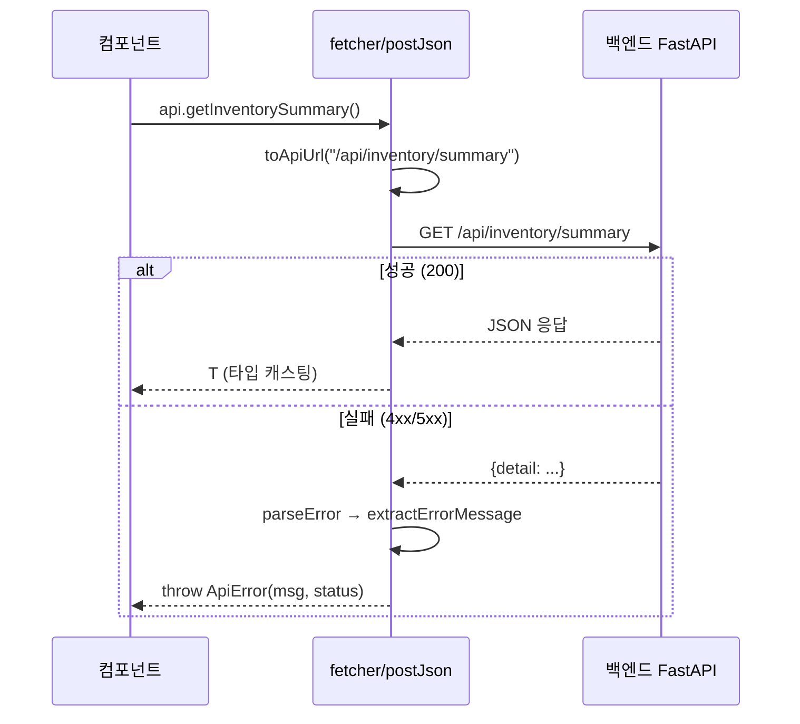

# lib/api-core.ts — URL 빌더 + fetch 래퍼

#layer/frontend #topic/api

> [!summary] 한 줄 요약
> 모든 API 호출의 실제 기반. URL 만들기(`toApiUrl`), HTTP 요청 보내기(`fetcher/postJson`), 에러 파싱(`ApiError/parseError`)을 담당한다.

---

## 1. 위치 & 관계

| 항목 | 내용 |
|------|------|
| 원본 | `erp/frontend/lib/api-core.ts` |
| 레이어 | frontend / lib |
| 역할 | fetch 래퍼 + URL 빌더 + 에러 파서 |
| 분리 시점 | 5.6-A (거대 api.ts 1단계 분할) |
| 소비자 | 모든 도메인 API 파일 (`api/inventory.ts` 등) |



---

## 2. 핵심 함수 목록

| 이름 | 종류 | 설명 |
|------|------|------|
| `toApiUrl(path)` | 함수 | 환경변수 기반 절대/상대 URL 생성 |
| `ApiError` | 클래스 | HTTP 상태 코드를 보존하는 에러 |
| `extractErrorMessage(detail)` | 함수 | 백엔드 detail 구조에서 메시지 추출 |
| `parseError(res)` | async 함수 | Response 실패 시 메시지 파싱 |
| `fetcher<T>(url, signal?)` | async 함수 | GET 요청 + JSON 반환 |
| `postJson<T>(url, body?)` | async 함수 | POST 요청 |
| `putJson<T>(url, body?)` | async 함수 | PUT 요청 |
| `patchJson<T>(url, body?)` | async 함수 | PATCH 요청 |
| `deleteJson<T>(url, body?)` | async 함수 | DELETE 요청 |
| `FALLBACK_SERVER_API_BASE` | 상수 | `http://127.0.0.1:8000` |

---

## 3. URL 빌더 상세 — `toApiUrl`

```typescript
const SERVER_API_BASE = process.env.NEXT_PUBLIC_API_URL
  ? `${process.env.NEXT_PUBLIC_API_URL}`
  : "";

export const FALLBACK_SERVER_API_BASE = "http://127.0.0.1:8000";

export function toApiUrl(path: string): string {
  if (SERVER_API_BASE) {
    return `${SERVER_API_BASE}${path}`;
  }
  return path;  // 상대 경로 → Next.js rewrites 가 처리
}
```

> [!info] 동작 방식
> - `.env.local` 에 `NEXT_PUBLIC_API_URL=http://192.168.1.10:8000` 설정 시 → 절대 URL 생성
> - 미설정 시 → `/api/...` 상대 경로 → Next.js `next.config.js` rewrites 가 백엔드로 forward

---

## 4. 에러 처리 — `ApiError` + `extractErrorMessage`

```typescript
export class ApiError extends Error {
  constructor(
    message: string,
    public readonly status: number,
  ) {
    super(message);
    this.name = "ApiError";
  }
  get isConflict(): boolean { return this.status === 409; }
  get isUnavailable(): boolean { return this.status === 503; }
}

export function extractErrorMessage(detail: unknown, fallback = "처리 실패"): string {
  if (typeof detail === "string") return detail;
  if (detail && typeof detail === "object") {
    const d = detail as Record<string, unknown>;
    const msg = typeof d.message === "string" ? d.message : null;
    if (!msg) return fallback;

    // shortages 배열 — 재고 부족 품목 목록 (구형 / 신형 Phase 4 모두 지원)
    let shortages: unknown = d.shortages;
    if (!Array.isArray(shortages) && d.extra && typeof d.extra === "object") {
      shortages = (d.extra as Record<string, unknown>).shortages;
    }
    const tail = Array.isArray(shortages) && shortages.length
      ? `\n${shortages.join("\n")}`
      : "";
    return `${msg}${tail}`;
  }
  return fallback;
}
```

> [!note] 백엔드 detail 형식
> FastAPI 는 에러를 `{"detail": ...}` 로 반환한다. `detail` 값이
> - 문자열이면 그대로 표시
> - `{message, shortages?}` 딕셔너리면 메시지 + 부족 품목 목록 조합
> - `{code, message, extra: {shortages?}}` Phase 4 신형이면 extra.shortages 사용

---

## 5. fetch 래퍼 — `fetcher` & `writeJson`

```typescript
export async function fetcher<T>(url: string, signal?: AbortSignal): Promise<T> {
  let res: Response;
  try {
    res = await fetch(url, { signal });
  } catch (error) {
    if ((error as Error)?.name === "AbortError") throw error;
    throw new Error(
      error instanceof Error
        ? `API 연결에 실패했습니다. ${url} 주소에 접근할 수 있는지 확인해 주세요.`
        : "API 연결에 실패했습니다.",
    );
  }
  if (!res.ok) {
    throw new ApiError(await parseError(res), res.status);
  }
  return res.json();
}
```

```typescript
// POST/PUT/PATCH/DELETE 공통 내부 함수
async function writeJson<T>(
  url: string,
  method: "POST" | "PUT" | "PATCH" | "DELETE",
  body?: unknown,
): Promise<T> {
  const init: RequestInit = { method };
  if (body !== undefined) {
    init.headers = { "Content-Type": "application/json" };
    init.body = JSON.stringify(body);
  }
  const res = await fetch(url, init);
  if (!res.ok) throw new ApiError(await parseError(res), res.status);
  if (res.status === 204) return undefined as T;
  const text = await res.text();
  if (!text) return undefined as T;
  return JSON.parse(text) as T;
}

export const postJson = <T>(url: string, body?: unknown): Promise<T> =>
  writeJson<T>(url, "POST", body);
export const putJson  = <T>(url: string, body?: unknown): Promise<T> =>
  writeJson<T>(url, "PUT",  body);
export const patchJson = <T>(url: string, body?: unknown): Promise<T> =>
  writeJson<T>(url, "PATCH", body);
export const deleteJson = <T = void>(url: string, body?: unknown): Promise<T> =>
  writeJson<T>(url, "DELETE", body);
```

> [!tip] body 없는 POST
> `body` 를 `undefined` 로 두면 `Content-Type` 헤더와 body 모두 생략된다.
> 예: `confirm`, `cancel` 같이 POST 엔드포인트지만 본문이 필요 없는 경우.

---

## 6. 주요 동작 흐름



---

## 7. 컴포넌트에서 에러 처리 예시

```typescript
import { ApiError } from "@/lib/api-core";

try {
  await api.submit(payload);
} catch (e) {
  if (e instanceof ApiError) {
    if (e.isConflict) {
      onStatusChange("이미 처리된 요청입니다.");
    } else {
      onStatusChange(e.message);
    }
  }
}
```

---

## 8. 관련 파일

- [[erp/frontend/lib/api.ts]] — re-export 허브 (이 파일을 import)
- [[erp/frontend/lib/api/io.ts]] — io 도메인 (직접 api-core import 사용)
- [[erp/frontend/lib/api/inventory.ts]] — inventory 도메인
- [[erp/backend/app/main.py]] — FastAPI 앱 진입점

---

## 9. 신규 도메인 파일 작성 가이드

```typescript
// erp/frontend/lib/api/myDomain.ts 예시
import { fetcher, postJson, toApiUrl } from "../api-core";

export const myDomainApi = {
  getList: () =>
    fetcher<MyType[]>(toApiUrl("/api/my-domain")),

  create: (payload: CreatePayload) =>
    postJson<MyType>(toApiUrl("/api/my-domain"), payload),
};
```

---

## 10. 주의 사항

> [!warning] AbortController 패턴
> 달력·필터 등 fetch 를 취소해야 하는 컴포넌트는 `fetcher(url, signal)` 두 번째 인자로
> `AbortController.signal` 을 넘긴다. 컴포넌트 unmount 시 `ctrl.abort()` 를 호출해야
> "AbortError" 가 정상 발생하며 에러 상태를 오염시키지 않는다.

---

## 11. 정책

- `main` 브랜치: 코드만 유지
- `vault-sync` 브랜치: 코드 + `vault/` 노트
- 코드와 노트가 다르면 실제 코드 우선
