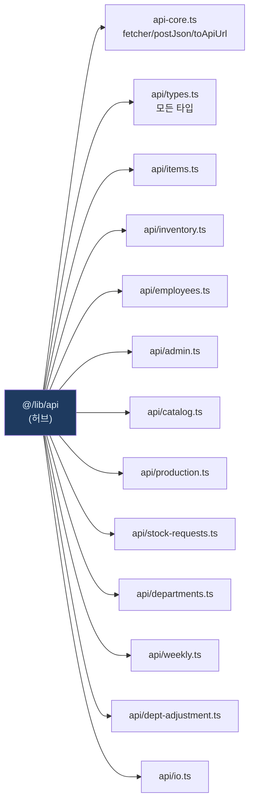

# lib/api.ts — 도메인 re-export 허브

#layer/frontend #topic/api

> [!summary] 한 줄 요약
> 프론트엔드 전체에서 `@/lib/api` 한 곳만 import 해도 되도록 11개 도메인 API 객체와 모든 타입을 한 파일에서 re-export 하는 집합소다.

---

## 1. 위치 & 관계

| 항목 | 내용 |
|------|------|
| 원본 | `erp/frontend/lib/api.ts` |
| 레이어 | frontend / lib |
| 역할 | re-export 허브 (실 로직 없음) |
| 주요 소비자 | 앱 전체 컴포넌트 — `import { api } from "@/lib/api"` |



---

## 2. 핵심 개념

> [!info] re-export 패턴
> 이 파일은 **로직이 없다**. `import → re-export`만 한다.
> 컴포넌트는 개별 도메인 파일을 몰라도 되고, 리팩터링 시 이 파일 한 곳만 바꾸면 된다.

### 2-1. `api` 객체 (spread 병합)

11개 도메인 API 객체를 모두 spread 해서 단일 `api` 객체로 노출한다.

```typescript
export const api = {
  ...itemsApi,        // items 도메인
  ...inventoryApi,    // inventory 9메소드
  ...employeesApi,    // employees 6메소드
  ...adminApi,        // admin/settings 7메소드
  ...catalogApi,      // catalog 16메소드
  ...productionApi,   // production/transactions 11메소드
  ...stockRequestsApi,// stock-requests 15메소드
  ...departmentsApi,  // departments 6메소드
  ...weeklyApi,       // weekly-report
  ...deptAdjustmentApi,// 부서 재고 조정
  ...ioApi,           // 입출고 2.0
};
```

> [!warning] 키 충돌 주의
> 두 도메인이 같은 메소드명을 가지면 나중 spread 가 앞것을 덮어쓴다.
> 현재는 도메인별로 고유 이름을 사용하므로 문제없다.

### 2-2. 유틸 re-export (api-core)

```typescript
export {
  extractErrorMessage,
  fetcher,
  postJson,
  putJson,
  patchJson,
  FALLBACK_SERVER_API_BASE,
};
```

이 유틸들은 `@/lib/api-core` 에 실체가 있고, 이 파일이 다시 내보낸다.
이전 코드가 `@/lib/api` 에서 직접 임포트해도 계속 동작한다.

### 2-3. 타입 re-export

`api/types.ts` 에 정의된 모든 타입을 `export type { ... }` 로 그대로 노출.
컴포넌트 파일에서 별도로 `api/types` 를 import할 필요가 없다.

---

## 3. 도메인 목록 (11개)

| 도메인 파일 | 메소드 수 | 대표 기능 |
|------------|-----------|-----------|
| `api/items.ts` | ~8 | 품목 CRUD, 카테고리 |
| `api/inventory.ts` | 9 | 재고 현황, 입고/이동/불량 |
| `api/employees.ts` | 6 | 직원 목록/CRUD |
| `api/admin.ts` | 7 | PIN 검증, DB 리셋, 감사 CSV |
| `api/catalog.ts` | 16 | 제품 모델, 출하 패키지, BOM |
| `api/production.ts` | 11 | 생산 입고, 거래 내역, 엑셀 내보내기 |
| `api/stock-requests.ts` | 15 | 창고 결재 흐름, draft 장바구니 |
| `api/departments.ts` | 6 | 부서 마스터, 앱 세션 |
| `api/weekly.ts` | ~4 | 주간보고 |
| `api/dept-adjustment.ts` | ~3 | 부서 재고 조정 |
| `api/io.ts` | 8 | 입출고 2.0 (preview/draft/submit) |

---

## 4. 코드 발췌 — import 블록

```typescript
// api-core 에서 공통 유틸 가져오기
import {
  toApiUrl,
  extractErrorMessage,
  parseError,
  fetcher,
  postJson,
  putJson,
  patchJson,
  FALLBACK_SERVER_API_BASE,
} from "./api-core";

// 도메인별 API 분리 (R5-5 ~ R6-D9)
import { itemsApi } from "./api/items";
import { inventoryApi } from "./api/inventory";
import { employeesApi } from "./api/employees";
import { adminApi } from "./api/admin";
import { catalogApi } from "./api/catalog";
import { productionApi } from "./api/production";
import { stockRequestsApi } from "./api/stock-requests";
import { departmentsApi } from "./api/departments";
import { weeklyApi } from "./api/weekly";
import { deptAdjustmentApi } from "./api/dept-adjustment";
import { ioApi } from "./api/io";   // 입출고 2.0
```

---

## 5. 사용 예시

```typescript
// 컴포넌트에서 — 도메인 파일을 직접 import 하지 않아도 됨
import { api } from "@/lib/api";
import type { Item, StockRequest, IoBatch } from "@/lib/api";

// 재고 현황 조회
const summary = await api.getInventorySummary();

// 입출고 2.0 draft 저장
const draft = await api.saveDraft(payload);

// 창고 큐 목록
const queue = await api.listWarehouseQueue();
```

---

## 6. 관련 파일

- [[erp/frontend/lib/api-core.ts]] — 실제 fetch 로직
- [[erp/frontend/lib/api/io.ts]] — 입출고 2.0 핵심
- [[erp/frontend/lib/api/inventory.ts]] — 재고 도메인
- [[erp/frontend/lib/api/stock-requests.ts]] — 결재 흐름
- [[erp/frontend/lib/api/production.ts]] — 생산/거래 내역
- [[erp/frontend/lib/api/admin.ts]] — 관리자 API
- [[erp/backend/app/routers/io.py]] — 입출고 2.0 백엔드 라우터

---

## 7. 히스토리 메모

| 리비전 | 변경 내용 |
|--------|-----------|
| 5.6-A | api-core.ts 분리 — fetch wrapper/URL 빌더 이동 |
| R5-5 | items 도메인 분리 시작 |
| R6-D1~D9 | inventory → io 순서로 11개 도메인 단계적 분리 |

---

## 8. 주의 사항

> [!warning] 새 도메인 추가 시
> 1. `frontend/lib/api/<domain>.ts` 에 API 객체 정의
> 2. 이 파일 상단에 `import { domainApi } from "./api/<domain>"` 추가
> 3. `export const api = { ...domainApi }` 블록에 spread 추가
> 4. 필요한 타입은 `api/types.ts` 에 추가 후 이 파일에서 re-export

---

## 9. 백엔드 연결

각 도메인 API 메소드는 FastAPI 라우터와 1:1 대응한다.

| 프론트엔드 도메인 | 백엔드 라우터 |
|-----------------|--------------|
| ioApi | [[erp/backend/app/routers/io.py]] |
| inventoryApi | [[erp/backend/app/routers/inventory.py]] |
| stockRequestsApi | [[erp/backend/app/routers/stock_requests.py]] |
| productionApi | [[erp/backend/app/routers/production.py]] |
| adminApi | [[erp/backend/app/routers/settings.py]] |

---

## 10. 검색 / 탐색 팁

> [!tip] 메소드 찾기
> `api.어떤메소드` 를 검색할 때 이 파일에서 시작하면 된다.
> 실체는 각 도메인 파일에 있으니 해당 노트로 이동하면 구현을 볼 수 있다.

---

## 11. 정책

- `main` 브랜치: 코드만 유지
- `vault-sync` 브랜치: 코드 + `vault/` 노트
- 코드와 노트가 다르면 실제 코드 우선
