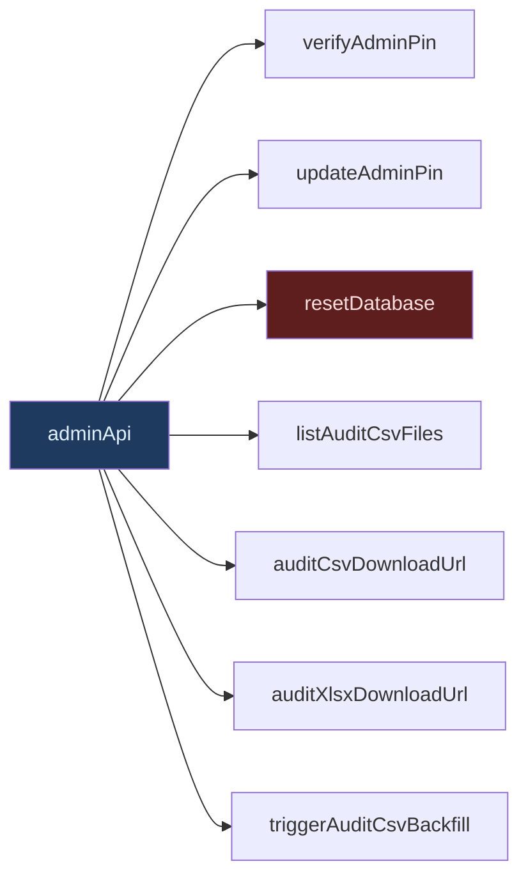
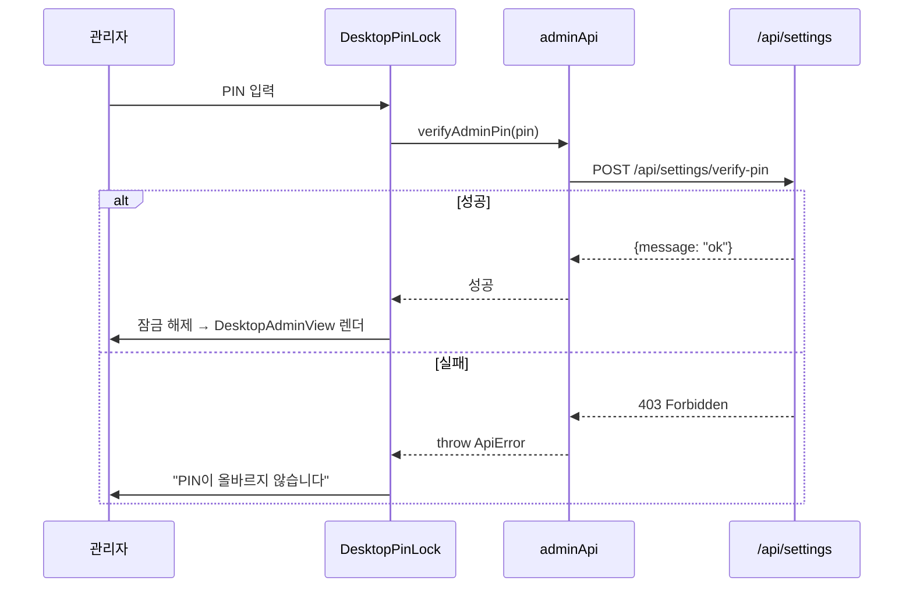
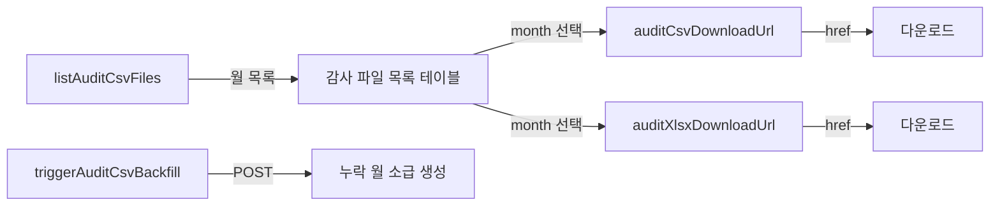

# lib/api/admin.ts — 관리자 API (7 메소드)

#layer/frontend #topic/api

> [!summary] 한 줄 요약
> 관리자 전용 기능 — PIN 검증, PIN 변경, DB 초기화, 감사 CSV/XLSX 관리를 담당한다. 모두 `DesktopAdminView` 에서 사용하며 PIN 인증을 통해 접근을 제어한다.

---

## 1. 위치 & 관계

| 항목 | 내용 |
|------|------|
| 원본 | `erp/frontend/lib/api/admin.ts` |
| 분리 시점 | Round-6 (R6-D3) |
| 역할 | PIN 관리, DB 초기화, 감사 CSV 파일 관리 |
| 백엔드 라우터 | [[erp/backend/app/routers/settings.py]], [[erp/backend/app/routers/admin.py]] |



---

## 2. 메소드 목록 (7개)

| 메소드 | HTTP | 엔드포인트 | 설명 |
|--------|------|-----------|------|
| `verifyAdminPin` | POST | `/api/settings/verify-pin` | PIN 검증 (잠금 해제용) |
| `updateAdminPin` | PUT | `/api/settings/admin-pin` | PIN 변경 |
| `resetDatabase` | POST | `/api/settings/reset` | DB 전체 초기화 (위험) |
| `listAuditCsvFiles` | GET | `/api/admin/audit-csv/files` | 월별 감사 CSV 목록 |
| `auditCsvDownloadUrl` | (URL 생성) | `/api/admin/audit-csv/{month}.csv` | CSV 다운로드 URL |
| `auditXlsxDownloadUrl` | (URL 생성) | `/api/admin/audit-csv/{month}.xlsx` | XLSX 다운로드 URL |
| `triggerAuditCsvBackfill` | POST | `/api/admin/audit-csv/backfill` | 누락 CSV 소급 생성 |

---

## 3. 코드 발췌

```typescript
import { fetcher, postJson, putJson, toApiUrl } from "../api-core";

export interface AuditCsvFile {
  month: string;      // "2026-04"
  file_name: string;
  size_bytes: number;
  row_count: number;
}

export interface AuditCsvBackfillResult {
  total_rows: number;
  months: string[];   // 생성된 월 목록
}

export const adminApi = {
  verifyAdminPin: (pin: string) =>
    postJson<{ message: string }>(toApiUrl("/api/settings/verify-pin"), { pin }),

  resetDatabase: (pin: string) =>
    postJson<{ message: string }>(toApiUrl("/api/settings/reset"), { pin }),

  updateAdminPin: (payload: { current_pin: string; new_pin: string }) =>
    putJson<{ message: string }>(toApiUrl("/api/settings/admin-pin"), payload),

  listAuditCsvFiles: () =>
    fetcher<AuditCsvFile[]>(toApiUrl("/api/admin/audit-csv/files")),

  auditCsvDownloadUrl: (month: string) =>
    toApiUrl(`/api/admin/audit-csv/${month}.csv`),

  auditXlsxDownloadUrl: (month: string) =>
    toApiUrl(`/api/admin/audit-csv/${month}.xlsx`),

  triggerAuditCsvBackfill: () =>
    postJson<AuditCsvBackfillResult>(toApiUrl("/api/admin/audit-csv/backfill")),
};
```

---

## 4. PIN 잠금 흐름



---

## 5. 감사 CSV 관리



> [!note] URL 생성 함수
> `auditCsvDownloadUrl` 과 `auditXlsxDownloadUrl` 은 fetch 없이 URL 문자열만 반환한다.
> `<a href={url} download>` 태그에 직접 연결한다.
> `month` 파라미터 형식: `"2026-04"` (YYYY-MM)

---

## 6. 타입 상세

### `AuditCsvFile`

| 필드 | 타입 | 설명 |
|------|------|------|
| `month` | `string` | `"2026-04"` 형식 |
| `file_name` | `string` | 실제 파일명 |
| `size_bytes` | `number` | 파일 크기 (바이트) |
| `row_count` | `number` | CSV 행 수 |

### `AuditCsvBackfillResult`

| 필드 | 타입 | 설명 |
|------|------|------|
| `total_rows` | `number` | 소급 생성된 총 행 수 |
| `months` | `string[]` | 생성된 월 목록 |

---

## 7. DesktopAdminView 에서의 사용

```typescript
// useAdminSettings 훅 내부 (간략화)
const changePin = async () => {
  await api.updateAdminPin({ current_pin: pinForm.current, new_pin: pinForm.next });
  onStatusChange("PIN이 변경되었습니다.");
};

const resetDatabase = async () => {
  await api.resetDatabase(adminPin);
  onAfterReset(); // 데이터 재로드
};
```

관리자 화면 진입 시 `DesktopPinLock` → `verifyAdminPin` 으로 먼저 검증 후, 잠금 해제되면 나머지 기능에 접근할 수 있다.

---

## 8. 관련 파일

- [[erp/frontend/lib/api.ts]] — 이 파일을 spread merge 하는 허브
- [[erp/frontend/app/legacy/_components/DesktopAdminView.tsx]] — 주요 소비자
- [[erp/backend/app/routers/settings.py]] — PIN/DB 리셋 라우터
- [[erp/backend/app/routers/admin.py]] — 감사 CSV 라우터

---

## 9. 주의 사항

> [!danger] `resetDatabase` — 데이터 전체 삭제
> DB 초기화는 복구 불가 작업이다. PIN 재확인 후 사용자에게 이중 확인을 받아야 한다.
> 현재 구현: PIN 을 다시 한번 POST 로 전달하여 서버에서 검증 후 초기화 진행.

> [!warning] PIN 평문 전송
> PIN 이 HTTPS 없이 HTTP 로 전송되면 평문 노출 위험이 있다.
> 운영 환경에서는 HTTPS 를 반드시 적용해야 한다.

---

## 10. 히스토리 메모

| 리비전 | 변경 내용 |
|--------|-----------|
| R6-D3 | admin 도메인 최초 분리 (3메소드: verifyAdminPin/updateAdminPin/resetDatabase) |
| 이후 | 감사 CSV 관련 4메소드 추가 (listAuditCsvFiles, 다운로드 URL, backfill) |

---

## 11. 정책

- `main` 브랜치: 코드만 유지
- `vault-sync` 브랜치: 코드 + `vault/` 노트
- 코드와 노트가 다르면 실제 코드 우선
