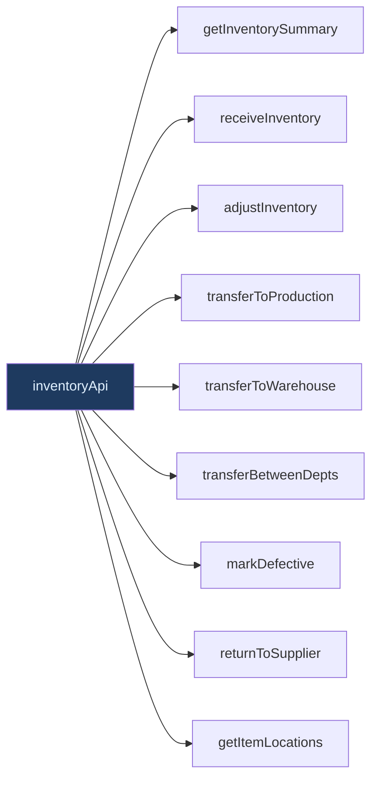
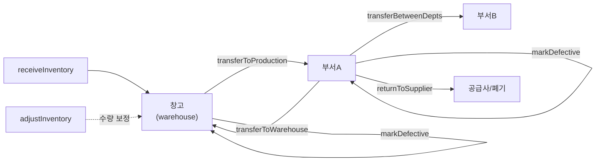

# lib/api/inventory.ts — 재고 도메인 API (9 메소드)

#layer/frontend #topic/api

> [!summary] 한 줄 요약
> 창고 재고의 입고, 조정, 이동, 불량 처리, 반품, 위치 조회 9개 메소드를 담는다. 모든 쓰기 작업은 `InventoryMutationResponse` 를 반환한다.

---

## 1. 위치 & 관계

| 항목 | 내용 |
|------|------|
| 원본 | `erp/frontend/lib/api/inventory.ts` |
| 분리 시점 | Round-6 (R6-D1) |
| 역할 | 재고 현황 조회 + 재고 변동 작업 |
| 백엔드 라우터 | [[erp/backend/app/routers/inventory.py]] |



---

## 2. 메소드 목록 (9개)

| 메소드 | HTTP | 엔드포인트 | 설명 |
|--------|------|-----------|------|
| `getInventorySummary` | GET | `/api/inventory/summary` | 카테고리별 재고 요약 |
| `receiveInventory` | POST | `/api/inventory/receive` | 외부 입고 (창고) |
| `adjustInventory` | POST | `/api/inventory/adjust` | 재고 수량 조정 (reason 필수) |
| `transferToProduction` | POST | `/api/inventory/transfer-to-production` | 창고 → 부서 불출 |
| `transferToWarehouse` | POST | `/api/inventory/transfer-to-warehouse` | 부서 → 창고 반납 |
| `transferBetweenDepts` | POST | `/api/inventory/transfer-between-depts` | 부서 ↔ 부서 이동 |
| `markDefective` | POST | `/api/inventory/mark-defective` | 불량 처리 |
| `returnToSupplier` | POST | `/api/inventory/return-to-supplier` | 공급사 반품 |
| `getItemLocations` | GET | `/api/inventory/locations/{itemId}` | 품목별 부서 위치 목록 |

---

## 3. 코드 발췌

```typescript
import { fetcher, postJson, toApiUrl } from "../api-core";
import type {
  Department, InventoryLocationRow,
  InventoryMutationResponse, InventorySummary,
} from "./types";

export const inventoryApi = {
  getInventorySummary: () =>
    fetcher<InventorySummary>(toApiUrl("/api/inventory/summary")),

  receiveInventory: (payload: {
    item_id: string;
    quantity: number;
    location?: string;
    reference_no?: string;
    produced_by?: string;
    notes?: string;
  }) => postJson<InventoryMutationResponse>(toApiUrl("/api/inventory/receive"), payload),

  transferToProduction: (payload: {
    item_id: string;
    quantity: number;
    department: Department;
    notes?: string;
    reference_no?: string;
    produced_by?: string;
  }) =>
    postJson<InventoryMutationResponse>(
      toApiUrl("/api/inventory/transfer-to-production"), payload,
    ),

  markDefective: (payload: {
    item_id: string;
    quantity: number;
    source: "warehouse" | "production";
# ... (이하 10줄 생략. 원본 참조)

```

---

## 4. 주요 타입 설명

| 타입 | 구조 | 설명 |
|------|------|------|
| `InventorySummary` | `{categories[], total_items, total_quantity, uk_item_count}` | 카테고리별 재고 집계 |
| `InventoryMutationResponse` | 서버 응답 (상태 메시지 등) | 모든 쓰기 작업 공통 반환 |
| `InventoryLocationRow` | `{department, status, quantity}` | 품목의 부서별 위치 한 줄 |
| `Department` | `"조립" \| "고압" \| "진공" \| ...` | 유효 부서명 유니온 타입 |

---

## 5. 이동 흐름 다이어그램



---

## 6. payload 필드 설명

### `receiveInventory`

| 필드 | 필수 | 설명 |
|------|------|------|
| `item_id` | O | 품목 UUID |
| `quantity` | O | 입고 수량 (양수) |
| `location` | - | 창고 내 위치 메모 |
| `reference_no` | - | 발주서 번호 등 참조 번호 |
| `produced_by` | - | 입고 담당자 |
| `notes` | - | 메모 |

### `markDefective`

| 필드 | 필수 | 설명 |
|------|------|------|
| `source` | O | `"warehouse"` 또는 `"production"` |
| `source_department` | - | production 출처 부서 |
| `target_department` | O | 불량품 보관 부서 |

---

## 7. 사용 예시

```typescript
// 재고 현황 조회
const summary = await api.getInventorySummary();

// 창고에서 조립부서로 불출
await api.transferToProduction({
  item_id: "abc-123",
  quantity: 10,
  department: "조립",
  reference_no: "WO-2026-001",
});

// 품목 위치 조회 (우측 패널)
const locations = await api.getItemLocations(item.item_id);
```

---

## 8. 관련 파일

- [[erp/frontend/lib/api.ts]] — 이 파일을 spread merge 하는 허브
- [[erp/frontend/app/legacy/_components/DesktopInventoryView.tsx]] — 재고 대시보드
- [[erp/frontend/app/legacy/_components/DesktopWarehouseView.tsx]] — 입출고 화면
- [[erp/backend/app/routers/inventory.py]] — 백엔드 엔드포인트

---

## 9. 주의 사항

> [!warning] `adjustInventory` 는 reason 필수
> 재고 조정은 audit trail 을 위해 `reason` 필드가 반드시 필요하다.

> [!warning] `transferBetweenDepts` — from/to 부서 구분
> `from_department` 와 `to_department` 둘 다 `Department` 타입이어야 한다.
> 같은 부서를 넣으면 백엔드에서 에러 반환.

---

## 10. 히스토리 메모

| 리비전 | 변경 내용 |
|--------|-----------|
| R6-D1 | inventory 도메인 최초 분리 (9메소드) |

---

## 11. 정책

- `main` 브랜치: 코드만 유지
- `vault-sync` 브랜치: 코드 + `vault/` 노트
- 코드와 노트가 다르면 실제 코드 우선
