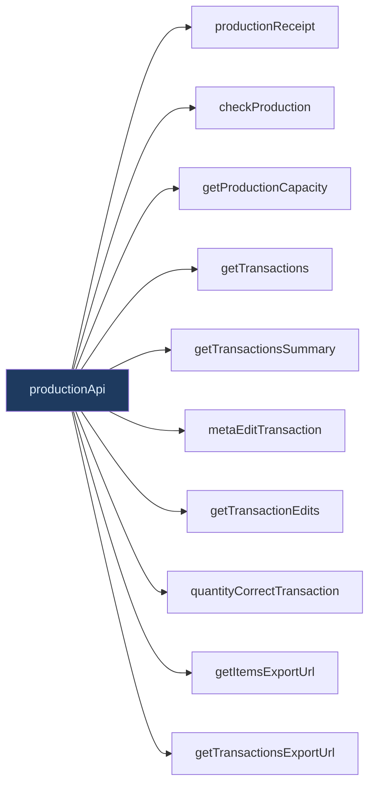
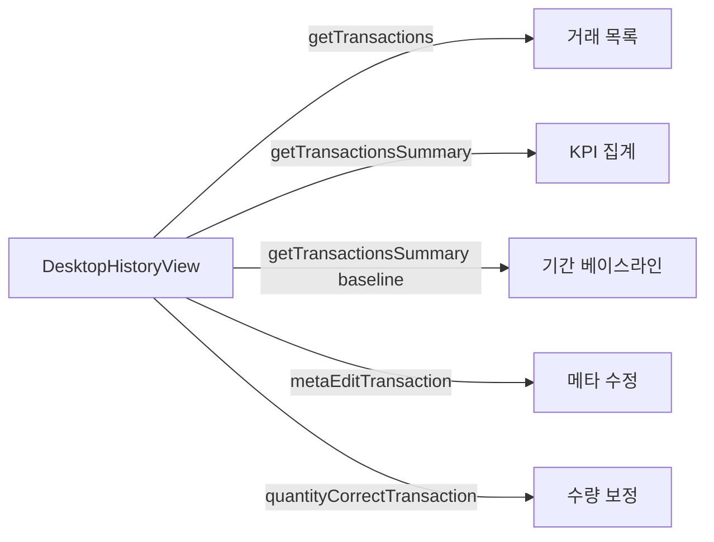

# lib/api/production.ts — 생산/거래 내역/엑셀 API (11 메소드)

#layer/frontend #topic/api

> [!summary] 한 줄 요약
> 생산 입고·생산 가능 수량 확인, 거래 내역 조회·수정·보정, 엑셀 내보내기 URL 생성을 담당한다. `DesktopHistoryView` 의 핵심 데이터 소스다.

---

## 1. 위치 & 관계

| 항목 | 내용 |
|------|------|
| 원본 | `erp/frontend/lib/api/production.ts` |
| 분리 시점 | Round-6 (R6-D7) |
| 역할 | 생산 입고 + 거래 내역 조회/수정 + 엑셀 내보내기 |
| 백엔드 라우터 | [[erp/backend/app/routers/production.py]], [[erp/backend/app/routers/inventory.py]] |



---

## 2. 메소드 목록 (11개)

| 메소드 | HTTP | 엔드포인트 | 설명 |
|--------|------|-----------|------|
| `productionReceipt` | POST | `/api/production/receipt` | 생산 완료 입고 |
| `checkProduction` | GET | `/api/production/bom-check/{itemId}?quantity=` | BOM 기반 생산 가능 여부 확인 |
| `getProductionCapacity` | GET | `/api/production/capacity` | 전체 생산 가능 수량 |
| `getTransactions` | GET | `/api/inventory/transactions?...` | 거래 내역 목록 (다중 필터) |
| `getTransactionsSummary` | GET | `/api/inventory/transactions/summary?...` | 거래 KPI 집계 (카운트) |
| `metaEditTransaction` | POST | `/api/inventory/transactions/{id}/meta-edit` | 메타(notes/ref/담당자) 수정 |
| `getTransactionEdits` | GET | `/api/inventory/transactions/{id}/edits` | 수정 이력 조회 |
| `quantityCorrectTransaction` | POST | `/api/inventory/transactions/{id}/quantity-correction` | 수량 보정 |
| `getItemsExportUrl` | (URL 생성) | `/api/items/export.xlsx` | 품목 엑셀 다운로드 URL |
| `getTransactionsExportUrl` | (URL 생성) | `/api/inventory/transactions/export.xlsx` | 거래 내역 엑셀 다운로드 URL |

---

## 3. 코드 발췌 — `getTransactions`

```typescript
getTransactions: (
  params?: {
    itemId?: string;
    transactionType?: TransactionType;
    transactionTypes?: string; // 쉼표 구분. 예: "RECEIVE,SHIP"
    referenceNo?: string;
    search?: string;
    department?: string;
    model?: string;        // 제품 모델명 (쉼표 복수)
    processStep?: string;  // 공정 구분 R/A/F (쉼표 복수)
    dateFrom?: string;     // YYYY-MM-DD
    dateTo?: string;       // YYYY-MM-DD
    includeArchived?: boolean;
    limit?: number;
    skip?: number;
  },
  opts?: { signal?: AbortSignal },
) => {
  const query = new URLSearchParams();
  if (params?.itemId) query.set("item_id", params.itemId);
  if (params?.transactionType) query.set("transaction_type", params.transactionType);
  if (params?.transactionTypes) query.set("transaction_types", params.transactionTypes);
  // ... 나머지 파라미터 빌딩
  return fetcher<TransactionLog[]>(
    toApiUrl(`/api/inventory/transactions?${query}`),
    opts?.signal,
  );
},
```

---

## 4. `TransactionSummary` 타입 (이 파일 내 정의)

```typescript
export interface TransactionSummary {
  total: number;
  warehouseCount: number;
  deptCount: number;
  adjustCount: number;
  /** dept-bucket 거래의 부서별 카운트 {부서명: 건수}. */
  departmentCounts: Record<string, number>;
}
```

> [!info] 백엔드 → 프론트엔드 필드명 변환
> 백엔드는 스네이크 케이스(`warehouse_count`)를 반환하고,
> `getTransactionsSummary` 메소드 내부에서 `.then()` 으로 카멜 케이스로 변환한다.

---

## 5. 엑셀 내보내기 URL 생성

```typescript
getTransactionsExportUrl: (params?: {
  transaction_type?: string;
  search?: string;
  start_date?: string; // YYYY-MM-DD
  end_date?: string;   // YYYY-MM-DD
}) => {
  // 미지정 시 최근 30일(D-29 ~ 오늘)을 자동 부여
  const today = new Date();
  const from = new Date(today);
  from.setDate(today.getDate() - 29);
  const ymd = (d: Date) =>
    `${d.getFullYear()}-${String(d.getMonth() + 1).padStart(2, "0")}-${String(d.getDate()).padStart(2, "0")}`;
  qs.set("start_date", params?.start_date ?? ymd(from));
  qs.set("end_date", params?.end_date ?? ymd(today));
  return toApiUrl(`/api/inventory/transactions/export.xlsx?${qs}`);
},
```

> [!note] URL 생성 함수
> `getItemsExportUrl` 과 `getTransactionsExportUrl` 은 fetch 를 하지 않는다.
> URL 문자열만 반환하므로 `<a href={url} download>` 로 직접 연결하면 된다.

---

## 6. 거래 수정 API 상세

### `metaEditTransaction` — 메타데이터만 수정
```typescript
metaEditTransaction(logId, {
  notes?: string | null;
  reference_no?: string | null;
  produced_by?: string | null;
  reason: string;              // 수정 이유 (필수)
  edited_by_employee_id: string;
  edited_by_pin: string;       // PIN 인증
})
```

### `quantityCorrectTransaction` — 수량 보정
```typescript
quantityCorrectTransaction(logId, {
  quantity_change: number;     // SHIP은 음수여야 함
  reason: string;
  edited_by_employee_id: string;
  edited_by_pin: string;
})
// 반환: { original: TransactionLog; correction: TransactionLog }
// 원본 거래는 archived 처리, 보정 거래가 새로 생성됨
```

---

## 7. DesktopHistoryView 와의 연결



`DesktopHistoryView` 에서 직접 `productionApi` 를 import 해서 사용한다 (api 허브 우회):
```typescript
import { productionApi, type TransactionSummary } from "@/lib/api/production";
```

---

## 8. AbortController 패턴

```typescript
const ctrl = new AbortController();
void productionApi
  .getTransactionsSummary(params, { signal: ctrl.signal })
  .then(setSummary)
  .catch((err) => {
    if ((err as Error)?.name === "AbortError") return; // 정상 취소
  });
return () => ctrl.abort(); // 컴포넌트 effect 클린업
```

---

## 9. 관련 파일

- [[erp/frontend/lib/api.ts]] — 이 파일을 spread merge 하는 허브
- [[erp/frontend/app/legacy/_components/DesktopHistoryView.tsx]] — 주요 소비자
- [[erp/backend/app/routers/production.py]] — 생산 입고 라우터
- [[erp/backend/app/routers/inventory.py]] — 거래 내역 라우터 (transactions 엔드포인트)

---

## 10. 주의 사항

> [!warning] `getTransactions` 필터 파라미터 누락 시
> 파라미터 없이 호출하면 전체 거래를 반환한다. 대용량일 수 있으므로
> `limit`, `skip` 으로 페이지네이션을 반드시 적용할 것.

> [!warning] `quantityCorrectTransaction` — SHIP 수량
> 입고(RECEIVE)는 `quantity_change` 를 양수로, 출고(SHIP)는 음수로 넣어야 한다.
> 양수를 잘못 넣으면 백엔드에서 에러 반환.

---

## 11. 정책

- `main` 브랜치: 코드만 유지
- `vault-sync` 브랜치: 코드 + `vault/` 노트
- 코드와 노트가 다르면 실제 코드 우선
